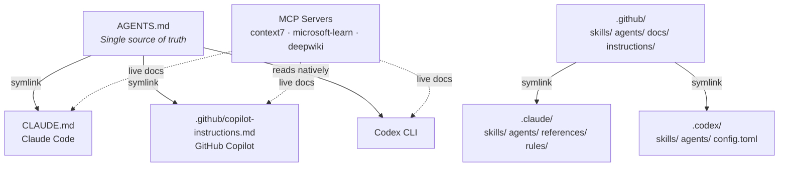

# vibes

A multi-platform skill and agent framework for AI coding assistants.

## What is vibes?

Vibes provides a shared set of skills, agents, and reference documentation for AI coding assistants. Write your agent instructions once in `AGENTS.md`, and every supported platform — Claude Code, GitHub Copilot, Codex CLI — gets the same guidance through symlinks and platform-specific configuration.

Skills teach agents _how_ to perform specific tasks (fetch library docs, manage GitHub PRs, review code). Agents define _roles_ with scoped tools and system prompts. MCP servers provide _live documentation_ so agents work from current APIs instead of stale training data.

## Quick Start

```bash
git clone https://github.com/jonhill90/vibes.git
cd vibes
```

Open the repo in your editor. The platform reads its instruction file automatically — no build step, no install.

### MCP Servers

Three MCP servers provide live documentation. They are pre-configured in `.mcp.json` (Claude Code), `.vscode/mcp.json` (VS Code), and `.codex/config.toml` (Codex CLI). No API keys required.

| Server | Purpose |
|--------|---------|
| **context7** | Library and framework docs (npm, PyPI, crates, etc.) |
| **microsoft-learn** | Azure, .NET, M365, and Microsoft docs |
| **deepwiki** | GitHub repository wikis and documentation |

### Platform Setup

| Platform | Instruction File | MCP Config |
|----------|-----------------|------------|
| **Claude Code** | `CLAUDE.md` (symlink → `AGENTS.md`) | `.mcp.json` |
| **GitHub Copilot** | `.github/copilot-instructions.md` (symlink → `AGENTS.md`) | `.vscode/mcp.json` |
| **Codex CLI** | `AGENTS.md` (read natively) | `.codex/config.toml` |

## Skills

Skills are invocable instruction sets that teach an agent how to perform a specific task. Each lives in `.github/skills/<name>/SKILL.md`.

### Documentation

| Skill | Trigger | Description |
|-------|---------|-------------|
| `primer` | `/primer` | Orient in any codebase — structure, docs, key files, current state |
| `context7` | `/context7` | Fetch live library/framework docs via MCP (Python, Bash, PowerShell variants) |
| `ms-learn` | `/ms-learn` | Query official Microsoft docs for Azure, .NET, M365 |

### Platform Integration

| Skill | Trigger | Description |
|-------|---------|-------------|
| `gh-cli` | `/gh-cli` | Manage GitHub via CLI — PRs, issues, workflows, releases |
| `az-devops` | `/az-devops` | Manage Azure DevOps — repos, pipelines, boards, work items |
| `linear` | `/linear` | Manage Linear via CLI — issues, teams, projects, Git workflow |
| `obsidian` | `/obsidian` | Read, write, search, and manage Obsidian vault notes |
| `youtube-transcript` | `/youtube-transcript` | Fetch YouTube video transcripts and metadata |

### Authoring & Validation

| Skill | Trigger | Description |
|-------|---------|-------------|
| `create-skill` | `/create-skill` | Guide for creating new skills with scripts and references |
| `validate-skill` | `/validate-skill` | Validate a SKILL.md against the spec |
| `lint-agents` | `/lint-agents` | Check agent definition files for correct YAML frontmatter |

## Agents

Agents are specialized roles with scoped tools and a system prompt. Defined in `.github/agents/<name>.md`.

| Agent | Purpose | Tools |
|-------|---------|-------|
| `code-reviewer` | Code quality and security review after changes | Read, Grep, Glob, Bash |
| `researcher` | Codebase investigation and pattern analysis | Read, Grep, Glob |

## Architecture



**Key decisions:**

- **`.github/` is the single source.** Platform directories (`.claude/`, `.codex/`) contain only symlinks and platform-specific config.
- **One instruction file for all platforms.** `AGENTS.md` is symlinked so every tool reads the same guidance.
- **Progressive disclosure.** Skill metadata (name + description) is always in context. The SKILL.md body loads on trigger. Reference files load on demand.
- **Platform-specific rules stay separate.** `.claude/rules/` and `.github/instructions/` use their own formats rather than a forced shared one.

## Reference Documentation

Platform-agnostic docs live in `.github/docs/` and are symlinked into `.claude/references/`.

| Document | Path | Topic |
|----------|------|-------|
| Best Practices | `.github/docs/best-practices.md` | Operational patterns for agent development |
| Context Engineering | `.github/docs/context-engineering.md` | Token budget management, progressive disclosure |
| TDD Workflow | `.github/docs/tdd-workflow.md` | Red-Green-Refactor process for agents |

## Workflow

```
Explore → Plan → Red → Green → Refactor → Commit
```

1. **Explore** — Run `/primer` to orient, then dig deeper as needed
2. **Plan** — Surface tradeoffs and get alignment
3. **Red** — Write failing tests that define success
4. **Green** — Write minimum code to pass
5. **Refactor** — Clean up while tests stay green
6. **Commit** — Clean, descriptive messages

For non-code changes (docs, config), skip Red/Green/Refactor and go from Plan to Commit. See [`AGENTS.md`](AGENTS.md) for the full instruction set.

## Adding Skills and Agents

**New skill:**

```bash
mkdir -p .github/skills/my-skill
# Create SKILL.md with name + description frontmatter
# Validate: /validate-skill .github/skills/my-skill
```

**New agent:**

```bash
# Create .github/agents/my-agent.md
# YAML frontmatter (name, description, tools) + markdown system prompt
# Validate: /lint-agents
```

See `/create-skill` for the full skill authoring guide and [`AGENTS.md`](AGENTS.md) for naming conventions.

## Further Reading

- **[`AGENTS.md`](AGENTS.md)** — Full instruction set, conventions, principles, and checklist
- **[`.claude/references/skills-guide.md`](.claude/references/skills-guide.md)** — Skill authoring reference (frontmatter options, progressive disclosure)
- **[`.claude/references/subagents-guide.md`](.claude/references/subagents-guide.md)** — Agent configuration and delegation patterns
- **[`.github/docs/context-engineering.md`](.github/docs/context-engineering.md)** — Token budget management and context architecture
