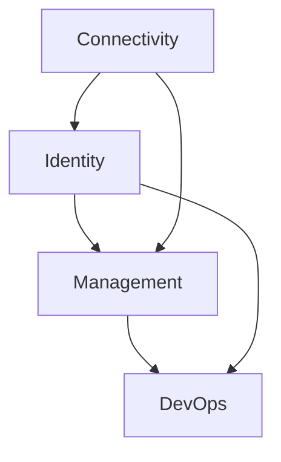

# Phase 1: Platform Foundation Overview

## 🎯 Phase Objective
Establish the core platform infrastructure that enables all subsequent application workloads. This phase creates the foundational services for security, networking, monitoring, and automation.

## 📅 Timeline
**Duration**: 2-3 weeks
**Status**: 🔴 Not Started

## 🏗️ Architecture Components

### 🌐 Connectivity Domain
**Priority**: Critical (Deploy First)
- Hub-spoke virtual network architecture
- Private DNS zones for Azure services
- Network security groups and routing
- Cross-subscription connectivity

[📋 Detailed Planning](connectivity/ToDo.md)

### 🔐 Identity Domain  
**Priority**: Critical (Deploy Second)
- Azure Active Directory integration
- Key Vault infrastructure per domain
- Role-based access control automation
- Managed identity strategy

[📋 Detailed Planning](identity/ToDo.md)

### 📊 Management Domain
**Priority**: High (Deploy Third)
- Azure Monitor and Log Analytics
- Policy and governance automation
- Cost management and optimization
- Resource tagging strategy

[📋 Detailed Planning](management/ToDo.md)

### 🔄 DevOps Domain
**Priority**: High (Deploy Fourth)
- Azure DevOps infrastructure as code
- Pipeline automation for deployments
- Self-hosted agent pools
- Repository management

[📋 Detailed Planning](devops/ToDo.md)

## 🔗 Dependencies

## ✅ Phase Completion Criteria

### Technical Readiness
- [ ] Hub-spoke networking operational across subscriptions
- [ ] Private DNS resolution working for all Azure services
- [ ] Key Vaults deployed with proper network ACLs
- [ ] RBAC automation configured and tested
- [ ] Monitoring dashboards showing platform health
- [ ] CI/CD pipelines successfully deploying infrastructure

### Documentation Complete
- [ ] Network architecture documented
- [ ] Security baseline documented
- [ ] Monitoring runbooks created
- [ ] Deployment procedures validated

### Team Readiness
- [ ] Platform team trained on new architecture
- [ ] Troubleshooting procedures documented
- [ ] On-call procedures established
- [ ] Knowledge transfer sessions completed

## 🚀 Success Metrics

| Metric | Target | Measurement |
|--------|--------|-------------|
| Deployment Success Rate | >95% | Pipeline success rate |
| Network Latency | <10ms hub-spoke | Network monitoring |
| Security Compliance | 100% | Policy compliance score |
| Knowledge Transfer | All team members | Training completion |

## 🎯 Phase 2 Enablement

Upon completion, Phase 1 provides:
- **Secure Networking** - Ready for application workloads
- **Identity Foundation** - Service accounts and access patterns
- **Monitoring Platform** - Application telemetry collection
- **Automation Platform** - Application deployment pipelines

## 📋 Next Steps

1. Review individual domain ToDo files
2. Plan deployment order and timeline
3. Assign domain ownership to team members
4. Begin with connectivity domain implementation
