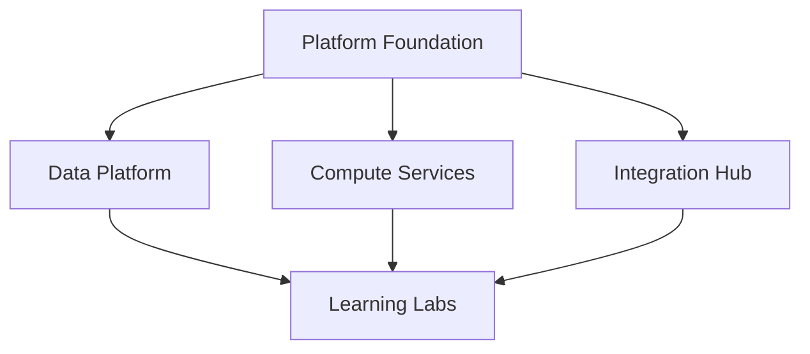

# Phase 2: Application Workloads Overview

## 🎯 Phase Objective
Deploy business-value applications that leverage the platform foundation from Phase 1. This phase demonstrates real-world workload patterns and showcases enterprise application capabilities.

## 📅 Timeline
**Duration**: 3-4 weeks
**Status**: 🟡 Waiting for Phase 1 Completion

## 🎯 Application Domains

### 🗄️ Data Platform Domain
**Priority**: High (Business Critical)
- Modern analytics with Synapse and Databricks
- AI Foundry for machine learning workloads
- Data lake and warehouse architecture
- Real-time streaming analytics

[📋 Detailed Planning](data/ToDo.md)

### 💻 Compute Services Domain
**Priority**: High (Infrastructure Foundation)
- Virtual machine management and scaling
- Container platform with AKS
- Image bakery for golden images
- Hybrid cloud connectivity

[📋 Detailed Planning](compute/ToDo.md)

### 🔗 Integration Hub Domain
**Priority**: Medium (Service Enablement)
- API Management platform
- Event-driven architecture with Event Grid
- Service Bus messaging patterns
- Logic Apps for workflow automation

[📋 Detailed Planning](integration/ToDo.md)

### 🎓 Learning Labs Domain
**Priority**: Medium (Team Development)
- DP-203 certification environment
- AZ-104 practice labs
- Experimentation and sandbox areas
- Skills development tracking

[📋 Detailed Planning](labs/ToDo.md)

## 🔗 Dependencies

**Phase 1 Prerequisites:**
- ✅ Hub-spoke networking operational
- ✅ Identity and Key Vault infrastructure ready
- ✅ Monitoring and governance policies active
- ✅ CI/CD pipelines functional

**Inter-Domain Dependencies:**

## ✅ Phase Completion Criteria

### Data Platform Ready
- [ ] Analytics workloads processing real data
- [ ] AI models deployed and serving predictions
- [ ] Data governance policies enforced
- [ ] Performance monitoring operational

### Compute Platform Ready
- [ ] VMs deployed with automated management
- [ ] Container workloads running on AKS
- [ ] Image pipeline producing golden images
- [ ] Auto-scaling configured and tested

### Integration Platform Ready
- [ ] APIs published and discoverable
- [ ] Event-driven workflows operational
- [ ] Message queues processing traffic
- [ ] Cross-service communication secured

### Learning Platform Ready
- [ ] Certification labs available to team
- [ ] Sandbox environments self-service
- [ ] Learning progress tracking active
- [ ] Knowledge sharing sessions scheduled

## 🚀 Success Metrics

| Domain | Key Metric | Target | Measurement |
|--------|------------|--------|-------------|
| Data | Query Performance | <5s for dashboards | Analytics monitoring |
| Compute | Service Availability | >99.9% uptime | Health checks |
| Integration | API Response Time | <200ms average | API monitoring |
| Labs | Team Engagement | 80% active usage | Usage analytics |

## 🏢 Business Value Demonstration

### For Leadership
- **Real Analytics**: Dashboards showing business insights
- **AI Capabilities**: Machine learning models solving business problems
- **Cost Optimization**: Efficient resource utilization metrics
- **Team Growth**: Certification achievements and skill development

### For Engineering Teams
- **Modern Patterns**: Event-driven, microservices, containers
- **Developer Experience**: Self-service platforms and automation
- **Operational Excellence**: Monitoring, alerting, and incident response
- **Career Development**: Hands-on experience with cutting-edge technology

## 🎯 Phase 3 Preparation

This phase sets up for advanced scenarios:
- Multi-region application patterns
- Advanced security and compliance
- Performance optimization and scaling
- Disaster recovery and business continuity

## 📋 Next Steps

1. Confirm Phase 1 completion and sign-off
2. Review application domain requirements
3. Plan workload deployment sequence
4. Begin with data platform (highest business value)
5. Parallel development of compute and integration domains
