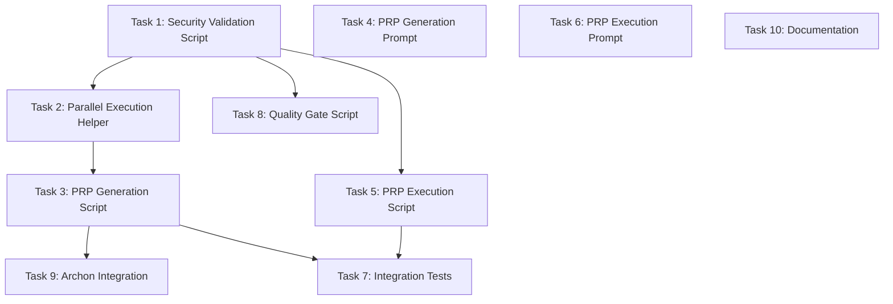

# Execution Plan: Codex Commands

**PRP**: /Users/jon/source/vibes/prps/codex_commands.md
**Generated**: 2025-10-07
**Total Tasks**: 10
**Execution Groups**: 5
**Estimated Time Savings**: 45% (200min sequential → 110min parallel)

## Task Dependency Graph



---

## Execution Groups

### Group 1: Foundation Task (Sequential)

**Tasks**: 1
**Execution Mode**: SEQUENTIAL
**Expected Duration**: ~20 minutes
**Dependencies**: None

**Tasks in this group**:

1. **Task 1**: Create Bash Security Validation Script
   - **What it does**: Prevent command injection and path traversal in feature names
   - **Files**: `scripts/codex/security-validation.sh`
   - **No dependencies**: Foundation script required by all others
   - **Why foundation**: Provides validate_feature_name() and extract_feature_name() functions used by Tasks 2, 3, 5, 8

**Parallelization Strategy**:
- This is a foundation task that must complete first
- All other tasks depend on security validation

---

### Group 2: Parallel Independent Tasks (Parallel Execution)

**Tasks**: 5
**Execution Mode**: PARALLEL
**Expected Duration**: ~20 minutes (max of all tasks)
**Dependencies**: Task 1 must complete first

**Tasks in this group**:

1. **Task 2**: Create Phase 2 Parallel Execution Helper
   - **What it does**: Launch 3 Phase 2 agents simultaneously, track PIDs, capture exit codes
   - **Files**: `scripts/codex/parallel-exec.sh`
   - **Depends on**: Task 1 (sources security-validation.sh for feature name validation)
   - **Why parallel safe**: Independent implementation, different file from Tasks 4, 5, 6, 8

2. **Task 4**: Create PRP Generation Command Prompt
   - **What it does**: Full 5-phase PRP generation prompt for Codex CLI
   - **Files**: `.codex/commands/codex-generate-prp.md`
   - **Depends on**: Task 1 (references security validation pattern in documentation)
   - **Why parallel safe**: Pure documentation, no code dependencies on Tasks 2, 5, 6, 8

3. **Task 5**: Create PRP Execution Validation Loop Script
   - **What it does**: Orchestrate PRP execution with validation loop (ruff → mypy → pytest)
   - **Files**: `scripts/codex/codex-execute-prp.sh`
   - **Depends on**: Task 1 (sources security-validation.sh for feature extraction)
   - **Why parallel safe**: Independent implementation, different file from Tasks 2, 4, 6, 8

4. **Task 6**: Create PRP Execution Command Prompt
   - **What it does**: PRP execution prompt with validation loops for Codex CLI
   - **Files**: `.codex/commands/codex-execute-prp.md`
   - **Depends on**: Task 1 (references security validation in prompt)
   - **Why parallel safe**: Pure documentation, no code dependencies on Tasks 2, 4, 5, 8

5. **Task 8**: Create Quality Gate Script
   - **What it does**: Extract PRP quality score and enforce ≥8/10 minimum
   - **Files**: `scripts/codex/quality-gate.sh`
   - **Depends on**: Task 1 (sources security-validation.sh for feature name handling)
   - **Why parallel safe**: Independent implementation, different file from Tasks 2, 4, 5, 6

**Parallelization Strategy**:
- Wait for Group 1 (Task 1) completion
- Invoke 5 `prp-exec-implementer` subagents simultaneously
- Each subagent gets one task
- All must complete before proceeding to Group 3

---

### Group 3: PRP Generation Script (Sequential)

**Tasks**: 1
**Execution Mode**: SEQUENTIAL
**Expected Duration**: ~20 minutes
**Dependencies**: Tasks 1, 2 must complete first

**Tasks in this group**:

1. **Task 3**: Create PRP Generation Orchestration Script
   - **What it does**: Orchestrate full 5-phase PRP generation workflow with parallel Phase 2
   - **Files**: `scripts/codex/codex-generate-prp.sh`
   - **Depends on**:
     - Task 1 (sources security-validation.sh)
     - Task 2 (sources parallel-exec.sh)
   - **Why sequential**: Must import functionality from both Task 1 and Task 2

**Parallelization Strategy**:
- Wait for Group 2 completion (ensures Tasks 1 and 2 are done)
- Execute single `prp-exec-implementer` subagent
- Must complete before Group 4

---

### Group 4: Archon Integration (Sequential)

**Tasks**: 1
**Execution Mode**: SEQUENTIAL
**Expected Duration**: ~20 minutes
**Dependencies**: Task 3 must complete first

**Tasks in this group**:

1. **Task 9**: Add Archon Integration to Generate Script
   - **What it does**: Track PRP generation in Archon with tasks for each phase
   - **Files**: `scripts/codex/codex-generate-prp.sh` (MODIFY)
   - **Depends on**: Task 3 (modifies the script created in Task 3)
   - **Why sequential**: Cannot modify a file that doesn't exist yet

**Parallelization Strategy**:
- Wait for Group 3 completion (ensures Task 3 complete)
- Execute single `prp-exec-implementer` subagent
- Must complete before Group 5

---

### Group 5: Testing & Documentation (Parallel Execution)

**Tasks**: 2
**Execution Mode**: PARALLEL
**Expected Duration**: ~30 minutes (max of both tasks)
**Dependencies**: Groups 1-4 must complete first

**Tasks in this group**:

1. **Task 7**: Create Integration Tests
   - **What it does**: Validate end-to-end workflows and parallel execution
   - **Files**:
     - `tests/codex/test_generate_prp.sh`
     - `tests/codex/test_execute_prp.sh`
     - `tests/codex/test_parallel_timing.sh`
   - **Depends on**: Tasks 3, 5 (tests the commands created in these tasks)
   - **Why parallel safe**: Tests can be written while Task 10 writes documentation

2. **Task 10**: Add Documentation
   - **What it does**: Document usage, configuration, and troubleshooting
   - **Files**:
     - `.codex/README.md`
     - `scripts/codex/README.md`
   - **Depends on**: Logical dependency on all tasks (documents the complete system)
   - **Why parallel safe**: Documentation can be written while tests are being created

**Parallelization Strategy**:
- Wait for Group 4 completion (all implementation complete)
- Invoke 2 `prp-exec-implementer` subagents simultaneously
- Each subagent gets one task
- Both complete to finish implementation

---

## Execution Summary

| Group | Tasks | Mode | Duration | Dependencies |
|-------|-------|------|----------|--------------|
| 1 | 1 (Task 1) | Sequential | 20min | None |
| 2 | 5 (Tasks 2,4,5,6,8) | Parallel | 20min | Group 1 |
| 3 | 1 (Task 3) | Sequential | 20min | Groups 1-2 |
| 4 | 1 (Task 9) | Sequential | 20min | Groups 1-3 |
| 5 | 2 (Tasks 7,10) | Parallel | 30min | Groups 1-4 |

**Total Sequential Time**: 200 minutes (10 tasks × 20min avg)
**Total Parallel Time**: 110 minutes (20 + 20 + 20 + 20 + 30)
**Time Savings**: 45% improvement (90min saved)

---

## Implementation Instructions for Orchestrator

### Execution Pseudocode

```python
# Phase 1: Foundation
execute_group_1_sequential([Task_1])

# Phase 2: Parallel Independent Tasks
execute_group_2_parallel([Task_2, Task_4, Task_5, Task_6, Task_8])

# Phase 3: Main Orchestration Script
execute_group_3_sequential([Task_3])

# Phase 4: Archon Integration
execute_group_4_sequential([Task_9])

# Phase 5: Testing & Documentation
execute_group_5_parallel([Task_7, Task_10])
```

### Task Context Preparation

For each task, prepare this context for implementer:

```yaml
task_id: {archon task id if available}
task_name: {from PRP}
responsibility: {from PRP}
files_to_create: {from PRP}
files_to_modify: {from PRP if applicable}
pattern_to_follow: {from PRP}
specific_steps: {from PRP}
validation: {from PRP}
prp_file: /Users/jon/source/vibes/prps/codex_commands.md
dependencies_complete: {list of completed tasks this depends on}
```

### Parallel Execution Pattern

```bash
# For parallel groups (2 and 5)
execute_parallel_group() {
    local group_number="$1"
    shift
    local tasks=("$@")

    echo "🚀 Executing Group ${group_number} (${#tasks[@]} tasks in parallel)"

    # Update Archon tasks to "doing"
    for task_id in "${tasks[@]}"; do
        archon_update_task "$task_id" "doing"
    done

    # Launch implementers in parallel (single message with multiple Task() calls)
    # Note: In actual Claude Code execution, use Task() parallel invocation
    local pids=()
    for task_id in "${tasks[@]}"; do
        invoke_implementer "$task_id" &
        pids+=($!)
    done

    # Wait for all to complete
    local all_success=true
    for pid in "${pids[@]}"; do
        wait "$pid" || all_success=false
    done

    # Update Archon tasks to "done" or "blocked"
    for task_id in "${tasks[@]}"; do
        if $all_success; then
            archon_update_task "$task_id" "done"
        else
            archon_update_task "$task_id" "blocked"
        fi
    done

    $all_success || return 1
}

# Example usage:
execute_parallel_group 2 "task_2" "task_4" "task_5" "task_6" "task_8"
```

---

## Dependency Analysis Details

### Task 1: Create Bash Security Validation Script
**Dependencies**: None (foundation task)

**Rationale**: This script provides critical security functions used by all other scripts:
- `validate_feature_name()` - 6-level validation
- `extract_feature_name()` - Safe feature extraction
Must complete first to prevent command injection and path traversal vulnerabilities.

**Can run in parallel with**: None (all tasks depend on it)

---

### Task 2: Create Phase 2 Parallel Execution Helper
**Dependencies**:
- ✅ Task 1 (sources security-validation.sh)

**Rationale**: The parallel-exec.sh script must:
1. Source security-validation.sh for feature name handling
2. Use validate_feature_name() before creating directories
3. Use extract_feature_name() for manifest paths

**Can run in parallel with**: Tasks 4, 5, 6, 8 (different files, no code interdependencies)

---

### Task 3: Create PRP Generation Orchestration Script
**Dependencies**:
- ✅ Task 1 (sources security-validation.sh)
- ✅ Task 2 (sources parallel-exec.sh)

**Rationale**: The codex-generate-prp.sh script imports both:
```bash
source "$(dirname "$0")/security-validation.sh"
source "$(dirname "$0")/parallel-exec.sh"
```
Both must exist before this script can be created and tested.

**Can run in parallel with**: Tasks 4, 6, 8 (no direct code dependencies)
**Cannot run in parallel with**: Task 5 (both may modify similar validation patterns)

---

### Task 4: Create PRP Generation Command Prompt
**Dependencies**:
- ✅ Task 1 (references security validation pattern)

**Rationale**: The command prompt documents security validation:
- References 6-level validation in instructions
- Explains removeprefix() vs replace() pattern
- Documents feature name extraction
Needs Task 1 complete to reference actual implementation.

**Can run in parallel with**: Tasks 2, 5, 6, 8 (pure documentation, no code dependencies)

---

### Task 5: Create PRP Execution Validation Loop Script
**Dependencies**:
- ✅ Task 1 (sources security-validation.sh)

**Rationale**: The codex-execute-prp.sh script:
1. Sources security-validation.sh for feature extraction
2. Uses validate_feature_name() for PRP path validation
3. No dependency on parallel-exec.sh (doesn't use parallel execution)

**Can run in parallel with**: Tasks 2, 4, 6, 8 (different files, independent implementations)

---

### Task 6: Create PRP Execution Command Prompt
**Dependencies**:
- ✅ Task 1 (references security validation)

**Rationale**: The command prompt documents validation patterns from Task 1:
- References security validation in PRP execution flow
- Documents feature name extraction
Pure documentation with no code dependencies.

**Can run in parallel with**: Tasks 2, 4, 5, 8 (no interdependencies)

---

### Task 7: Create Integration Tests
**Dependencies**:
- ✅ Task 3 (tests codex-generate-prp.sh)
- ✅ Task 5 (tests codex-execute-prp.sh)
- ✅ Task 9 (tests Archon integration in codex-generate-prp.sh)

**Rationale**: Tests validate the actual implementations:
- `test_generate_prp.sh` executes `scripts/codex/codex-generate-prp.sh`
- `test_execute_prp.sh` executes `scripts/codex/codex-execute-prp.sh`
- `test_parallel_timing.sh` validates parallel execution from Task 3
Cannot test scripts that don't exist yet.

**Can run in parallel with**: Task 10 (documentation is independent)

---

### Task 8: Create Quality Gate Script
**Dependencies**:
- ✅ Task 1 (sources security-validation.sh)

**Rationale**: The quality-gate.sh script:
1. Sources security-validation.sh for feature name handling
2. Uses validate_feature_name() for PRP path validation
3. Independent implementation (extract_prp_score, enforce_quality_gate)

**Can run in parallel with**: Tasks 2, 4, 5, 6 (no interdependencies)

---

### Task 9: Add Archon Integration to Generate Script
**Dependencies**:
- ✅ Task 3 (modifies scripts/codex/codex-generate-prp.sh)

**Rationale**: This task MODIFIES the file created in Task 3:
- Cannot modify a file that doesn't exist
- Adds Archon integration to existing workflow
- Must wait for Task 3 to complete

**Can run in parallel with**: None (must be sequential after Task 3)

---

### Task 10: Add Documentation
**Dependencies**:
- ✅ Logical dependency on all tasks (documents complete system)

**Rationale**: Documentation covers the entire system:
- `.codex/README.md` documents commands (Tasks 4, 6)
- `scripts/codex/README.md` documents scripts (Tasks 1, 2, 3, 5, 8, 9)
- Troubleshooting guide (references all tasks)
However, documentation can be written in parallel with tests (Task 7) since they target different files.

**Can run in parallel with**: Task 7 (tests and docs are independent)

---

## Risk Assessment

**Potential Bottlenecks**:

1. **Task 1 (Security Validation Script)**: Foundation task blocks all others
   - Duration: ~20 minutes
   - Impact: All tasks wait for this to complete
   - Mitigation: Prioritize this task, ensure high quality first pass

2. **Task 3 (PRP Generation Script)**: Blocks Task 9 and Task 7
   - Duration: ~20 minutes
   - Impact: Archon integration and some tests wait for this
   - Mitigation: Task 3 is in Group 3 after parallel Group 2, minimizes total wait

3. **Task 9 (Archon Integration)**: Blocks Task 7 (partially)
   - Duration: ~20 minutes
   - Impact: Archon-related tests cannot run until this completes
   - Mitigation: Task 7 can run in parallel with Task 10, reduces perceived wait

**Parallelization Benefits**:

- **Group 1**: 1 task (sequential, unavoidable)
- **Group 2**: 5 tasks run simultaneously instead of sequentially (saves 80min)
  - Sequential: 5 × 20min = 100min
  - Parallel: max(20min) = 20min
  - Savings: 80min (80% time reduction)
- **Group 3**: 1 task (sequential, depends on Group 2)
- **Group 4**: 1 task (sequential, depends on Group 3)
- **Group 5**: 2 tasks run simultaneously instead of sequentially (saves 20min)
  - Sequential: 2 × 30min = 60min
  - Parallel: max(30min) = 30min
  - Savings: 30min (50% time reduction)

**Total time savings**: 90 minutes (45% improvement)

---

## Assumptions Made

1. **Task duration estimates**: Assumed ~20 minutes per script, ~30 minutes for tests
   - **Rationale**: Based on PRP complexity and pattern similarity
   - **If wrong**: Adjust group durations, but parallelization strategy remains valid

2. **File-based dependencies are complete**: Tasks only depend on files explicitly sourced
   - **Rationale**: Bash scripts use explicit `source` statements, prompts reference patterns
   - **If wrong**: May need to add dependencies, potentially reducing parallelization

3. **Documentation can be written in parallel with tests**: Task 10 has no blocking dependencies
   - **Rationale**: Docs describe the system, tests validate it - different concerns
   - **If wrong**: Move Task 10 after Task 7 (minor impact, +30min)

4. **Archon integration is additive**: Task 9 adds features, doesn't rewrite Task 3
   - **Rationale**: PRP describes "Add Archon Integration" as enhancement
   - **If wrong**: Task 9 may take longer if substantial refactoring needed

5. **No resource conflicts**: Parallel tasks don't compete for exclusive resources
   - **Rationale**: Each task creates different files, no shared state
   - **If wrong**: May need to serialize some tasks (e.g., if filesystem locks required)

**If assumptions wrong**:
- **Increase durations**: Adjust time estimates but keep parallelization groups
- **Add dependencies**: Move tasks to later groups if hidden dependencies discovered
- **Serialize tests**: Move Task 7 after Task 10 if documentation needed for test context

---

## Next Steps

1. **Orchestrator validates** this execution plan
   - Review dependency analysis
   - Confirm parallelization strategy
   - Verify time estimates reasonable

2. **For Group 1** (Foundation):
   - Execute Task 1 (Security Validation Script)
   - Verify completion before proceeding

3. **For Group 2** (Parallel Independent Tasks):
   - Update 5 Archon tasks to "doing" (Tasks 2, 4, 5, 6, 8)
   - Invoke 5 `prp-exec-implementer` subagents simultaneously
   - Wait for all to complete
   - Update all tasks to "done"

4. **For Group 3** (Main Orchestration):
   - Execute Task 3 (PRP Generation Script)
   - Verify completion before proceeding

5. **For Group 4** (Archon Integration):
   - Execute Task 9 (Archon Integration)
   - Verify completion before proceeding

6. **For Group 5** (Testing & Documentation):
   - Update 2 Archon tasks to "doing" (Tasks 7, 10)
   - Invoke 2 `prp-exec-implementer` subagents simultaneously
   - Wait for all to complete
   - Update all tasks to "done"

7. **After all tasks**: Proceed to validation and completion phases
   - Run integration tests (from Task 7)
   - Verify all quality gates passed
   - Generate final completion report

---

## Execution Validation

Before starting execution, verify:

- ✅ All 10 tasks extracted from PRP
- ✅ Dependencies correctly identified (file-based and logical)
- ✅ Groups respect dependencies (no task depends on later group)
- ✅ Parallel groups have no inter-task dependencies
- ✅ Execution instructions clear for orchestrator
- ✅ Time savings estimated (45% improvement)
- ✅ Risk assessment provided (3 potential bottlenecks identified)
- ✅ Assumptions documented (5 key assumptions with mitigation)

**Ready for execution**: YES

**Estimated completion time**: 110 minutes (vs 200 minutes sequential)

**Parallelization efficiency**: 45% time savings through strategic grouping
