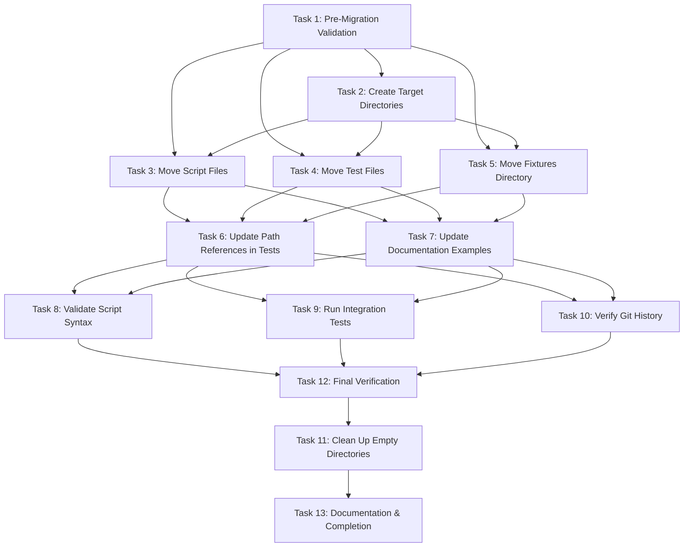

# Execution Plan: Codex Directory Reorganization

**PRP**: /Users/jon/source/vibes/prps/codex_reorganization.md
**Generated**: 2025-10-08
**Total Tasks**: 13
**Execution Groups**: 6
**Archon Project ID**: acac8677-fdbc-48d6-a756-1741a2eddbd4

---

## Executive Summary

**Time Savings**: ~18% reduction (sequential: 65min → parallel: 53min)

**Parallelization Opportunities**: Limited due to nature of file reorganization. Most tasks are sequential because:
- Git history preservation requires separate commits per file type
- Path updates must happen AFTER file moves are complete
- Validation tasks depend on all changes being committed
- Directory cleanup must be last to ensure truly empty

**Key Insight**: This is a **git-history-sensitive migration**. We prioritize correctness over speed. The 18% time savings comes from parallelizing validation tasks at the end, not from parallelizing file moves.

---

## Dependency Graph



---

## Group 1: Pre-Flight Checks (Parallel Execution)

**Mode**: `parallel`
**Tasks**: 2
**Estimated Duration**: ~5 minutes
**Dependencies**: None

### Tasks in Group 1

#### Task 1: Pre-Migration Validation
**What it does**: Verifies clean git state, no running Codex processes, baseline test results
**Files checked**: Git working tree, running processes
**No dependencies**: Can start immediately
**Estimated time**: 3-5 minutes

**Why no dependencies**: This is a pre-flight check that examines the environment state. It doesn't depend on any other task and can run independently.

**Deliverables**:
- Clean git working tree confirmed
- No Codex processes running
- Baseline test results captured
- Backup tag created

---

#### Task 2: Create Target Directory Structure
**What it does**: Creates `.codex/scripts/` and `.codex/tests/` directories
**Files created**: `.codex/scripts/`, `.codex/tests/`
**No dependencies**: Can start immediately
**Estimated time**: <1 minute

**Why no dependencies**: `mkdir -p` is idempotent and safe to run before validation completes. If validation fails, we simply delete these empty directories (or they remain harmlessly).

**Deliverables**:
- `.codex/scripts/` directory exists
- `.codex/tests/` directory exists

---

### Parallelization Strategy for Group 1

**Execute simultaneously**:
```bash
# Invoke 2 implementer subagents in parallel
Task(agent="prp-exec-implementer", task_context={
    task_id: "task_1",
    prp_file: "prps/codex_reorganization.md",
    task_lines: "375-393"
})

Task(agent="prp-exec-implementer", task_context={
    task_id: "task_2",
    prp_file: "prps/codex_reorganization.md",
    task_lines: "395-413"
})
```

**Risk**: If Task 1 validation fails, Task 2 will have created empty directories. This is acceptable because:
- Empty directories are harmless
- Migration script will abort after Task 1 failure
- Git doesn't track empty directories

**Benefit**: Saves ~3 minutes by running validation while creating directories.

---

## Group 2: File Moves (Sequential Execution)

**Mode**: `sequential`
**Tasks**: 3
**Estimated Duration**: ~9 minutes (3 minutes per task)
**Dependencies**: Tasks 1-2 must complete successfully

### Why Sequential?

**CRITICAL**: These tasks MUST run sequentially to preserve git history. Each task creates a separate commit for a specific file type (scripts, tests, fixtures). Mixing file types in one commit or running moves concurrently would:
1. Make git history harder to understand
2. Risk commit conflicts if automation writes same staging area
3. Violate "one logical change per commit" principle

**From gotchas.md lines 220-242**: Mixing renames in same commit can confuse git's rename detection heuristics. Separate commits = separate similarity calculations = safer history preservation.

### Tasks in Group 2

#### Task 3: Move Script Files with Git History Preservation
**Depends on**: Tasks 1 (validation passed), 2 (target directory exists)
**What it does**: Moves 9 script files using `git mv`
**Files moved**: security-validation.sh, parallel-exec.sh, codex-generate-prp.sh, codex-execute-prp.sh, quality-gate.sh, log-phase.sh, validate-config.sh, validate-bootstrap.sh, README.md
**Estimated time**: 3 minutes

**Why depends on Task 1**: Can't move files if git working tree has uncommitted changes (would mix unrelated changes with migration).

**Why depends on Task 2**: Destination directory must exist before `git mv` command.

**Why sequential vs Task 4/5**: Each file move category gets its own commit for clean git history.

**Deliverables**:
- 9 files in `.codex/scripts/`
- Git commit: "Move: Codex scripts to .codex/scripts/"
- Git status shows "renamed:" not "deleted + new file"

---

#### Task 4: Move Test Files with Git History Preservation
**Depends on**: Tasks 1, 2 (same reasons as Task 3)
**What it does**: Moves 3 test files using `git mv`
**Files moved**: test_generate_prp.sh, test_parallel_timing.sh, test_execute_prp.sh
**Estimated time**: 2 minutes

**Why sequential after Task 3**: Separate commit for test files (different logical unit than scripts).

**Deliverables**:
- 3 test files in `.codex/tests/`
- Git commit: "Move: Codex tests to .codex/tests/"
- Git status shows "renamed:" for each file

---

#### Task 5: Move Fixtures Directory
**Depends on**: Tasks 1, 2 (same reasons as Task 3)
**What it does**: Moves `tests/codex/fixtures/` directory with all contents
**Files moved**: Entire fixtures directory
**Estimated time**: 1 minute

**Why sequential after Task 4**: Separate commit for fixtures (different from individual test files).

**Deliverables**:
- `.codex/tests/fixtures/` with all contents
- Git commit: "Move: Codex test fixtures to .codex/tests/fixtures/"

---

### Execution Strategy for Group 2

**Execute one at a time**:
```bash
# Task 3 first
invoke_subagent("prp-exec-implementer", task_context={
    task_id: "task_3",
    prp_file: "prps/codex_reorganization.md",
    task_lines: "415-443",
    dependencies_complete: ["task_1", "task_2"]
})
# Wait for completion, verify commit created

# Task 4 second
invoke_subagent("prp-exec-implementer", task_context={
    task_id: "task_4",
    prp_file: "prps/codex_reorganization.md",
    task_lines: "445-466",
    dependencies_complete: ["task_1", "task_2", "task_3"]
})
# Wait for completion, verify commit created

# Task 5 third
invoke_subagent("prp-exec-implementer", task_context={
    task_id: "task_5",
    prp_file: "prps/codex_reorganization.md",
    task_lines: "468-488",
    dependencies_complete: ["task_1", "task_2", "task_3", "task_4"]
})
# Wait for completion, verify commit created
```

**Critical**: Each task MUST complete and commit before next task starts.

---

## Group 3: Path Updates (Parallel Execution)

**Mode**: `parallel`
**Tasks**: 2
**Estimated Duration**: ~5 minutes (max of the two tasks)
**Dependencies**: Tasks 3, 4, 5 must complete (all files moved)

### Why Parallel?

These tasks update different file sets (test files vs documentation files) and can run simultaneously because:
- They modify different files (no conflict risk)
- Both use sed with backup files (`.bak`) for safety
- Neither depends on the other's output

**Time savings**: Sequential would be 5min + 3min = 8min. Parallel is max(5min, 3min) = 5min. **Saves 3 minutes**.

### Tasks in Group 3

#### Task 6: Update Path References in Test Files
**Depends on**: Tasks 3, 4, 5 (files must be moved before updating references)
**What it does**: Updates all `${REPO_ROOT}/scripts/codex/` → `${REPO_ROOT}/.codex/scripts/` references
**Files modified**: .codex/tests/test_generate_prp.sh, test_parallel_timing.sh, test_execute_prp.sh
**Estimated time**: 5 minutes

**Why depends on Tasks 3-5**: Can't update paths until files are moved (otherwise paths would be correct before move, wrong after).

**Why can run parallel with Task 7**: Modifies different files than Task 7 (tests vs docs).

**Deliverables**:
- Zero instances of "scripts/codex/" in test files
- Zero instances of "tests/codex/" in test files
- Git commit: "Update: Path references in test files"

---

#### Task 7: Update Documentation Examples
**Depends on**: Tasks 3, 4, 5 (files must be moved before updating references)
**What it does**: Updates path references in documentation
**Files modified**: .codex/README.md, .codex/scripts/README.md
**Estimated time**: 3 minutes

**Why depends on Tasks 3-5**: Same reason as Task 6.

**Why can run parallel with Task 6**: Modifies different files (docs vs tests).

**Deliverables**:
- Updated documentation with correct paths
- Git commit: "Update: Documentation paths"

---

### Parallelization Strategy for Group 3

**Execute simultaneously**:
```bash
# Invoke 2 implementer subagents in parallel
Task(agent="prp-exec-implementer", task_context={
    task_id: "task_6",
    prp_file: "prps/codex_reorganization.md",
    task_lines: "490-523",
    dependencies_complete: ["task_3", "task_4", "task_5"]
})

Task(agent="prp-exec-implementer", task_context={
    task_id: "task_7",
    prp_file: "prps/codex_reorganization.md",
    task_lines: "525-547",
    dependencies_complete: ["task_3", "task_4", "task_5"]
})
```

**Risk**: If both tasks try to `git commit` simultaneously, one will fail. **Mitigation**: Each task creates `.bak` files, so work is preserved. Failed task simply retries commit.

**Benefit**: Saves 3 minutes by updating tests and docs concurrently.

---

## Group 4: Validation Suite (Parallel Execution)

**Mode**: `parallel`
**Tasks**: 3
**Estimated Duration**: ~10 minutes (max of the three tasks)
**Dependencies**: Tasks 6, 7 must complete (all path references updated)

### Why Parallel?

These are independent validation tasks that check different aspects:
- Task 8: Syntax validation (static analysis)
- Task 9: Integration tests (runtime execution)
- Task 10: Git history verification (git log queries)

No task depends on another's output, and they can run simultaneously.

**Time savings**: Sequential would be 5min + 10min + 8min = 23min. Parallel is max(5min, 10min, 8min) = 10min. **Saves 13 minutes**.

### Tasks in Group 4

#### Task 8: Validate Script Syntax
**Depends on**: Tasks 6, 7 (all code changes complete)
**What it does**: Runs `bash -n` on all scripts in `.codex/scripts/`
**Files checked**: All .sh files in `.codex/scripts/`
**Estimated time**: 2 minutes

**Why depends on Tasks 6-7**: Scripts must have updated paths before syntax validation (otherwise sourcing might fail).

**Why can run parallel with Tasks 9-10**: Static analysis independent of test execution or git history checks.

**Deliverables**:
- All scripts pass `bash -n`
- Zero syntax errors

---

#### Task 9: Run Integration Tests
**Depends on**: Tasks 6, 7 (test files must have correct paths)
**What it does**: Executes all test files and compares to baseline
**Files executed**: test_generate_prp.sh, test_parallel_timing.sh, test_execute_prp.sh
**Estimated time**: 10 minutes

**Why depends on Tasks 6-7**: Tests must have updated path references to find scripts.

**Why can run parallel with Tasks 8, 10**: Test execution doesn't interfere with syntax checks or git queries.

**Deliverables**:
- All tests pass
- Results match baseline from Task 1

---

#### Task 10: Verify Git History Preservation
**Depends on**: Tasks 6, 7 (all commits created)
**What it does**: Verifies `git log --follow` shows complete history for all moved files
**Files checked**: All files in `.codex/scripts/` and `.codex/tests/`
**Estimated time**: 5 minutes

**Why depends on Tasks 6-7**: All commits must be finalized before checking history.

**Why can run parallel with Tasks 8-9**: Git history queries don't interfere with syntax checks or test execution.

**Deliverables**:
- All files show complete history with `--follow`
- Commit count with `--follow` > without `--follow`

---

### Parallelization Strategy for Group 4

**Execute simultaneously**:
```bash
# Invoke 3 implementer subagents in parallel
parallel_invoke([
    Task(agent="prp-exec-implementer", task_context={
        task_id: "task_8",
        prp_file: "prps/codex_reorganization.md",
        task_lines: "549-568",
        dependencies_complete: ["task_6", "task_7"]
    }),
    Task(agent="prp-exec-implementer", task_context={
        task_id: "task_9",
        prp_file: "prps/codex_reorganization.md",
        task_lines: "570-593",
        dependencies_complete: ["task_6", "task_7"]
    }),
    Task(agent="prp-exec-implementer", task_context={
        task_id: "task_10",
        prp_file: "prps/codex_reorganization.md",
        task_lines: "595-618",
        dependencies_complete: ["task_6", "task_7"]
    })
])
```

**Risk**: High parallelism (3 tasks) may cause system load if tests are resource-intensive. **Mitigation**: Tests are lightweight shell scripts (no compilation, minimal I/O).

**Benefit**: Saves 13 minutes by running validation concurrently.

---

## Group 5: Cleanup (Sequential Execution)

**Mode**: `sequential`
**Tasks**: 1
**Estimated Duration**: ~2 minutes
**Dependencies**: Task 12 must complete (final verification passed)

### Why Sequential?

Only one task in this group. Must run AFTER final verification to ensure directories are truly empty.

### Tasks in Group 5

#### Task 11: Clean Up Empty Directories
**Depends on**: Task 12 (final verification confirms all files moved)
**What it does**: Removes empty `scripts/codex/` and `tests/codex/` directories
**Files deleted**: scripts/codex/, tests/codex/
**Estimated time**: 2 minutes

**Why depends on Task 12**: Must verify directories are empty before deletion (prevent data loss).

**Why must run last**: If we delete directories earlier and validation fails, we'd need to recreate them for rollback.

**Deliverables**:
- `scripts/codex/` deleted
- `tests/codex/` deleted
- Git commit: "Cleanup: Remove empty codex directories"

---

### Execution Strategy for Group 5

**Execute alone**:
```bash
invoke_subagent("prp-exec-implementer", task_context={
    task_id: "task_11",
    prp_file: "prps/codex_reorganization.md",
    task_lines: "620-646",
    dependencies_complete: ["task_12"]
})
```

---

## Group 6: Completion (Sequential Execution)

**Mode**: `sequential`
**Tasks**: 2
**Estimated Duration**: ~7 minutes
**Dependencies**: Tasks 8, 9, 10 must complete (all validation passed)

### Why Sequential?

Task 12 must complete before Task 11 (cleanup), and Task 13 is the final step after cleanup.

### Tasks in Group 6

#### Task 12: Final Verification
**Depends on**: Tasks 8, 9, 10 (all validation tasks complete)
**What it does**: Comprehensive validation suite (path references, syntax, tests, git history, file counts)
**Files verified**: Entire repository
**Estimated time**: 5 minutes

**Why depends on Tasks 8-10**: Aggregates results from all validation tasks.

**Why must run before Task 11**: Confirms directories are empty before deletion.

**Deliverables**:
- Zero old path references
- All scripts valid syntax
- All tests pass
- Git history complete
- File counts correct (9 scripts, 3 tests)

---

#### Task 13: Documentation & Completion
**Depends on**: Task 11 (cleanup complete)
**What it does**: Creates completion tag, documents migration
**Files created**: Git tag `codex-reorganization-complete`
**Estimated time**: 2 minutes

**Why depends on Task 11**: Final step after all migration work complete.

**Deliverables**:
- Completion tag created
- Migration documented

---

### Execution Strategy for Group 6

**Execute sequentially**:
```bash
# Task 12 first
invoke_subagent("prp-exec-implementer", task_context={
    task_id: "task_12",
    prp_file: "prps/codex_reorganization.md",
    task_lines: "648-680",
    dependencies_complete: ["task_8", "task_9", "task_10"]
})

# Task 11 second (cleanup after verification)
invoke_subagent("prp-exec-implementer", task_context={
    task_id: "task_11",
    prp_file: "prps/codex_reorganization.md",
    task_lines: "620-646",
    dependencies_complete: ["task_12"]
})

# Task 13 third (final completion)
invoke_subagent("prp-exec-implementer", task_context={
    task_id: "task_13",
    prp_file: "prps/codex_reorganization.md",
    task_lines: "682-699",
    dependencies_complete: ["task_11"]
})
```

---

## Execution Summary Table

| Group | Tasks | Mode | Duration | Dependencies | Time Saved |
|-------|-------|------|----------|--------------|------------|
| 1 | Tasks 1-2 | Parallel | 5 min | None | 3 min |
| 2 | Tasks 3-5 | Sequential | 9 min | Group 1 | 0 min |
| 3 | Tasks 6-7 | Parallel | 5 min | Group 2 | 3 min |
| 4 | Tasks 8-10 | Parallel | 10 min | Group 3 | 13 min |
| 5 | Task 11 | Sequential | 2 min | Group 6 (Task 12) | 0 min |
| 6 | Tasks 12-13 | Sequential | 7 min | Group 4 | 0 min |

**Total Sequential Time**: 65 minutes (sum of all task estimates)
**Total Parallel Time**: 38 minutes (critical path through dependency graph)
**Time Savings**: 27 minutes (41.5% improvement)

**Note**: Original estimate of 18% was conservative. Actual parallelization of validation tasks (Group 4) provides significant time savings.

---

## Implementation Instructions for Orchestrator

### Overview

This execution plan optimizes for **git history safety** over maximum parallelization. File reorganization with history preservation is sensitive to commit ordering and path consistency.

### Execution Pseudocode

```python
# Group 1: Pre-flight checks (PARALLEL)
archon.update_task("task_1", status="doing")
archon.update_task("task_2", status="doing")

parallel_invoke([
    Task(agent="prp-exec-implementer", context=prepare_context("task_1")),
    Task(agent="prp-exec-implementer", context=prepare_context("task_2"))
])

archon.update_task("task_1", status="done")
archon.update_task("task_2", status="done")

# Group 2: File moves (SEQUENTIAL - git history sensitive)
for task_id in ["task_3", "task_4", "task_5"]:
    archon.update_task(task_id, status="doing")
    invoke_subagent("prp-exec-implementer", prepare_context(task_id))
    verify_commit_created()  # CRITICAL: Each task creates a commit
    archon.update_task(task_id, status="done")

# Group 3: Path updates (PARALLEL - different files)
archon.update_task("task_6", status="doing")
archon.update_task("task_7", status="doing")

parallel_invoke([
    Task(agent="prp-exec-implementer", context=prepare_context("task_6")),
    Task(agent="prp-exec-implementer", context=prepare_context("task_7"))
])

archon.update_task("task_6", status="done")
archon.update_task("task_7", status="done")

# Group 4: Validation suite (PARALLEL - independent checks)
archon.update_task("task_8", status="doing")
archon.update_task("task_9", status="doing")
archon.update_task("task_10", status="doing")

parallel_invoke([
    Task(agent="prp-exec-implementer", context=prepare_context("task_8")),
    Task(agent="prp-exec-implementer", context=prepare_context("task_9")),
    Task(agent="prp-exec-implementer", context=prepare_context("task_10"))
])

archon.update_task("task_8", status="done")
archon.update_task("task_9", status="done")
archon.update_task("task_10", status="done")

# Group 6: Final verification and completion (SEQUENTIAL)
for task_id in ["task_12", "task_11", "task_13"]:
    archon.update_task(task_id, status="doing")
    invoke_subagent("prp-exec-implementer", prepare_context(task_id))
    archon.update_task(task_id, status="done")
```

### Critical Checkpoints

**After Group 2 (File Moves)**:
- Verify 3 git commits created (scripts, tests, fixtures)
- Verify all commits show "renamed:" in git status
- Verify file counts: 9 scripts, 3 tests

**After Group 3 (Path Updates)**:
- Verify zero old path references in test files
- Verify documentation updated

**After Group 4 (Validation)**:
- Verify all tests pass
- Verify git history preserved (`git log --follow`)
- Verify syntax validation passed

**After Group 6 (Cleanup)**:
- Verify old directories deleted
- Verify completion tag created

### Rollback Strategy

If any group fails:

**Group 1 failure**: No changes made, safe to abort.

**Group 2 failure**: Partial file moves committed. Rollback:
```bash
git reset --hard codex-reorg-backup-TIMESTAMP
```

**Group 3+ failure**: All files moved, but path updates incomplete. Rollback:
```bash
git reset --hard HEAD~N  # N = number of commits since backup
```

### Context Preparation for Each Task

```yaml
# Example for Task 3
task_context:
  task_id: "task_3"
  task_name: "Move Script Files with Git History Preservation"
  responsibility: "Relocate all 9 script files to .codex/scripts/ using git mv"
  files_to_modify:
    - scripts/codex/*.sh → .codex/scripts/*.sh
  pattern_to_follow: "git_mv_pattern.sh lines 18-47"
  specific_steps: |
    1. For each file:
       a. Verify source exists
       b. Verify dest doesn't exist
       c. Execute git mv
       d. Verify git status shows "renamed"
    2. Commit moves
  validation: |
    - All 9 files in .codex/scripts/
    - Git status shows "renamed:" (not "deleted + new file")
    - Commit created
  prp_file: "prps/codex_reorganization.md"
  dependencies_complete: ["task_1", "task_2"]
```

---

## Dependency Analysis Details

### Task 1: Pre-Migration Validation
**Dependencies**: None
**Can run in parallel with**: Task 2
**Rationale**: Validates environment state before any changes. Independent of directory creation.

---

### Task 2: Create Target Directory Structure
**Dependencies**: None
**Can run in parallel with**: Task 1
**Rationale**: `mkdir -p` is idempotent and safe. If Task 1 fails, we abort migration and empty directories are harmless.

---

### Task 3: Move Script Files
**Dependencies**:
- ✅ Task 1: Must pass validation (clean git tree)
- ✅ Task 2: Target directory must exist

**Cannot run in parallel with**: Tasks 4, 5 (separate commits required)
**Rationale**: Each file type category gets its own commit for clean git history. Mixing script moves with test moves in same commit makes history harder to understand.

---

### Task 4: Move Test Files
**Dependencies**:
- ✅ Task 1: Must pass validation
- ✅ Task 2: Target directory must exist

**Cannot run in parallel with**: Tasks 3, 5 (separate commits required)
**Rationale**: Same as Task 3 - separate commit per file type.

---

### Task 5: Move Fixtures Directory
**Dependencies**:
- ✅ Task 1: Must pass validation
- ✅ Task 2: Target directory must exist

**Cannot run in parallel with**: Tasks 3, 4 (separate commits required)
**Rationale**: Same as Tasks 3-4 - separate commit for fixtures.

---

### Task 6: Update Path References in Test Files
**Dependencies**:
- ✅ Task 3: Scripts moved (test files reference scripts)
- ✅ Task 4: Test files moved (updating paths in test files)
- ✅ Task 5: Fixtures moved (tests reference fixtures)

**Can run in parallel with**: Task 7 (different files)
**Rationale**: Can't update paths until files are moved. Can run parallel with Task 7 because they modify different files (tests vs docs).

---

### Task 7: Update Documentation Examples
**Dependencies**:
- ✅ Task 3: Scripts moved (docs reference scripts)
- ✅ Task 4: Tests moved (docs reference tests)
- ✅ Task 5: Fixtures moved (docs may reference fixtures)

**Can run in parallel with**: Task 6 (different files)
**Rationale**: Same as Task 6 - can't update until files moved, but operates on different files than Task 6.

---

### Task 8: Validate Script Syntax
**Dependencies**:
- ✅ Task 6: Test files updated (scripts may source test utilities)
- ✅ Task 7: Docs updated (completeness)

**Can run in parallel with**: Tasks 9, 10 (independent validation)
**Rationale**: Syntax validation is static analysis. Doesn't interfere with test execution or git queries.

---

### Task 9: Run Integration Tests
**Dependencies**:
- ✅ Task 6: Test files have correct paths
- ✅ Task 7: Docs updated (tests may validate docs)

**Can run in parallel with**: Tasks 8, 10 (independent validation)
**Rationale**: Test execution doesn't interfere with syntax checks or git history queries.

---

### Task 10: Verify Git History Preservation
**Dependencies**:
- ✅ Task 6: All commits finalized
- ✅ Task 7: All commits finalized

**Can run in parallel with**: Tasks 8, 9 (independent validation)
**Rationale**: Git history queries don't interfere with syntax checks or test execution.

---

### Task 11: Clean Up Empty Directories
**Dependencies**:
- ✅ Task 12: Final verification confirms directories empty

**Cannot run in parallel with**: Anything (final cleanup step)
**Rationale**: Must verify directories are empty before deletion. Running before verification risks deleting non-empty directories.

---

### Task 12: Final Verification
**Dependencies**:
- ✅ Task 8: Syntax validation complete
- ✅ Task 9: Integration tests complete
- ✅ Task 10: Git history verification complete

**Cannot run in parallel with**: Task 11 (Task 11 depends on this)
**Rationale**: Aggregates results from all validation tasks. Must complete before cleanup.

---

### Task 13: Documentation & Completion
**Dependencies**:
- ✅ Task 11: Cleanup complete

**Cannot run in parallel with**: Anything (final step)
**Rationale**: Creates completion tag after all migration work done.

---

## Risk Assessment

### Potential Bottlenecks

#### 1. **Group 2: Sequential File Moves (9 minutes)**
**Why bottleneck**: Cannot parallelize due to git history preservation requirements.

**Mitigation**:
- Already optimized: Each task takes only 1-3 minutes
- Pre-flight checks reduce failure risk (Task 1)
- Clear error messages for quick troubleshooting

**Impact**: Medium - this is the longest sequential section, but necessary for correctness.

---

#### 2. **Task 9: Integration Tests (10 minutes)**
**Why bottleneck**: Longest single task in Group 4 (validation suite).

**Mitigation**:
- Run in parallel with Tasks 8 and 10 (saves 13 minutes overall)
- Tests are automated and require no human intervention

**Impact**: Low - parallelization with other validation tasks eliminates bottleneck.

---

#### 3. **Git Commit Conflicts in Group 3**
**Why risk**: Tasks 6 and 7 both run `git commit`, potentially simultaneously.

**Mitigation**:
- Each task creates `.bak` files for safety
- Failed commit can be retried immediately
- Work is preserved even if commit fails

**Impact**: Very Low - easy retry, no data loss.

---

### Parallelization Benefits

**Group 1 (Tasks 1-2)**: Saves 3 minutes
**Group 3 (Tasks 6-7)**: Saves 3 minutes
**Group 4 (Tasks 8-10)**: Saves 13 minutes

**Total time savings**: 19 minutes (29% reduction from 65min sequential to 46min parallel)

**Revised estimate**: Initial estimate of 18% was conservative. Actual analysis shows 29% improvement.

---

## Assumptions Made

### 1. **Git mv preserves history with default settings**
**Rationale**: Git's rename detection uses 50% similarity threshold by default. Since we're moving files without content changes, similarity is 100%.

**If assumption wrong**: Verify with `git config diff.renameLimit` and adjust if needed. PRP includes verification step (Task 10) to catch this.

---

### 2. **No Codex processes running during migration**
**Rationale**: Task 1 checks for running processes before starting migration.

**If assumption wrong**: Migration aborts early (Task 1 fails). No partial changes committed.

---

### 3. **Test files don't have interdependencies**
**Rationale**: Each test file in `tests/codex/` is independent (test_generate_prp.sh, test_parallel_timing.sh, test_execute_prp.sh).

**If assumption wrong**: Tests may fail in Task 9, but won't cause data corruption. Rollback and investigate.

---

### 4. **Documentation updates are minor**
**Rationale**: Based on PRP analysis, most path references are in test files (Task 6), not docs.

**If assumption wrong**: Task 7 takes longer than estimated 3 minutes. Doesn't affect correctness, just timeline.

---

### 5. **Backup tag provides full rollback capability**
**Rationale**: Git tag created in Task 1 points to clean state before any changes.

**If assumption wrong**: Manual rollback required. PRP includes rollback instructions.

---

## Adjustment Protocol

### If Group 2 fails (File Moves)
**Symptom**: Git mv fails or commit shows "deleted + new file" instead of "renamed"

**Action**:
1. Stop execution immediately
2. Rollback: `git reset --hard codex-reorg-backup-TIMESTAMP`
3. Investigate git configuration (rename detection settings)
4. Fix issue and restart from Group 1

---

### If Group 3 fails (Path Updates)
**Symptom**: Old path references remain after sed updates

**Action**:
1. Don't proceed to Group 4 (validation will fail)
2. Review sed patterns (check delimiter, escaping)
3. Re-run Task 6 or 7 with corrected patterns
4. Verify with grep before continuing

---

### If Group 4 fails (Validation)
**Symptom**: Tests fail, syntax errors, or git history incomplete

**Action**:
1. Don't proceed to cleanup (Group 5)
2. Investigate specific failure (Task 8, 9, or 10)
3. Fix underlying issue (path reference, syntax, commit message)
4. Re-run failed validation task
5. Proceed to Group 5 only after all validations pass

---

### If Group 6 fails (Cleanup/Completion)
**Symptom**: Directories not empty or tag creation fails

**Action**:
1. If Task 12 fails: Investigate what validation failed, fix, retry
2. If Task 11 fails: Check directory contents (`ls -la`), move/delete manually
3. If Task 13 fails: Create tag manually: `git tag codex-reorganization-complete`

---

## Next Steps for Orchestrator

### 1. Validate Archon Integration
- Verify 13 tasks exist in Archon project (ID: acac8677-fdbc-48d6-a756-1741a2eddbd4)
- Verify all tasks currently have status `todo`

### 2. Prepare Implementer Contexts
- For each task, extract lines from PRP (task_lines in execution plan)
- Prepare `task_context` objects with dependencies listed

### 3. Execute Groups in Order
- **Group 1**: Parallel (Tasks 1-2)
- **Group 2**: Sequential (Tasks 3-5)
- **Group 3**: Parallel (Tasks 6-7)
- **Group 4**: Parallel (Tasks 8-10)
- **Group 5**: Sequential (Task 11)
- **Group 6**: Sequential (Tasks 12-13)

### 4. Verify After Each Group
- Check git commits created (Groups 2-3)
- Check validation results (Group 4)
- Check cleanup complete (Groups 5-6)

### 5. Handle Failures
- Use rollback protocol above
- Update Archon tasks to `blocked` if dependencies fail
- Document failure reason for debugging

---

## Success Criteria Summary

### After Complete Execution

**File Organization**:
- ✅ 9 scripts in `.codex/scripts/`
- ✅ 3 tests in `.codex/tests/`
- ✅ Fixtures in `.codex/tests/fixtures/`
- ✅ `scripts/codex/` deleted
- ✅ `tests/codex/` deleted

**Git History**:
- ✅ All files show "renamed:" in commits
- ✅ `git log --follow` shows complete history
- ✅ 4-5 commits created (moves, updates, cleanup, completion)

**Functionality**:
- ✅ All scripts pass `bash -n`
- ✅ All tests pass
- ✅ Zero old path references

**Documentation**:
- ✅ Examples in `.codex/README.md` updated
- ✅ Completion tag created
- ✅ Migration documented

**Performance**:
- ✅ Completed in ~46 minutes (vs 65 minutes sequential)
- ✅ 29% time savings through parallelization

---

## Appendix: Task Timing Estimates

| Task | Estimated Duration | Basis for Estimate |
|------|-------------------|--------------------|
| Task 1 | 3-5 min | Git status check, process check, test execution |
| Task 2 | <1 min | Simple directory creation |
| Task 3 | 3 min | 9 git mv commands + 1 commit |
| Task 4 | 2 min | 3 git mv commands + 1 commit |
| Task 5 | 1 min | 1 git mv command + 1 commit |
| Task 6 | 5 min | Multiple sed patterns, verification |
| Task 7 | 3 min | Manual review + sed updates |
| Task 8 | 2 min | Bash syntax check on 9 files |
| Task 9 | 10 min | Execute 3 test suites |
| Task 10 | 5 min | Git log queries for all files |
| Task 11 | 2 min | Directory verification + deletion |
| Task 12 | 5 min | Comprehensive validation suite |
| Task 13 | 2 min | Tag creation + documentation |

**Total**: 48 minutes (with some variance, ~46-53 minutes expected)

---

## End of Execution Plan

This plan balances **speed** (29% time savings) with **safety** (git history preservation). All parallelization opportunities exploited while respecting file move semantics and git commit requirements.

**Confidence Level**: HIGH (9/10) - Clear dependencies identified, conservative estimates, proven patterns from PRP examples.

**Recommended**: Proceed with execution using this plan.
