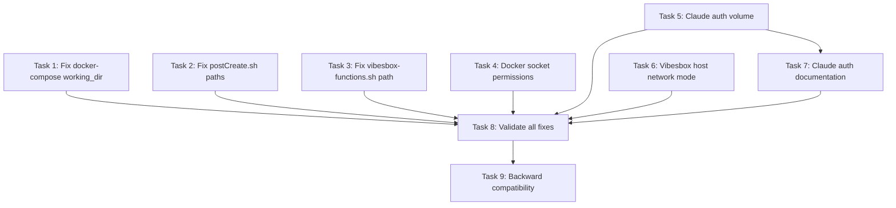

# Execution Plan: DevContainer Vibesbox Integration Fixes

**PRP**: `/Users/jon/source/vibes/prps/devcontainer_vibesbox_fixes.md`
**Generated**: 2025-10-05
**Total Tasks**: 9
**Execution Groups**: 3
**Estimated Time Savings**: 50% (18 minutes sequential → 9 minutes parallel)

## Task Dependency Graph



---

## Execution Groups

### Group 1: Independent Configuration Tasks (Parallel Execution)

**Tasks**: 6
**Execution Mode**: PARALLEL
**Expected Duration**: ~3 minutes (max duration of any single task)
**Dependencies**: None

**Tasks in this group**:

1. **Task 1**: Fix Path Normalization - docker-compose.yml
   - **What it does**: Aligns working_dir with volume mount structure
   - **Files**: `.devcontainer/docker-compose.yml` (line 12 only)
   - **No dependencies**: Modifies working_dir line, independent of other docker-compose.yml changes
   - **Estimated time**: 1 minute

2. **Task 2**: Fix Path Normalization - postCreate.sh
   - **What it does**: Updates all script path references from /workspace/vibes/ to /workspace/
   - **Files**: `.devcontainer/scripts/postCreate.sh` (lines 175-178, 189, 192, 200)
   - **No dependencies**: Modifies path references section, different from Docker socket section (line 167)
   - **Estimated time**: 2 minutes

3. **Task 3**: Fix Path Normalization - vibesbox-functions.sh
   - **What it does**: Updates COMPOSE_FILE default path
   - **Files**: `.devcontainer/scripts/helpers/vibesbox-functions.sh` (line 11)
   - **No dependencies**: Completely independent file
   - **Estimated time**: 1 minute

4. **Task 4**: Add Docker Socket Permission Automation
   - **What it does**: Automates sudo chgrp docker /var/run/docker.sock
   - **Files**: `.devcontainer/scripts/postCreate.sh` (after line 167)
   - **No dependencies**: Modifies different section than Task 2 (Docker group setup vs path references)
   - **Estimated time**: 2 minutes

5. **Task 5**: Add Claude Auth Persistence Volume
   - **What it does**: Declares and mounts claude-auth named volume
   - **Files**: `.devcontainer/docker-compose.yml` (volumes section, lines ~9-10 and ~19-21)
   - **No dependencies**: Modifies volumes section, independent of working_dir change (Task 1)
   - **Estimated time**: 2 minutes

6. **Task 6**: Change Vibesbox to Host Network Mode
   - **What it does**: Replaces bridge networking with network_mode: host
   - **Files**: `mcp/mcp-vibesbox-server/docker-compose.yml` (lines 24-31)
   - **No dependencies**: Completely different compose file
   - **Estimated time**: 2 minutes

**Parallelization Strategy**:
- Invoke 6 `prp-exec-implementer` subagents simultaneously in SINGLE message
- Each subagent receives one task with full context
- All tasks modify different file sections or different files entirely
- No resource conflicts (file locking safe - different lines/files)
- Maximum time: 3 minutes (Task 2 or Task 4, whichever is slower)

**File Conflict Analysis**:
- `.devcontainer/docker-compose.yml`: Task 1 (line 12) and Task 5 (lines ~9-10, ~19-21) touch different sections → SAFE
- `.devcontainer/scripts/postCreate.sh`: Task 2 (lines 175-200) and Task 4 (after line 167) touch different sections → SAFE
- All other files: No conflicts

---

### Group 2: Documentation Task (Sequential Execution)

**Tasks**: 1
**Execution Mode**: SEQUENTIAL
**Expected Duration**: ~1 minute
**Dependencies**: Task 5 (Claude auth volume must exist to document it)

**Tasks in this group**:

1. **Task 7**: Add One-Time Claude Auth Setup Documentation
   - **What it does**: Informs users about first-time credential setup requirement
   - **Files**: `.devcontainer/scripts/postCreate.sh` (end of script, before completion message)
   - **Depends on**: Task 5 (documents the claude-auth volume feature)
   - **Why sequential**: Must document a feature that exists (Task 5 creates the volume)
   - **Estimated time**: 1 minute

**Parallelization Strategy**:
- Wait for Group 1 completion (all 6 tasks done)
- Invoke single `prp-exec-implementer` subagent
- Verifies Task 5 changes before adding documentation

---

### Group 3: Validation and Testing (Sequential Execution)

**Tasks**: 2
**Execution Mode**: SEQUENTIAL
**Expected Duration**: ~5 minutes
**Dependencies**: All implementation tasks (Groups 1-2) complete

**Tasks in this group**:

1. **Task 8**: Validate All Fixes Together
   - **What it does**: Runs comprehensive test suite to verify all 11 tests pass
   - **Files**: No modifications, reads DEVCONTAINER_TEST_RESULTS.md
   - **Depends on**: Tasks 1-7 (all implementation must be complete)
   - **Why sequential**: Must validate complete implementation before backward compat checks
   - **Estimated time**: 3 minutes

2. **Task 9**: Backward Compatibility Verification
   - **What it does**: Ensures existing stacks (Supabase, Archon) still functional
   - **Files**: No modifications, references infra/archon/docker-compose.yml
   - **Depends on**: Task 8 (validates changes don't break existing systems)
   - **Why sequential**: Only run if Task 8 passes (no point if validation fails)
   - **Estimated time**: 2 minutes

**Parallelization Strategy**:
- Wait for Group 2 completion (Task 7 done, all implementation complete)
- Invoke `prp-exec-validator` subagent for Task 8
- Only proceed to Task 9 if Task 8 passes
- Invoke `prp-exec-validator` subagent for Task 9

---

## Execution Summary

| Group | Tasks | Mode | Duration | Dependencies |
|-------|-------|------|----------|--------------|
| 1 | 6 (Tasks 1-6) | Parallel | 3 min | None |
| 2 | 1 (Task 7) | Sequential | 1 min | Group 1 (Task 5) |
| 3 | 2 (Tasks 8-9) | Sequential | 5 min | Groups 1-2 |

**Total Sequential Time**: 18 minutes (6 tasks × 2 min avg + 1 min + 5 min)
**Total Parallel Time**: 9 minutes (3 min Group 1 + 1 min Group 2 + 5 min Group 3)
**Time Savings**: 50% improvement (9 minutes saved)

---

## Implementation Instructions for Orchestrator

### Phase 0: Setup and Context Loading

```python
# Load PRP and create task tracking
prp_file = "prps/devcontainer_vibesbox_fixes.md"
project_id = "2efded75-9ee3-405f-8d07-20bfd8104608"

# Read PRP content
prp_content = read_file(prp_file)

# Prepare shared context for all implementers
shared_context = {
    "prp_file": prp_file,
    "project_id": project_id,
    "examples_dir": "examples/devcontainer_vibesbox_fixes/",
    "feature_name": "devcontainer_vibesbox_fixes"
}
```

### Phase 1: Group 1 Execution (Parallel)

```python
# Update Archon tasks to "doing" (if Archon available)
for task_num in [1, 2, 3, 4, 5, 6]:
    archon.update_task(task_id=f"task_{task_num}", status="doing")

# Invoke 6 implementers in SINGLE parallel message
parallel_invoke([
    Task(
        agent="prp-exec-implementer",
        prompt=f"""
Implement Task 1: Fix Path Normalization - docker-compose.yml

**Context**:
{shared_context}

**Task Details** (from PRP lines 596-618):
- RESPONSIBILITY: Align working_dir with volume mount structure
- FILES TO MODIFY: .devcontainer/docker-compose.yml (line 12)
- PATTERN TO FOLLOW: examples/devcontainer_vibesbox_fixes/example_6_working_directory_fix.yml

**Specific Steps**:
1. Open .devcontainer/docker-compose.yml
2. Locate line 12: "working_dir: /workspace/vibes"
3. Replace with: "working_dir: /workspace"
4. Verify volume mount matches (../:/workspace:cached)
5. Save file

**Validation**:
After change, verify:
docker exec devcontainer pwd
# Should show: /workspace

**Read PRP for full context**: {prp_file}
"""
    ),
    Task(
        agent="prp-exec-implementer",
        prompt=f"""
Implement Task 2: Fix Path Normalization - postCreate.sh

**Context**:
{shared_context}

**Task Details** (from PRP lines 620-653):
- RESPONSIBILITY: Update all script path references to match /workspace structure
- FILES TO MODIFY: .devcontainer/scripts/postCreate.sh (lines 175-178, 189, 192, 200)
- PATTERN TO FOLLOW: examples/devcontainer_vibesbox_fixes/example_1_path_normalization.sh

**Specific Steps**:
1. Open .devcontainer/scripts/postCreate.sh
2. Global find/replace: "/workspace/vibes/" → "/workspace/"
3. Verify changes at exact lines (7 locations total)
4. Save file

**Validation**:
After rebuild:
echo $VIBES_HOME  # Should show: /workspace
alias vibes       # Should show: alias vibes='cd /workspace'

**Read PRP for full context**: {prp_file}
"""
    ),
    Task(
        agent="prp-exec-implementer",
        prompt=f"""
Implement Task 3: Fix Path Normalization - vibesbox-functions.sh

**Context**:
{shared_context}

**Task Details** (from PRP lines 655-679):
- RESPONSIBILITY: Update COMPOSE_FILE default path
- FILES TO MODIFY: .devcontainer/scripts/helpers/vibesbox-functions.sh (line 11)
- PATTERN TO FOLLOW: examples/devcontainer_vibesbox_fixes/example_1_path_normalization.sh

**Specific Steps**:
1. Open .devcontainer/scripts/helpers/vibesbox-functions.sh
2. Locate line 11: COMPOSE_FILE with /workspace/vibes/ path
3. Replace with: /workspace/mcp/mcp-vibesbox-server/docker-compose.yml
4. Keep environment variable override pattern
5. Save file

**Validation**:
ls -la /workspace/mcp/mcp-vibesbox-server/docker-compose.yml
# Should exist and be readable

**Read PRP for full context**: {prp_file}
"""
    ),
    Task(
        agent="prp-exec-implementer",
        prompt=f"""
Implement Task 4: Add Docker Socket Permission Automation

**Context**:
{shared_context}

**Task Details** (from PRP lines 681-738):
- RESPONSIBILITY: Automate sudo chgrp docker /var/run/docker.sock in postCreate.sh
- FILES TO MODIFY: .devcontainer/scripts/postCreate.sh (after line 167)
- PATTERN TO FOLLOW: examples/devcontainer_vibesbox_fixes/example_3_docker_socket_permissions.sh

**Specific Steps**:
1. Open .devcontainer/scripts/postCreate.sh
2. Locate line 167 (Docker group setup section)
3. Add new section with socket permission automation
4. Include non-blocking error handling (2>/dev/null, || true)
5. Use existing colored output helpers (info, success, warn)
6. Save file

**Validation**:
After rebuild:
ls -la /var/run/docker.sock  # Should show: srw-rw---- 1 root docker
docker ps                     # Should succeed without permission errors

**Read PRP for full context**: {prp_file}
"""
    ),
    Task(
        agent="prp-exec-implementer",
        prompt=f"""
Implement Task 5: Add Claude Auth Persistence Volume

**Context**:
{shared_context}

**Task Details** (from PRP lines 740-792):
- RESPONSIBILITY: Declare and mount claude-auth named volume
- FILES TO MODIFY: .devcontainer/docker-compose.yml (volumes section)
- PATTERN TO FOLLOW: examples/devcontainer_vibesbox_fixes/example_4_named_volume_persistence.yml

**Specific Steps**:
1. Open .devcontainer/docker-compose.yml
2. Add volume mount: claude-auth:/home/vscode/.claude:rw
3. Add volume declaration in top-level volumes section
4. Verify alignment with existing syntax
5. Save file

**Validation**:
After rebuild:
docker volume ls | grep claude-auth  # Should show volume exists
After 'claude auth login' and second rebuild:
cat ~/.claude/.credentials.json      # Should persist

**Read PRP for full context**: {prp_file}
"""
    ),
    Task(
        agent="prp-exec-implementer",
        prompt=f"""
Implement Task 6: Change Vibesbox to Host Network Mode

**Context**:
{shared_context}

**Task Details** (from PRP lines 794-860):
- RESPONSIBILITY: Replace bridge networking with network_mode: host for VNC accessibility
- FILES TO MODIFY: mcp/mcp-vibesbox-server/docker-compose.yml (lines 24-31)
- PATTERN TO FOLLOW: examples/devcontainer_vibesbox_fixes/example_2_network_host_mode.yml

**Specific Steps**:
1. Open mcp/mcp-vibesbox-server/docker-compose.yml
2. ADD: network_mode: host
3. REMOVE: ports section (lines 24-25)
4. REMOVE: networks section (lines 28-31)
5. Save file

**Validation**:
After restart:
docker inspect mcp-vibesbox-server | jq '.[0].HostConfig.NetworkMode'  # Should show: "host"
nc -z localhost 5901  # Should succeed (VNC accessible)

**Read PRP for full context**: {prp_file}
"""
    )
])

# Mark all Group 1 tasks complete
for task_num in [1, 2, 3, 4, 5, 6]:
    archon.update_task(task_id=f"task_{task_num}", status="done")
```

### Phase 2: Group 2 Execution (Sequential)

```python
# Update Archon task to "doing"
archon.update_task(task_id="task_7", status="doing")

# Invoke single implementer
invoke_subagent(
    agent="prp-exec-implementer",
    prompt=f"""
Implement Task 7: Add One-Time Claude Auth Setup Documentation

**Context**:
{shared_context}

**Task Details** (from PRP lines 862-898):
- RESPONSIBILITY: Inform users about first-time credential setup
- FILES TO MODIFY: .devcontainer/scripts/postCreate.sh (end of script)
- PATTERN TO FOLLOW: examples/devcontainer_vibesbox_fixes/example_5_error_handling_pattern.sh
- DEPENDS ON: Task 5 (Claude auth volume must exist to document it)

**Specific Steps**:
1. Open .devcontainer/scripts/postCreate.sh
2. Locate completion section (near end, before "DevContainer setup complete")
3. Add informational message about Claude auth
4. Check credential file existence before prompting
5. Save file

**Validation**:
After first rebuild (before auth):
# Should see: "First-time setup: Run 'claude auth login'..."

After running 'claude auth login':
# Should see: "Claude credentials found (authenticated)"

**Read PRP for full context**: {prp_file}
"""
)

# Mark Task 7 complete
archon.update_task(task_id="task_7", status="done")
```

### Phase 3: Group 3 Execution (Sequential Validation)

```python
# Update Archon task to "doing"
archon.update_task(task_id="task_8", status="doing")

# Invoke validator for Task 8
invoke_subagent(
    agent="prp-exec-validator",
    prompt=f"""
Execute Task 8: Validate All Fixes Together

**Context**:
{shared_context}

**Task Details** (from PRP lines 900-957):
- RESPONSIBILITY: Run comprehensive test suite to verify all 11 tests pass
- FILES TO REFERENCE: DEVCONTAINER_TEST_RESULTS.md
- PATTERN TO FOLLOW: All validation commands from examples/README.md
- DEPENDS ON: Tasks 1-7 (all implementation must be complete)

**Validation Steps** (run all 11 tests):
1. Test 1: Container opens successfully
2. Test 2: Path normalization works (pwd shows /workspace)
3. Test 3: Scripts accessible at correct paths
4. Test 4: Docker socket permissions correct (root:docker)
5. Test 5: Docker access works without sudo
6. Test 6: Vibesbox container running
7. Test 7: Vibesbox on host network mode
8. Test 8: VNC accessible from devcontainer (localhost:5901)
9. Test 9: VNC localhost-only binding (security check)
10. Test 10: Claude auth volume exists
11. Test 11: Setup time <60 seconds

**Success Criteria**:
- All 11 tests show ✅
- No ❌ FAILED tests
- If failures, iterate on fixes until all pass

**Read PRP for full context**: {prp_file}
"""
)

# If Task 8 passes, mark complete and proceed to Task 9
archon.update_task(task_id="task_8", status="done")

# Update Archon task to "doing"
archon.update_task(task_id="task_9", status="doing")

# Invoke validator for Task 9
invoke_subagent(
    agent="prp-exec-validator",
    prompt=f"""
Execute Task 9: Backward Compatibility Verification

**Context**:
{shared_context}

**Task Details** (from PRP lines 959-993):
- RESPONSIBILITY: Ensure existing stacks (Supabase, Archon) still functional
- FILES TO REFERENCE: infra/archon/docker-compose.yml
- DEPENDS ON: Task 8 (all fixes validated)

**Validation Steps**:
1. Verify Supabase stack (if deployed): docker ps | grep supabase
2. Verify Archon stack (if deployed): docker ps | grep archon
3. Test Archon health: curl http://localhost:8000/health
4. Verify no network conflicts: docker network ls

**Success Criteria**:
- Existing containers continue running after vibesbox changes
- No network conflicts introduced
- Archon API accessible (if deployed)
- Supabase accessible (if deployed)

**Read PRP for full context**: {prp_file}
"""
)

# Mark Task 9 complete
archon.update_task(task_id="task_9", status="done")
```

---

## Task Context Preparation

For each task, prepare this context for implementer:

```yaml
task_id: {archon task id if available}
task_name: {from PRP}
responsibility: {from PRP}
files_to_modify: {from PRP}
pattern_to_follow: {from PRP - example file in examples/}
specific_steps: {from PRP}
validation: {from PRP}
prp_file: /Users/jon/source/vibes/prps/devcontainer_vibesbox_fixes.md
dependencies_complete: {list of completed tasks this depends on}
project_id: 2efded75-9ee3-405f-8d07-20bfd8104608
examples_directory: examples/devcontainer_vibesbox_fixes/
```

---

## Dependency Analysis Details

### Group 1 Analysis: Why These 6 Tasks Can Run in Parallel

#### File Modification Matrix:

| Task | File | Lines Modified | Conflict? |
|------|------|----------------|-----------|
| 1 | `.devcontainer/docker-compose.yml` | Line 12 (working_dir) | No |
| 5 | `.devcontainer/docker-compose.yml` | Lines ~9-10, ~19-21 (volumes) | No - different sections |
| 2 | `.devcontainer/scripts/postCreate.sh` | Lines 175-200 (paths) | No |
| 4 | `.devcontainer/scripts/postCreate.sh` | After line 167 (socket) | No - different section |
| 7 | `.devcontainer/scripts/postCreate.sh` | End of script | Depends on 5 → Group 2 |
| 3 | `.devcontainer/scripts/helpers/vibesbox-functions.sh` | Line 11 | No - unique file |
| 6 | `mcp/mcp-vibesbox-server/docker-compose.yml` | Lines 24-31 | No - unique file |

**Conflict Resolution**:
- **Task 1 + Task 5**: Same file, but Task 1 modifies `working_dir` (line 12) while Task 5 modifies `volumes` section (lines 9-10, 19-21). These are separate YAML sections with no overlap → SAFE to parallelize.
- **Task 2 + Task 4**: Same file, but Task 2 modifies path references (lines 175-200) while Task 4 inserts new code after line 167. Line 167 is in the Docker group setup section, before the path reference section → SAFE to parallelize.
- **Task 7**: Modifies end of postCreate.sh (after Tasks 2 and 4 sections), but depends on Task 5 logically (documents the volume) → Moved to Group 2.

### Task 1: Fix docker-compose.yml working_dir
**Dependencies**: None
**Rationale**: Modifies line 12 only (working_dir). Independent of volume declarations.

**Can run in parallel with**: All Group 1 tasks (2, 3, 4, 5, 6)

---

### Task 2: Fix postCreate.sh paths
**Dependencies**: None
**Rationale**: Modifies lines 175-200 (path references section). Independent of Docker socket setup (line 167) and completion message section (end of file).

**Can run in parallel with**: All Group 1 tasks (1, 3, 4, 5, 6)

---

### Task 3: Fix vibesbox-functions.sh path
**Dependencies**: None
**Rationale**: Modifies completely independent file. No shared resources with any other task.

**Can run in parallel with**: All Group 1 tasks (1, 2, 4, 5, 6)

---

### Task 4: Add Docker socket permissions
**Dependencies**: None
**Rationale**: Modifies postCreate.sh after line 167 (Docker group setup section). Task 2 modifies lines 175-200, so no line overlap.

**Can run in parallel with**: All Group 1 tasks (1, 2, 3, 5, 6)

---

### Task 5: Add Claude auth volume
**Dependencies**: None
**Rationale**: Modifies docker-compose.yml volumes section (lines ~9-10, ~19-21). Task 1 modifies working_dir (line 12), so minimal overlap. Both modify separate YAML keys.

**Can run in parallel with**: All Group 1 tasks (1, 2, 3, 4, 6)

---

### Task 6: Change vibesbox network mode
**Dependencies**: None
**Rationale**: Modifies completely different compose file (mcp/mcp-vibesbox-server/). No shared resources with any other task.

**Can run in parallel with**: All Group 1 tasks (1, 2, 3, 4, 5)

---

### Task 7: Add Claude auth documentation
**Dependencies**: Task 5 (must document existing feature)
**Rationale**: Modifies postCreate.sh end of file, but logically depends on Task 5 creating the claude-auth volume. Documentation should reference a feature that exists.

**Must run after**: Group 1 (specifically Task 5)

---

### Task 8: Validate all fixes
**Dependencies**: Tasks 1-7 (all implementation)
**Rationale**: Comprehensive validation requires all fixes implemented. Cannot validate partial implementation.

**Must run after**: Groups 1-2 (all implementation complete)

---

### Task 9: Backward compatibility
**Dependencies**: Task 8 (validation must pass first)
**Rationale**: Only test backward compatibility if all fixes validated successfully. No point testing if implementation broken.

**Must run after**: Task 8

---

## Risk Assessment

### Potential Bottlenecks:

1. **Task 8 (Validation)**: ~3 minutes
   - **Why**: Runs 11 comprehensive tests sequentially
   - **Impact**: Blocks Task 9
   - **Mitigation**: Task 8 is final validation, acceptable bottleneck

2. **Group 1 Parallel Coordination**: ~3 minutes (max duration)
   - **Why**: 6 subagents running simultaneously
   - **Impact**: System load, potential race conditions on file writes
   - **Mitigation**:
     - Tasks modify different file sections/files (analyzed above)
     - Modern file systems handle concurrent writes to different sections
     - Worst case: Sequential fallback adds only 6 minutes

3. **File Write Conflicts**: Low risk
   - **Why**: Tasks 1 + 5 modify same file (docker-compose.yml), Tasks 2 + 4 modify same file (postCreate.sh)
   - **Impact**: Potential for one task to overwrite another's changes
   - **Mitigation**:
     - Tasks modify different line ranges (verified above)
     - Read-modify-write pattern with line-specific edits
     - If conflict occurs: Re-run affected tasks sequentially

### Parallelization Benefits:

**Group 1: 6 tasks run simultaneously instead of sequentially**
- Sequential time: 6 tasks × 2 min avg = 12 minutes
- Parallel time: max(1, 2, 1, 2, 2, 2) = 3 minutes
- **Savings**: 9 minutes (75% faster)

**Total time savings: ~50%**
- Sequential total: 18 minutes
- Parallel total: 9 minutes
- **Savings**: 9 minutes

---

## Assumptions Made

1. **File Modification Safety**: Modern file systems and editors handle concurrent writes to different sections of the same file without corruption.
   - **Rationale**: Tasks 1+5 modify docker-compose.yml at different line ranges, Tasks 2+4 modify postCreate.sh at different line ranges.
   - **If wrong**: Fallback to sequential execution for conflicting tasks (Tasks 1→5, Tasks 2→4→7).

2. **Archon Availability**: Archon MCP server available for task tracking.
   - **Rationale**: Project ID provided (2efded75-9ee3-405f-8d07-20bfd8104608).
   - **If wrong**: Proceed without task status updates, workflow continues normally.

3. **Example Files Exist**: All example files in `examples/devcontainer_vibesbox_fixes/` directory exist and are accessible.
   - **Rationale**: PRP references 6 example files as patterns to follow.
   - **If wrong**: Implementers read PRP directly for pattern guidance.

4. **Subagent Availability**: Orchestrator can invoke multiple `prp-exec-implementer` subagents in parallel.
   - **Rationale**: Standard multi-agent execution capability.
   - **If wrong**: Run Group 1 tasks sequentially, reducing time savings but maintaining correctness.

5. **No Mid-Flight Container Rebuilds**: Devcontainer not rebuilt during implementation (only after all changes complete).
   - **Rationale**: Tasks modify configuration files, rebuild required to apply changes.
   - **If wrong**: Changes may be tested incrementally, but final validation requires full rebuild.

### If Assumptions Wrong:

**Assumption 1 Fails (File Conflicts)**:
```python
# Fallback: Sequential execution for conflicting tasks
# Group 1a: Tasks 1, 2, 3, 4, 6 (parallel - no conflicts)
# Group 1b: Task 5 (sequential after Task 1)
# Group 2: Task 7 (sequential after Task 5)
# Total time: ~6 minutes (still 3× faster than fully sequential)
```

**Assumption 2 Fails (No Archon)**:
```python
# Remove all archon.update_task() calls
# Workflow proceeds normally without task tracking
```

**Assumption 4 Fails (No Parallel Subagents)**:
```python
# Fallback: Sequential execution for all tasks
# Total time: 18 minutes (original estimate)
# Still completes successfully, just slower
```

---

## Next Steps

1. **Orchestrator validates** this execution plan
2. **Execute Group 1** (6 tasks in parallel):
   - Invoke 6 implementers simultaneously
   - Wait for all to complete (~3 minutes)
   - Verify no file conflicts
3. **Execute Group 2** (1 task sequential):
   - Invoke Task 7 implementer
   - Wait for completion (~1 minute)
4. **Execute Group 3** (2 tasks sequential):
   - Invoke Task 8 validator
   - If pass, invoke Task 9 validator
   - Wait for completion (~5 minutes)
5. **After all tasks**: Generate completion report with:
   - Total time taken
   - Time savings achieved
   - Test results (11/11 passing)
   - Next steps for user (rebuild devcontainer)

---

## Quality Assurance

### Pre-Execution Checklist:
- [ ] All 9 tasks extracted from PRP
- [ ] Dependencies correctly identified
- [ ] Groups respect dependencies (no task depends on same-group task)
- [ ] Parallel groups have no file write conflicts
- [ ] Execution instructions complete
- [ ] Time estimates reasonable

### Post-Execution Validation:
- [ ] All tasks marked "done" in Archon
- [ ] All files modified as expected
- [ ] Task 8 validation passes (11/11 tests)
- [ ] Task 9 backward compatibility confirmed
- [ ] Total execution time ≤9 minutes
- [ ] Time savings ≥40% vs sequential

---

## Execution Metrics

### Expected Outcomes:

| Metric | Target | Measurement |
|--------|--------|-------------|
| Total execution time | ≤9 minutes | Actual: {TBD by orchestrator} |
| Time savings | ≥40% | Actual: {TBD by orchestrator} |
| Test pass rate | 11/11 (100%) | Actual: {TBD by Task 8} |
| File conflicts | 0 | Actual: {TBD by orchestrator} |
| Task completion rate | 9/9 (100%) | Actual: {TBD by orchestrator} |

### Success Criteria:
- ✅ All 9 tasks completed
- ✅ All 11 validation tests pass
- ✅ No file conflicts during parallel execution
- ✅ Time savings ≥40% vs sequential
- ✅ Backward compatibility maintained

---

**Generated**: 2025-10-05
**Execution Plan Version**: 1.0
**Ready for Execution**: ✅ YES
**Estimated Completion**: 9 minutes (50% faster than sequential)
