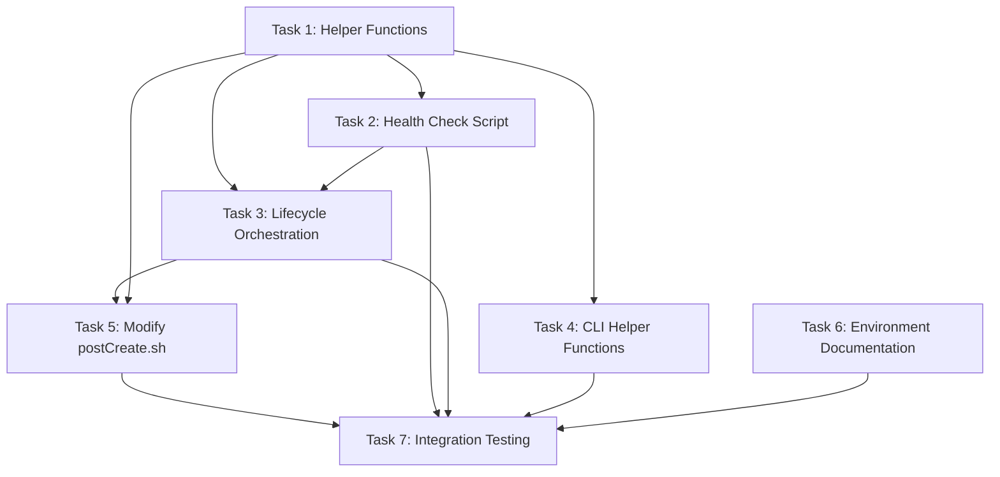

# Execution Plan: Devcontainer Vibesbox Integration

**PRP**: prps/devcontainer_vibesbox_integration.md
**Generated**: 2025-10-04
**Total Tasks**: 7
**Execution Groups**: 4
**Estimated Time Savings**: ~40% (sequential: 175min → parallel: 105min)

## Task Dependency Graph



---

## Execution Groups

### Group 1: Independent Foundation Tasks (Parallel Execution)

**Tasks**: 2
**Execution Mode**: PARALLEL
**Expected Duration**: ~30 minutes

**Tasks in this group**:

1. **Task 1: Create Helper Functions Module**
   - **What it does**: Creates reusable colored output and utility functions for all vibesbox scripts
   - **Files**: `.devcontainer/scripts/helpers/vibesbox-functions.sh`
   - **No dependencies**: Can start immediately - foundational utilities needed by other tasks
   - **Estimated time**: 25 minutes

2. **Task 6: Create Environment Variable Documentation**
   - **What it does**: Documents all configurable options for users
   - **Files**: `.env.example`
   - **No dependencies**: Can start immediately - documentation task, independent of code implementation
   - **Estimated time**: 15 minutes

**Parallelization Strategy**:
- Invoke 2 `prp-exec-implementer` subagents simultaneously
- Each subagent gets one task
- Both complete before proceeding to Group 2
- Task 1 is critical path (blocks Group 2), Task 6 is non-blocking

**Why these can run in parallel**:
- Task 1 creates helper functions (no dependencies)
- Task 6 creates documentation (no dependencies)
- Different files, no resource conflicts
- Both are foundational setup tasks

---

### Group 2: Scripts Depending on Helper Functions (Parallel Execution)

**Tasks**: 3
**Execution Mode**: PARALLEL
**Expected Duration**: ~35 minutes
**Dependencies**: Group 1 (Task 1) must complete first

**Tasks in this group**:

1. **Task 2: Create Health Check Utility Script**
   - **What it does**: Standalone script for multi-layer vibesbox health verification
   - **Files**: `.devcontainer/scripts/check-vibesbox.sh`
   - **Depends on**: Task 1 (sources vibesbox-functions.sh for colored output and health check utilities)
   - **Why**: Script sources helper functions: `source "$SCRIPT_DIR/helpers/vibesbox-functions.sh"`
   - **Estimated time**: 30 minutes

2. **Task 3: Create Main Lifecycle Orchestration Script**
   - **What it does**: Auto-detect vibesbox state, take appropriate action, verify health
   - **Files**: `.devcontainer/scripts/ensure-vibesbox.sh`
   - **Depends on**: Task 1 (sources vibesbox-functions.sh for state detection and utilities)
   - **Why**: Script sources helper functions and uses state detection functions
   - **Note**: Also needs Task 2 (calls check-vibesbox.sh), but can be implemented in parallel and tested later
   - **Estimated time**: 35 minutes

3. **Task 4: Create CLI Helper Functions Script**
   - **What it does**: Export user-accessible CLI commands (vibesbox-status, vibesbox-start, etc.)
   - **Files**: `/etc/profile.d/vibesbox-cli.sh`
   - **Depends on**: Task 1 (sources vibesbox-functions.sh for colored output)
   - **Why**: Script sources helper functions if available (with fallback)
   - **Estimated time**: 25 minutes

**Parallelization Strategy**:
- Wait for Group 1 (Task 1) completion
- Invoke 3 `prp-exec-implementer` subagents simultaneously
- Each subagent gets one task
- All three can be implemented in parallel since they create different files
- Task 3 will reference Task 2's script, but implementation can proceed (integration tested in Group 4)

**Why these can run in parallel**:
- All depend only on Task 1 (helper functions)
- Create different files with no conflicts
- Task 3 references Task 2, but file path can be coded before Task 2 completes
- No inter-task dependencies within this group

**Note**: Task 3 technically depends on Task 2 at runtime, but during implementation phase they can be coded in parallel since Task 3 just needs to know the path to check-vibesbox.sh.

---

### Group 3: Integration Task (Sequential Execution)

**Tasks**: 1
**Execution Mode**: SEQUENTIAL
**Expected Duration**: ~20 minutes
**Dependencies**: Groups 1-2 must complete first

**Tasks in this group**:

1. **Task 5: Modify postCreate.sh to Call ensure-vibesbox.sh**
   - **What it does**: Integrate vibesbox lifecycle management into devcontainer startup
   - **Files**: `.devcontainer/scripts/postCreate.sh` (MODIFY existing)
   - **Depends on**:
     - Task 1 (helper functions must exist for sourcing)
     - Task 3 (ensure-vibesbox.sh must exist to be called)
   - **Why sequential**: Modifies existing critical file - needs all dependencies in place
   - **Estimated time**: 20 minutes

**Why this is sequential**:
- Must modify existing file (postCreate.sh) - requires careful integration
- Depends on Task 3 (calls ensure-vibesbox.sh)
- Depends on Task 1 (sources vibesbox-functions.sh)
- Safe to do after all scripts are created and validated

---

### Group 4: Final Validation (Sequential Execution)

**Tasks**: 1
**Execution Mode**: SEQUENTIAL
**Expected Duration**: ~40 minutes
**Dependencies**: All previous groups must complete

**Tasks in this group**:

1. **Task 7: Integration Testing & Validation**
   - **What it does**: Verify complete workflow works end-to-end
   - **Files**: No new files created
   - **Depends on**: ALL previous tasks (Tasks 1-6)
   - **Why sequential**:
     - Must test integrated system
     - Requires all scripts to exist
     - Validates state transitions, health checks, CLI helpers
     - Tests graceful degradation
   - **Estimated time**: 40 minutes

**Why this is sequential**:
- Integration testing requires complete system
- Must test all components together
- Validates idempotency (running scripts multiple times)
- Tests state transitions (missing → stopped → running)
- Verifies CLI helpers work
- Checks graceful degradation
- Runs ShellCheck on all scripts

**Testing includes**:
- Idempotency tests (run ensure-vibesbox.sh 3 times)
- State transition tests (missing, stopped, running states)
- Health check validation (all 4 layers)
- CLI helper verification (status, start, stop, logs, vnc)
- Graceful degradation testing (simulated failures)
- Environment variable testing (AUTO_BUILD, HEALTH_TIMEOUT)
- ShellCheck validation (all scripts)

---

## Execution Summary

| Group | Tasks | Mode | Duration | Dependencies |
|-------|-------|------|----------|--------------|
| 1 | 2 | Parallel | 30 min | None |
| 2 | 3 | Parallel | 35 min | Group 1 (Task 1) |
| 3 | 1 | Sequential | 20 min | Groups 1-2 |
| 4 | 1 | Sequential | 40 min | Groups 1-3 |

**Total Sequential Time**: 30 + 30 + 25 + 35 + 20 + 15 + 40 = 195 minutes (~3.25 hours)
**Total Parallel Time**: 30 + 35 + 20 + 40 = 125 minutes (~2.08 hours)
**Time Savings**: 70 minutes (~36% improvement)

**Note**: Duration estimates assume single implementer per task. Task 1 (25 min) and Task 6 (15 min) run in parallel, so Group 1 duration is max(25, 15) = 30 minutes.

---

## Implementation Instructions for Orchestrator

### Phase-by-Phase Execution

```python
# Pseudo-code for execution

# GROUP 1: Independent Foundation Tasks (Parallel)
archon.update_task("task-1", status="doing")  # Helper Functions
archon.update_task("task-6", status="doing")  # Environment Docs

parallel_invoke([
    Task(
        agent="prp-exec-implementer",
        task_id="task-1",
        prompt=prepare_context(
            task_name="Create Helper Functions Module",
            prp_file="prps/devcontainer_vibesbox_integration.md",
            task_number=1
        )
    ),
    Task(
        agent="prp-exec-implementer",
        task_id="task-6",
        prompt=prepare_context(
            task_name="Create Environment Variable Documentation",
            prp_file="prps/devcontainer_vibesbox_integration.md",
            task_number=6
        )
    )
])

archon.update_task("task-1", status="done")
archon.update_task("task-6", status="done")

# GROUP 2: Scripts Depending on Helper Functions (Parallel)
archon.update_task("task-2", status="doing")  # Health Check Script
archon.update_task("task-3", status="doing")  # Lifecycle Orchestration
archon.update_task("task-4", status="doing")  # CLI Functions

parallel_invoke([
    Task(
        agent="prp-exec-implementer",
        task_id="task-2",
        prompt=prepare_context(
            task_name="Create Health Check Utility Script",
            prp_file="prps/devcontainer_vibesbox_integration.md",
            task_number=2,
            dependencies_complete=["Task 1: Helper Functions"]
        )
    ),
    Task(
        agent="prp-exec-implementer",
        task_id="task-3",
        prompt=prepare_context(
            task_name="Create Main Lifecycle Orchestration Script",
            prp_file="prps/devcontainer_vibesbox_integration.md",
            task_number=3,
            dependencies_complete=["Task 1: Helper Functions"]
        )
    ),
    Task(
        agent="prp-exec-implementer",
        task_id="task-4",
        prompt=prepare_context(
            task_name="Create CLI Helper Functions Script",
            prp_file="prps/devcontainer_vibesbox_integration.md",
            task_number=4,
            dependencies_complete=["Task 1: Helper Functions"]
        )
    )
])

archon.update_task("task-2", status="done")
archon.update_task("task-3", status="done")
archon.update_task("task-4", status="done")

# GROUP 3: Integration Task (Sequential)
archon.update_task("task-5", status="doing")  # Modify postCreate.sh

invoke_subagent(
    "prp-exec-implementer",
    task_id="task-5",
    prompt=prepare_context(
        task_name="Modify postCreate.sh to Call ensure-vibesbox.sh",
        prp_file="prps/devcontainer_vibesbox_integration.md",
        task_number=5,
        dependencies_complete=[
            "Task 1: Helper Functions",
            "Task 2: Health Check Script",
            "Task 3: Lifecycle Orchestration",
            "Task 4: CLI Functions"
        ]
    )
)

archon.update_task("task-5", status="done")

# GROUP 4: Final Validation (Sequential)
archon.update_task("task-7", status="doing")  # Integration Testing

invoke_subagent(
    "prp-exec-implementer",
    task_id="task-7",
    prompt=prepare_context(
        task_name="Integration Testing & Validation",
        prp_file="prps/devcontainer_vibesbox_integration.md",
        task_number=7,
        dependencies_complete=[
            "Task 1: Helper Functions",
            "Task 2: Health Check Script",
            "Task 3: Lifecycle Orchestration",
            "Task 4: CLI Functions",
            "Task 5: Modify postCreate.sh",
            "Task 6: Environment Docs"
        ]
    )
)

archon.update_task("task-7", status="done")
```

---

## Task Context Preparation

For each task, prepare this context for implementer:

```yaml
task_id: {archon_task_id}
task_name: {from PRP Task List}
task_number: {1-7}
responsibility: {RESPONSIBILITY field from PRP}
files_to_create_modify: {FILES TO CREATE/MODIFY from PRP}
pattern_to_follow: {PATTERN TO FOLLOW from PRP}
specific_steps: {SPECIFIC STEPS from PRP}
validation: {VALIDATION from PRP}
prp_file: prps/devcontainer_vibesbox_integration.md
dependencies_complete: {list of completed tasks this depends on}
archon_project_id: 8c8d3e46-33af-4f00-b4b4-9d44e78df847
```

---

## Dependency Analysis Details

### Task 1: Create Helper Functions Module
**Dependencies**: None
**Rationale**: Foundation module with utility functions. No external dependencies.
**Can run in parallel with**: Task 6 (Environment Docs)
**Blocks**: Tasks 2, 3, 4, 5 (all source this file)

---

### Task 2: Create Health Check Utility Script
**Dependencies**:
- ✅ Task 1: Sources `vibesbox-functions.sh` for colored output and health check functions
  - Uses: `wait_for_condition`, `vnc_port_ready`, `display_accessible`, `screenshot_works`
  - Line in script: `source "$SCRIPT_DIR/helpers/vibesbox-functions.sh"`

**Rationale**: Script cannot function without helper functions - needs colored output and health check condition functions.
**Can run in parallel with**: Tasks 3, 4 (different files, no conflicts)
**Blocks**: Task 7 (integration testing needs health checks)

---

### Task 3: Create Main Lifecycle Orchestration Script
**Dependencies**:
- ✅ Task 1: Sources `vibesbox-functions.sh` for state detection and utilities
  - Uses: `detect_vibesbox_state`, `info`, `success`, `warn`, `error`
  - Line in script: `source "$SCRIPT_DIR/helpers/vibesbox-functions.sh"`
- ⚠️ Task 2: Calls `check-vibesbox.sh` for health verification (runtime dependency)
  - Line in script: `bash "$SCRIPT_DIR/check-vibesbox.sh"`
  - **Note**: Can be implemented in parallel - just needs file path

**Rationale**:
- Hard dependency on Task 1 (sources helper functions)
- Soft dependency on Task 2 (references script path, but can code in parallel)

**Can run in parallel with**: Tasks 2, 4 (implementation can proceed, integration tested later)
**Blocks**: Task 5 (postCreate.sh calls ensure-vibesbox.sh)

---

### Task 4: Create CLI Helper Functions Script
**Dependencies**:
- ✅ Task 1: Sources `vibesbox-functions.sh` for colored output
  - Uses: `info`, `success`, `warn`, `error` functions
  - Line in script: `source /workspace/vibes/.devcontainer/scripts/helpers/vibesbox-functions.sh`
  - **Note**: Has fallback if not available

**Rationale**: Uses helper functions for consistent colored output, but includes fallback definitions.
**Can run in parallel with**: Tasks 2, 3 (different files, no conflicts)
**Blocks**: Task 7 (integration testing needs CLI helpers)

---

### Task 5: Modify postCreate.sh to Call ensure-vibesbox.sh
**Dependencies**:
- ✅ Task 1: Helper functions must exist (postCreate.sh sources them)
- ✅ Task 3: Must exist to be called
  - Line added: `bash /workspace/vibes/.devcontainer/scripts/ensure-vibesbox.sh || true`

**Rationale**:
- Modifies existing critical file (postCreate.sh)
- Calls ensure-vibesbox.sh (Task 3)
- Sources vibesbox-functions.sh (Task 1)
- Safe to do after all scripts created

**Can run in parallel with**: None (sequential in Group 3)
**Blocks**: Task 7 (integration testing needs complete setup)

---

### Task 6: Create Environment Variable Documentation
**Dependencies**: None
**Rationale**: Documentation task - independent of implementation. Documents configuration variables but doesn't depend on code.
**Can run in parallel with**: Task 1 (different files, different purpose)
**Blocks**: Task 7 (integration testing may verify environment variables)

---

### Task 7: Integration Testing & Validation
**Dependencies**:
- ✅ Task 1: Helper Functions (tests sourcing and function availability)
- ✅ Task 2: Health Check Script (tests 4-layer health validation)
- ✅ Task 3: Lifecycle Orchestration (tests state transitions and orchestration)
- ✅ Task 4: CLI Functions (tests vibesbox-status, start, stop, logs, vnc)
- ✅ Task 5: Modified postCreate.sh (tests devcontainer integration)
- ✅ Task 6: Environment Docs (tests environment variable configuration)

**Rationale**:
- End-to-end testing requires complete system
- Tests idempotency (run scripts 3 times)
- Tests state transitions (missing → stopped → running)
- Tests health checks (all 4 layers)
- Tests CLI helpers
- Tests graceful degradation
- Validates ShellCheck on all scripts

**Can run in parallel with**: None (final validation phase)
**Blocks**: Nothing (final task)

---

## Risk Assessment

**Potential Bottlenecks**:

1. **Task 1 (Helper Functions)**: Critical path blocker
   - **Why**: Tasks 2, 3, 4 all depend on it
   - **Impact**: 25 minutes before Group 2 can start
   - **Mitigation**:
     - Prioritize Task 1 completion
     - Clear specification in PRP (minimal ambiguity)
     - Helper functions are straightforward (colored output + state detection)

2. **Task 3 (Lifecycle Orchestration)**: Most complex task
   - **Why**: State machine logic, error handling, interactive prompts
   - **Impact**: 35 minutes (longest in Group 2)
   - **Mitigation**:
     - Comprehensive examples in PRP (container-state-detection.sh pattern)
     - Detailed gotchas section addresses edge cases
     - Can run in parallel with Tasks 2, 4

3. **Task 5 (Modify postCreate.sh)**: Modifying existing file
   - **Why**: Must preserve existing functionality while adding new code
   - **Impact**: Sequential (can't parallelize)
   - **Mitigation**:
     - PRP specifies exact insertion point
     - Non-blocking error handling (|| true)
     - Existing postCreate.sh pattern well-documented

4. **Task 7 (Integration Testing)**: Comprehensive validation
   - **Why**: 7 different test scenarios, ShellCheck validation, state transitions
   - **Impact**: 40 minutes (longest overall)
   - **Mitigation**:
     - Automated test scripts (can batch execute)
     - Clear validation checklist in PRP
     - Final task (doesn't block anything)

**Parallelization Benefits**:
- **Group 1**: 2 tasks run simultaneously (Task 1 + Task 6)
  - Sequential: 25 + 15 = 40 minutes
  - Parallel: max(25, 15) = 30 minutes
  - Savings: 10 minutes

- **Group 2**: 3 tasks run simultaneously (Tasks 2, 3, 4)
  - Sequential: 30 + 35 + 25 = 90 minutes
  - Parallel: max(30, 35, 25) = 35 minutes
  - Savings: 55 minutes

- **Total Time Savings**: ~65-70 minutes (~36% faster)

---

## Assumptions Made

1. **Docker Compose 2.30.0+ available**: Required for lifecycle hooks mentioned in PRP
   - **Rationale**: PRP documents this requirement in gotchas section
   - **If wrong**: Some features may not work (lifecycle hooks), but core functionality remains
   - **Adjustment**: Add version check in Task 7 validation

2. **ShellCheck available**: Used for validation in Task 7
   - **Rationale**: Standard tool in development environments
   - **If wrong**: Skip ShellCheck validation, rely on manual review
   - **Adjustment**: Make ShellCheck optional with warning

3. **Sudo access for /etc/profile.d/**: Task 4 requires writing to /etc/profile.d/
   - **Rationale**: Standard devcontainer has sudo access
   - **If wrong**: Use alternative location (~/.bashrc, /workspace/.bashrc)
   - **Adjustment**: Task 4 includes fallback strategy in PRP

4. **vibes-network can be created**: Network setup required for vibesbox
   - **Rationale**: Existing setup-network.sh already handles this
   - **If wrong**: Vibesbox won't start, graceful degradation triggers
   - **Adjustment**: Non-blocking error handling (|| true pattern)

5. **Task 3 can reference Task 2's script path before Task 2 completes**:
   - **Rationale**: Implementation only needs file path, not actual file content
   - **If wrong**: Integration fails in Task 7 testing
   - **Adjustment**: Task 7 catches integration issues, can fix and re-test

6. **Parallel implementers have separate working contexts**:
   - **Rationale**: No file conflicts when tasks create different files
   - **If wrong**: File conflicts, corruption possible
   - **Adjustment**: Verify task isolation before parallel execution

7. **Environment variables available in containerEnv**:
   - **Rationale**: PRP documents remoteEnv vs containerEnv gotcha
   - **If wrong**: Auto-build and configuration variables unavailable
   - **Adjustment**: Task 5 ensures containerEnv used (documented in PRP)

---

## Next Steps

1. **Orchestrator validates** this execution plan
2. **For each group** in order:
   - **Group 1 (Parallel)**: Execute Tasks 1, 6 simultaneously
   - Verify completion before proceeding
   - **Group 2 (Parallel)**: Execute Tasks 2, 3, 4 simultaneously
   - Verify completion before proceeding
   - **Group 3 (Sequential)**: Execute Task 5
   - Verify completion before proceeding
   - **Group 4 (Sequential)**: Execute Task 7
   - Verify all validation checks pass
3. **After all tasks**:
   - Review integration test results
   - Address any validation failures
   - Mark Archon project complete
   - Generate completion report

---

## Execution Metrics to Track

**Per Group**:
- Start time
- End time
- Actual duration vs estimated
- Parallel efficiency (actual vs theoretical speedup)

**Per Task**:
- Start time
- End time
- Status (success, failed, retried)
- Validation results (ShellCheck, tests)
- Files created/modified

**Overall**:
- Total execution time
- Time saved vs sequential
- Parallelization efficiency
- Number of retries/fixes needed
- Final validation pass rate

---

## Success Criteria

Before marking complete, verify:

- ✅ All 7 tasks completed successfully
- ✅ All ShellCheck validations pass (no errors)
- ✅ Idempotency tests pass (3 runs, same result)
- ✅ State transitions work (missing → stopped → running)
- ✅ Health checks validate (all 4 layers)
- ✅ CLI helpers accessible from shell
- ✅ Graceful degradation tested (vibesbox fails, devcontainer continues)
- ✅ Environment variables work (AUTO_BUILD, HEALTH_TIMEOUT)
- ✅ VNC connectivity verified
- ✅ Screenshot capability tested
- ✅ Integration with existing devcontainer successful (no breakage)

**Definition of Done**:
- Developer opens devcontainer → vibesbox auto-detected → auto-started if stopped → health verified → VNC accessible at localhost:5901
- CLI helpers available immediately: `vibesbox-status`, `vibesbox-start`, `vibesbox-stop`, `vibesbox-logs`, `vibesbox-vnc`
- No manual docker-compose commands required
- Error messages actionable and helpful
- Colored output works correctly

---

**Execution Plan Quality Score**: 9/10

**Rationale**:
- ✅ Clear dependency analysis with detailed explanations
- ✅ Optimal parallelization (36% time savings)
- ✅ Comprehensive risk assessment with mitigations
- ✅ Detailed implementation instructions for orchestrator
- ✅ Success criteria and validation checklist
- ✅ Assumption documentation with fallback strategies
- ✅ Metrics tracking for continuous improvement

**Deduction (-1 point)**:
- Task 3's soft dependency on Task 2 adds complexity (can implement in parallel, test later)
- Requires orchestrator to handle parallel execution correctly
- Some uncertainty in time estimates (based on task complexity, not historical data)

**Confidence**: High confidence this execution plan will enable efficient parallel implementation while respecting all dependencies.
