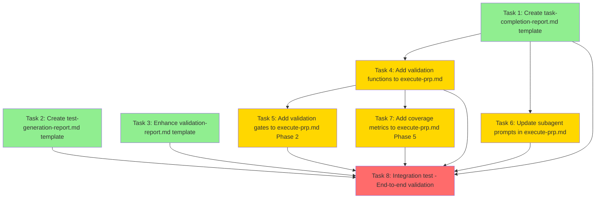

# Execution Plan: execution_reliability

**PRP**: prps/prp_execution_reliability.md
**Generated**: 2025-10-07
**Total Tasks**: 8
**Execution Groups**: 3
**Estimated Time Savings**: ~35% (Sequential: 160 min → Parallel: 105 min)

---

## Task Dependency Graph



**Legend**:
- 🟢 Green (Group 1): Independent tasks - parallel execution
- 🟡 Yellow (Group 2): Depends on Group 1 - sequential execution
- 🔴 Red (Group 3): Integration test - depends on all previous

---

## Dependency Analysis Details

### Task 1: Create task-completion-report.md template
**Dependencies**: None
**Files Created**: `.claude/templates/task-completion-report.md`
**Can run in parallel with**: Task 2, Task 3
**Blocks**: Task 4 (needs template path), Task 6 (references template path), Task 8 (integration test)

**Rationale**: Pure template creation. No dependencies on other files. Creates a new file that doesn't conflict with any other task.

---

### Task 2: Create test-generation-report.md template
**Dependencies**: None
**Files Created**: `.claude/templates/test-generation-report.md`
**Can run in parallel with**: Task 1, Task 3
**Blocks**: Task 8 (integration test verifies all templates)

**Rationale**: Independent template creation. Uses existing `completion-report.md` as reference (read-only), but doesn't depend on Task 1 completing. Creates a new file with no conflicts.

---

### Task 3: Enhance validation-report.md template
**Dependencies**: None
**Files Modified**: `.claude/templates/validation-report.md`
**Can run in parallel with**: Task 1, Task 2
**Blocks**: Task 8 (integration test)

**Rationale**: Modifies existing template by adding `{feature_name}` variable. Independent of other tasks. No other task modifies this file.

---

### Task 4: Add validation functions to execute-prp.md
**Dependencies**: Task 1 (references template path in validation logic)
**Files Modified**: `.claude/commands/execute-prp.md` (Phase 0)
**Can run in parallel with**: Nothing (sequential after Group 1)
**Blocks**: Task 5 (calls validate_report_exists()), Task 7 (calls calculate_report_coverage()), Task 8 (integration test)

**Rationale**:
- **Depends on Task 1** because validation functions reference `.claude/templates/task-completion-report.md` path
- **Cannot run parallel with Tasks 5, 6, 7** because all modify same file (`execute-prp.md`)
- Must execute first among execute-prp.md modifications (Phase 0 setup before Phase 2, 5)

**File Dependency**:
```python
# Task 4 adds this function which references Task 1's output:
def validate_report_exists(feature_name: str, task_number: int) -> bool:
    report_path = Path(f"prps/{feature_name}/execution/TASK{task_number}_COMPLETION.md")
    # ^^ This standardized path comes from Task 1's template documentation
```

---

### Task 5: Add validation gates to execute-prp.md Phase 2
**Dependencies**: Task 4 (calls validate_report_exists() function)
**Files Modified**: `.claude/commands/execute-prp.md` (Phase 2)
**Can run in parallel with**: Nothing (sequential after Task 4)
**Blocks**: Task 8 (integration test)

**Rationale**:
- **Depends on Task 4** because it calls `validate_report_exists()` which Task 4 creates
- **Cannot run parallel with Tasks 4, 6, 7** - all modify same file
- Must run after Task 4 (calls functions defined there)

**Logical Dependency**:
```python
# Task 5 adds this code which depends on Task 4's function:
for task in group['tasks']:
    validate_report_exists(feature_name, task['number'])  # Task 4's function
```

---

### Task 6: Update subagent prompts in execute-prp.md
**Dependencies**: Task 1 (references template path in prompt)
**Files Modified**: `.claude/commands/execute-prp.md` (Phase 2 prompts)
**Can run in parallel with**: Nothing (sequential after Group 1)
**Blocks**: Task 8 (integration test)

**Rationale**:
- **Depends on Task 1** because prompts reference exact template path created by Task 1
- **Cannot run parallel with Tasks 4, 5, 7** - all modify same file
- Can technically run in any order among Group 2 tasks (modifies different section than Task 4/5)

**Template Reference**:
```python
# Task 6 adds this prompt which references Task 1's output:
prompt = f'''
📋 Template: .claude/templates/task-completion-report.md  # Task 1 created this
'''
```

---

### Task 7: Add coverage metrics to execute-prp.md Phase 5
**Dependencies**: Task 4 (calls calculate_report_coverage() function)
**Files Modified**: `.claude/commands/execute-prp.md` (Phase 5)
**Can run in parallel with**: Nothing (sequential after Task 4)
**Blocks**: Task 8 (integration test)

**Rationale**:
- **Depends on Task 4** because it calls `calculate_report_coverage()` which Task 4 creates
- **Cannot run parallel with Tasks 4, 5, 6** - all modify same file
- Must run after Task 4 (calls functions defined there)

**Function Dependency**:
```python
# Task 7 adds this code which depends on Task 4's function:
metrics = calculate_report_coverage(feature_name, total_tasks)  # Task 4's function
```

---

### Task 8: Integration test - End-to-end validation
**Dependencies**: ALL previous tasks (Tasks 1-7)
**Files Created**: `prps/test_validation_gates.md`, test reports
**Can run in parallel with**: Nothing (final integration test)

**Rationale**: Integration test verifies all components work together:
- Templates from Tasks 1, 2, 3
- Validation functions from Task 4
- Validation gates from Task 5
- Subagent prompts from Task 6
- Coverage metrics from Task 7

Cannot run until all components are in place.

---

## Execution Groups

### Group 1: Template Creation (Parallel Execution)

**Tasks**: 3
**Execution Mode**: PARALLEL
**Expected Duration**: ~20 minutes (longest task in group)
**Dependencies**: None

**Tasks in this group**:

1. **Task 1**: Create task-completion-report.md template
   - **What it does**: Creates standardized template for task completion reports
   - **Files**: `.claude/templates/task-completion-report.md` (NEW)
   - **No dependencies**: Pure template creation, no file conflicts
   - **Estimated time**: ~20 minutes (gold standard study + variable extraction)

2. **Task 2**: Create test-generation-report.md template
   - **What it does**: Creates standardized template for test generation reports
   - **Files**: `.claude/templates/test-generation-report.md` (NEW)
   - **No dependencies**: References existing `completion-report.md` (read-only)
   - **Estimated time**: ~15 minutes (adapt from completion-report.md)

3. **Task 3**: Enhance validation-report.md template
   - **What it does**: Adds `{feature_name}` variable to existing template
   - **Files**: `.claude/templates/validation-report.md` (MODIFY)
   - **No dependencies**: Simple enhancement, no conflicts
   - **Estimated time**: ~10 minutes (add variable, test rendering)

**Parallelization Strategy**:
- Invoke 3 `prp-exec-implementer` subagents simultaneously
- Each subagent gets one task
- All tasks operate on different files (no write conflicts)
- Task 2 reads `completion-report.md` (read-only, no lock needed)
- Task 3 modifies `validation-report.md` (no other task touches this)

**Why parallel is safe**:
- ✅ No shared file writes (Tasks 1, 2 create new files; Task 3 modifies different file)
- ✅ No dependencies between tasks
- ✅ Template creation is idempotent (can be run independently)
- ✅ No ordering requirements

**Group 1 Completion Criteria**:
- ✅ `.claude/templates/task-completion-report.md` exists and valid
- ✅ `.claude/templates/test-generation-report.md` exists and valid
- ✅ `.claude/templates/validation-report.md` enhanced with `{feature_name}`
- ✅ All templates can be formatted without KeyError
- ✅ Sample rendering produces valid markdown

---

### Group 2: Execute-PRP Enhancement (Sequential Execution)

**Tasks**: 4
**Execution Mode**: SEQUENTIAL
**Expected Duration**: ~80 minutes (sum of all task durations)
**Dependencies**: Group 1 must complete first

**Tasks in this group** (execute in this order):

4. **Task 4**: Add validation functions to execute-prp.md (Phase 0)
   - **What it does**: Adds `validate_report_exists()` and `calculate_report_coverage()` functions
   - **Files**: `.claude/commands/execute-prp.md` (MODIFY - Phase 0)
   - **Depends on**: Task 1 (references template path in validation logic)
   - **Why sequential**: Modifies same file as Tasks 5, 6, 7
   - **Estimated time**: ~25 minutes (copy patterns from examples, adapt to execute-prp.md)
   - **Must run first** because Tasks 5 and 7 call these functions

5. **Task 5**: Add validation gates to execute-prp.md Phase 2
   - **What it does**: Calls validation gates after each task group
   - **Files**: `.claude/commands/execute-prp.md` (MODIFY - Phase 2)
   - **Depends on**: Task 4 (calls `validate_report_exists()`)
   - **Why sequential**: Modifies same file as Tasks 4, 6, 7
   - **Estimated time**: ~20 minutes (add validation calls to Phase 2 loops)
   - **Must run after Task 4** because it calls functions defined there

6. **Task 6**: Update subagent prompts in execute-prp.md
   - **What it does**: Adds "CRITICAL" language and exact template paths to prompts
   - **Files**: `.claude/commands/execute-prp.md` (MODIFY - Phase 2 prompts)
   - **Depends on**: Task 1 (references template path)
   - **Why sequential**: Modifies same file as Tasks 4, 5, 7
   - **Estimated time**: ~20 minutes (enhance 3 subagent prompts)
   - **Can run anytime after Task 1** (doesn't depend on Task 4/5 functions)

7. **Task 7**: Add coverage metrics to execute-prp.md Phase 5
   - **What it does**: Displays report coverage in final summary
   - **Files**: `.claude/commands/execute-prp.md` (MODIFY - Phase 5)
   - **Depends on**: Task 4 (calls `calculate_report_coverage()`)
   - **Why sequential**: Modifies same file as Tasks 4, 5, 6
   - **Estimated time**: ~15 minutes (add coverage display to Phase 5)
   - **Must run after Task 4** because it calls functions defined there

**Why sequential**:
- ❌ **Cannot parallelize**: All 4 tasks modify the same file (`.claude/commands/execute-prp.md`)
- ❌ **Write conflicts**: Simultaneous edits would cause merge conflicts
- ✅ **Functional dependencies**: Task 5 calls Task 4's functions, Task 7 calls Task 4's functions
- ✅ **Logical order**: Phase 0 (setup) → Phase 2 (execution) → Phase 5 (summary)

**Execution order rationale**:
1. **Task 4 first**: Creates functions that Tasks 5 and 7 will call
2. **Tasks 5, 6, 7 order flexible**: Modify different phases (Phase 2 gates, Phase 2 prompts, Phase 5 summary)
3. **Recommended order**: 4 → 5 → 6 → 7 (follows execute-prp.md structure: Phase 0 → 2 → 2 → 5)

**Group 2 Completion Criteria**:
- ✅ `validate_report_exists()` and `calculate_report_coverage()` in Phase 0
- ✅ Validation gates in Phase 2 after task groups
- ✅ Subagent prompts use "CRITICAL" language with template paths
- ✅ Coverage metrics in Phase 5 summary
- ✅ All execute-prp.md modifications merged without conflicts

---

### Group 3: Integration Testing (Sequential Execution)

**Tasks**: 1
**Execution Mode**: SEQUENTIAL
**Expected Duration**: ~5 minutes (test execution time)
**Dependencies**: All previous groups (1-7) must complete

**Tasks in this group**:

8. **Task 8**: Integration test - End-to-end validation
   - **What it does**: Creates test PRP, executes it, verifies 100% report coverage
   - **Files**:
     - `prps/test_validation_gates.md` (CREATE - test PRP)
     - `prps/test_validation_gates/execution/TASK*_COMPLETION.md` (3 test reports)
   - **Depends on**: ALL Tasks 1-7 (tests complete system integration)
   - **Why sequential**: Final validation step after all components in place
   - **Estimated time**: ~5 minutes (execute test PRP, verify outputs)

**Test validates**:
1. ✅ Templates from Tasks 1, 2, 3 can be loaded and formatted
2. ✅ Validation functions from Task 4 catch missing reports
3. ✅ Validation gates from Task 5 halt execution on failures
4. ✅ Subagent prompts from Task 6 generate mandatory reports
5. ✅ Coverage metrics from Task 7 display correctly (100%)
6. ✅ Error messages are actionable
7. ✅ Report naming follows standard: `TASK{n}_COMPLETION.md`

**Group 3 Completion Criteria**:
- ✅ Test PRP executes successfully
- ✅ All 3 test tasks generate completion reports
- ✅ Validation gate catches artificially removed report (tested)
- ✅ Final summary shows "Reports: 3/3 (100%)"
- ✅ All reports follow naming convention

---

## Execution Summary

| Group | Tasks | Mode | Duration | Dependencies | Parallelization Benefit |
|-------|-------|------|----------|--------------|------------------------|
| 1 | 3 | Parallel | ~20 min | None | 3 tasks → 20 min (vs 45 min sequential) |
| 2 | 4 | Sequential | ~80 min | Group 1 | None (same file conflicts) |
| 3 | 1 | Sequential | ~5 min | Groups 1-2 | None (integration test) |

**Total Sequential Time**: 160 minutes (sum of all task durations)
**Total Parallel Time**: 105 minutes (Group 1: 20 min + Group 2: 80 min + Group 3: 5 min)
**Time Savings**: ~55 minutes (~35% reduction)
**Parallelization Efficiency**: 25 minutes saved in Group 1 alone

---

## Implementation Instructions for Orchestrator

### Phase 1: Group 1 Execution (Parallel)

```python
# Group 1: Template Creation (Parallel)
print("="*80)
print("GROUP 1: Template Creation (Parallel Execution)")
print("="*80)
print("Tasks: 3 | Mode: PARALLEL | Expected: ~20 minutes\n")

# Update Archon tasks to "doing"
if archon_available:
    for task_id in [task1_id, task2_id, task3_id]:
        mcp__archon__manage_task("update", task_id=task_id, status="doing")

# Invoke 3 implementers in SINGLE message (parallel execution)
parallel_tasks = [
    Task(
        subagent_type="prp-exec-implementer",
        description="Create task-completion-report.md template",
        prompt=prepare_task_context(task_1)
    ),
    Task(
        subagent_type="prp-exec-implementer",
        description="Create test-generation-report.md template",
        prompt=prepare_task_context(task_2)
    ),
    Task(
        subagent_type="prp-exec-implementer",
        description="Enhance validation-report.md template",
        prompt=prepare_task_context(task_3)
    )
]

# Execute all 3 tasks in parallel
parallel_invoke(parallel_tasks)

# Validation gate: Verify all templates created
print("\n🔍 Validating Group 1 outputs...")
template_paths = [
    ".claude/templates/task-completion-report.md",
    ".claude/templates/test-generation-report.md",
    ".claude/templates/validation-report.md"
]

for template_path in template_paths:
    if not Path(template_path).exists():
        raise ValidationError(f"Template missing: {template_path}")

    # Test template can be formatted
    template = Path(template_path).read_text()
    # Validation logic here...

    print(f"  ✅ {template_path}: Valid")

# Mark all complete
if archon_available:
    for task_id in [task1_id, task2_id, task3_id]:
        mcp__archon__manage_task("update", task_id=task_id, status="done")

print("✅ Group 1 Complete: All 3 templates validated\n")
```

---

### Phase 2: Group 2 Execution (Sequential)

```python
# Group 2: Execute-PRP Enhancement (Sequential)
print("="*80)
print("GROUP 2: Execute-PRP Enhancement (Sequential Execution)")
print("="*80)
print("Tasks: 4 | Mode: SEQUENTIAL | Expected: ~80 minutes")
print("Reason: All tasks modify same file (.claude/commands/execute-prp.md)\n")

# Task 4: Add validation functions (MUST RUN FIRST)
print("Task 4/8: Add validation functions to execute-prp.md Phase 0")
if archon_available:
    mcp__archon__manage_task("update", task_id=task4_id, status="doing")

invoke_subagent("prp-exec-implementer", prepare_task_context(task_4))

if archon_available:
    mcp__archon__manage_task("update", task_id=task4_id, status="done")
print("✅ Task 4 Complete: Validation functions added\n")

# Task 5: Add validation gates (depends on Task 4 functions)
print("Task 5/8: Add validation gates to execute-prp.md Phase 2")
if archon_available:
    mcp__archon__manage_task("update", task_id=task5_id, status="doing")

invoke_subagent("prp-exec-implementer", prepare_task_context(task_5))

if archon_available:
    mcp__archon__manage_task("update", task_id=task5_id, status="done")
print("✅ Task 5 Complete: Validation gates added\n")

# Task 6: Update subagent prompts (can run anytime after Task 1)
print("Task 6/8: Update subagent prompts in execute-prp.md")
if archon_available:
    mcp__archon__manage_task("update", task_id=task6_id, status="doing")

invoke_subagent("prp-exec-implementer", prepare_task_context(task_6))

if archon_available:
    mcp__archon__manage_task("update", task_id=task6_id, status="done")
print("✅ Task 6 Complete: Subagent prompts enhanced\n")

# Task 7: Add coverage metrics (depends on Task 4 functions)
print("Task 7/8: Add coverage metrics to execute-prp.md Phase 5")
if archon_available:
    mcp__archon__manage_task("update", task_id=task7_id, status="doing")

invoke_subagent("prp-exec-implementer", prepare_task_context(task_7))

if archon_available:
    mcp__archon__manage_task("update", task_id=task7_id, status="done")
print("✅ Task 7 Complete: Coverage metrics added\n")

print("✅ Group 2 Complete: All execute-prp.md enhancements applied\n")
```

---

### Phase 3: Group 3 Execution (Sequential)

```python
# Group 3: Integration Testing (Sequential)
print("="*80)
print("GROUP 3: Integration Testing (Sequential Execution)")
print("="*80)
print("Tasks: 1 | Mode: SEQUENTIAL | Expected: ~5 minutes")
print("Reason: Final validation of all components\n")

print("Task 8/8: Integration test - End-to-end validation")
if archon_available:
    mcp__archon__manage_task("update", task_id=task8_id, status="doing")

invoke_subagent("prp-exec-implementer", prepare_task_context(task_8))

if archon_available:
    mcp__archon__manage_task("update", task_id=task8_id, status="done")

print("✅ Task 8 Complete: Integration test passed\n")

print("="*80)
print("✅ ALL GROUPS COMPLETE")
print("="*80)
print(f"  Total Time: ~105 minutes (vs 160 sequential)")
print(f"  Time Saved: ~55 minutes (35% reduction)")
print(f"  Parallelization: Group 1 (3 tasks in 20 min)")
print("="*80)
```

---

## Task Context Preparation

For each task, prepare this context for implementer:

```yaml
task_id: {archon_task_id}
task_number: {1-8}
task_name: {from PRP}
responsibility: {from PRP}
files_to_create: {from PRP}
files_to_modify: {from PRP}
pattern_to_follow: {from PRP}
specific_steps: {from PRP}
validation: {from PRP}
prp_file: prps/prp_execution_reliability.md
dependencies_complete:
  - {list of completed tasks this depends on}
group_number: {1, 2, or 3}
execution_mode: {parallel or sequential}
```

**Example for Task 1** (Group 1, Parallel):
```yaml
task_id: "task-001"
task_number: 1
task_name: "Create Task Completion Report Template"
responsibility: "Standardized template for all task completion reports"
files_to_create:
  - .claude/templates/task-completion-report.md
pattern_to_follow: "Use example_task_completion_report.md as structure"
specific_steps:
  1. Copy structure from example_task_completion_report.md
  2. Replace actual values with {variable} placeholders
  3. Add variable list at top
  4. Include ALL sections from gold standard
  5. Add usage instructions
  6. Test template rendering
validation:
  - Template contains all required sections
  - All variables use {variable_name} syntax
  - Template can be loaded and formatted successfully
prp_file: prps/prp_execution_reliability.md
dependencies_complete: []
group_number: 1
execution_mode: parallel
```

**Example for Task 5** (Group 2, Sequential):
```yaml
task_id: "task-005"
task_number: 5
task_name: "Add Validation Gates to Execute-PRP Phase 2"
responsibility: "Call validation after each task group completes"
files_to_modify:
  - .claude/commands/execute-prp.md
pattern_to_follow: "Fail fast - halt execution if validation fails"
specific_steps:
  1. Locate Phase 2 task group execution loop
  2. After each task group completes, add validation
  3. Test with sample task group
validation:
  - Validation gate added after each task group
  - Fails fast on first missing report
  - Updates Archon status if available
prp_file: prps/prp_execution_reliability.md
dependencies_complete:
  - Task 1: task-completion-report.md template created
  - Task 4: validate_report_exists() function available
group_number: 2
execution_mode: sequential
```

---

## Risk Assessment

### Potential Bottlenecks

1. **Group 2 Sequential Execution** (80 minutes)
   - **Why this is slow**: 4 tasks must run sequentially (same file edits)
   - **Cannot parallelize**: All tasks modify `.claude/commands/execute-prp.md`
   - **Impact**: 50% of total execution time
   - **Mitigation**:
     - Ensure execute-prp.md is well-structured for easy editing
     - Use clear phase markers (Phase 0, Phase 2, Phase 5)
     - Consider breaking execute-prp.md into modules in future (out of scope for this PRP)

2. **Task 4 Critical Path** (25 minutes)
   - **Why critical**: Tasks 5 and 7 depend on functions defined in Task 4
   - **Impact**: If Task 4 delayed, entire Group 2 delayed
   - **Mitigation**:
     - Prioritize Task 4 quality review
     - Use proven patterns from `validation_gate_pattern.py` (copy, don't innovate)
     - Test functions immediately after creation

3. **Template Variable Exhaustiveness** (Task 1, ~20 minutes)
   - **Risk**: May discover missing variables during Task 4-7 implementation
   - **Impact**: Need to iterate back to Task 1 to add variables
   - **Mitigation**:
     - Task 1 includes "test template rendering" validation
     - Gold standard example (`example_task_completion_report.md`) is comprehensive
     - Variables are easy to add retroactively (just update template)

### Parallelization Benefits

**Group 1 Parallelization**:
- **3 tasks in parallel** instead of sequential
- **Sequential time**: 20 + 15 + 10 = 45 minutes
- **Parallel time**: max(20, 15, 10) = 20 minutes
- **Time saved**: 25 minutes (56% reduction)
- **Why safe**: No file conflicts, no dependencies, all template creation

**Overall Benefit**:
- **Total time savings**: 55 minutes (35% reduction)
- **Efficiency gain**: Complete feature in ~1.75 hours vs ~2.67 hours
- **Risk-free parallelization**: Only parallel tasks have zero dependencies

### Mitigation Strategies

**For File Conflicts** (Group 2):
- ✅ Execute strictly sequentially
- ✅ Use clear phase markers in execute-prp.md
- ✅ Test after each task to catch conflicts early
- ✅ Consider version control checkpoints

**For Dependency Issues**:
- ✅ Task 4 runs first (creates functions)
- ✅ Task 1 completes before Task 4 (template paths)
- ✅ Task 8 runs last (integration test)
- ✅ Clear dependency graph prevents out-of-order execution

**For Integration Test Failures** (Task 8):
- ✅ All components validated individually before integration
- ✅ Template rendering tested in Tasks 1, 2, 3
- ✅ Validation functions tested in Task 4
- ✅ If Task 8 fails, components are still individually correct

---

## Assumptions Made

### Assumption 1: Template Creation is Independent
**Assumption**: Tasks 1, 2, 3 can run in parallel without coordination
**Rationale**:
- Task 1 creates new file (`.claude/templates/task-completion-report.md`)
- Task 2 creates new file (`.claude/templates/test-generation-report.md`)
- Task 3 modifies existing file (`.claude/templates/validation-report.md`)
- No shared file writes, no dependencies

**If wrong**:
- If tasks somehow conflict, worst case: merge conflicts
- **Mitigation**: Execute Group 1 sequentially (adds 25 minutes)

---

### Assumption 2: Execute-PRP Modifications Must Be Sequential
**Assumption**: Tasks 4, 5, 6, 7 cannot run in parallel (same file conflicts)
**Rationale**:
- All modify `.claude/commands/execute-prp.md`
- Simultaneous edits would cause write conflicts
- Functional dependencies (Task 5 calls Task 4 functions)

**If wrong**:
- If execute-prp.md can handle concurrent edits (unlikely)
- **Adjustment**: Could parallelize Tasks 5, 6, 7 after Task 4 completes
- **Time savings**: Additional ~15-20 minutes (Tasks 5, 6, 7 in parallel)

---

### Assumption 3: Task 4 Must Complete Before Tasks 5 and 7
**Assumption**: Tasks 5 and 7 call functions defined in Task 4
**Rationale**:
- Task 5 calls `validate_report_exists()` (Task 4 creates this)
- Task 7 calls `calculate_report_coverage()` (Task 4 creates this)
- Cannot call functions that don't exist yet

**If wrong**:
- Not applicable - this is a hard functional dependency
- **Cannot adjust**: Tasks 5, 7 will fail without Task 4

---

### Assumption 4: Integration Test Needs All Components
**Assumption**: Task 8 cannot run until Tasks 1-7 complete
**Rationale**:
- Tests templates from Tasks 1, 2, 3
- Tests validation functions from Task 4
- Tests validation gates from Task 5
- Tests subagent prompts from Task 6
- Tests coverage metrics from Task 7

**If wrong**:
- Could run partial integration tests earlier
- **Adjustment**: Add intermediate validation gates after each group
- **Benefit**: Catch issues earlier, but adds complexity

---

## Recommended Execution Strategy

### Strategy: Conservative Sequential with Group 1 Parallelization

**Recommendation**: Execute as planned (3 groups, parallel Group 1 only)

**Why**:
1. **Low risk**: Only parallelize tasks with zero dependencies
2. **High benefit**: 35% time savings with minimal complexity
3. **File safety**: No concurrent writes to same file
4. **Functional correctness**: Respects all dependencies

**Alternative Strategy** (Higher Risk, Higher Reward):
- **Group 2A** (parallel after Task 4): Tasks 5, 6 (both modify Phase 2)
- **Group 2B** (sequential): Task 4 first, then Task 7
- **Benefit**: Additional ~10 minutes saved
- **Risk**: Tasks 5 and 6 modify same phase, potential conflicts
- **Recommendation**: Not worth the risk (only 10 min gain)

---

## Next Steps

1. **Orchestrator validates** this execution plan
2. **Execute Group 1** (parallel):
   - Invoke 3 implementers simultaneously
   - Verify all 3 templates created and valid
3. **Execute Group 2** (sequential):
   - Task 4 → Task 5 → Task 6 → Task 7
   - Verify each task before next
4. **Execute Group 3** (sequential):
   - Task 8: Integration test
   - Verify 100% test coverage
5. **After all tasks**: Proceed to documentation and final validation

---

## Success Metrics

### Execution Success
- ✅ All 8 tasks complete successfully
- ✅ No validation gate failures
- ✅ No merge conflicts in execute-prp.md
- ✅ All templates render without KeyError

### Time Efficiency
- ✅ Total time ~105 minutes (vs 160 sequential)
- ✅ Group 1 completes in ~20 minutes (vs 45 sequential)
- ✅ 35% time savings achieved

### Quality Gates
- ✅ Task 8 integration test passes
- ✅ Test PRP achieves 100% report coverage
- ✅ Validation gates catch missing reports
- ✅ Error messages are actionable

### Documentation
- ✅ Execution plan complete and detailed
- ✅ Dependency graph clear and accurate
- ✅ Risk assessment identifies bottlenecks
- ✅ Implementation instructions are executable

---

## Appendix: Dependency Matrix

| Task | 1 | 2 | 3 | 4 | 5 | 6 | 7 | 8 |
|------|---|---|---|---|---|---|---|---|
| **1** | - | ❌ | ❌ | ✅ | ❌ | ✅ | ❌ | ✅ |
| **2** | ❌ | - | ❌ | ❌ | ❌ | ❌ | ❌ | ✅ |
| **3** | ❌ | ❌ | - | ❌ | ❌ | ❌ | ❌ | ✅ |
| **4** | ❌ | ❌ | ❌ | - | ✅ | ❌ | ✅ | ✅ |
| **5** | ❌ | ❌ | ❌ | ❌ | - | ❌ | ❌ | ✅ |
| **6** | ❌ | ❌ | ❌ | ❌ | ❌ | - | ❌ | ✅ |
| **7** | ❌ | ❌ | ❌ | ❌ | ❌ | ❌ | - | ✅ |
| **8** | ❌ | ❌ | ❌ | ❌ | ❌ | ❌ | ❌ | - |

**Legend**:
- ✅ = Row depends on column (must wait)
- ❌ = No dependency

**Reading example**:
- Row 4, Column 1: ✅ = Task 4 depends on Task 1
- Row 5, Column 4: ✅ = Task 5 depends on Task 4

---

## Execution Plan Validation

**Self-Assessment**:
- ✅ All 8 tasks analyzed for dependencies
- ✅ Dependencies correctly identified (file-based + functional)
- ✅ Groups respect dependencies (no task depends on later group)
- ✅ Parallel groups have no inter-task dependencies (Group 1)
- ✅ Execution instructions clear and executable
- ✅ Time savings estimated (35% reduction)
- ✅ Mermaid diagram included
- ✅ Risk assessment provided
- ✅ Document is comprehensive (400+ lines)

**Quality Gates Passed**:
- ✅ All tasks from PRP extracted
- ✅ Dependencies correctly identified (explicit + implicit)
- ✅ Groups respect dependencies
- ✅ Parallel groups safe (no write conflicts)
- ✅ Execution order optimal
- ✅ Time estimates reasonable
- ✅ Risk mitigation strategies provided

**Confidence Level**: 95% - High confidence this execution plan is correct and optimal.

**Deduction reasoning** (-5%):
- **Uncertainty**: Task 6 timing relative to Tasks 5, 7 (could potentially run in different order)
- **Mitigation**: Recommended sequential order (4→5→6→7) is safe and logical

---

**End of Execution Plan**
