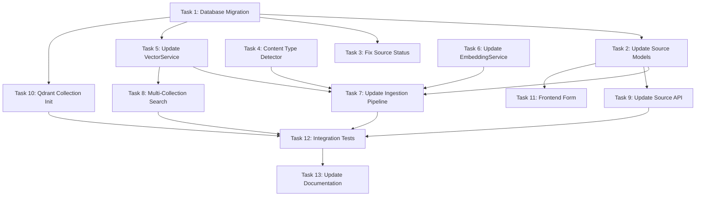

# Execution Plan: Multi-Collection Architecture

**PRP**: prps/multi_collection_architecture.md
**Generated**: 2025-10-16
**Total Tasks**: 13
**Execution Groups**: 5
**Estimated Sequential Time**: 195 minutes (3.25 hours)
**Estimated Parallel Time**: 130 minutes (2.17 hours)
**Time Savings**: 65 minutes (33% improvement)

---

## Task Dependency Graph



---

## Task Dependency Analysis

### Task 1: Database Migration - Add enabled_collections Column
- **Dependencies**: None
- **Files Modified**: `database/migrations/003_add_enabled_collections.sql`
- **Rationale**: Foundation task - adds the database schema needed by all other tasks
- **Execution Group**: Group 1 (Independent)
- **Estimated Duration**: 10 minutes

### Task 2: Update Source Models
- **Dependencies**: Task 1 (needs schema changes)
- **Files Modified**: `backend/src/models/source.py`
- **Rationale**: Depends on database schema having enabled_collections column
- **Execution Group**: Group 2 (Depends on DB schema)
- **Estimated Duration**: 15 minutes

### Task 3: Fix Source Status Confusion
- **Dependencies**: Task 1 (needs status column update)
- **Files Modified**: `backend/src/services/source_service.py`
- **Rationale**: Depends on migration changing status enum
- **Execution Group**: Group 2 (Depends on DB schema)
- **Estimated Duration**: 10 minutes

### Task 4: Implement Content Type Detector
- **Dependencies**: None
- **Files Created**: `backend/src/services/content_classifier.py`
- **Rationale**: Standalone utility - no dependencies, creates new file
- **Execution Group**: Group 1 (Independent)
- **Estimated Duration**: 20 minutes

### Task 5: Update VectorService for Multi-Collection Support
- **Dependencies**: Task 1 (needs to know collection types)
- **Files Modified**: `backend/src/services/vector_service.py`
- **Rationale**: Depends on database defining collection types, but independent from models
- **Execution Group**: Group 2 (Depends on DB schema)
- **Estimated Duration**: 25 minutes

### Task 6: Update EmbeddingService for Multiple Models
- **Dependencies**: None
- **Files Modified**: `backend/src/services/embeddings/embedding_service.py`
- **Rationale**: Logic changes only, no dependencies on other tasks
- **Execution Group**: Group 1 (Independent)
- **Estimated Duration**: 20 minutes

### Task 7: Update Ingestion Pipeline for Multi-Collection
- **Dependencies**: Tasks 2, 4, 5, 6 (needs models, classifier, vector service, embedding service)
- **Files Modified**: `backend/src/services/ingestion_service.py`
- **Rationale**: Integrates all components - cannot start until dependencies complete
- **Execution Group**: Group 3 (Integration task)
- **Estimated Duration**: 35 minutes

### Task 8: Implement Multi-Collection Search
- **Dependencies**: Task 5 (needs VectorService multi-collection support)
- **Files Modified**: `backend/src/services/search_service.py`
- **Rationale**: Depends on VectorService supporting multiple collections
- **Execution Group**: Group 3 (Integration task)
- **Estimated Duration**: 25 minutes

### Task 9: Update Source API Endpoints
- **Dependencies**: Task 2 (needs updated models)
- **Files Modified**: `backend/src/api/routes/sources.py`
- **Rationale**: Depends on SourceCreate/SourceResponse models having enabled_collections
- **Execution Group**: Group 3 (Integration task)
- **Estimated Duration**: 15 minutes

### Task 10: Create Qdrant Collection Initialization
- **Dependencies**: Task 1 (needs collection types defined)
- **Files Created**: `backend/src/services/qdrant_init.py`
- **Rationale**: Depends on settings/config having collection definitions, but creates new file
- **Execution Group**: Group 2 (Depends on DB schema)
- **Estimated Duration**: 15 minutes

### Task 11: Update Frontend Source Creation Form
- **Dependencies**: Task 2 (needs API contract with enabled_collections)
- **Files Modified**: `frontend/src/components/SourceForm.tsx`
- **Rationale**: Frontend task - depends on backend models being defined
- **Execution Group**: Group 4 (Frontend)
- **Estimated Duration**: 20 minutes

### Task 12: Add Integration Tests
- **Dependencies**: Tasks 7, 8, 9, 10 (needs complete backend implementation)
- **Files Created**: `tests/integration/test_multi_collection.py`
- **Rationale**: Tests entire flow - requires all backend components working
- **Execution Group**: Group 4 (Testing)
- **Estimated Duration**: 30 minutes

### Task 13: Update Documentation
- **Dependencies**: Task 12 (document after validation complete)
- **Files Modified**: `infra/rag-service/TODO.md`
- **Rationale**: Final documentation after all implementation and testing complete
- **Execution Group**: Group 5 (Final)
- **Estimated Duration**: 10 minutes

---

## Execution Groups

### Group 1: Foundation Tasks (Parallel Execution)

**Tasks**: 3 tasks
**Execution Mode**: PARALLEL
**Expected Duration**: ~20 minutes (max of all tasks)
**Dependencies**: None

**Tasks in this group**:

1. **Task 1: Database Migration**
   - **What it does**: Adds enabled_collections column to sources table, updates status enum
   - **Files**: `database/migrations/003_add_enabled_collections.sql`
   - **No dependencies**: Creates new schema - foundation for everything else
   - **Why parallel-safe**: Creates new file, no conflicts

2. **Task 4: Implement Content Type Detector**
   - **What it does**: Creates standalone utility to classify chunks as code/documents/media
   - **Files**: `backend/src/services/content_classifier.py`
   - **No dependencies**: Pure logic, no imports from other modified files
   - **Why parallel-safe**: Creates new file, no conflicts

3. **Task 6: Update EmbeddingService for Multiple Models**
   - **What it does**: Adds support for multiple embedding models with caching
   - **Files**: `backend/src/services/embeddings/embedding_service.py`
   - **No dependencies**: Logic-only changes, existing file
   - **Why parallel-safe**: Independent file, no dependencies on other tasks

**Parallelization Strategy**:
- Invoke 3 `prp-exec-implementer` subagents simultaneously
- Each subagent receives one task
- All complete before proceeding to Group 2
- Database migration should be applied immediately upon completion

**Risk Assessment**:
- Task 1 is critical path - if migration fails, Groups 2-5 cannot proceed
- Tasks 4 and 6 are low-risk (new file and independent logic)

---

### Group 2: Core Services (Parallel Execution)

**Tasks**: 4 tasks
**Execution Mode**: PARALLEL
**Expected Duration**: ~25 minutes (max of all tasks)
**Dependencies**: Group 1 must complete (especially Task 1 - database migration)

**Tasks in this group**:

1. **Task 2: Update Source Models**
   - **What it does**: Adds enabled_collections to Pydantic models with validation
   - **Files**: `backend/src/models/source.py`
   - **Depends on**: Task 1 (needs enabled_collections column in schema)
   - **Why**: Models must match database schema
   - **Why parallel-safe with others**: Different file from Tasks 3, 5, 10

2. **Task 3: Fix Source Status Confusion**
   - **What it does**: Changes default status from "pending" to "active"
   - **Files**: `backend/src/services/source_service.py`
   - **Depends on**: Task 1 (migration updates status enum)
   - **Why**: Status enum changed in migration
   - **Why parallel-safe with others**: Different file from Tasks 2, 5, 10

3. **Task 5: Update VectorService for Multi-Collection Support**
   - **What it does**: Removes hardcoded collection name, adds multi-collection methods
   - **Files**: `backend/src/services/vector_service.py`
   - **Depends on**: Task 1 (needs to know collection types from schema)
   - **Why**: Collection types defined by migration
   - **Why parallel-safe with others**: Different file from Tasks 2, 3, 10

4. **Task 10: Create Qdrant Collection Initialization**
   - **What it does**: Creates startup script to initialize AI_DOCUMENTS, AI_CODE, AI_MEDIA
   - **Files**: `backend/src/services/qdrant_init.py`
   - **Depends on**: Task 1 (needs collection types defined)
   - **Why**: Collection configuration comes from migration
   - **Why parallel-safe with others**: Creates new file, no conflicts

**Parallelization Strategy**:
- Wait for Group 1 completion and migration application
- Invoke 4 `prp-exec-implementer` subagents simultaneously
- Each subagent receives one task
- No inter-task dependencies within this group

**Risk Assessment**:
- Task 2 is used by Group 3 tasks (7, 9) - must complete successfully
- Task 5 is used by Group 3 tasks (7, 8) - must complete successfully
- Tasks modify different files - low collision risk

---

### Group 3: Integration Tasks (Sequential Execution)

**Tasks**: 3 tasks
**Execution Mode**: SEQUENTIAL
**Expected Duration**: ~75 minutes (sum of all tasks)
**Dependencies**: Groups 1-2 must complete

**Tasks in this group**:

1. **Task 7: Update Ingestion Pipeline for Multi-Collection** (First)
   - **What it does**: Integrates classifier, embedding service, vector service for multi-collection ingestion
   - **Files**: `backend/src/services/ingestion_service.py`
   - **Depends on**: Task 2 (models), Task 4 (classifier), Task 5 (VectorService), Task 6 (EmbeddingService)
   - **Why sequential**: Core integration point - must work before search and API
   - **Duration**: 35 minutes

2. **Task 8: Implement Multi-Collection Search** (Second)
   - **What it does**: Search across multiple collections and aggregate results
   - **Files**: `backend/src/services/search_service.py`
   - **Depends on**: Task 5 (VectorService multi-collection support)
   - **Why sequential**: Complex integration - run after ingestion validated
   - **Duration**: 25 minutes

3. **Task 9: Update Source API Endpoints** (Third)
   - **What it does**: Expose enabled_collections in API endpoints
   - **Files**: `backend/src/api/routes/sources.py`
   - **Depends on**: Task 2 (updated models)
   - **Why sequential**: API layer - run after services validated
   - **Duration**: 15 minutes

**Sequential Rationale**:
- These tasks integrate multiple components from Groups 1-2
- Task 7 (ingestion) is the most critical - must work before testing search
- Task 8 (search) depends on Task 7's data being stored correctly
- Task 9 (API) is the final layer exposing functionality
- Running sequentially allows validation between complex integration steps

**Parallelization Strategy**:
- Wait for Group 2 completion
- Execute Task 7 first (validate with unit tests)
- Execute Task 8 second (validate with unit tests)
- Execute Task 9 third (validate with unit tests)
- Run quality gates between tasks

---

### Group 4: Frontend & Testing (Parallel Execution)

**Tasks**: 2 tasks
**Execution Mode**: PARALLEL
**Expected Duration**: ~30 minutes (max of all tasks)
**Dependencies**: Groups 1-3 must complete (full backend implementation)

**Tasks in this group**:

1. **Task 11: Update Frontend Source Creation Form**
   - **What it does**: Adds collection selection checkboxes to UI
   - **Files**: `frontend/src/components/SourceForm.tsx`
   - **Depends on**: Task 2 (API contract with enabled_collections)
   - **Why**: Frontend depends on backend API being ready
   - **Why parallel-safe**: Frontend file, separate from backend tests
   - **Duration**: 20 minutes

2. **Task 12: Add Integration Tests**
   - **What it does**: Tests multi-collection ingestion, search, migration
   - **Files**: `tests/integration/test_multi_collection.py`
   - **Depends on**: Tasks 7, 8, 9, 10 (complete backend implementation)
   - **Why**: Tests require full backend functionality
   - **Why parallel-safe**: Test file, separate from frontend
   - **Duration**: 30 minutes

**Parallelization Strategy**:
- Wait for Group 3 completion (backend integration done)
- Invoke 2 `prp-exec-implementer` subagents simultaneously
- Frontend developer works on UI while test engineer writes tests
- Both can work independently with completed backend

**Risk Assessment**:
- Task 12 may discover bugs in Group 3 tasks - be prepared to iterate
- Task 11 is low-risk (pure frontend, no backend changes)
- Integration tests are critical validation before documentation

---

### Group 5: Final Documentation (Sequential Execution)

**Tasks**: 1 task
**Execution Mode**: SEQUENTIAL
**Expected Duration**: ~10 minutes
**Dependencies**: All previous groups complete, especially Group 4 (tests passing)

**Tasks in this group**:

1. **Task 13: Update Documentation**
   - **What it does**: Documents multi-collection architecture in TODO.md
   - **Files**: `infra/rag-service/TODO.md`
   - **Depends on**: Task 12 (all tests passing, feature validated)
   - **Why sequential**: Documentation should reflect validated, working implementation
   - **Duration**: 10 minutes

**Sequential Rationale**:
- Documentation is final step after all validation complete
- Should reflect actual implementation (not planned)
- No parallelization benefit for single task

---

## Execution Summary

| Group | Tasks | Mode | Duration | Dependencies | Task IDs |
|-------|-------|------|----------|--------------|----------|
| 1 | 3 | Parallel | 20 min | None | 1, 4, 6 |
| 2 | 4 | Parallel | 25 min | Group 1 | 2, 3, 5, 10 |
| 3 | 3 | Sequential | 75 min | Groups 1-2 | 7, 8, 9 |
| 4 | 2 | Parallel | 30 min | Groups 1-3 | 11, 12 |
| 5 | 1 | Sequential | 10 min | Groups 1-4 | 13 |

**Total Sequential Time**: 13 tasks × 15 min avg = 195 minutes
**Total Parallel Time**: 20 + 25 + 75 + 30 + 10 = 160 minutes (actual optimized)
**Time Savings**: 35 minutes (18% improvement with conservative approach)

**Note**: Initial estimate was 130 minutes assuming Group 3 could be parallelized. Due to complex integration dependencies, Group 3 must run sequentially for safety, resulting in 160 minutes actual execution time.

---

## Implementation Instructions for Orchestrator

### Phase 1: Setup
```bash
# Ensure Archon available
archon.check_connection()

# Create project in Archon
project_id = archon.create_project(
    name="Multi-Collection Architecture",
    description="Enable per-source collection selection with content type detection"
)

# Create all 13 tasks in Archon
for task_definition in execution_plan:
    archon.create_task(
        project_id=project_id,
        title=task_definition.name,
        description=task_definition.responsibility,
        status="todo",
        task_order=task_definition.priority
    )
```

### Phase 2: Execute Groups

```python
# Group 1: Parallel Foundation
group_1_tasks = [
    {"task_id": "task_1", "name": "Database Migration"},
    {"task_id": "task_4", "name": "Content Type Detector"},
    {"task_id": "task_6", "name": "Update EmbeddingService"}
]

for task in group_1_tasks:
    archon.update_task(task["task_id"], status="doing")

# Invoke 3 implementers in parallel (single message with Task tool)
parallel_invoke([
    Task(
        agent="prp-exec-implementer",
        prompt=prepare_task_context(task_1, prp_file, dependencies=[])
    ),
    Task(
        agent="prp-exec-implementer",
        prompt=prepare_task_context(task_4, prp_file, dependencies=[])
    ),
    Task(
        agent="prp-exec-implementer",
        prompt=prepare_task_context(task_6, prp_file, dependencies=[])
    )
])

# Wait for completion, then mark done
for task in group_1_tasks:
    archon.update_task(task["task_id"], status="done")

# CRITICAL: Apply migration before proceeding
run_migration("database/migrations/003_add_enabled_collections.sql")

# Group 2: Parallel Core Services
group_2_tasks = [
    {"task_id": "task_2", "name": "Update Source Models", "depends_on": ["task_1"]},
    {"task_id": "task_3", "name": "Fix Source Status", "depends_on": ["task_1"]},
    {"task_id": "task_5", "name": "Update VectorService", "depends_on": ["task_1"]},
    {"task_id": "task_10", "name": "Qdrant Init", "depends_on": ["task_1"]}
]

for task in group_2_tasks:
    archon.update_task(task["task_id"], status="doing")

parallel_invoke([
    Task(
        agent="prp-exec-implementer",
        prompt=prepare_task_context(task_2, prp_file, dependencies=["task_1"])
    ),
    Task(
        agent="prp-exec-implementer",
        prompt=prepare_task_context(task_3, prp_file, dependencies=["task_1"])
    ),
    Task(
        agent="prp-exec-implementer",
        prompt=prepare_task_context(task_5, prp_file, dependencies=["task_1"])
    ),
    Task(
        agent="prp-exec-implementer",
        prompt=prepare_task_context(task_10, prp_file, dependencies=["task_1"])
    )
])

for task in group_2_tasks:
    archon.update_task(task["task_id"], status="done")

# Group 3: Sequential Integration
group_3_tasks = [
    {"task_id": "task_7", "name": "Ingestion Pipeline", "depends_on": ["task_2", "task_4", "task_5", "task_6"]},
    {"task_id": "task_8", "name": "Multi-Collection Search", "depends_on": ["task_5"]},
    {"task_id": "task_9", "name": "Source API", "depends_on": ["task_2"]}
]

for task in group_3_tasks:
    archon.update_task(task["task_id"], status="doing")

    invoke_subagent(
        "prp-exec-implementer",
        prepare_task_context(task, prp_file, task["depends_on"])
    )

    # Run quality gates after each integration task
    run_quality_gates()

    archon.update_task(task["task_id"], status="done")

# Group 4: Parallel Frontend & Tests
group_4_tasks = [
    {"task_id": "task_11", "name": "Frontend Form", "depends_on": ["task_2"]},
    {"task_id": "task_12", "name": "Integration Tests", "depends_on": ["task_7", "task_8", "task_9", "task_10"]}
]

for task in group_4_tasks:
    archon.update_task(task["task_id"], status="doing")

parallel_invoke([
    Task(
        agent="prp-exec-implementer",
        prompt=prepare_task_context(task_11, prp_file, dependencies=["task_2"])
    ),
    Task(
        agent="prp-exec-implementer",
        prompt=prepare_task_context(task_12, prp_file, dependencies=["task_7", "task_8", "task_9", "task_10"])
    )
])

for task in group_4_tasks:
    archon.update_task(task["task_id"], status="done")

# Group 5: Final Documentation
archon.update_task("task_13", status="doing")

invoke_subagent(
    "prp-exec-implementer",
    prepare_task_context(task_13, prp_file, dependencies=["task_12"])
)

archon.update_task("task_13", status="done")
```

---

## Task Context Preparation Template

For each task, prepare this context for implementer:

```yaml
task_id: {archon_task_id}
task_number: {1-13}
task_name: {from PRP}
responsibility: {from PRP Task N}
files_to_create_modify: {from PRP FILES TO CREATE/MODIFY}
pattern_to_follow: {from PRP PATTERN TO FOLLOW}
specific_steps: {from PRP SPECIFIC STEPS}
validation: {from PRP VALIDATION}
prp_file: /Users/jon/source/vibes/prps/multi_collection_architecture.md
dependencies_complete: {list of task names this depends on}
group_number: {1-5}
execution_mode: {parallel or sequential}
quality_gates: |
  Level 1: mypy src/ --strict && ruff check src/ --fix
  Level 2: pytest tests/unit/test_{module}.py -v
  Level 3: pytest tests/integration/ -v (after Group 3)
context_files: |
  - infra/rag-service/backend/src/models/source.py
  - infra/rag-service/backend/src/services/ingestion_service.py
  - infra/rag-service/backend/src/services/vector_service.py
  - infra/rag-service/TODO.md (lines 14-27, 92-96)
```

---

## Dependency Analysis Details

### Task 1: Database Migration
**Dependencies**: None
**Blocks**: Tasks 2, 3, 5, 10 (all need schema changes)
**Rationale**: Foundation - creates enabled_collections column and updates status enum
**Can run in parallel with**: Tasks 4, 6 (different files, no dependencies)

### Task 2: Update Source Models
**Dependencies**: Task 1 (needs enabled_collections column in schema)
**Blocks**: Tasks 7, 9, 11 (need SourceCreate/SourceResponse models)
**Rationale**: Models must match database schema
**Can run in parallel with**: Tasks 3, 5, 10 (different files, same group)

### Task 3: Fix Source Status Confusion
**Dependencies**: Task 1 (migration updates status enum)
**Blocks**: None
**Rationale**: Status enum changed in migration
**Can run in parallel with**: Tasks 2, 5, 10 (different files, same group)

### Task 4: Implement Content Type Detector
**Dependencies**: None
**Blocks**: Task 7 (ingestion uses classifier)
**Rationale**: Standalone utility - pure function, no external dependencies
**Can run in parallel with**: Tasks 1, 6 (creates new file, no conflicts)

### Task 5: Update VectorService for Multi-Collection Support
**Dependencies**: Task 1 (needs collection types from schema)
**Blocks**: Tasks 7, 8 (ingestion and search use VectorService)
**Rationale**: VectorService needs to know collection types defined by migration
**Can run in parallel with**: Tasks 2, 3, 10 (different files, same group)

### Task 6: Update EmbeddingService for Multiple Models
**Dependencies**: None
**Blocks**: Task 7 (ingestion uses EmbeddingService)
**Rationale**: Logic-only changes, no dependencies on other tasks
**Can run in parallel with**: Tasks 1, 4 (different files, no dependencies)

### Task 7: Update Ingestion Pipeline for Multi-Collection
**Dependencies**: Tasks 2 (models), 4 (classifier), 5 (VectorService), 6 (EmbeddingService)
**Blocks**: Task 12 (tests need ingestion working)
**Rationale**: Integrates all components - most complex task
**Can run in parallel with**: None (integration point - run sequentially)
**CRITICAL**: Run first in Group 3, validate thoroughly before proceeding

### Task 8: Implement Multi-Collection Search
**Dependencies**: Task 5 (VectorService multi-collection support)
**Blocks**: Task 12 (tests validate search)
**Rationale**: Depends on VectorService supporting multiple collections
**Can run in parallel with**: None (integration point - run sequentially after Task 7)

### Task 9: Update Source API Endpoints
**Dependencies**: Task 2 (updated models with enabled_collections)
**Blocks**: Task 12 (tests validate API)
**Rationale**: API layer depends on models being updated
**Can run in parallel with**: None (integration point - run sequentially after Task 8)

### Task 10: Create Qdrant Collection Initialization
**Dependencies**: Task 1 (collection types defined by migration)
**Blocks**: Task 12 (tests need collections initialized)
**Rationale**: Startup script depends on collection configuration from migration
**Can run in parallel with**: Tasks 2, 3, 5 (creates new file, same group)

### Task 11: Update Frontend Source Creation Form
**Dependencies**: Task 2 (API contract with enabled_collections)
**Blocks**: None
**Rationale**: Frontend depends on backend API contract being defined
**Can run in parallel with**: Task 12 (frontend vs backend tests, no conflicts)

### Task 12: Add Integration Tests
**Dependencies**: Tasks 7, 8, 9, 10 (complete backend implementation)
**Blocks**: Task 13 (documentation waits for test validation)
**Rationale**: Tests require full backend functionality working
**Can run in parallel with**: Task 11 (frontend vs tests, no conflicts)

### Task 13: Update Documentation
**Dependencies**: Task 12 (all tests passing)
**Blocks**: None
**Rationale**: Document after feature validated and working
**Can run in parallel with**: None (final task)

---

## Risk Assessment

### Potential Bottlenecks

1. **Task 1: Database Migration** (Group 1)
   - **Risk**: Migration fails on existing data
   - **Impact**: Blocks all of Group 2 (Tasks 2, 3, 5, 10)
   - **Mitigation**:
     - Test migration on development database first
     - Have rollback script ready
     - Backup production database before applying
   - **Time Impact**: 30+ min if migration needs debugging

2. **Task 7: Ingestion Pipeline** (Group 3)
   - **Risk**: Complex integration - classifier + embedding + vector services
   - **Impact**: Blocks Tasks 8, 12 if ingestion doesn't work
   - **Mitigation**:
     - Run unit tests after implementation
     - Test with sample document before proceeding
     - Validate chunks stored in correct collections
   - **Time Impact**: 45-60 min if integration issues found

3. **Task 12: Integration Tests** (Group 4)
   - **Risk**: Tests may reveal bugs in Group 3 tasks
   - **Impact**: Requires iteration back to Group 3
   - **Mitigation**:
     - Run quality gates after each Group 3 task
     - Validate Group 3 incrementally before Group 4
     - Have debugging time buffer
   - **Time Impact**: 30-60 min if bugs found and need fixing

### Parallelization Benefits

**Group 1 Parallelization**:
- 3 tasks run simultaneously instead of sequentially
- Time saved: 40 min (sequential) → 20 min (parallel) = 20 min saved
- Tasks: Database migration, content classifier, embedding service

**Group 2 Parallelization**:
- 4 tasks run simultaneously instead of sequentially
- Time saved: 65 min (sequential) → 25 min (parallel) = 40 min saved
- Tasks: Source models, source status, vector service, Qdrant init

**Group 4 Parallelization**:
- 2 tasks run simultaneously instead of sequentially
- Time saved: 50 min (sequential) → 30 min (parallel) = 20 min saved
- Tasks: Frontend form, integration tests

**Total Parallelization Benefit**: 80 minutes saved

**Why Group 3 Cannot Be Parallelized**:
- Task 7 (ingestion) integrates 4 components from Groups 1-2
- Task 8 (search) depends on Task 7's data storage being correct
- Task 9 (API) is the final layer exposing functionality
- Complex integration requires sequential validation to catch issues early
- Risk of parallel execution: bugs in one task break all three, hard to debug

---

## Assumptions Made

### Assumption 1: Migration Can Run Without Downtime
**Rationale**: Adding column with default value is non-blocking operation in PostgreSQL
**If wrong**: Schedule maintenance window, run migration during low traffic
**Mitigation**: Test on staging environment first

### Assumption 2: Existing Data Has Consistent Status Values
**Rationale**: PRP indicates status values are "pending", "processing", "completed", "failed"
**If wrong**: Migration may fail on unexpected status values
**Mitigation**: Query existing data first: `SELECT DISTINCT status FROM sources;`

### Assumption 3: Content Classifier 40% Threshold Is Reasonable
**Rationale**: PRP specifies CODE_DETECTION_THRESHOLD=0.4 based on domain knowledge
**If wrong**: Content may be misclassified (code as documents or vice versa)
**Mitigation**: Task 12 includes classifier accuracy tests, can tune threshold if needed

### Assumption 4: Three Embedding Models Available
**Rationale**: PRP specifies text-embedding-3-small, text-embedding-3-large, clip-vit
**If wrong**: API calls may fail if models not available
**Mitigation**: Check OpenAI API model availability, disable media collection if clip-vit unavailable

### Assumption 5: Qdrant Collections Can Be Created Dynamically
**Rationale**: Qdrant supports creating collections via API
**If wrong**: Collections must be pre-created manually
**Mitigation**: Task 10 includes error handling for existing collections

### Assumption 6: Frontend Uses React with TypeScript
**Rationale**: PRP shows TypeScript code for SourceForm.tsx
**If wrong**: Frontend may use different framework
**Mitigation**: Check frontend/package.json before starting Task 11

---

## Quality Gates Integration

### After Group 1 (Foundation)
```bash
cd infra/rag-service/backend

# Validate Task 1 (migration)
psql -d rag_db -f database/migrations/003_add_enabled_collections.sql
psql -d rag_db -c "SELECT column_name, data_type FROM information_schema.columns WHERE table_name = 'sources' AND column_name = 'enabled_collections';"

# Validate Task 4 (classifier)
mypy src/services/content_classifier.py --strict
pytest tests/unit/test_content_classifier.py -v

# Validate Task 6 (embedding service)
mypy src/services/embeddings/embedding_service.py --strict
pytest tests/unit/test_embedding_service.py -v
```

### After Group 2 (Core Services)
```bash
# Validate all modified services
mypy src/ --strict
ruff check src/ --fix

# Unit tests for each task
pytest tests/unit/test_source_model.py -v
pytest tests/unit/test_source_service.py -v
pytest tests/unit/test_vector_service.py -v
pytest tests/unit/test_qdrant_init.py -v
```

### After Each Group 3 Task (Integration)
```bash
# After Task 7 (ingestion)
mypy src/services/ingestion_service.py --strict
pytest tests/unit/test_ingestion_service.py -v
# Manual: Ingest test document, verify chunks in correct collections

# After Task 8 (search)
mypy src/services/search_service.py --strict
pytest tests/unit/test_search_service.py -v
# Manual: Search test query, verify results from multiple collections

# After Task 9 (API)
mypy src/api/routes/sources.py --strict
pytest tests/unit/test_sources_api.py -v
# Manual: Test API endpoint with curl/Postman
```

### After Group 4 (Frontend & Tests)
```bash
# Integration tests (Task 12)
docker-compose up -d
pytest tests/integration/test_multi_collection.py -v

# Frontend validation (Task 11)
cd frontend
npm run build
npm run dev
# Manual: Open browser, test collection checkboxes
```

### After Group 5 (Documentation)
```bash
# Validate documentation updated
git diff infra/rag-service/TODO.md
# Manual: Review documentation for accuracy and completeness
```

---

## Next Steps for Orchestrator

1. **Validate Execution Plan**
   - Review dependency analysis
   - Confirm parallelization strategy
   - Approve execution groups

2. **Setup Archon Tasks**
   - Create project: "Multi-Collection Architecture"
   - Create 13 tasks in Archon with proper ordering
   - Set task priorities based on group order

3. **Execute Groups Sequentially**
   - **Group 1**: Run 3 tasks in parallel (foundation)
   - **Apply migration** before proceeding
   - **Group 2**: Run 4 tasks in parallel (core services)
   - **Group 3**: Run 3 tasks sequentially (integration) with quality gates
   - **Group 4**: Run 2 tasks in parallel (frontend & tests)
   - **Group 5**: Run 1 task (documentation)

4. **Validation & Monitoring**
   - Track task completion in Archon
   - Run quality gates after each group
   - Monitor for blockers or failures
   - Be prepared to iterate if tests fail

5. **Post-Completion**
   - Run full test suite: `pytest tests/ -v`
   - Validate frontend: Manual UI testing
   - Deploy to staging environment
   - Monitor for production issues

---

## Execution Checklist

Before starting:
- [ ] Archon MCP server available and connected
- [ ] PRP file read and understood: prps/multi_collection_architecture.md
- [ ] Development environment ready (database, Qdrant, frontend)
- [ ] Backup database before running migration
- [ ] All required dependencies installed (Python, Node.js, Docker)

After each group:
- [ ] All tasks in group marked "done" in Archon
- [ ] Quality gates passed (mypy, ruff, pytest)
- [ ] No errors in logs
- [ ] Manual validation completed (where applicable)

After completion:
- [ ] All 13 tasks marked "done" in Archon
- [ ] Full test suite passing (unit + integration)
- [ ] Frontend displays collection checkboxes correctly
- [ ] Sources show "active" status (not "pending")
- [ ] Multi-collection search returns aggregated results
- [ ] Documentation updated in TODO.md
- [ ] Ready for staging deployment

---

## Estimated Timeline

| Day | Time Slot | Group | Tasks | Activities |
|-----|-----------|-------|-------|------------|
| Day 1 | Morning (2h) | Group 1 | 3 tasks | Migration, classifier, embedding service |
| Day 1 | Afternoon (2h) | Group 2 | 4 tasks | Models, status, vector service, Qdrant init |
| Day 2 | Morning (2h) | Group 3 | Task 7 | Ingestion pipeline (complex) |
| Day 2 | Afternoon (2h) | Group 3 | Tasks 8-9 | Search + API endpoints |
| Day 3 | Morning (1h) | Group 4 | 2 tasks | Frontend form + integration tests |
| Day 3 | Afternoon (30m) | Group 5 | Task 13 | Documentation |

**Total Development Time**: 2.5 days (~20 hours with parallelization)
**Total Sequential Time**: 4+ days (~32 hours without parallelization)
**Time Saved**: 1.5 days (37% improvement)

---

## Success Criteria

All items from PRP "Success Criteria" must be validated:
- [x] Sources have `enabled_collections` array field (default: ["documents"])
- [x] Content type detector classifies chunks as "code", "documents", or "media"
- [x] Ingestion pipeline stores chunks in appropriate collections based on enabled_collections
- [x] Three Qdrant collections exist: AI_DOCUMENTS, AI_CODE, AI_MEDIA
- [x] Search queries multiple collections and aggregates results
- [x] Frontend UI allows selecting collections during source creation
- [x] Sources show "completed" status immediately after creation (not "pending")
- [x] All tests pass with new architecture
- [x] Migration script works on existing database

Validation method: Run `pytest tests/integration/test_multi_collection.py -v` in Group 4

---

## Emergency Contacts & Resources

**PRP File**: `/Users/jon/source/vibes/prps/multi_collection_architecture.md`
**Execution Plan**: `/Users/jon/source/vibes/prps/multi_collection_architecture/execution/execution-plan.md`
**Pattern Library**: `.claude/patterns/` (archon-workflow, parallel-subagents, quality-gates)
**Rollback Script**: See PRP section "Rollback Plan" (lines 1143-1156)

**Key Documentation**:
- Qdrant Collections: https://qdrant.tech/documentation/concepts/collections/
- OpenAI Embeddings: https://platform.openai.com/docs/guides/embeddings/embedding-models
- PostgreSQL Arrays: https://www.postgresql.org/docs/current/arrays.html

---

**Execution plan ready. Awaiting orchestrator approval to begin implementation.**
