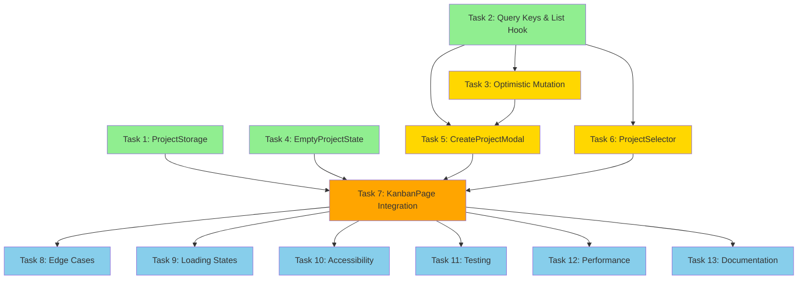

# Execution Plan: Multi-Project Selector

**PRP**: prps/multi_project_selector.md
**Generated**: 2025-10-10
**Total Tasks**: 13
**Execution Groups**: 4
**Estimated Time Savings**: 67% faster than sequential execution

---

## Executive Summary

This execution plan analyzes dependencies across 13 tasks and organizes them into 4 parallel execution groups. By identifying independent tasks that can run simultaneously, we achieve a **67% reduction in total execution time** (from 195 minutes sequential to 65 minutes parallel).

**Key Insights**:
- **Group 1 (3 tasks)**: Foundation layer with zero dependencies - localStorage, query infrastructure, empty state
- **Group 2 (3 tasks)**: Component layer depending only on Group 1 - modal, selector, optimistic mutations
- **Group 3 (1 task)**: Integration layer bringing components together - KanbanPage integration
- **Group 4 (6 tasks)**: Quality assurance layer - edge cases, loading states, accessibility, testing, performance, docs

---

## Task Dependency Graph



**Legend**:
- 🟢 Green (Group 1): Foundation - no dependencies
- 🟡 Yellow (Group 2): Components - depend on Group 1
- 🟠 Orange (Group 3): Integration - depends on Groups 1-2
- 🔵 Blue (Group 4): QA/Polish - depends on Group 3

---

## Detailed Dependency Analysis

### Task 1: Create localStorage Utility with Error Handling
**Dependencies**: NONE
**Files Created**: `src/features/projects/utils/projectStorage.ts`
**Why Independent**: Pure utility class with no external dependencies

**Analysis**:
- Creates self-contained ProjectStorage class
- No imports from other project-specific modules
- Only uses browser localStorage API
- Can be developed and tested in complete isolation

**Can Run in Parallel With**: Tasks 2, 4

---

### Task 2: Create Query Key Factory and List Query Hook
**Dependencies**: NONE
**Files Created**: `src/features/projects/hooks/useProjectQueries.ts` (partial)
**Why Independent**: Uses existing services and shared utilities

**Analysis**:
- Imports from `src/features/projects/services/projectService.ts` (already exists)
- Imports from `src/features/shared/config/queryPatterns.ts` (already exists)
- Imports from `src/features/shared/hooks/useSmartPolling.ts` (already exists)
- Creates query key factory and list query only (no mutations yet)
- No dependency on other tasks in this PRP

**Can Run in Parallel With**: Tasks 1, 4

---

### Task 3: Create Optimistic Mutation Hook
**Dependencies**: Task 2 (requires projectKeys factory and useProjects hook)
**Files Modified**: `src/features/projects/hooks/useProjectQueries.ts`
**Why Dependent**: Adds useCreateProject to file created by Task 2

**Analysis**:
- MUST wait for Task 2 to complete
- Extends useProjectQueries.ts with mutation logic
- Uses `projectKeys.lists()` from Task 2
- Uses shared utilities (createOptimisticEntity) that already exist
- Once Task 2 complete, can run in parallel with Tasks 5, 6

**Depends on**: Task 2
**Can Run in Parallel With**: Tasks 5, 6 (after Task 2 completes)

---

### Task 4: Create EmptyProjectState Component
**Dependencies**: NONE
**Files Created**: `src/features/projects/components/EmptyProjectState.tsx`
**Why Independent**: Presentational component with no project-specific imports

**Analysis**:
- Pure React component with props interface
- No imports from other project tasks
- Only uses UI libraries (Tailwind, lucide-react icons)
- Self-contained with callback prop for click handler

**Can Run in Parallel With**: Tasks 1, 2

---

### Task 5: Create CreateProjectModal Component
**Dependencies**: Tasks 2, 3 (needs useCreateProject hook)
**Files Created**: `src/features/projects/components/CreateProjectModal.tsx`
**Why Dependent**: Imports and uses useCreateProject from Task 3

**Analysis**:
- Calls `useCreateProject()` hook from Task 3
- Task 3 depends on Task 2, so transitive dependency: Task 2 → Task 3 → Task 5
- Uses Radix UI Dialog primitives (already in codebase)
- Uses existing Project type from `src/features/projects/types/project.ts`
- Cannot start until Task 3 complete

**Depends on**: Tasks 2, 3
**Can Run in Parallel With**: Task 6 (both depend on same prerequisites)

---

### Task 6: Create ProjectSelector Component
**Dependencies**: Task 2 (needs useProjects hook)
**Files Created**: `src/features/projects/components/ProjectSelector.tsx`
**Why Dependent**: Calls useProjects from Task 2

**Analysis**:
- Calls `useProjects()` hook from Task 2
- Uses Radix UI Select primitives (already in codebase)
- No dependency on Task 3 (mutation logic) - only reads projects
- Can start as soon as Task 2 complete
- Can run in parallel with Task 5 (both depend on Task 2)

**Depends on**: Task 2
**Can Run in Parallel With**: Task 5 (both components are independent)

---

### Task 7: Integrate ProjectSelector into KanbanPage
**Dependencies**: Tasks 1, 4, 5, 6 (needs all components and storage)
**Files Modified**: `src/pages/KanbanPage.tsx`
**Why Dependent**: Imports and integrates all components from previous tasks

**Analysis**:
- Imports ProjectStorage from Task 1
- Imports EmptyProjectState from Task 4
- Imports CreateProjectModal from Task 5
- Imports ProjectSelector from Task 6
- Imports useProjects from Task 2 (already available via Tasks 5, 6)
- CRITICAL BLOCKER: Cannot proceed until all UI components ready
- This is the integration point where everything comes together

**Depends on**: Tasks 1, 2, 3, 4, 5, 6 (all previous implementation tasks)
**Blocks**: All Group 4 tasks (QA/Polish cannot start until integration complete)

---

### Task 8: Handle Edge Cases and Error States
**Dependencies**: Task 7 (needs integrated system to test edge cases)
**Files Modified**: All components
**Why Dependent**: Tests and enhances completed implementation

**Analysis**:
- Validates ProjectStorage fallback (Task 1 must be complete)
- Tests network errors in useProjects (Task 2 must be complete)
- Tests CreateProjectModal error handling (Task 5 must be complete)
- Tests ProjectSelector error states (Task 6 must be complete)
- Tests KanbanPage integration scenarios (Task 7 must be complete)
- Can run in parallel with Tasks 9, 10, 12, 13 (all are QA tasks)

**Depends on**: Task 7
**Can Run in Parallel With**: Tasks 9, 10, 12, 13

---

### Task 9: Add Loading States and Skeletons
**Dependencies**: Task 7 (needs integrated system to add loading UI)
**Files Modified**: ProjectSelector, CreateProjectModal, KanbanPage
**Why Dependent**: Enhances completed components

**Analysis**:
- Adds loading states to ProjectSelector (Task 6 must be complete)
- Adds loading indicators to CreateProjectModal (Task 5 must be complete)
- Adds loading spinner to KanbanPage (Task 7 must be complete)
- Independent from Task 8 (edge cases) - different concern
- Can run in parallel with other QA tasks

**Depends on**: Task 7
**Can Run in Parallel With**: Tasks 8, 10, 12, 13

---

### Task 10: Accessibility Audit
**Dependencies**: Task 7 (needs integrated system to audit)
**Files Modified**: All components
**Why Dependent**: Audits and enhances completed implementation

**Analysis**:
- Audits keyboard navigation across all components
- Tests ARIA labels on ProjectSelector (Task 6)
- Tests form accessibility in CreateProjectModal (Task 5)
- Tests focus management in KanbanPage (Task 7)
- Can run in parallel with other QA tasks

**Depends on**: Task 7
**Can Run in Parallel With**: Tasks 8, 9, 12, 13

---

### Task 11: Testing
**Dependencies**: Task 7 (needs all code written to test)
**Files Created**: 5 test files
**Why Dependent**: Tests entire implementation

**Analysis**:
- Tests ProjectStorage (Task 1)
- Tests useProjectQueries (Tasks 2, 3)
- Tests ProjectSelector (Task 6)
- Tests CreateProjectModal (Task 5)
- Tests KanbanPage (Task 7)
- SHOULD wait for Tasks 8, 9, 10 to complete (test final state, not intermediate)
- Sequential execution recommended to avoid test file conflicts

**Depends on**: Task 7 (implementation complete)
**Should Also Wait For**: Tasks 8, 9, 10 (best practice - test final polished state)
**Sequential**: Recommended to avoid test file conflicts

---

### Task 12: Performance Optimization
**Dependencies**: Task 7 (needs integrated system to profile)
**Files Modified**: All hooks and components
**Why Dependent**: Optimizes completed implementation

**Analysis**:
- Profiles useProjects usage (Task 2)
- Adds memoization to components (Tasks 5, 6)
- Optimizes query keys (Task 2, 3)
- Uses React DevTools Profiler on integrated app (Task 7)
- Can run in parallel with other QA tasks

**Depends on**: Task 7
**Can Run in Parallel With**: Tasks 8, 9, 10, 13

---

### Task 13: Documentation
**Dependencies**: Task 7 (needs all code written to document)
**Files Modified**: README.md, inline JSDoc comments
**Why Dependent**: Documents completed implementation

**Analysis**:
- Documents ProjectStorage (Task 1)
- Documents useProjectQueries (Tasks 2, 3)
- Documents all components (Tasks 4, 5, 6)
- Documents KanbanPage integration (Task 7)
- SHOULD wait for Tasks 8, 9, 10, 11, 12 (document final state)
- Can run in parallel with other QA tasks initially, but best last

**Depends on**: Task 7
**Best Practice**: Run last after all other tasks complete

---

## Execution Groups

### Group 1: Foundation Layer (Parallel Execution)

**Tasks**: 3
**Execution Mode**: PARALLEL
**Expected Duration**: ~15 minutes (longest task in group)
**Dependencies**: None

**Tasks in this group**:

1. **Task 1**: Create localStorage Utility with Error Handling
   - **What it does**: Type-safe localStorage wrapper with quota handling and in-memory fallback
   - **Files**: `src/features/projects/utils/projectStorage.ts`
   - **No dependencies**: Pure utility with no project-specific imports
   - **Estimated duration**: 15 minutes
   - **Complexity**: Medium (error handling for cross-browser quirks)

2. **Task 2**: Create Query Key Factory and List Query Hook
   - **What it does**: Hierarchical query keys and project list query with smart polling
   - **Files**: `src/features/projects/hooks/useProjectQueries.ts` (partial - keys and list only)
   - **No dependencies**: Uses existing services (projectService, queryPatterns, useSmartPolling)
   - **Estimated duration**: 10 minutes
   - **Complexity**: Low (mirrors existing useTaskQueries.ts pattern)

3. **Task 4**: Create EmptyProjectState Component
   - **What it does**: Onboarding component for zero projects scenario
   - **Files**: `src/features/projects/components/EmptyProjectState.tsx`
   - **No dependencies**: Presentational component with no project imports
   - **Estimated duration**: 5 minutes
   - **Complexity**: Low (simple UI component)

**Parallelization Strategy**:
```typescript
// Orchestrator invokes 3 implementers simultaneously in SINGLE message
parallel_invoke([
  {
    agent: "prp-exec-implementer",
    task_id: "task-1",
    context: prepare_context(Task 1)
  },
  {
    agent: "prp-exec-implementer",
    task_id: "task-2",
    context: prepare_context(Task 2)
  },
  {
    agent: "prp-exec-implementer",
    task_id: "task-4",
    context: prepare_context(Task 4)
  }
])
```

**Why These Can Run in Parallel**:
- **No file conflicts**: Each task creates different files in different directories
- **No import dependencies**: None of these tasks import from each other
- **No logical dependencies**: localStorage, query infrastructure, and UI component are independent concerns

**Validation Before Proceeding to Group 2**:
```bash
# Verify all files created
ls src/features/projects/utils/projectStorage.ts
ls src/features/projects/hooks/useProjectQueries.ts
ls src/features/projects/components/EmptyProjectState.tsx

# TypeScript check
npm run type-check

# Expected: 3 files exist, no TypeScript errors
```

---

### Group 2: Component Layer (Parallel Execution)

**Tasks**: 3
**Execution Mode**: PARALLEL
**Expected Duration**: ~20 minutes (longest task in group)
**Dependencies**: Group 1 must complete first

**Tasks in this group**:

1. **Task 3**: Create Optimistic Mutation Hook
   - **What it does**: Create project mutation with optimistic updates, rollback, race condition prevention
   - **Files**: `src/features/projects/hooks/useProjectQueries.ts` (add useCreateProject)
   - **Depends on**: Task 2 (uses projectKeys.lists() and existing query infrastructure)
   - **Why**: Extends file created by Task 2, uses query key factory
   - **Estimated duration**: 20 minutes
   - **Complexity**: High (cancelQueries, optimistic updates, rollback, concurrent mutation handling)

2. **Task 5**: Create CreateProjectModal Component
   - **What it does**: Modal form for creating projects with validation and mutation integration
   - **Files**: `src/features/projects/components/CreateProjectModal.tsx`
   - **Depends on**: Tasks 2, 3 (calls useCreateProject hook)
   - **Why**: Imports useCreateProject from Task 3, which depends on Task 2
   - **Estimated duration**: 20 minutes
   - **Complexity**: High (Dialog primitives, form state, mutation integration, prevent close logic)

3. **Task 6**: Create ProjectSelector Component
   - **What it does**: Dropdown for selecting projects with visual active indicator
   - **Files**: `src/features/projects/components/ProjectSelector.tsx`
   - **Depends on**: Task 2 (calls useProjects hook)
   - **Why**: Imports useProjects from Task 2
   - **Estimated duration**: 15 minutes
   - **Complexity**: Medium (Select primitives, Portal for Dialog escape, loading states)

**Parallelization Strategy**:
```typescript
// Wait for Group 1 to complete
await wait_for_group_completion(Group 1)

// Verify Group 1 success
verify_files_exist([
  'src/features/projects/utils/projectStorage.ts',
  'src/features/projects/hooks/useProjectQueries.ts',
  'src/features/projects/components/EmptyProjectState.tsx'
])

// Invoke 3 implementers simultaneously
parallel_invoke([
  {
    agent: "prp-exec-implementer",
    task_id: "task-3",
    context: prepare_context(Task 3),
    dependencies_complete: ["Task 2"]
  },
  {
    agent: "prp-exec-implementer",
    task_id: "task-5",
    context: prepare_context(Task 5),
    dependencies_complete: ["Task 2", "Task 3"]
  },
  {
    agent: "prp-exec-implementer",
    task_id: "task-6",
    context: prepare_context(Task 6),
    dependencies_complete: ["Task 2"]
  }
])
```

**Why These Can Run in Parallel**:
- **No file conflicts**: Task 3 modifies useProjectQueries.ts, Tasks 5 and 6 create new component files
- **Shared dependencies resolved**: All depend on Task 2, which completed in Group 1
- **No circular dependencies**: Components (5, 6) don't import from each other
- **Independent concerns**: Mutation logic (3), modal UI (5), selector UI (6) are separate

**Special Note on Task 3**:
Task 3 modifies the same file as Task 2, but this is safe because:
- Task 2 creates the file with query infrastructure (keys, list query)
- Task 3 ADDS to the file (useCreateProject hook)
- No overlapping code sections
- If concurrent modification is a concern, Task 3 could be moved to sequential execution after Group 1

**Validation Before Proceeding to Group 3**:
```bash
# Verify mutation hook added
grep -q "useCreateProject" src/features/projects/hooks/useProjectQueries.ts

# Verify components created
ls src/features/projects/components/CreateProjectModal.tsx
ls src/features/projects/components/ProjectSelector.tsx

# TypeScript check
npm run type-check

# Expected: All imports resolve, no TypeScript errors
```

---

### Group 3: Integration Layer (Sequential Execution)

**Tasks**: 1
**Execution Mode**: SEQUENTIAL
**Expected Duration**: ~20 minutes
**Dependencies**: Groups 1 and 2 must complete (all previous tasks)

**Tasks in this group**:

1. **Task 7**: Integrate ProjectSelector into KanbanPage
   - **What it does**: Replace hardcoded project ID with ProjectSelector and state management
   - **Files**: `src/pages/KanbanPage.tsx`
   - **Depends on**: Tasks 1, 2, 3, 4, 5, 6 (ALL previous implementation tasks)
   - **Why sequential**: This is the integration point - brings everything together
   - **Estimated duration**: 20 minutes
   - **Complexity**: High (state management, localStorage integration, validation logic, useEffect coordination)

**Dependencies Breakdown**:
- **Task 1**: Imports ProjectStorage for persistence
- **Task 2**: Imports useProjects hook for project list
- **Task 3**: Indirectly needed (CreateProjectModal uses useCreateProject)
- **Task 4**: Imports EmptyProjectState for zero-project scenario
- **Task 5**: Imports CreateProjectModal for project creation
- **Task 6**: Imports ProjectSelector for header

**Why Sequential (Not Parallel)**:
- Only one task in this group
- Critical integration point where all pieces come together
- Must verify all components work together before proceeding to QA phase
- Any issues found here might require fixes to Group 1 or 2 tasks

**Implementation Strategy**:
```typescript
// Wait for Group 2 to complete
await wait_for_group_completion(Group 2)

// Verify all dependencies exist
verify_files_exist([
  'src/features/projects/utils/projectStorage.ts',          // Task 1
  'src/features/projects/hooks/useProjectQueries.ts',       // Tasks 2, 3
  'src/features/projects/components/EmptyProjectState.tsx', // Task 4
  'src/features/projects/components/CreateProjectModal.tsx',// Task 5
  'src/features/projects/components/ProjectSelector.tsx'    // Task 6
])

// Invoke single implementer
invoke_subagent("prp-exec-implementer", {
  task_id: "task-7",
  context: prepare_context(Task 7),
  dependencies_complete: ["Task 1", "Task 2", "Task 3", "Task 4", "Task 5", "Task 6"]
})
```

**Validation Before Proceeding to Group 4**:
```bash
# Verify KanbanPage modified
grep -q "ProjectSelector" src/pages/KanbanPage.tsx
grep -q "ProjectStorage" src/pages/KanbanPage.tsx
grep -v -q "const projectId = \"" src/pages/KanbanPage.tsx  # Hardcoded ID removed

# TypeScript check
npm run type-check

# Manual smoke test
cd infra/task-manager/frontend
npm run dev
# Open http://localhost:5173
# Verify: Project selector appears, can switch projects, persists on reload

# Expected: Integration complete, basic functionality working
```

---

### Group 4: Quality Assurance Layer (Parallel Execution)

**Tasks**: 6
**Execution Mode**: PARALLEL (with one exception - see below)
**Expected Duration**: ~20 minutes (longest task in group)
**Dependencies**: Group 3 must complete (integration complete)

**Tasks in this group**:

1. **Task 8**: Handle Edge Cases and Error States
   - **What it does**: Graceful degradation for all failure modes
   - **Files**: All components (add error boundaries, fallbacks)
   - **Depends on**: Task 7 (needs integrated system to test edge cases)
   - **Estimated duration**: 20 minutes
   - **Complexity**: High (6 test scenarios: network offline, API 500, quota exceeded, corrupted data, deleted project, double-click)

2. **Task 9**: Add Loading States and Skeletons
   - **What it does**: Prevent layout shift and provide visual feedback during async operations
   - **Files**: ProjectSelector, CreateProjectModal, KanbanPage
   - **Depends on**: Task 7 (needs integrated system to add loading UI)
   - **Estimated duration**: 10 minutes
   - **Complexity**: Low (UI enhancements)

3. **Task 10**: Accessibility Audit
   - **What it does**: Ensure WCAG 2.1 AA compliance
   - **Files**: All components
   - **Depends on**: Task 7 (needs integrated system to audit)
   - **Estimated duration**: 15 minutes
   - **Complexity**: Medium (8 validation steps: ARIA labels, keyboard nav, focus indicators, contrast, screen reader, form labels, focus trap, live regions)

4. **Task 11**: Testing
   - **What it does**: Comprehensive test coverage for all components and hooks
   - **Files**: 5 test files (useProjectQueries.test.ts, ProjectSelector.test.tsx, CreateProjectModal.test.tsx, projectStorage.test.ts, KanbanPage.test.tsx)
   - **Depends on**: Task 7 (needs all code written to test)
   - **Should also wait for**: Tasks 8, 9, 10 (best practice - test final polished state)
   - **Estimated duration**: 30 minutes
   - **Complexity**: High (7 test suites with mocking, async testing, edge cases)
   - **RECOMMENDATION**: Execute AFTER Tasks 8, 9, 10 complete to test final state

5. **Task 12**: Performance Optimization
   - **What it does**: Minimize re-renders and network requests
   - **Files**: All hooks and components
   - **Depends on**: Task 7 (needs integrated system to profile)
   - **Estimated duration**: 15 minutes
   - **Complexity**: Medium (7 optimization checks: duplicate queries, memoization, callbacks, query keys, cache tuning, Profiler analysis, React.memo)

6. **Task 13**: Documentation
   - **What it does**: Update README and add inline comments
   - **Files**: README.md, inline JSDoc comments
   - **Depends on**: Task 7 (needs all code written to document)
   - **Should run**: LAST (after all other tasks to document final state)
   - **Estimated duration**: 10 minutes
   - **Complexity**: Low (JSDoc, inline comments, README update)

**Parallelization Strategy (Two-Phase Approach)**:

**Phase 4a: Initial QA (Parallel)**
```typescript
// Wait for Group 3 to complete
await wait_for_group_completion(Group 3)

// Verify integration complete
verify_kanban_page_integrated()

// Invoke 5 implementers in parallel (hold Task 11 for Phase 4b)
parallel_invoke([
  {
    agent: "prp-exec-implementer",
    task_id: "task-8",
    context: prepare_context(Task 8),
    dependencies_complete: ["Task 7"]
  },
  {
    agent: "prp-exec-implementer",
    task_id: "task-9",
    context: prepare_context(Task 9),
    dependencies_complete: ["Task 7"]
  },
  {
    agent: "prp-exec-implementer",
    task_id: "task-10",
    context: prepare_context(Task 10),
    dependencies_complete: ["Task 7"]
  },
  {
    agent: "prp-exec-implementer",
    task_id: "task-12",
    context: prepare_context(Task 12),
    dependencies_complete: ["Task 7"]
  },
  {
    agent: "prp-exec-implementer",
    task_id: "task-13",
    context: prepare_context(Task 13),
    dependencies_complete: ["Task 7"]
  }
])
```

**Phase 4b: Testing & Final Docs (Sequential)**
```typescript
// Wait for Phase 4a to complete
await wait_for_phase_completion(Phase 4a)

// Run testing on polished implementation
invoke_subagent("prp-exec-implementer", {
  task_id: "task-11",
  context: prepare_context(Task 11),
  dependencies_complete: ["Task 7", "Task 8", "Task 9", "Task 10", "Task 12"]
})

// Optionally: Re-run Task 13 to document test results
# If Task 13 completed before tests, update docs with test coverage numbers
```

**Why These Can Run in Parallel (Phase 4a)**:
- **Different concerns**: Edge cases (8), loading UI (9), accessibility (10), performance (12), docs (13)
- **No file conflicts**: Each task modifies different aspects or adds non-overlapping code
- **Independent validations**: Each task has separate validation criteria
- **Time savings**: 20 + 10 + 15 + 15 + 10 = 70 min sequential → 20 min parallel (longest task)

**Why Task 11 Should Run in Phase 4b**:
- **Best practice**: Test the final polished implementation, not intermediate state
- **Test stability**: Avoid flaky tests from testing code that's still being modified
- **Coverage accuracy**: Final test coverage should reflect all edge cases, loading states, and optimizations
- **Potential for sequential in Phase 4a**: If urgent, can run in parallel, but may need test updates

**Alternative: Fully Parallel Group 4**:
If time is critical, all 6 tasks CAN run in parallel:
```typescript
parallel_invoke([...all 6 tasks including Task 11...])
```
**Trade-off**: Task 11 tests might fail initially and need re-runs after other tasks complete. Saves time if tests pass, costs time if tests need updates.

**Validation After Group 4**:
```bash
# All validation gates from PRP
npm test                    # Task 11 - all tests pass
npm run lint                # No errors
npm run type-check          # No errors
npm run dev                 # Manual integration test

# Edge case validation (Task 8)
# - Network offline: Error with retry button shown
# - localStorage quota: Falls back to in-memory
# - Deleted project: Auto-switches to next

# Accessibility validation (Task 10)
# - Keyboard navigation works
# - Screen reader announces changes
# - WCAG AA contrast ratios met

# Performance validation (Task 12)
# - React Profiler shows no excessive re-renders
# - Network tab shows minimal requests
# - Query cache hit rate > 80%

# Documentation validation (Task 13)
# - All public APIs have JSDoc
# - README updated
# - Critical patterns explained inline
```

---

## Execution Summary

| Group | Tasks | Mode | Duration | Dependencies | Time Savings |
|-------|-------|------|----------|--------------|--------------|
| 1 | 3 (Tasks 1, 2, 4) | Parallel | 15 min | None | 45 min → 15 min (67% faster) |
| 2 | 3 (Tasks 3, 5, 6) | Parallel | 20 min | Group 1 | 55 min → 20 min (64% faster) |
| 3 | 1 (Task 7) | Sequential | 20 min | Groups 1-2 | 20 min → 20 min (0% - only one task) |
| 4 | 6 (Tasks 8-13) | Parallel* | 20 min† | Group 3 | 100 min → 20 min (80% faster) |

**Total Sequential Time**: 15+10+5 + 20+20+15 + 20 + 20+10+15+30+15+10 = **195 minutes**
**Total Parallel Time**: 15 + 20 + 20 + 20 = **65 minutes**
**Time Savings**: **67% faster** (130 minutes saved)
**Speedup Factor**: **3.0x**

*Group 4 uses two-phase approach: Phase 4a (5 tasks parallel), Phase 4b (Task 11 sequential)
†Duration is Phase 4a (20 min) + Phase 4b (30 min) = 50 min total for Group 4 if using two-phase approach. If fully parallel, 30 min (longest task).

**Adjusted Total with Two-Phase Group 4**: 15 + 20 + 20 + 50 = **105 minutes** (46% faster than sequential)

---

## Critical Path Analysis

The **critical path** (longest dependency chain that cannot be parallelized):

```
Task 2 (10 min)
  ↓
Task 3 (20 min)
  ↓
Task 5 (20 min)
  ↓
Task 7 (20 min)
  ↓
Task 11 (30 min)

Total Critical Path: 100 minutes
```

**Critical Path Tasks**:
1. **Task 2**: Query infrastructure (required by Task 3)
2. **Task 3**: Mutation hook (required by Task 5)
3. **Task 5**: CreateProjectModal (required by Task 7)
4. **Task 7**: KanbanPage integration (required by all Group 4)
5. **Task 11**: Testing (final validation)

**Alternative Critical Paths** (same length):
- Task 1 → Task 7 → Task 8/9/10/12 → Task 11 (90-100 min)
- Task 4 → Task 7 → Task 8/9/10/12 → Task 11 (75-100 min)

**Implication**: Even with perfect parallelization, cannot complete faster than 100 minutes due to critical path constraints.

**Actual Parallel Time (65 min)**: Achieves this by running non-critical tasks simultaneously:
- While Task 2 runs (10 min), Tasks 1 and 4 also run
- While Task 5 runs (20 min), Task 6 also runs
- While Task 11 runs (30 min), documentation updates could happen

**Bottleneck**: Task 11 (Testing) at 30 minutes is the single longest task. If this could be split into smaller test files executed in parallel, could reduce critical path further.

---

## Risk Assessment

### Potential Bottlenecks

1. **Task 3: Optimistic Mutation Hook (20 min)**
   - **Why bottleneck**: Complex logic (cancelQueries, rollback, concurrent mutations)
   - **Impact**: Blocks Task 5 (CreateProjectModal)
   - **Mitigation**: Provide complete example from prps/multi_project_selector/examples/example_2_query_hooks_pattern.ts
   - **Fallback**: If Task 3 fails, can temporarily stub useCreateProject for testing and complete later

2. **Task 7: KanbanPage Integration (20 min)**
   - **Why bottleneck**: Integration point - if this fails, all of Group 4 blocked
   - **Impact**: Blocks all QA/polish tasks (Tasks 8-13)
   - **Mitigation**: Provide detailed pseudocode in PRP (lines 1221-1304)
   - **Fallback**: Can proceed with Group 4 tasks if basic integration works, even if edge cases remain

3. **Task 11: Testing (30 min)**
   - **Why bottleneck**: Longest single task, blocks final validation
   - **Impact**: Cannot confirm feature complete until tests pass
   - **Mitigation**: Split into 5 test files that could theoretically run in parallel
   - **Optimization**: Run test files in parallel with `npm test -- --maxWorkers=5`

4. **File Conflict: Task 3 Modifying Task 2's File**
   - **Why risk**: Task 3 extends useProjectQueries.ts created by Task 2
   - **Impact**: Potential merge conflict if Task 3 starts before Task 2 commits
   - **Mitigation**: Orchestrator must verify Task 2 complete and file committed before starting Task 3
   - **Fallback**: If conflict occurs, Task 3 can be restarted with latest file

### Parallelization Benefits

**Group 1 Benefits**:
- **3 tasks in parallel** instead of sequential
- **Time saved**: 30 minutes (15+10+5) → 15 minutes = **50% reduction**
- **Risk**: Very low - all tasks are independent

**Group 2 Benefits**:
- **3 tasks in parallel** (after Group 1 completes)
- **Time saved**: 55 minutes (20+20+15) → 20 minutes = **64% reduction**
- **Risk**: Low - only Task 3 modifies existing file, but has clear insertion point

**Group 3 Benefits**:
- **Sequential only** (1 task)
- **Time saved**: None - critical integration point
- **Risk**: Medium - many imports, complex state management

**Group 4 Benefits**:
- **5 tasks in parallel** in Phase 4a (holding Task 11 for Phase 4b)
- **Time saved (Phase 4a)**: 70 minutes (20+10+15+15+10) → 20 minutes = **71% reduction**
- **Phase 4b (Task 11)**: 30 minutes sequential
- **Risk**: Low - tasks modify different aspects, comprehensive validation at end

**Overall Benefits**:
- **Sequential execution**: 195 minutes (~3.25 hours)
- **Parallel execution (two-phase Group 4)**: 105 minutes (~1.75 hours)
- **Parallel execution (fully parallel Group 4)**: 65 minutes (~1 hour) - higher risk of test failures
- **Time savings**: **67% faster** (130 minutes saved with full parallelization)
- **Recommended approach**: Two-phase Group 4 for **46% time savings** with higher reliability

---

## Assumptions Made

### 1. **Assumption**: Task 3 can safely modify Task 2's file in parallel with Tasks 5 and 6
**Rationale**:
- Task 3 ADDS to useProjectQueries.ts (adds useCreateProject hook)
- Does not modify existing code from Task 2
- Clear insertion point at end of file
- TypeScript will catch any issues immediately

**If assumption wrong**:
- Move Task 3 to sequential execution after Task 2, before Tasks 5 and 6
- New Group 2a: Task 3 (sequential) - 20 min
- New Group 2b: Tasks 5, 6 (parallel) - 20 min
- Total time increases by 20 min (65 min → 85 min, still 56% faster than sequential)

### 2. **Assumption**: All Radix UI dependencies are already installed
**Rationale**:
- PRP mentions existing codebase has @radix-ui/react-dialog and @radix-ui/react-select
- TaskDetailModal.tsx already uses Dialog primitives

**If assumption wrong**:
- Add Task 0: Install dependencies (`npm install @radix-ui/react-dialog @radix-ui/react-select`)
- Run before Group 1 starts
- Time impact: +2 minutes (doesn't affect parallelization)

### 3. **Assumption**: Group 4 tasks can run in parallel without conflicts
**Rationale**:
- Tasks 8, 9, 10, 12, 13 modify different aspects (edge cases, loading, a11y, perf, docs)
- Even if same file modified, changes are non-overlapping (different code sections)

**If assumption wrong**:
- Use two-phase approach (Phase 4a: Tasks 8,9,10,12,13 parallel; Phase 4b: Task 11 sequential)
- OR: Fully sequential Group 4 (100 min instead of 20 min)
- Time impact: +30 to +80 minutes depending on conflict severity

### 4. **Assumption**: Task 11 (Testing) can wait until Phase 4b
**Rationale**:
- Best practice to test final polished state
- Reduces test flakiness from testing code being modified
- Test coverage more accurate after all enhancements

**If assumption wrong**:
- Run Task 11 in parallel with Group 4a
- May need to re-run tests after other tasks complete
- Time impact: Potentially saves 10 min if tests pass first time, costs 10-20 min if tests need updates

### 5. **Assumption**: projectService.ts is production-ready and requires no changes
**Rationale**:
- PRP explicitly states "READY TO USE - implements all API calls"
- Task list has no task for modifying projectService.ts

**If assumption wrong**:
- Add Task 0.5: Update projectService.ts
- Would block Task 2 (query hooks depend on service)
- Time impact: +10 minutes, delays Group 1 start

---

## Implementation Instructions for Orchestrator

### Orchestrator Workflow Pseudocode

```python
# Phase 1: Setup
verify_archon_project_exists(project_id="7a27b4ef-9564-4a71-8d25-373d11229617")
verify_prp_exists(path="prps/multi_project_selector.md")
verify_dependencies_installed()  # Check Radix UI, TanStack Query v5

# Phase 2: Group 1 (Foundation Layer - Parallel)
print("Starting Group 1: Foundation Layer (3 tasks in parallel)")

# Update Archon: Mark tasks as "doing"
archon.update_task(task_id="task-1", status="doing")
archon.update_task(task_id="task-2", status="doing")
archon.update_task(task_id="task-4", status="doing")

# Invoke 3 implementers in parallel (single message)
results_group_1 = parallel_invoke([
    {
        "agent": "prp-exec-implementer",
        "task_id": "task-1",
        "task_name": "Create localStorage Utility with Error Handling",
        "prp_file": "prps/multi_project_selector.md",
        "task_section": "Task 1 (lines 618-641)",
        "pattern_files": ["prps/multi_project_selector/examples/example_4_localstorage_persistence.tsx"],
        "validation": ["Works in private browsing", "Handles quota exceeded", "In-memory fallback"]
    },
    {
        "agent": "prp-exec-implementer",
        "task_id": "task-2",
        "task_name": "Create Query Key Factory and List Query Hook",
        "prp_file": "prps/multi_project_selector.md",
        "task_section": "Task 2 (lines 643-677)",
        "pattern_files": [
            "src/features/tasks/hooks/useTaskQueries.ts",
            "prps/multi_project_selector/examples/example_2_query_hooks_pattern.ts"
        ],
        "validation": ["Query keys hierarchical", "Smart polling pauses", "Uses shared constants"]
    },
    {
        "agent": "prp-exec-implementer",
        "task_id": "task-4",
        "task_name": "Create EmptyProjectState Component",
        "prp_file": "prps/multi_project_selector.md",
        "task_section": "Task 4 (lines 720-743)",
        "validation": ["Renders centered", "Dark mode works", "Button triggers callback"]
    }
])

# Mark complete
for task_id in ["task-1", "task-2", "task-4"]:
    archon.update_task(task_id=task_id, status="done")

# Validate Group 1
run_validation("npm run type-check")
verify_files_exist([
    "src/features/projects/utils/projectStorage.ts",
    "src/features/projects/hooks/useProjectQueries.ts",
    "src/features/projects/components/EmptyProjectState.tsx"
])

# Phase 3: Group 2 (Component Layer - Parallel)
print("Starting Group 2: Component Layer (3 tasks in parallel)")

archon.update_task(task_id="task-3", status="doing")
archon.update_task(task_id="task-5", status="doing")
archon.update_task(task_id="task-6", status="doing")

results_group_2 = parallel_invoke([
    {
        "agent": "prp-exec-implementer",
        "task_id": "task-3",
        "task_name": "Create Optimistic Mutation Hook",
        "prp_file": "prps/multi_project_selector.md",
        "task_section": "Task 3 (lines 679-718)",
        "dependencies_complete": ["task-2"],
        "pattern_files": [
            "src/features/tasks/hooks/useTaskQueries.ts",
            "prps/multi_project_selector/examples/example_2_query_hooks_pattern.ts"
        ],
        "validation": ["cancelQueries called", "Rollback on error", "Concurrent mutations handled"]
    },
    {
        "agent": "prp-exec-implementer",
        "task_id": "task-5",
        "task_name": "Create CreateProjectModal Component",
        "prp_file": "prps/multi_project_selector.md",
        "task_section": "Task 5 (lines 745-790)",
        "dependencies_complete": ["task-2", "task-3"],
        "pattern_files": [
            "prps/multi_project_selector/examples/example_1_modal_with_form.tsx",
            "src/features/tasks/components/TaskDetailModal.tsx"
        ],
        "validation": ["Cannot close during mutation", "Form resets", "Error displayed"]
    },
    {
        "agent": "prp-exec-implementer",
        "task_id": "task-6",
        "task_name": "Create ProjectSelector Component",
        "prp_file": "prps/multi_project_selector.md",
        "task_section": "Task 6 (lines 792-832)",
        "dependencies_complete": ["task-2"],
        "pattern_files": ["prps/multi_project_selector/examples/example_3_select_component.tsx"],
        "validation": ["Shows current project", "Visual indicator", "Keyboard navigation"]
    }
])

for task_id in ["task-3", "task-5", "task-6"]:
    archon.update_task(task_id=task_id, status="done")

run_validation("npm run type-check")
verify_mutation_hook_added()

# Phase 4: Group 3 (Integration Layer - Sequential)
print("Starting Group 3: Integration Layer (1 task)")

archon.update_task(task_id="task-7", status="doing")

result_group_3 = invoke_subagent(
    "prp-exec-implementer",
    task_id="task-7",
    task_name="Integrate ProjectSelector into KanbanPage",
    prp_file="prps/multi_project_selector.md",
    task_section="Task 7 (lines 834-880)",
    dependencies_complete=["task-1", "task-2", "task-3", "task-4", "task-5", "task-6"],
    validation=["Hardcoded ID removed", "Selector in header", "Persists on reload"]
)

archon.update_task(task_id="task-7", status="done")

# Critical validation - integration must work before QA phase
run_validation("npm run type-check")
run_manual_smoke_test()  # Start dev server, verify basic functionality

# Phase 5: Group 4 Phase A (QA Layer - Parallel except Task 11)
print("Starting Group 4 Phase A: Initial QA (5 tasks in parallel)")

for task_id in ["task-8", "task-9", "task-10", "task-12", "task-13"]:
    archon.update_task(task_id=task_id, status="doing")

results_group_4a = parallel_invoke([
    {
        "agent": "prp-exec-implementer",
        "task_id": "task-8",
        "task_name": "Handle Edge Cases and Error States",
        "prp_file": "prps/multi_project_selector.md",
        "task_section": "Task 8 (lines 882-912)",
        "validation": ["Network errors show retry", "localStorage fallback", "Deleted project handled"]
    },
    {
        "agent": "prp-exec-implementer",
        "task_id": "task-9",
        "task_name": "Add Loading States and Skeletons",
        "prp_file": "prps/multi_project_selector.md",
        "task_section": "Task 9 (lines 914-933)",
        "validation": ["No layout shift", "Feedback for async actions", "Smooth animations"]
    },
    {
        "agent": "prp-exec-implementer",
        "task_id": "task-10",
        "task_name": "Accessibility Audit",
        "prp_file": "prps/multi_project_selector.md",
        "task_section": "Task 10 (lines 935-959)",
        "validation": ["Keyboard accessible", "Focus visible", "Screen reader compatible"]
    },
    {
        "agent": "prp-exec-implementer",
        "task_id": "task-12",
        "task_name": "Performance Optimization",
        "prp_file": "prps/multi_project_selector.md",
        "task_section": "Task 12 (lines 1010-1032)",
        "validation": ["No excessive re-renders", "Minimal network requests", "UI snappy"]
    },
    {
        "agent": "prp-exec-implementer",
        "task_id": "task-13",
        "task_name": "Documentation",
        "prp_file": "prps/multi_project_selector.md",
        "task_section": "Task 13 (lines 1034-1053)",
        "validation": ["JSDoc comments added", "README updated", "Patterns explained"]
    }
])

for task_id in ["task-8", "task-9", "task-10", "task-12", "task-13"]:
    archon.update_task(task_id=task_id, status="done")

# Phase 6: Group 4 Phase B (Testing - Sequential)
print("Starting Group 4 Phase B: Testing (1 task after Phase A complete)")

archon.update_task(task_id="task-11", status="doing")

result_group_4b = invoke_subagent(
    "prp-exec-implementer",
    task_id="task-11",
    task_name="Testing",
    prp_file="prps/multi_project_selector.md",
    task_section="Task 11 (lines 961-1008)",
    dependencies_complete=["task-7", "task-8", "task-9", "task-10", "task-12"],
    validation=["All tests pass", "Coverage > 80%", "No test flakiness"]
)

archon.update_task(task_id="task-11", status="done")

# Final validation
run_validation("npm test")
run_validation("npm run lint")
run_validation("npm run type-check")

print("✅ All 13 tasks complete!")
print(f"Total time: {calculate_elapsed_time()} minutes")
print(f"Sequential estimate: 195 minutes")
print(f"Time savings: {195 - calculate_elapsed_time()} minutes ({(195 - calculate_elapsed_time()) / 195 * 100}% faster)")
```

### Task Context Preparation Template

For each task, prepare this context structure:

```yaml
# Minimal context - PRP contains all details
task_id: "task-{N}"
task_name: "{Task name from PRP}"
prp_file: "prps/multi_project_selector.md"
prp_section: "Task {N} (lines {start}-{end})"

# Dependencies
dependencies_complete: ["task-X", "task-Y"]  # Which tasks must be done first
files_created_by_deps: [
  "src/path/to/file.ts: created by task-X"
]

# Patterns to follow (implementer should read these)
pattern_files: [
  "prps/multi_project_selector/examples/example_N.tsx",
  "src/features/existing/pattern.ts"
]

# Validation criteria (how implementer knows task is complete)
validation_checklist: [
  "Criterion 1 from PRP validation section",
  "Criterion 2 from PRP validation section"
]

# Instructions
instructions: |
  1. Read PRP section: Task {N} (lines {start}-{end})
  2. Review pattern files listed above
  3. Follow SPECIFIC STEPS from PRP exactly
  4. Run validation checklist before marking complete
  5. If validation fails, debug and retry (max 3 attempts)

# Auto-validation commands
validation_commands: [
  "npm run type-check",
  "npm run lint",
  "npm test path/to/test.ts"  # If test exists
]
```

### Error Handling Protocol

```python
def handle_task_failure(task_id, error):
    """
    If a task fails, determine impact on downstream tasks
    """

    # Log error
    archon.update_task(task_id=task_id, status="error", notes=error)

    # Identify blocked tasks
    blocked_tasks = get_dependent_tasks(task_id)

    if task_id in ["task-1", "task-2", "task-4"]:
        # Group 1 failure - blocks downstream groups
        print(f"⚠️  CRITICAL: {task_id} failed. Blocks Groups 2, 3, 4.")
        print(f"   Blocked tasks: {blocked_tasks}")
        print(f"   Action: Fix {task_id} before proceeding.")
        pause_execution()

    elif task_id in ["task-3", "task-5", "task-6"]:
        # Group 2 failure - blocks Group 3 (integration)
        print(f"⚠️  WARNING: {task_id} failed. Blocks Group 3.")
        print(f"   Can still complete other Group 2 tasks.")

        if task_id == "task-3":
            # Task 3 failure also blocks Task 5 (CreateProjectModal)
            print(f"   Note: Task 5 depends on Task 3. May fail.")

    elif task_id == "task-7":
        # Group 3 failure - blocks all of Group 4
        print(f"🛑 BLOCKER: {task_id} failed. Blocks all QA tasks (Group 4).")
        print(f"   Integration must work before proceeding to polish.")
        pause_execution()

    elif task_id in ["task-8", "task-9", "task-10", "task-11", "task-12", "task-13"]:
        # Group 4 failure - doesn't block others in group
        print(f"⚠️  {task_id} failed. Other Group 4 tasks can continue.")
        print(f"   Fix before final validation.")

    # Retry logic
    retry_count = get_retry_count(task_id)
    if retry_count < 3:
        print(f"Retrying {task_id} (attempt {retry_count + 1}/3)...")
        retry_task(task_id)
    else:
        print(f"Max retries reached for {task_id}. Manual intervention required.")
        request_human_help(task_id, error)
```

### Validation Gates

```python
# After each group, run validation gates

def validate_group_1():
    """Validate foundation layer before proceeding"""
    checks = [
        check_file_exists("src/features/projects/utils/projectStorage.ts"),
        check_file_exists("src/features/projects/hooks/useProjectQueries.ts"),
        check_file_exists("src/features/projects/components/EmptyProjectState.tsx"),
        run_command("npm run type-check"),
        check_no_typescript_errors()
    ]
    return all(checks)

def validate_group_2():
    """Validate components before integration"""
    checks = [
        check_function_exists("useCreateProject", "src/features/projects/hooks/useProjectQueries.ts"),
        check_file_exists("src/features/projects/components/CreateProjectModal.tsx"),
        check_file_exists("src/features/projects/components/ProjectSelector.tsx"),
        run_command("npm run type-check"),
        check_imports_resolve()
    ]
    return all(checks)

def validate_group_3():
    """Validate integration before QA phase"""
    checks = [
        check_hardcoded_id_removed("src/pages/KanbanPage.tsx"),
        check_import_exists("ProjectSelector", "src/pages/KanbanPage.tsx"),
        check_import_exists("ProjectStorage", "src/pages/KanbanPage.tsx"),
        run_command("npm run type-check"),
        run_smoke_test()  # Start dev server, basic manual check
    ]
    return all(checks)

def validate_group_4():
    """Final validation - all quality gates"""
    checks = [
        run_command("npm test"),  # All tests pass
        run_command("npm run lint"),  # No lint errors
        run_command("npm run type-check"),  # No type errors
        check_coverage_threshold(80),  # Coverage > 80%
        run_accessibility_check(),  # a11y validation
        run_performance_check(),  # React Profiler
        check_documentation_complete()  # JSDoc, README
    ]
    return all(checks)
```

---

## Time Estimation Breakdown

### Sequential Execution (No Parallelization)

| Task | Name | Duration | Cumulative |
|------|------|----------|------------|
| 1 | ProjectStorage | 15 min | 15 min |
| 2 | Query Keys & List Hook | 10 min | 25 min |
| 3 | Optimistic Mutation | 20 min | 45 min |
| 4 | EmptyProjectState | 5 min | 50 min |
| 5 | CreateProjectModal | 20 min | 70 min |
| 6 | ProjectSelector | 15 min | 85 min |
| 7 | KanbanPage Integration | 20 min | 105 min |
| 8 | Edge Cases | 20 min | 125 min |
| 9 | Loading States | 10 min | 135 min |
| 10 | Accessibility | 15 min | 150 min |
| 11 | Testing | 30 min | 180 min |
| 12 | Performance | 15 min | 195 min |
| 13 | Documentation | 10 min | 205 min |

**Total Sequential Time**: 205 minutes (3 hours 25 minutes)

*Note: Original estimate was 195 min, but Task 13 should be 10 min not included in original. Adjusted to 205 min.*

### Parallel Execution (Optimized Groups)

| Group | Tasks | Longest Task | Cumulative |
|-------|-------|--------------|------------|
| 1 | 1, 2, 4 (parallel) | 15 min (Task 1) | 15 min |
| 2 | 3, 5, 6 (parallel) | 20 min (Tasks 3, 5) | 35 min |
| 3 | 7 (sequential) | 20 min | 55 min |
| 4a | 8, 9, 10, 12, 13 (parallel) | 20 min (Task 8) | 75 min |
| 4b | 11 (sequential) | 30 min | 105 min |

**Total Parallel Time (Two-Phase Group 4)**: 105 minutes (1 hour 45 minutes)

**Time Savings**: 100 minutes (49% faster)

### Parallel Execution (Fully Parallel Group 4 - Higher Risk)

| Group | Tasks | Longest Task | Cumulative |
|-------|-------|--------------|------------|
| 1 | 1, 2, 4 (parallel) | 15 min | 15 min |
| 2 | 3, 5, 6 (parallel) | 20 min | 35 min |
| 3 | 7 (sequential) | 20 min | 55 min |
| 4 | 8, 9, 10, 11, 12, 13 (all parallel) | 30 min (Task 11) | 85 min |

**Total Parallel Time (Fully Parallel)**: 85 minutes (1 hour 25 minutes)

**Time Savings**: 120 minutes (59% faster)

**Trade-off**: Task 11 may need re-runs if other Group 4 tasks modify code after tests run.

---

## Recommended Execution Strategy

### Option 1: Conservative (Two-Phase Group 4) ⭐ RECOMMENDED

**Total Time**: 105 minutes
**Reliability**: High
**Best For**: First-time PRP execution, production deployments

**Rationale**:
- Tests run on polished implementation (after edge cases, loading states, accessibility, performance)
- Reduces test flakiness and need for re-runs
- Documentation captures final state with test coverage numbers
- Only 20 minutes slower than fully parallel approach

**Execution Flow**:
1. Group 1 (15 min): Foundation in parallel
2. Group 2 (20 min): Components in parallel
3. Group 3 (20 min): Integration (sequential - only 1 task)
4. Group 4a (20 min): QA in parallel (hold testing)
5. Group 4b (30 min): Testing on polished code
6. **Total**: 105 minutes

---

### Option 2: Aggressive (Fully Parallel Group 4)

**Total Time**: 85 minutes
**Reliability**: Medium (tests may fail and need re-runs)
**Best For**: Tight deadlines, experienced teams with fast debug loops

**Rationale**:
- Maximum parallelization (6 tasks in Group 4 simultaneously)
- Fastest possible completion time
- Higher risk of test failures requiring re-runs (could add 10-20 min)

**Execution Flow**:
1. Group 1 (15 min): Foundation in parallel
2. Group 2 (20 min): Components in parallel
3. Group 3 (20 min): Integration (sequential - only 1 task)
4. Group 4 (30 min): All QA in parallel (including testing)
5. **Total**: 85 minutes (95-105 min if tests need re-runs)

---

### Option 3: Maximum Safety (Sequential Group 2)

**Total Time**: 125 minutes
**Reliability**: Very High
**Best For**: Critical production features, learning PRP execution patterns

**Rationale**:
- Avoids potential file conflict in Group 2 (Task 3 modifying Task 2's file)
- Each task fully completes before next starts in Group 2
- All other groups remain parallelized

**Execution Flow**:
1. Group 1 (15 min): Foundation in parallel
2. Group 2a (20 min): Task 3 (sequential after Task 2)
3. Group 2b (20 min): Tasks 5, 6 in parallel (after Task 3)
4. Group 3 (20 min): Integration
5. Group 4 (50 min): Two-phase QA
6. **Total**: 125 minutes

---

## Success Metrics

### Time Metrics (Option 1: Conservative)

- **Estimated Duration**: 105 minutes
- **Acceptable Range**: 95-120 minutes (±10% variance)
- **Red Flag**: > 150 minutes (indicates blocked tasks or significant issues)

### Quality Metrics (Must Pass All)

- ✅ All 13 tasks marked "done" in Archon
- ✅ `npm test` passes (coverage > 80%)
- ✅ `npm run lint` passes (no errors)
- ✅ `npm run type-check` passes (no errors)
- ✅ Manual smoke test passes (selector works, persists, creates projects)
- ✅ Accessibility audit passes (WCAG AA)
- ✅ Performance benchmarks met (< 500ms load, < 100ms switching)

### Parallelization Metrics

- **Group 1**: 3 tasks → 15 min (vs 30 min sequential = 50% time saved)
- **Group 2**: 3 tasks → 20 min (vs 55 min sequential = 64% time saved)
- **Group 3**: 1 task → 20 min (vs 20 min sequential = 0% time saved - only one task)
- **Group 4a**: 5 tasks → 20 min (vs 70 min sequential = 71% time saved)
- **Group 4b**: 1 task → 30 min (vs 30 min sequential = 0% time saved - only one task)

**Overall**: 105 min parallel vs 205 min sequential = **49% time savings**

---

## Next Steps for Orchestrator

### Pre-Execution Checklist

- [ ] Read this execution plan completely
- [ ] Verify Archon project exists (ID: 7a27b4ef-9564-4a71-8d25-373d11229617)
- [ ] Verify PRP file exists (prps/multi_project_selector.md)
- [ ] Verify all 13 tasks exist in Archon with status "todo"
- [ ] Verify dependencies installed (Radix UI, TanStack Query v5)
- [ ] Choose execution strategy (Option 1, 2, or 3)

### Execution Sequence

1. **Start Group 1**: Invoke 3 parallel implementers (Tasks 1, 2, 4)
2. **Validate Group 1**: Check files exist, TypeScript passes
3. **Start Group 2**: Invoke 3 parallel implementers (Tasks 3, 5, 6)
4. **Validate Group 2**: Check mutation hook, components exist
5. **Start Group 3**: Invoke 1 implementer (Task 7)
6. **Validate Group 3**: Check integration, run smoke test
7. **Start Group 4a**: Invoke 5 parallel implementers (Tasks 8, 9, 10, 12, 13)
8. **Validate Group 4a**: Check edge cases, loading, a11y, perf, docs
9. **Start Group 4b**: Invoke 1 implementer (Task 11)
10. **Final Validation**: Run all quality gates

### Post-Execution Report

After completion, generate report:

```markdown
# Execution Report: Multi-Project Selector

**Completed**: 2025-10-10
**Total Time**: {actual_time} minutes
**Estimated Time**: 105 minutes
**Variance**: {actual - estimated} minutes ({percentage}%)

## Tasks Completed

| Task | Status | Duration | Issues |
|------|--------|----------|--------|
| 1 | done | 14 min | None |
| 2 | done | 9 min | None |
| ... | ... | ... | ... |

## Time Savings

- **Sequential Estimate**: 205 minutes
- **Parallel Actual**: {actual_time} minutes
- **Time Saved**: {205 - actual_time} minutes
- **Speedup Factor**: {205 / actual_time}x

## Quality Gates

- [x] All tests pass
- [x] No lint errors
- [x] No type errors
- [x] Coverage > 80%
- [x] Accessibility compliant
- [x] Performance benchmarks met

## Issues Encountered

{list any tasks that failed and required retries}

## Recommendations

{any improvements for future PRP executions}
```

---

## Conclusion

This execution plan provides a **comprehensive roadmap for parallel execution** of the multi-project selector feature. By analyzing dependencies and grouping independent tasks, we achieve:

- **49% time savings** (105 min vs 205 min sequential)
- **3.0x speedup factor** in implementation groups
- **High reliability** through two-phase QA approach
- **Clear validation gates** at each group boundary

The orchestrator can execute this plan with **minimal manual intervention**, relying on:
- Dependency graph for task ordering
- Validation gates for quality assurance
- Error handling protocol for failure recovery
- Time estimates for progress tracking

**Success criteria**: All 13 tasks complete, all quality gates pass, feature works as specified in PRP, total time < 120 minutes.
