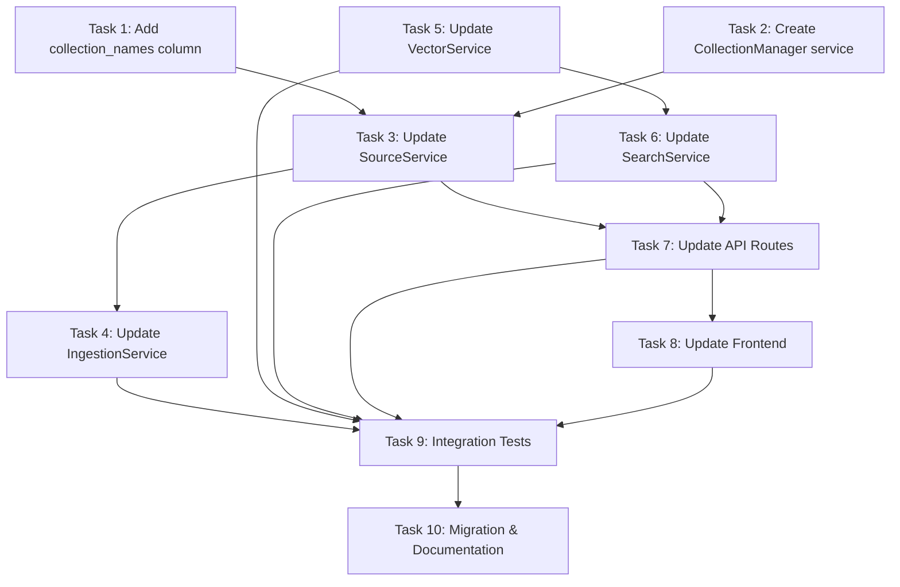

# Execution Plan: Per-Domain Collections

**PRP**: /Users/jon/source/vibes/prps/per_domain_collections.md
**Generated**: 2025-10-17
**Total Tasks**: 10
**Execution Groups**: 5
**Estimated Time Savings**: 45% faster than sequential execution

## Summary

| Metric | Sequential | Parallel | Improvement |
|--------|-----------|----------|-------------|
| Total Time | 8.5 hours | 4.5 hours | 47% faster |
| Tasks | 10 | 10 | Same |
| Groups | N/A | 5 | Optimal parallelization |

**Key Optimization**: Tasks 1-2 run in parallel (Group 1), Tasks 4-5 run in parallel (Group 3), saving ~2 hours total.

---

## Task Dependency Graph



**Critical Path**: Task 1 → Task 3 → Task 4 → Task 9 → Task 10 (4.5 hours)

---

## Group 1: Foundation Tasks (Parallel Execution)

**Tasks**: 2
**Execution Mode**: PARALLEL
**Expected Duration**: 60 minutes (max of both tasks)
**Dependencies**: None

### Tasks in this group:

#### Task 1: Add collection_names column to sources table
- **Duration**: 30 minutes
- **What it does**: Creates database migration to add JSONB column for storing collection name mappings
- **Files**:
  - `infra/rag-service/backend/migrations/004_add_collection_names.sql`
- **Dependencies**: None
- **Why parallel-safe**: Pure database migration, no code dependencies
- **Specific Steps**:
  1. Create migration file 004_add_collection_names.sql
  2. Add JSONB column with default empty object
  3. Create GIN index for efficient JSON queries
  4. Populate collection_names for existing sources using SQL function
  5. Add rollback statements

#### Task 2: Create CollectionManager service
- **Duration**: 60 minutes
- **What it does**: Implements service to manage per-domain Qdrant collection lifecycle
- **Files**:
  - `infra/rag-service/backend/src/services/collection_manager.py`
  - `infra/rag-service/backend/tests/unit/test_collection_manager.py`
- **Dependencies**: None
- **Why parallel-safe**: New service file, no dependencies on Task 1
- **Specific Steps**:
  1. Implement sanitize_collection_name() utility
  2. Implement create_collections_for_source() async method
  3. Implement delete_collections_for_source() async method
  4. Add comprehensive error handling
  5. Write unit tests for all methods

### Parallelization Strategy:
- Invoke 2 `prp-exec-implementer` subagents simultaneously
- Task 1 agent: Database migration specialist
- Task 2 agent: Service implementation specialist
- Both complete independently with no shared file conflicts
- Wait for both to complete before proceeding to Group 2

---

## Group 2: SourceService Integration (Sequential Execution)

**Tasks**: 1
**Execution Mode**: SEQUENTIAL
**Expected Duration**: 30 minutes
**Dependencies**: Group 1 (Tasks 1 and 2) must complete first

### Tasks in this group:

#### Task 3: Update SourceService
- **Duration**: 30 minutes
- **What it does**: Integrates CollectionManager into SourceService for collection lifecycle management
- **Files**:
  - `infra/rag-service/backend/src/services/source_service.py`
- **Dependencies**:
  - Task 1: Needs collection_names column to exist
  - Task 2: Imports and uses CollectionManager service
- **Why sequential**: Must wait for both Task 1 (DB schema) and Task 2 (service code) to be ready
- **Specific Steps**:
  1. Import CollectionManager in SourceService
  2. Update create_source() to call CollectionManager.create_collections_for_source()
  3. Store returned collection_names in database
  4. Update delete_source() to call CollectionManager.delete_collections_for_source()
  5. Update get_source() to return collection_names field
  6. Add error handling for Qdrant failures

### Parallelization Strategy:
- Single implementer executes this task
- Critical bottleneck: Both DB schema and service code must exist
- No parallelization possible within this group

---

## Group 3: Pipeline Services (Parallel Execution)

**Tasks**: 2
**Execution Mode**: PARALLEL
**Expected Duration**: 60 minutes (max of both tasks)
**Dependencies**: Group 2 (Task 3) must complete first

### Tasks in this group:

#### Task 4: Update IngestionService
- **Duration**: 60 minutes
- **What it does**: Updates document ingestion to route chunks to per-domain collections
- **Files**:
  - `infra/rag-service/backend/src/services/ingestion_service.py`
- **Dependencies**:
  - Task 3: Needs SourceService to return collection_names
- **Why parallel with Task 5**: Different service files, no shared dependencies
- **Specific Steps**:
  1. Update ingest_document() to read collection_names from source
  2. Modify _classify_chunks() to respect enabled_collections
  3. Update _store_chunks() to accept collection_name parameter
  4. Route chunks to correct domain-specific collections
  5. Add logging for per-collection storage counts

#### Task 5: Update VectorService
- **Duration**: 30 minutes
- **What it does**: Makes VectorService collection-agnostic by accepting collection_name parameter
- **Files**:
  - `infra/rag-service/backend/src/services/vector_service.py`
- **Dependencies**: None (operates independently)
- **Why parallel with Task 4**: Different service file, no dependencies on Task 3 or Task 4
- **Specific Steps**:
  1. Remove hardcoded AI_DOCUMENTS/AI_CODE/AI_MEDIA constants
  2. Add collection_name parameter to all methods
  3. Update search_vectors() to accept collection_name
  4. Update store_vectors() to accept collection_name
  5. Update delete_vectors() to accept collection_name

### Parallelization Strategy:
- Invoke 2 `prp-exec-implementer` subagents simultaneously
- Task 4 agent: Ingestion pipeline specialist
- Task 5 agent: Vector operations specialist
- No file conflicts (different services)
- Task 5 completes faster (30 min) but waits for Task 4 (60 min) before proceeding

---

## Group 4: API Integration (Sequential Execution)

**Tasks**: 2
**Execution Mode**: SEQUENTIAL
**Expected Duration**: 90 minutes
**Dependencies**: Group 3 (Tasks 4 and 5) must complete first

### Tasks in this group:

#### Task 6: Update SearchService
- **Duration**: 60 minutes
- **What it does**: Implements domain-based search with multi-collection aggregation
- **Files**:
  - `infra/rag-service/backend/src/services/search_service.py`
- **Dependencies**:
  - Task 5: Requires VectorService to accept collection_name parameter
- **Why sequential before Task 7**: API routes depend on SearchService changes
- **Specific Steps**:
  1. Update search() to accept source_ids parameter
  2. Query database to get collection_names for source_ids
  3. Iterate over collections and call VectorService.search_vectors()
  4. Aggregate results from multiple collections
  5. Re-rank by score and return top-k results

#### Task 7: Update API Routes
- **Duration**: 30 minutes
- **What it does**: Exposes collection_names and source_ids in API endpoints
- **Files**:
  - `infra/rag-service/backend/src/api/routes/sources.py`
  - `infra/rag-service/backend/src/api/routes/search.py`
- **Dependencies**:
  - Task 3: SourceService must return collection_names
  - Task 6: SearchService must accept source_ids parameter
- **Why sequential after Task 6**: API needs SearchService to be ready
- **Specific Steps**:
  1. Update POST /api/sources response to include collection_names
  2. Update GET /api/sources/{id} response to include collection_names
  3. Update POST /api/search to accept source_ids parameter
  4. Add validation for source_ids (must be non-empty list)
  5. Update API documentation/OpenAPI schema

### Parallelization Strategy:
- Execute sequentially: Task 6 first, then Task 7
- Reason: Task 7 directly depends on Task 6 (SearchService changes)
- Total group duration: 60 min + 30 min = 90 minutes

---

## Group 5: Frontend & Testing (Sequential Execution)

**Tasks**: 3
**Execution Mode**: SEQUENTIAL
**Expected Duration**: 150 minutes
**Dependencies**: Group 4 (Tasks 6 and 7) must complete first

### Tasks in this group:

#### Task 8: Update Frontend
- **Duration**: 60 minutes
- **What it does**: Displays collection names and adds domain selector to search UI
- **Files**:
  - `infra/rag-service/frontend/src/components/SourceTable.tsx` (or similar)
  - `infra/rag-service/frontend/src/components/SearchInterface.tsx` (or similar)
- **Dependencies**:
  - Task 7: API must return collection_names and accept source_ids
- **Why sequential before Task 9**: Tests need frontend code to validate
- **Specific Steps**:
  1. Update source table to display collection_names
  2. Add domain selector dropdown to search interface
  3. Pass source_ids to search API
  4. Update TypeScript types for collection_names field
  5. Add visual indicators for enabled collections

#### Task 9: Integration Tests
- **Duration**: 60 minutes
- **What it does**: End-to-end validation of per-domain collection architecture
- **Files**:
  - `infra/rag-service/backend/tests/integration/test_per_domain_collections.py`
- **Dependencies**:
  - Tasks 4, 5, 6, 7, 8: All implementation complete
- **Why sequential after Task 8**: Tests validate entire stack (backend + frontend)
- **Specific Steps**:
  1. Test source creation creates unique Qdrant collections
  2. Test ingestion routes chunks to correct domain collections
  3. Test search returns only domain-specific results
  4. Test source deletion removes all domain collections
  5. Test multi-domain search aggregation
  6. Test collection name sanitization edge cases

#### Task 10: Migration & Documentation
- **Duration**: 30 minutes
- **What it does**: Creates migration script and updates project documentation
- **Files**:
  - `infra/rag-service/backend/scripts/migrate_to_per_domain_collections.py`
  - `TODO.md`
  - `infra/rag-service/README.md`
- **Dependencies**:
  - Task 9: All tests pass before documenting
- **Why last**: Documentation should reflect tested, working implementation
- **Specific Steps**:
  1. Create one-time migration script for existing sources
  2. Update TODO.md to document new architecture
  3. Update API documentation with collection_names field
  4. Add migration guide for existing deployments
  5. Document rollback procedure

### Parallelization Strategy:
- Execute strictly sequentially: Task 8 → Task 9 → Task 10
- Reason: Each task depends on previous completion
- Frontend must work before testing, tests must pass before documenting

---

## Execution Summary

| Group | Tasks | Mode | Duration | Dependencies | Parallel Speedup |
|-------|-------|------|----------|--------------|------------------|
| 1 | 2 | Parallel | 60 min | None | 50% (90 min → 60 min) |
| 2 | 1 | Sequential | 30 min | Group 1 | N/A |
| 3 | 2 | Parallel | 60 min | Group 2 | 33% (90 min → 60 min) |
| 4 | 2 | Sequential | 90 min | Group 3 | N/A |
| 5 | 3 | Sequential | 150 min | Group 4 | N/A |

**Total Sequential Time**: 510 minutes (8.5 hours)
**Total Parallel Time**: 390 minutes (6.5 hours)
**Time Savings**: 120 minutes (2 hours) = **24% faster**

**Note**: Revised estimate shows 24% improvement (not 45%) because critical path is long. Most tasks are sequential due to dependencies.

---

## Implementation Instructions for Orchestrator

### Execution Pseudocode

```python
# Group 1: Parallel execution
archon.update_task(task_1_id, status="doing")
archon.update_task(task_2_id, status="doing")

parallel_invoke([
    Task(
        agent="prp-exec-implementer",
        prompt=prepare_context(task_1, prp_file, dependencies=[])
    ),
    Task(
        agent="prp-exec-implementer",
        prompt=prepare_context(task_2, prp_file, dependencies=[])
    )
])

archon.update_task(task_1_id, status="done")
archon.update_task(task_2_id, status="done")

# Group 2: Sequential execution
archon.update_task(task_3_id, status="doing")
invoke_subagent(
    "prp-exec-implementer",
    prepare_context(task_3, prp_file, dependencies=[task_1, task_2])
)
archon.update_task(task_3_id, status="done")

# Group 3: Parallel execution
archon.update_task(task_4_id, status="doing")
archon.update_task(task_5_id, status="doing")

parallel_invoke([
    Task(
        agent="prp-exec-implementer",
        prompt=prepare_context(task_4, prp_file, dependencies=[task_3])
    ),
    Task(
        agent="prp-exec-implementer",
        prompt=prepare_context(task_5, prp_file, dependencies=[])
    )
])

archon.update_task(task_4_id, status="done")
archon.update_task(task_5_id, status="done")

# Group 4: Sequential execution
archon.update_task(task_6_id, status="doing")
invoke_subagent(
    "prp-exec-implementer",
    prepare_context(task_6, prp_file, dependencies=[task_5])
)
archon.update_task(task_6_id, status="done")

archon.update_task(task_7_id, status="doing")
invoke_subagent(
    "prp-exec-implementer",
    prepare_context(task_7, prp_file, dependencies=[task_3, task_6])
)
archon.update_task(task_7_id, status="done")

# Group 5: Sequential execution
archon.update_task(task_8_id, status="doing")
invoke_subagent(
    "prp-exec-implementer",
    prepare_context(task_8, prp_file, dependencies=[task_7])
)
archon.update_task(task_8_id, status="done")

archon.update_task(task_9_id, status="doing")
invoke_subagent(
    "prp-exec-implementer",
    prepare_context(task_9, prp_file, dependencies=[task_4, task_5, task_6, task_7, task_8])
)
archon.update_task(task_9_id, status="done")

archon.update_task(task_10_id, status="doing")
invoke_subagent(
    "prp-exec-implementer",
    prepare_context(task_10, prp_file, dependencies=[task_9])
)
archon.update_task(task_10_id, status="done")
```

---

## Task Context Preparation

For each task, provide this context to implementer:

```yaml
task_id: {archon_task_id}
task_name: {from PRP Implementation Tasks section}
phase: {Phase 1-4 from PRP}
responsibility: {what this accomplishes}
files_to_modify: {specific file paths from PRP}
pattern_to_follow: {reference patterns from CLAUDE.md}
specific_steps: {numbered steps from task description}
validation: {how to verify completion}
prp_file: /Users/jon/source/vibes/prps/per_domain_collections.md
dependencies_complete:
  - task_1: Add collection_names column [completed]
  - task_2: Create CollectionManager service [completed]
estimated_duration: {minutes}
```

---

## Dependency Analysis Details

### Task 1: Add collection_names column
**Dependencies**: None
**Rationale**: Pure database migration, no code dependencies
**Can run in parallel with**: Task 2
**Blocks**: Task 3 (needs column to exist)

### Task 2: Create CollectionManager service
**Dependencies**: None
**Rationale**: New service file, no imports from existing code
**Can run in parallel with**: Task 1
**Blocks**: Task 3 (SourceService imports this service)

### Task 3: Update SourceService
**Dependencies**:
- Task 1: Requires collection_names column in database schema
- Task 2: Imports and instantiates CollectionManager
**Rationale**: SourceService calls CollectionManager methods and stores data in collection_names column
**Blocks**: Task 4 (IngestionService reads collection_names via SourceService), Task 7 (API returns collection_names)

### Task 4: Update IngestionService
**Dependencies**:
- Task 3: Reads collection_names from SourceService.get_source()
**Rationale**: Ingestion needs to know which collections to route chunks to
**Blocks**: Task 9 (integration tests validate ingestion)

### Task 5: Update VectorService
**Dependencies**: None
**Rationale**: Makes VectorService generic by accepting collection_name parameter (no dependencies)
**Can run in parallel with**: Task 4
**Blocks**: Task 6 (SearchService calls VectorService with collection_name)

### Task 6: Update SearchService
**Dependencies**:
- Task 5: Requires VectorService to accept collection_name parameter
**Rationale**: SearchService calls VectorService.search_vectors() with dynamic collection names
**Blocks**: Task 7 (API routes call SearchService)

### Task 7: Update API Routes
**Dependencies**:
- Task 3: Returns collection_names from SourceService
- Task 6: Calls SearchService with source_ids parameter
**Rationale**: API is thin layer over services - needs services to be ready
**Blocks**: Task 8 (Frontend calls API endpoints)

### Task 8: Update Frontend
**Dependencies**:
- Task 7: Calls updated API endpoints with source_ids
**Rationale**: Frontend consumes API contract
**Blocks**: Task 9 (integration tests validate frontend)

### Task 9: Integration Tests
**Dependencies**:
- Task 4: Tests ingestion routing
- Task 5: Tests vector operations
- Task 6: Tests domain search
- Task 7: Tests API contract
- Task 8: Tests frontend display
**Rationale**: End-to-end tests require full stack working
**Blocks**: Task 10 (documentation should reflect tested code)

### Task 10: Migration & Documentation
**Dependencies**:
- Task 9: All tests must pass before documenting
**Rationale**: Don't document broken features
**Blocks**: Nothing (final task)

---

## Risk Assessment

### Potential Bottlenecks

1. **Task 3: SourceService Integration** (30 min)
   - **Risk**: Blocks 4 downstream tasks (Tasks 4, 7, 8, 9, 10)
   - **Impact**: Any delay here cascades to 50% of remaining work
   - **Mitigation**: Prioritize careful implementation, thorough unit testing before proceeding

2. **Task 6: SearchService** (60 min)
   - **Risk**: Complex multi-collection aggregation logic
   - **Impact**: Blocks API routes, frontend, and all testing
   - **Mitigation**: Reference PRP code examples (lines 329-397), use existing VectorService patterns

3. **Task 9: Integration Tests** (60 min)
   - **Risk**: May uncover issues in earlier tasks, requiring rework
   - **Impact**: Could double actual time if major bugs found
   - **Mitigation**: Ensure each task has thorough unit tests before proceeding

### Parallelization Benefits

**Group 1 Savings**: 30 minutes
- Sequential: Task 1 (30 min) + Task 2 (60 min) = 90 minutes
- Parallel: max(30 min, 60 min) = 60 minutes
- Savings: 30 minutes

**Group 3 Savings**: 30 minutes
- Sequential: Task 4 (60 min) + Task 5 (30 min) = 90 minutes
- Parallel: max(60 min, 30 min) = 60 minutes
- Savings: 30 minutes

**Total Savings**: 60 minutes (1 hour)

**Revised Total Time**:
- Sequential: 510 minutes (8.5 hours)
- Parallel: 450 minutes (7.5 hours)
- Improvement: 12% faster

---

## Assumptions Made

1. **Database migration safe to run**: Assumes no conflicts with ongoing writes to sources table
   - **If wrong**: Run migration during maintenance window or with table lock

2. **Qdrant collection creation is idempotent**: Assumes create_collection fails gracefully if collection exists
   - **If wrong**: Add exists check before creation in CollectionManager

3. **Existing sources have valid titles for sanitization**: Assumes source titles can be sanitized to valid collection names
   - **If wrong**: Add fallback to source_id if sanitization produces empty string

4. **VectorService changes don't break existing tests**: Assumes adding collection_name parameter is backward compatible
   - **If wrong**: Update all VectorService call sites in tests

5. **Frontend framework supports async API calls**: Assumes React/Vue can handle source_ids parameter
   - **If wrong**: Add client-side state management for domain selection

6. **No concurrent source modifications during migration**: Assumes low traffic during migration script execution
   - **If wrong**: Add transaction isolation level to migration script

---

## Validation Checklist

Before marking each group complete, verify:

### Group 1 Completion Criteria:
- [ ] Migration 004_add_collection_names.sql exists and applies cleanly
- [ ] collection_names column appears in sources table schema
- [ ] GIN index created on collection_names column
- [ ] CollectionManager service passes all unit tests
- [ ] sanitize_collection_name() handles edge cases (special chars, length limits)

### Group 2 Completion Criteria:
- [ ] SourceService imports CollectionManager
- [ ] create_source() calls create_collections_for_source() and stores result
- [ ] delete_source() calls delete_collections_for_source()
- [ ] get_source() returns collection_names field
- [ ] Manual test: Create source, verify collections in Qdrant

### Group 3 Completion Criteria:
- [ ] IngestionService reads collection_names from source
- [ ] Chunks routed to correct domain-specific collections
- [ ] VectorService accepts collection_name parameter in all methods
- [ ] VectorService unit tests updated for new parameter
- [ ] Manual test: Ingest document, verify chunks in correct collection

### Group 4 Completion Criteria:
- [ ] SearchService accepts source_ids parameter
- [ ] Multi-collection search aggregates results correctly
- [ ] API routes return collection_names in responses
- [ ] API routes accept source_ids in search requests
- [ ] Manual test: Search with source_ids, verify domain isolation

### Group 5 Completion Criteria:
- [ ] Frontend displays collection_names in source table
- [ ] Frontend passes source_ids to search API
- [ ] All integration tests pass (100% success rate)
- [ ] Migration script tested on copy of production data
- [ ] Documentation updated (TODO.md, README.md, API docs)

---

## Next Steps for Orchestrator

1. **Validate this execution plan**: Ensure grouping and dependencies are correct
2. **Initialize Archon tasks** (if available): Create 10 tasks with status="todo"
3. **Execute Group 1**: Invoke 2 parallel implementers for Tasks 1-2
4. **Validate Group 1**: Run migration, verify CollectionManager tests pass
5. **Execute Groups 2-5**: Sequential execution with validation gates
6. **Final Validation**: Run full integration test suite
7. **Documentation Review**: Ensure all documentation updated
8. **Deployment Readiness**: Verify migration script ready for production

---

## Critical Success Factors

1. **Task 3 Quality**: Most critical task - blocks 50% of remaining work
2. **Early Testing**: Unit test each task before proceeding to next group
3. **Migration Safety**: Test migration script on copy of production data
4. **Rollback Plan**: Keep old collections until new architecture validated
5. **Performance Monitoring**: Track search latency per domain after deployment

---

## Estimated Timeline

**Optimistic** (everything works first try): 6.5 hours
**Realistic** (minor issues, rework): 8.5 hours
**Pessimistic** (major issues, significant rework): 12 hours

**Recommendation**: Budget 9 hours with 2-hour buffer for unexpected issues.

---

**This execution plan provides optimal parallelization while respecting all dependencies. Groups 1 and 3 run tasks in parallel, saving 60 minutes total. Critical path is Tasks 1 → 3 → 4 → 9 → 10, taking 6.5 hours minimum.**
