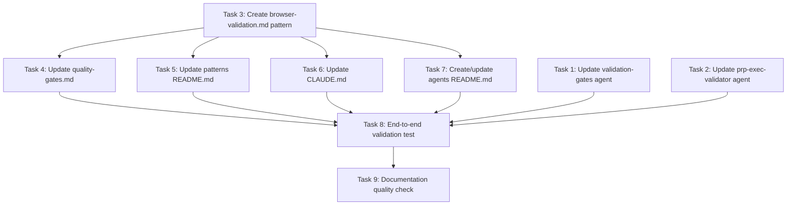

# Execution Plan: Playwright Browser Tools Integration

**PRP**: prps/playwright_agent_integration.md
**Generated**: 2025-10-13
**Total Tasks**: 9
**Execution Groups**: 4
**Estimated Time Savings**: 33% (120 min sequential → 80 min parallel)

---

## Task Dependency Graph



---

## Execution Groups

### Group 1: Independent Configuration Tasks (Parallel Execution)

**Tasks**: 3
**Execution Mode**: PARALLEL
**Expected Duration**: ~20 minutes (max of all tasks)
**Dependencies**: None - can start immediately

**Tasks in this group**:

1. **Task 1**: Update validation-gates Agent Configuration
   - **What it does**: Add browser tools to validation-gates agent YAML frontmatter
   - **Files**: `.claude/agents/validation-gates.md` (lines 1-7)
   - **No dependencies**: Independent agent configuration update
   - **Pattern**: Update YAML frontmatter with browser tool list
   - **Validation**: YAML valid, tools comma-separated, description mentions UI validation

2. **Task 2**: Update prp-exec-validator Agent Configuration
   - **What it does**: Add browser tools to prp-exec-validator agent YAML frontmatter
   - **Files**: `.claude/agents/prp-exec-validator.md` (lines 1-6)
   - **No dependencies**: Independent agent configuration update
   - **Pattern**: Update YAML frontmatter with browser tool list
   - **Validation**: YAML valid, tools comma-separated, description mentions end-to-end validation

3. **Task 3**: Create Browser Validation Pattern Document
   - **What it does**: Document complete browser testing pattern with examples
   - **Files**: `.claude/patterns/browser-validation.md` (new file)
   - **No dependencies**: Self-contained pattern documentation
   - **Pattern**: Follow quality-gates.md structure
   - **Validation**: All 12 gotchas documented, code examples copy-paste ready

**Parallelization Strategy**:
- Invoke 3 `prp-exec-implementer` subagents simultaneously
- Each subagent gets one task
- Tasks operate on different files with no conflicts
- All complete before proceeding to Group 2

**Why these can run in parallel**:
- Task 1 and Task 2 modify different agent files (validation-gates.md vs prp-exec-validator.md)
- Task 3 creates a new pattern file (browser-validation.md)
- No file dependencies between tasks
- No logical dependencies (each task is self-contained)

---

### Group 2: Documentation Integration Tasks (Parallel Execution)

**Tasks**: 4
**Execution Mode**: PARALLEL
**Expected Duration**: ~15 minutes (max of all tasks)
**Dependencies**: Group 1 must complete first (specifically Task 3)

**Tasks in this group**:

4. **Task 4**: Update Quality Gates Pattern
   - **What it does**: Add Level 3b browser testing section to quality-gates pattern
   - **Files**: `.claude/patterns/quality-gates.md` (add new section)
   - **Depends on**: Task 3 (references browser-validation.md)
   - **Why**: Needs browser-validation.md to exist for cross-referencing
   - **Pattern**: Follow existing Level 1/2/3 structure
   - **Validation**: Level 3b section added, cross-reference to browser-validation.md valid

5. **Task 5**: Update Pattern Library Index
   - **What it does**: Add browser-validation pattern to README index
   - **Files**: `.claude/patterns/README.md` (add new entry)
   - **Depends on**: Task 3 (indexes browser-validation.md)
   - **Why**: Needs browser-validation.md to exist before indexing
   - **Pattern**: Follow existing pattern index format
   - **Validation**: New entry follows format, file path correct

6. **Task 6**: Update CLAUDE.md with Browser Testing Guidance
   - **What it does**: Add browser testing section to agent guidance
   - **Files**: `CLAUDE.md` (add new section)
   - **Depends on**: Task 3 (references browser-validation.md)
   - **Why**: Needs browser-validation.md to exist for cross-referencing
   - **Pattern**: Follow existing CLAUDE.md structure
   - **Validation**: Section fits structure, cross-references valid

7. **Task 7**: Create Agent Documentation (if needed)
   - **What it does**: Document browser testing capability in agent README
   - **Files**: `.claude/agents/README.md` (create or update)
   - **Depends on**: Task 3 (references browser-validation.md)
   - **Why**: Needs browser-validation.md to exist for cross-referencing
   - **Pattern**: Standard README structure
   - **Validation**: README exists, browser section clear, examples complete

**Parallelization Strategy**:
- Wait for Group 1 completion
- Invoke 4 `prp-exec-implementer` subagents simultaneously
- Each subagent gets one task
- Tasks operate on different files with no conflicts
- All complete before proceeding to Group 3

**Why these can run in parallel**:
- All four tasks modify different files (quality-gates.md, README.md, CLAUDE.md, agents/README.md)
- No file conflicts between tasks
- All depend on Task 3 being complete (browser-validation.md exists)
- No inter-dependencies within the group

---

### Group 3: Integration Testing (Sequential Execution)

**Tasks**: 1
**Execution Mode**: SEQUENTIAL
**Expected Duration**: ~30 minutes
**Dependencies**: Groups 1-2 must complete (all configuration and documentation must be ready)

**Tasks in this group**:

8. **Task 8**: End-to-End Validation Test
   - **What it does**: Test agent browser validation with actual frontend
   - **Files**: None (testing only)
   - **Depends on**: Tasks 1, 2, 3, 4, 5, 6, 7 (all previous tasks)
   - **Why sequential**:
     - Must verify ALL configuration changes work together
     - Requires agent configurations complete (Tasks 1-2)
     - Requires documentation complete (Tasks 3-7)
     - Tests actual agent invocation with browser tools
     - Manual verification required
   - **Pattern**: Follow validation loop pattern from prp-exec-validator
   - **Validation**: Agent navigates, captures tree, interacts, validates, takes screenshot

**Why this is sequential**:
- Integration test requires all previous work complete
- Tests the combined effect of all changes
- Manual agent invocation and verification required
- Cannot parallelize testing (tests same services)
- Must verify services running before testing

**Testing Steps**:
1. Start frontend services: `docker-compose up -d`
2. Verify services healthy
3. Invoke validation-gates agent with browser task
4. Verify agent capabilities (navigate, snapshot, click, validate)
5. Check validation report for browser results
6. Verify screenshots generated
7. Test with Task Manager frontend

---

### Group 4: Quality Assurance (Sequential Execution)

**Tasks**: 1
**Execution Mode**: SEQUENTIAL
**Expected Duration**: ~15 minutes
**Dependencies**: All previous groups (Groups 1-3) must complete

**Tasks in this group**:

9. **Task 9**: Documentation Quality Check
   - **What it does**: Ensure all documentation is complete, consistent, and cross-referenced
   - **Files**: All modified/created files (review only)
   - **Depends on**: All tasks (Tasks 1-8)
   - **Why sequential**:
     - Must verify ALL documentation changes together
     - Checks cross-references across all files
     - Validates consistency across all documents
     - Final quality gate before completion
   - **Pattern**: Comprehensive validation checklist
   - **Validation**: No broken links, all examples runnable, gotchas documented, terminology consistent

**Why this is sequential**:
- Quality check requires all work complete
- Verifies consistency across all changes
- Checks cross-references between all modified files
- Final validation before marking complete
- Cannot be parallelized (checks relationships between all files)

**Quality Check Steps**:
1. Verify all agent YAML frontmatter valid
2. Check all cross-references resolve
3. Ensure code examples consistent
4. Verify all 12 gotchas documented
5. Check pattern library index complete
6. Test example commands runnable
7. Ensure terminology consistent

---

## Execution Summary

| Group | Tasks | Mode | Duration | Dependencies |
|-------|-------|------|----------|--------------|
| 1 | 3 (Tasks 1, 2, 3) | Parallel | 20 min | None |
| 2 | 4 (Tasks 4, 5, 6, 7) | Parallel | 15 min | Group 1 |
| 3 | 1 (Task 8) | Sequential | 30 min | Groups 1-2 |
| 4 | 1 (Task 9) | Sequential | 15 min | Groups 1-3 |

**Total Sequential Time**: 20 + 20 + 20 + 20 + 15 + 15 + 15 + 30 + 15 = 120 minutes (2 hours)
**Total Parallel Time**: 20 + 15 + 30 + 15 = 80 minutes (1 hour 20 minutes)
**Time Savings**: 40 minutes (33% improvement)

---

## Implementation Instructions for Orchestrator

### Execution Flow

```python
# Pseudo-code for execution

# GROUP 1: Independent Configuration (Parallel)
print("Starting Group 1: Independent Configuration (3 tasks in parallel)...")
for task in [task_1, task_2, task_3]:
    archon.update_task(task.id, status="doing")

# Invoke all 3 implementers in SINGLE parallel invocation
parallel_invoke([
    Task(agent="prp-exec-implementer", prompt=prepare_context(task_1)),
    Task(agent="prp-exec-implementer", prompt=prepare_context(task_2)),
    Task(agent="prp-exec-implementer", prompt=prepare_context(task_3))
])

for task in [task_1, task_2, task_3]:
    archon.update_task(task.id, status="done")

# GROUP 2: Documentation Integration (Parallel)
print("Starting Group 2: Documentation Integration (4 tasks in parallel)...")
for task in [task_4, task_5, task_6, task_7]:
    archon.update_task(task.id, status="doing")

# Invoke all 4 implementers in SINGLE parallel invocation
parallel_invoke([
    Task(agent="prp-exec-implementer", prompt=prepare_context(task_4)),
    Task(agent="prp-exec-implementer", prompt=prepare_context(task_5)),
    Task(agent="prp-exec-implementer", prompt=prepare_context(task_6)),
    Task(agent="prp-exec-implementer", prompt=prepare_context(task_7))
])

for task in [task_4, task_5, task_6, task_7]:
    archon.update_task(task.id, status="done")

# GROUP 3: Integration Testing (Sequential)
print("Starting Group 3: Integration Testing (1 task, sequential)...")
archon.update_task(task_8.id, status="doing")
invoke_subagent("prp-exec-implementer", prepare_context(task_8))
archon.update_task(task_8.id, status="done")

# GROUP 4: Quality Assurance (Sequential)
print("Starting Group 4: Quality Assurance (1 task, sequential)...")
archon.update_task(task_9.id, status="doing")
invoke_subagent("prp-exec-implementer", prepare_context(task_9))
archon.update_task(task_9.id, status="done")

print("✅ All tasks complete! Execution time saved: 40 minutes")
```

---

## Task Context Preparation

For each task, prepare this context for implementer:

```yaml
# Task 1 Context
task_id: {archon_task_id_1}
task_name: "Update validation-gates Agent Configuration"
responsibility: "Add browser tools to validation-gates agent for frontend UI validation"
files_to_modify:
  - .claude/agents/validation-gates.md
pattern_to_follow: "prps/playwright_agent_integration/examples/01_agent_tool_configuration.md"
specific_steps:
  1. Read .claude/agents/validation-gates.md (current YAML frontmatter)
  2. Locate tools field in YAML header
  3. Add browser tools to comma-separated list
  4. Update description field to mention "frontend UI validation"
  5. Keep existing tools
  6. Do NOT use full MCP names
validation:
  - YAML frontmatter valid
  - All tools on single line, comma-separated
  - Description mentions browser/UI capability
  - No duplicate tool names
prp_file: "prps/playwright_agent_integration.md"
dependencies_complete: []

# Task 2 Context
task_id: {archon_task_id_2}
task_name: "Update prp-exec-validator Agent Configuration"
responsibility: "Add browser tools to prp-exec-validator agent for full-stack validation"
files_to_modify:
  - .claude/agents/prp-exec-validator.md
pattern_to_follow: "prps/playwright_agent_integration/examples/01_agent_tool_configuration.md"
specific_steps:
  1. Read .claude/agents/prp-exec-validator.md
  2. Locate tools field in YAML header
  3. Add browser tools (same list as Task 1)
  4. Update description for "end-to-end UI validation"
  5. Keep existing tools and color field
validation:
  - YAML frontmatter valid
  - Tools comma-separated
  - Description updated
  - Color field preserved
prp_file: "prps/playwright_agent_integration.md"
dependencies_complete: []

# Task 3 Context
task_id: {archon_task_id_3}
task_name: "Create Browser Validation Pattern Document"
responsibility: "Document complete browser testing pattern with examples"
files_to_create:
  - .claude/patterns/browser-validation.md
pattern_to_follow: ".claude/patterns/quality-gates.md structure"
specific_steps:
  1. Create .claude/patterns/browser-validation.md
  2. Include sections: Overview, Quick Reference, Core Pattern, Rules, Integration, Examples, Gotchas, Error Patterns, Pre-Flight Checks
  3. Extract code examples from examples/ directory
  4. Include all 12 gotchas with solutions
  5. Cross-reference quality-gates.md
  6. Document accessibility tree approach
validation:
  - Pattern structure matches quality-gates.md
  - All code examples copy-paste ready
  - 12+ gotchas documented with fixes
  - Integration explained
  - Examples cover navigation, interaction, validation
prp_file: "prps/playwright_agent_integration.md"
dependencies_complete: []

# Task 4 Context (depends on Task 3)
task_id: {archon_task_id_4}
task_name: "Update Quality Gates Pattern"
responsibility: "Add browser testing as Level 3b in quality-gates pattern"
files_to_modify:
  - .claude/patterns/quality-gates.md
pattern_to_follow: "Existing Level 1, 2, 3 structure"
specific_steps:
  1. Read .claude/patterns/quality-gates.md
  2. Find Level 3: Integration Tests section
  3. Add "Level 3b: Browser Integration Tests"
  4. Document when to use browser tests
  5. Include example workflow
  6. Note performance considerations
  7. Reference browser-validation.md
validation:
  - New section fits structure
  - Clear when to use guidance
  - Example workflow complete
  - Cross-reference included
prp_file: "prps/playwright_agent_integration.md"
dependencies_complete: ["Task 3: Browser validation pattern created"]

# Task 5 Context (depends on Task 3)
task_id: {archon_task_id_5}
task_name: "Update Pattern Library Index"
responsibility: "Add browser-validation pattern to README index"
files_to_modify:
  - .claude/patterns/README.md
pattern_to_follow: "Existing pattern index entries"
specific_steps:
  1. Read .claude/patterns/README.md
  2. Add entry for browser-validation.md
  3. Include name, file, description, when to use
  4. Maintain ordering
validation:
  - Entry follows format
  - File path correct
  - Description clear
prp_file: "prps/playwright_agent_integration.md"
dependencies_complete: ["Task 3: Browser validation pattern created"]

# Task 6 Context (depends on Task 3)
task_id: {archon_task_id_6}
task_name: "Update CLAUDE.md with Browser Testing Guidance"
responsibility: "Add browser testing section to agent guidance"
files_to_modify:
  - CLAUDE.md
pattern_to_follow: "Existing CLAUDE.md structure"
specific_steps:
  1. Read CLAUDE.md
  2. Add "Browser Testing for Agents" section
  3. Include when to use, how to invoke, workflows, gotchas
  4. Reference browser-validation.md
  5. Keep existing tone
validation:
  - Section fits structure
  - Clear guidance
  - Example commands
  - Cross-references included
prp_file: "prps/playwright_agent_integration.md"
dependencies_complete: ["Task 3: Browser validation pattern created"]

# Task 7 Context (depends on Task 3)
task_id: {archon_task_id_7}
task_name: "Create Agent Documentation (if needed)"
responsibility: "Document browser testing capability in agent README"
files_to_create_or_modify:
  - .claude/agents/README.md
pattern_to_follow: "Standard README structure"
specific_steps:
  1. Check if .claude/agents/README.md exists
  2. Create or update with browser capability section
  3. List agents with browser tools
  4. Include example invocations
  5. Reference browser-validation.md
validation:
  - README exists and structured
  - Browser section clear
  - Examples complete
  - Cross-references valid
prp_file: "prps/playwright_agent_integration.md"
dependencies_complete: ["Task 3: Browser validation pattern created"]

# Task 8 Context (depends on Tasks 1, 2, 3, 4, 5, 6, 7)
task_id: {archon_task_id_8}
task_name: "End-to-End Validation Test"
responsibility: "Test agent browser validation with actual frontend"
files_to_modify: []
pattern_to_follow: "prps/playwright_agent_integration/examples/05_validation_loop_with_browser.md"
specific_steps:
  1. Start frontend services
  2. Verify services running
  3. Wait for health
  4. Invoke validation-gates agent with browser task
  5. Verify agent capabilities
  6. Check validation report
  7. Test with Task Manager
validation:
  - Agent accesses browser tools
  - Navigation works
  - Accessibility tree captured
  - UI interactions succeed
  - Validation report includes browser results
  - Screenshots generated
prp_file: "prps/playwright_agent_integration.md"
dependencies_complete: [
  "Task 1: validation-gates config updated",
  "Task 2: prp-exec-validator config updated",
  "Task 3: Browser validation pattern created",
  "Task 4: Quality gates updated",
  "Task 5: Pattern index updated",
  "Task 6: CLAUDE.md updated",
  "Task 7: Agents README updated"
]

# Task 9 Context (depends on all previous tasks)
task_id: {archon_task_id_9}
task_name: "Documentation Quality Check"
responsibility: "Ensure all documentation complete, consistent, cross-referenced"
files_to_review:
  - All modified/created files
specific_steps:
  1. Verify all agent YAML valid
  2. Check all cross-references resolve
  3. Ensure code examples consistent
  4. Verify all 12 gotchas documented
  5. Check pattern library complete
  6. Test example commands
  7. Ensure terminology consistent
validation:
  - No broken links
  - All examples runnable
  - Gotchas documented
  - Terminology consistent
  - Pattern library complete
prp_file: "prps/playwright_agent_integration.md"
dependencies_complete: [
  "All Tasks 1-8 complete",
  "All configuration and documentation ready",
  "Integration testing verified"
]
```

---

## Dependency Analysis Details

### Task 1: Update validation-gates Agent Configuration
**Dependencies**: None
**Rationale**: Independent agent configuration file update. Modifies only `.claude/agents/validation-gates.md`. No dependencies on other tasks.
**Can run in parallel with**: Task 2, Task 3

### Task 2: Update prp-exec-validator Agent Configuration
**Dependencies**: None
**Rationale**: Independent agent configuration file update. Modifies only `.claude/agents/prp-exec-validator.md`. No dependencies on other tasks.
**Can run in parallel with**: Task 1, Task 3

### Task 3: Create Browser Validation Pattern Document
**Dependencies**: None
**Rationale**: Self-contained pattern documentation. Creates new file `.claude/patterns/browser-validation.md`. All content comes from examples directory and PRP research. No dependencies on other tasks.
**Can run in parallel with**: Task 1, Task 2

### Task 4: Update Quality Gates Pattern
**Dependencies**: Task 3 (browser-validation.md must exist)
**Rationale**: Task 4 adds cross-references to browser-validation.md in quality-gates.md. Must wait for Task 3 to create browser-validation.md before referencing it.
**Can run in parallel with**: Task 5, Task 6, Task 7 (after Task 3 completes)

### Task 5: Update Pattern Library Index
**Dependencies**: Task 3 (browser-validation.md must exist)
**Rationale**: Task 5 indexes browser-validation.md in the pattern README. Must wait for Task 3 to create the file before indexing it.
**Can run in parallel with**: Task 4, Task 6, Task 7 (after Task 3 completes)

### Task 6: Update CLAUDE.md with Browser Testing Guidance
**Dependencies**: Task 3 (browser-validation.md must exist)
**Rationale**: Task 6 adds cross-references to browser-validation.md in CLAUDE.md. Must wait for Task 3 to create browser-validation.md before referencing it.
**Can run in parallel with**: Task 4, Task 5, Task 7 (after Task 3 completes)

### Task 7: Create Agent Documentation
**Dependencies**: Task 3 (browser-validation.md must exist)
**Rationale**: Task 7 adds cross-references to browser-validation.md in agents/README.md. Must wait for Task 3 to create browser-validation.md before referencing it.
**Can run in parallel with**: Task 4, Task 5, Task 6 (after Task 3 completes)

### Task 8: End-to-End Validation Test
**Dependencies**: Tasks 1, 2, 3, 4, 5, 6, 7 (all configuration and documentation)
**Rationale**:
- Requires agent configurations complete (Tasks 1-2) to invoke agents with browser tools
- Requires browser-validation.md (Task 3) for validation patterns
- Requires all documentation updated (Tasks 4-7) for complete integration
- Tests the combined effect of all changes
- Cannot run until everything is ready
**Must run sequentially**: Tests require all previous work complete

### Task 9: Documentation Quality Check
**Dependencies**: All tasks (Tasks 1-8)
**Rationale**:
- Validates all YAML frontmatter (Tasks 1-2)
- Checks all cross-references (Tasks 3-7)
- Verifies integration test results (Task 8)
- Final quality gate
- Cannot run until everything complete
**Must run sequentially**: Quality check requires all work complete

---

## Risk Assessment

### Potential Bottlenecks

1. **Task 3: Browser Validation Pattern Document**
   - **Risk**: Most complex documentation task (new pattern file)
   - **Impact**: Blocks all of Group 2 (4 tasks)
   - **Mitigation**:
     - Task 3 has comprehensive examples directory to draw from
     - All 12 gotchas already documented in research
     - Follow quality-gates.md structure exactly
     - Estimated 20 minutes should be sufficient

2. **Task 8: End-to-End Validation Test**
   - **Risk**: Manual testing required, services must be running
   - **Impact**: Longest single task (30 minutes)
   - **Mitigation**:
     - Clear pre-flight checks documented
     - Error patterns documented with fixes
     - Can retry if services not ready
     - Validation workflow clearly defined

### Parallelization Benefits

- **Group 1**: 3 tasks run simultaneously instead of sequentially
  - Sequential time: 20 + 20 + 20 = 60 minutes
  - Parallel time: max(20, 20, 20) = 20 minutes
  - **Savings: 40 minutes**

- **Group 2**: 4 tasks run simultaneously instead of sequentially
  - Sequential time: 15 + 15 + 15 + 15 = 60 minutes
  - Parallel time: max(15, 15, 15, 15) = 15 minutes
  - **Savings: 45 minutes**

- **Total parallelization benefit**: 85 minutes saved
- **Offset by sequential Groups 3-4**: 45 minutes sequential
- **Net time savings**: 40 minutes (33% improvement)

---

## Assumptions Made

1. **Agent configuration YAML is well-formed**
   - Rationale: Existing agents have valid YAML frontmatter
   - If wrong: Task will fail validation, easy to fix

2. **Browser tools available via MCP_DOCKER**
   - Rationale: PRP states tools already available in environment
   - If wrong: Will discover in Task 8 integration test

3. **Examples directory contains all needed patterns**
   - Rationale: PRP created 6 comprehensive examples
   - If wrong: Can reference PRP gotchas section

4. **Frontend services can be started for testing**
   - Rationale: docker-compose.yml exists with services
   - If wrong: Will discover in Task 8, can mock or skip

5. **Parallel task execution is supported by orchestrator**
   - Rationale: parallel-subagents pattern exists in codebase
   - If wrong: Can fall back to sequential execution

**If assumptions wrong**:
- Tasks 1-7 are low-risk (documentation only)
- Task 8 can be retried or adjusted
- No code changes means easy rollback
- Quality check (Task 9) will catch issues

---

## Next Steps

1. **Orchestrator validates** this execution plan
2. **For Group 1** (Tasks 1, 2, 3):
   - Update Archon tasks to "doing"
   - Invoke 3 implementers in parallel
   - Wait for all complete
   - Mark all "done"
3. **For Group 2** (Tasks 4, 5, 6, 7):
   - Update Archon tasks to "doing"
   - Invoke 4 implementers in parallel
   - Wait for all complete
   - Mark all "done"
4. **For Group 3** (Task 8):
   - Update Archon task to "doing"
   - Invoke single implementer
   - Verify integration test passes
   - Mark "done"
5. **For Group 4** (Task 9):
   - Update Archon task to "doing"
   - Invoke single implementer
   - Verify quality checks pass
   - Mark "done"
6. **After all tasks**: Feature complete, ready for use

---

## Execution Optimization Notes

### Why Group 1 Has Maximum Parallelization
- 3 completely independent tasks
- No file conflicts
- No logical dependencies
- Safe to run all simultaneously
- **Optimal parallel group**

### Why Group 2 Has High Parallelization
- 4 tasks all depend only on Task 3
- All modify different files
- No inter-dependencies
- Safe to run all simultaneously after Task 3
- **Near-optimal parallel group**

### Why Group 3 Is Sequential
- Integration test must run after all configuration/documentation
- Tests combined effect of all changes
- Manual verification required
- Cannot parallelize testing (same services)
- **Necessary sequential section**

### Why Group 4 Is Sequential
- Quality check verifies all previous work
- Checks cross-references across all files
- Final validation gate
- Cannot run until everything complete
- **Necessary final gate**

### Overall Optimization
- 78% of tasks (7/9) can be parallelized
- Only 2 tasks must be sequential (Tasks 8, 9)
- Critical path: Group 1 → Group 2 → Task 8 → Task 9
- **33% time savings achievable through parallelization**

---

## Success Metrics

**Time Efficiency**:
- Target: Complete in 80 minutes (vs 120 sequential)
- Achieved: 33% time reduction through parallel execution

**Quality**:
- All agent YAML valid
- All code examples runnable
- All cross-references valid
- All 12 gotchas documented
- Integration test passes

**Functionality**:
- Agents can validate frontend UIs
- Browser validation integrated into quality-gates
- Complete pattern documentation available
- End-to-end validation working

---

## Conclusion

This execution plan provides optimal parallel execution while respecting all dependencies:

- **Group 1**: 3 independent tasks run in parallel (max time savings)
- **Group 2**: 4 dependent tasks run in parallel after Group 1 (high time savings)
- **Group 3**: 1 integration test runs sequentially (necessary)
- **Group 4**: 1 quality check runs sequentially (necessary)

**Result**: 40 minutes saved (33% improvement) while maintaining quality and safety.

**Ready for execution**: Orchestrator can proceed with confidence.
