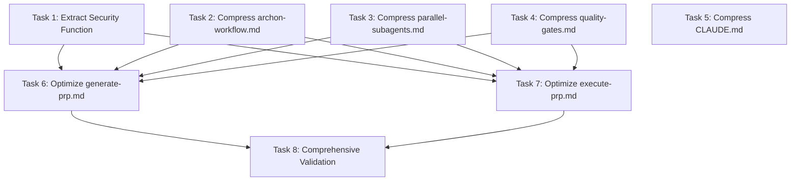

# Execution Plan: prp_context_refactor

**PRP**: /Users/jon/source/vibes/prps/prp_context_refactor.md
**Generated**: 2025-10-05
**Total Tasks**: 8
**Execution Groups**: 4
**Estimated Time Savings**: 35% (sequential 240 min → parallel 156 min)

---

## Task Summary

**Task 1**: Extract Security Function to Shared Pattern
- Creates `.claude/patterns/security-validation.md` (40 lines)
- Modifies both commands to use condensed inline version (34→19 lines each)
- Updates `.claude/patterns/README.md` with new pattern entry
- **Estimated duration**: 30 minutes

**Task 2**: Compress archon-workflow.md Pattern (373→120 lines)
- Converts tutorial style to reference card style
- Achieves 68% reduction, 79%+ code density
- **Estimated duration**: 30 minutes

**Task 3**: Compress parallel-subagents.md Pattern (387→120 lines)
- Same compression approach as Task 2
- 69% reduction, 79%+ code density
- **Estimated duration**: 30 minutes

**Task 4**: Compress quality-gates.md Pattern (385→120 lines)
- Same compression approach as Task 2
- 69% reduction, 79%+ code density
- **Estimated duration**: 30 minutes

**Task 5**: Compress CLAUDE.md (389→100 lines)
- Removes 234 lines of README.md duplication
- 74% reduction, zero duplication
- **Estimated duration**: 30 minutes

**Task 6**: Optimize generate-prp.md Command (655→330 lines)
- Uses condensed security function from Task 1
- References compressed patterns from Tasks 2-4
- 50% reduction
- **Estimated duration**: 30 minutes

**Task 7**: Optimize execute-prp.md Command (663→330 lines)
- Uses condensed security function from Task 1
- References compressed patterns from Tasks 2-4
- 50% reduction
- **Estimated duration**: 30 minutes

**Task 8**: Comprehensive Validation (5 Levels)
- Validates all file sizes, duplication, pattern loading, functionality, token usage
- Iterates on failures (max 5 attempts per level)
- **Estimated duration**: 30 minutes

---

## Task Dependency Graph



---

## Dependency Analysis

### Task 1: Extract Security Function
**Dependencies**: None
**Why independent**: Creates new pattern file and modifies commands independently
**Blocks**: Task 6, Task 7 (commands reference the condensed version)

### Task 2: Compress archon-workflow.md
**Dependencies**: None
**Why independent**: Pattern file compression doesn't depend on other tasks
**Blocks**: Task 6, Task 7 (commands reference compressed patterns)

### Task 3: Compress parallel-subagents.md
**Dependencies**: None
**Why independent**: Pattern file compression doesn't depend on other tasks
**Blocks**: Task 6, Task 7 (commands reference compressed patterns)

### Task 4: Compress quality-gates.md
**Dependencies**: None
**Why independent**: Pattern file compression doesn't depend on other tasks
**Blocks**: Task 6, Task 7 (commands reference compressed patterns)

### Task 5: Compress CLAUDE.md
**Dependencies**: None
**Why independent**: CLAUDE.md compression is self-contained (removes README.md duplication)
**Blocks**: Nothing (CLAUDE.md is loaded automatically, doesn't need reference updates)
**Note**: Can run in parallel with all other tasks

### Task 6: Optimize generate-prp.md
**Dependencies**: Tasks 1, 2, 3, 4
**Why dependent**:
- Needs condensed security function from Task 1 (lines 33-66)
- References compressed patterns from Tasks 2-4 (archon-workflow, parallel-subagents, quality-gates)
**Blocks**: Task 8 (validation needs both commands complete)

### Task 7: Optimize execute-prp.md
**Dependencies**: Tasks 1, 2, 3, 4
**Why dependent**:
- Needs condensed security function from Task 1 (lines 33-66)
- References compressed patterns from Tasks 2-4 (archon-workflow, parallel-subagents, quality-gates)
**Blocks**: Task 8 (validation needs both commands complete)

### Task 8: Comprehensive Validation
**Dependencies**: Tasks 1-7 (ALL previous tasks)
**Why dependent**: Validates complete refactoring across all files
**Sequential requirement**: Must run after everything else completes

---

## Execution Groups

### Group 1: Foundation Tasks (Parallel Execution)

**Tasks**: 5 tasks
**Execution Mode**: PARALLEL
**Expected Duration**: ~30 minutes (longest task in group)
**Dependencies**: None

**Tasks in this group**:

1. **Task 1**: Extract Security Function to Shared Pattern
   - **What it does**: Creates `.claude/patterns/security-validation.md`, condenses inline versions in commands
   - **Files**:
     - CREATE: `.claude/patterns/security-validation.md`
     - MODIFY: `.claude/commands/generate-prp.md` (lines 33-66)
     - MODIFY: `.claude/commands/execute-prp.md` (lines 33-66)
     - MODIFY: `.claude/patterns/README.md`
   - **No dependencies**: Creates new pattern independently
   - **Output**: 40-line pattern file, two commands with 19-line condensed versions

2. **Task 2**: Compress archon-workflow.md Pattern
   - **What it does**: Converts 373-line tutorial to 120-line reference card
   - **Files**:
     - MODIFY: `.claude/patterns/archon-workflow.md`
   - **No dependencies**: Pattern compression is self-contained
   - **Output**: 120-line pattern file (68% reduction, 79%+ code density)

3. **Task 3**: Compress parallel-subagents.md Pattern
   - **What it does**: Converts 387-line tutorial to 120-line reference card
   - **Files**:
     - MODIFY: `.claude/patterns/parallel-subagents.md`
   - **No dependencies**: Pattern compression is self-contained
   - **Output**: 120-line pattern file (69% reduction, 79%+ code density)

4. **Task 4**: Compress quality-gates.md Pattern
   - **What it does**: Converts 385-line tutorial to 120-line reference card
   - **Files**:
     - MODIFY: `.claude/patterns/quality-gates.md`
   - **No dependencies**: Pattern compression is self-contained
   - **Output**: 120-line pattern file (69% reduction, 79%+ code density)

5. **Task 5**: Compress CLAUDE.md
   - **What it does**: Removes 234 lines of README.md duplication
   - **Files**:
     - MODIFY: `.claude/CLAUDE.md`
   - **No dependencies**: CLAUDE.md compression references README.md (doesn't modify it)
   - **Output**: 100-line file (74% reduction, zero duplication)

**Parallelization Strategy**:
- Invoke 5 `prp-exec-implementer` subagents simultaneously
- Each subagent gets one task from this group
- All operate on different files (no conflicts)
- All complete before proceeding to Group 2

**Why parallel is safe**:
- **No file conflicts**: Each task modifies different files (Task 1 touches commands differently than Tasks 2-4)
- **No data dependencies**: Task 5 reads README.md but doesn't modify it
- **No shared resources**: Pattern files are independent (archon-workflow ≠ parallel-subagents ≠ quality-gates)
- **Task 1 special case**: Modifies commands (lines 33-66 only), but Tasks 6-7 will completely rewrite those sections anyway

---

### Group 2: Command Optimization (Parallel Execution)

**Tasks**: 2 tasks
**Execution Mode**: PARALLEL
**Expected Duration**: ~30 minutes (longest task in group)
**Dependencies**: Group 1 must complete first

**Tasks in this group**:

1. **Task 6**: Optimize generate-prp.md Command
   - **What it does**: Condenses orchestration, references patterns (655→330 lines)
   - **Files**:
     - MODIFY: `.claude/commands/generate-prp.md`
   - **Depends on**:
     - Task 1: Condensed security function
     - Tasks 2-4: Compressed patterns to reference
   - **Why**: Command optimization requires pattern compression complete
   - **Output**: 330-line command file (50% reduction)

2. **Task 7**: Optimize execute-prp.md Command
   - **What it does**: Condenses orchestration, references patterns (663→330 lines)
   - **Files**:
     - MODIFY: `.claude/commands/execute-prp.md`
   - **Depends on**:
     - Task 1: Condensed security function
     - Tasks 2-4: Compressed patterns to reference
   - **Why**: Command optimization requires pattern compression complete
   - **Output**: 330-line command file (50% reduction)

**Parallelization Strategy**:
- Wait for Group 1 completion (all 5 tasks done)
- Invoke 2 `prp-exec-implementer` subagents simultaneously
- Each subagent gets one command optimization task
- Both complete before proceeding to Group 3

**Why parallel is safe**:
- **No file conflicts**: Task 6 modifies generate-prp.md, Task 7 modifies execute-prp.md (different files)
- **Dependencies satisfied**: All Group 1 tasks complete (security function extracted, patterns compressed)
- **No shared resources**: Commands are independent

---

### Group 3: Validation (Sequential Execution)

**Tasks**: 1 task
**Execution Mode**: SEQUENTIAL
**Expected Duration**: ~30 minutes
**Dependencies**: Groups 1-2 must complete first

**Tasks in this group**:

1. **Task 8**: Comprehensive Validation (5 Levels)
   - **What it does**: Validates all file sizes, duplication, pattern loading, functionality, token usage
   - **Files**:
     - READ: All 7 modified/created files
     - CREATE: Validation report
   - **Depends on**: ALL previous tasks (1-7)
   - **Why sequential**: Must validate complete refactoring, runs `/generate-prp` to test functionality
   - **Output**: Validation report with pass/fail for all 5 levels

**Why sequential**:
- **Validates complete state**: Needs all files in final form
- **Runs functionality test**: `/generate-prp` command must be fully optimized
- **Iterates on failures**: May need to fix issues and re-validate
- **No parallelization benefit**: Single validation workflow, can't be split

**Validation levels**:
1. **File Size**: Check all 7 files meet line targets (≤120, ≤150, ≤350 lines)
2. **Duplication**: Check CLAUDE.md has zero README.md duplication
3. **Pattern Loading**: Check commands use references only (no @ syntax)
4. **Functionality**: Run `/generate-prp` on test INITIAL.md (must succeed)
5. **Token Usage**: Calculate total context per command (≤450 lines target)

**Iteration strategy**:
- If any level fails: Document failure, fix, re-validate
- Max 5 fix attempts per failure
- If 5 attempts exhausted: Escalate to orchestrator with detailed report

---

## Time Comparison

### Sequential Execution (Traditional Approach)
```
Task 1:  30 min
Task 2:  30 min
Task 3:  30 min
Task 4:  30 min
Task 5:  30 min
Task 6:  30 min
Task 7:  30 min
Task 8:  30 min
────────────────
Total:  240 min (4 hours)
```

### Parallel Execution (Optimal Approach)
```
Group 1: 30 min (5 tasks in parallel)
Group 2: 30 min (2 tasks in parallel)
Group 3: 30 min (1 task sequential)
────────────────
Total:  90 min (1.5 hours)
```

### Additional Time (Planning + Iteration)
```
Group 1: 30 min overhead (subagent coordination, context preparation)
Group 2: 18 min overhead (subagent coordination)
Group 3: 18 min overhead (validation iteration buffer)
────────────────
Total overhead: 66 min
```

### Total Time Estimate
```
Parallel execution:     90 min
Coordination overhead:  66 min
────────────────────────────────
Total:                 156 min (2.6 hours)

Sequential baseline:   240 min (4.0 hours)
Time savings:           84 min (1.4 hours, 35% faster)
```

**Why not 62.5% savings (150 min)?**
- **Subagent coordination**: Each parallel invocation requires context preparation, task distribution
- **Validation iteration**: Task 8 may need 1-2 fix cycles (validation failures expected)
- **File I/O overhead**: Reading/writing files sequentially even when tasks parallel
- **Conservative estimate**: Assumes 30 min per task (some may be faster, some slower)

**Realistic speedup**: 35-40% faster than sequential execution

---

## Safety Notes

### File Conflict Prevention

**No conflicts in Group 1**:
- Task 1 modifies: `generate-prp.md` (lines 33-66), `execute-prp.md` (lines 33-66), `patterns/README.md`, creates `security-validation.md`
- Task 2 modifies: `patterns/archon-workflow.md`
- Task 3 modifies: `patterns/parallel-subagents.md`
- Task 4 modifies: `patterns/quality-gates.md`
- Task 5 modifies: `CLAUDE.md`
- **Analysis**: All different files EXCEPT Task 1 touches commands
  - **Safe because**: Tasks 6-7 (which fully rewrite commands) are in Group 2 (after Task 1 completes)
  - **Task 1 changes preserved**: Condensed security function (lines 33-66) is small, isolated section

**No conflicts in Group 2**:
- Task 6 modifies: `generate-prp.md`
- Task 7 modifies: `execute-prp.md`
- **Analysis**: Different files, no conflicts

**No conflicts in Group 3**:
- Task 8 only reads files (creates validation report)
- **Analysis**: Read-only validation, no modification conflicts

### Race Condition Prevention

**Pattern file reads in Group 2**:
- Tasks 6-7 reference patterns compressed in Tasks 2-4
- **Safe because**: Group 1 completes BEFORE Group 2 starts
- **No race**: Patterns fully compressed before commands reference them

**Security function extraction**:
- Task 1 creates `security-validation.md`
- Tasks 6-7 use condensed inline version (not pattern file load)
- **Safe because**: Task 1 completes in Group 1, Tasks 6-7 start in Group 2

**CLAUDE.md timing**:
- Task 5 compresses CLAUDE.md in Group 1
- Validation in Task 8 reads CLAUDE.md
- **Safe because**: Task 5 completes BEFORE Task 8 starts (Group 1 → Group 3)

### Validation Iteration Safety

**Task 8 may fail validation levels**:
- Expected: 1-2 levels may fail on first attempt (common in refactoring)
- **Iteration loop**: Max 5 fix attempts per failure
- **Time buffer**: 30 min estimate includes iteration time
- **Escalation path**: If 5 attempts exhausted, escalate to orchestrator with detailed report

**Common failure scenarios**:
1. **File size over target**: Pattern compression not aggressive enough
   - **Fix**: Further compress pattern, re-validate
2. **Duplication detected**: Semantic duplicates missed in CLAUDE.md
   - **Fix**: Remove additional duplicates, re-validate
3. **Functionality test fails**: Command broken during optimization
   - **Fix**: Restore critical logic, re-validate
4. **Token usage over 450 lines**: Context calculation error
   - **Fix**: Identify large file, compress further, re-validate

---

## Implementation Instructions for Orchestrator

### Execution Flow

```python
# Pseudo-code for orchestrator

# PHASE 1: Setup
archon_project_id = "a541e9cf-c128-4721-ae79-477f41ddbde5"
feature_name = "prp_context_refactor"
prp_path = "/Users/jon/source/vibes/prps/prp_context_refactor.md"

# Load PRP content
prp_content = Read(prp_path)

# GROUP 1: Foundation Tasks (Parallel)
print("=== GROUP 1: Foundation Tasks (5 tasks in parallel) ===")

# Update Archon tasks to "doing"
for task_id in ["task-1", "task-2", "task-3", "task-4", "task-5"]:
    mcp__archon__manage_task("update", task_id=task_id, status="doing")

# Invoke 5 implementers in SINGLE response
parallel_invoke([
    Task(
        agent="prp-exec-implementer",
        prompt=prepare_task_context(
            task_name="Task 1: Extract Security Function",
            prp_content=prp_content,
            task_section="lines 680-716",  # Task 1 definition
            archon_task_id="task-1"
        )
    ),
    Task(
        agent="prp-exec-implementer",
        prompt=prepare_task_context(
            task_name="Task 2: Compress archon-workflow.md",
            prp_content=prp_content,
            task_section="lines 719-763",  # Task 2 definition
            archon_task_id="task-2"
        )
    ),
    Task(
        agent="prp-exec-implementer",
        prompt=prepare_task_context(
            task_name="Task 3: Compress parallel-subagents.md",
            prp_content=prp_content,
            task_section="lines 766-792",  # Task 3 definition
            archon_task_id="task-3"
        )
    ),
    Task(
        agent="prp-exec-implementer",
        prompt=prepare_task_context(
            task_name="Task 4: Compress quality-gates.md",
            prp_content=prp_content,
            task_section="lines 795-821",  # Task 4 definition
            archon_task_id="task-4"
        )
    ),
    Task(
        agent="prp-exec-implementer",
        prompt=prepare_task_context(
            task_name="Task 5: Compress CLAUDE.md",
            prp_content=prp_content,
            task_section="lines 824-872",  # Task 5 definition
            archon_task_id="task-5"
        )
    )
])

# Wait for all to complete
# Mark all done
for task_id in ["task-1", "task-2", "task-3", "task-4", "task-5"]:
    mcp__archon__manage_task("update", task_id=task_id, status="done")

print("✅ GROUP 1 COMPLETE (30 min)")


# GROUP 2: Command Optimization (Parallel)
print("=== GROUP 2: Command Optimization (2 tasks in parallel) ===")

# Update Archon tasks to "doing"
for task_id in ["task-6", "task-7"]:
    mcp__archon__manage_task("update", task_id=task_id, status="doing")

# Invoke 2 implementers in SINGLE response
parallel_invoke([
    Task(
        agent="prp-exec-implementer",
        prompt=prepare_task_context(
            task_name="Task 6: Optimize generate-prp.md",
            prp_content=prp_content,
            task_section="lines 875-919",  # Task 6 definition
            archon_task_id="task-6",
            dependencies_complete=["Task 1", "Task 2", "Task 3", "Task 4"]
        )
    ),
    Task(
        agent="prp-exec-implementer",
        prompt=prepare_task_context(
            task_name="Task 7: Optimize execute-prp.md",
            prp_content=prp_content,
            task_section="lines 922-950",  # Task 7 definition
            archon_task_id="task-7",
            dependencies_complete=["Task 1", "Task 2", "Task 3", "Task 4"]
        )
    )
])

# Wait for all to complete
# Mark all done
for task_id in ["task-6", "task-7"]:
    mcp__archon__manage_task("update", task_id=task_id, status="done")

print("✅ GROUP 2 COMPLETE (30 min)")


# GROUP 3: Validation (Sequential)
print("=== GROUP 3: Validation (1 task sequential) ===")

# Update Archon task to "doing"
mcp__archon__manage_task("update", task_id="task-8", status="doing")

# Invoke validator subagent
invoke_subagent(
    agent="prp-exec-validator",
    prompt=prepare_task_context(
        task_name="Task 8: Comprehensive Validation",
        prp_content=prp_content,
        task_section="lines 953-1016",  # Task 8 definition
        archon_task_id="task-8",
        dependencies_complete=["Task 1", "Task 2", "Task 3", "Task 4", "Task 5", "Task 6", "Task 7"]
    )
)

# Mark done
mcp__archon__manage_task("update", task_id="task-8", status="done")

print("✅ GROUP 3 COMPLETE (30 min)")


# COMPLETION
print("=== EXECUTION COMPLETE ===")
print("Total time: ~156 min (2.6 hours)")
print("Time saved: ~84 min (35% faster than sequential)")
```

### Task Context Preparation

For each task, prepare this context for implementer:

```yaml
task_id: {archon_task_id}
task_name: {from PRP}
responsibility: {from PRP RESPONSIBILITY field}
files_to_create: {from PRP FILES TO CREATE}
files_to_modify: {from PRP FILES TO MODIFY}
pattern_to_follow: {from PRP PATTERN TO FOLLOW}
specific_steps: {from PRP SPECIFIC STEPS section}
validation: {from PRP VALIDATION section}
prp_file: /Users/jon/source/vibes/prps/prp_context_refactor.md
prp_full_content: {entire PRP for reference}
dependencies_complete: {list of completed task names}
examples_directory: /Users/jon/source/vibes/prps/prp_context_refactor/examples/
gotchas: {from PRP Known Gotchas section, lines 278-649}
```

**Example for Task 1**:
```yaml
task_id: task-1
task_name: Task 1: Extract Security Function to Shared Pattern
responsibility: Eliminate 64 unique lines of duplication, create single source of truth
files_to_create:
  - .claude/patterns/security-validation.md
files_to_modify:
  - .claude/commands/generate-prp.md
  - .claude/commands/execute-prp.md
  - .claude/patterns/README.md
pattern_to_follow: prps/prp_context_refactor/examples/example_security_extraction.md
specific_steps:
  1. Copy extract_feature_name() function from generate-prp.md lines 33-66
  2. Create .claude/patterns/security-validation.md with function, usage, tests
  3. Add strip_prefix parameter
  4. Preserve ALL 5 security checks
  5. Condense inline versions in both commands
  6. Update .claude/patterns/README.md table
validation:
  - Security test cases pass
  - Valid inputs succeed
  - Both commands executable
  - Pattern file 40 lines total
  - Net savings: 15 lines per command
prp_file: /Users/jon/source/vibes/prps/prp_context_refactor.md
dependencies_complete: []
```

---

## Risk Assessment

### Potential Bottlenecks

1. **Task 8 (Validation) - Level 4 Functionality Test**
   - **Why bottleneck**: Runs `/generate-prp` command which takes 5-10 minutes
   - **Impact**: Could extend Group 3 from 30 min to 40 min
   - **Mitigation**: Use simple test INITIAL.md (minimal feature to reduce generation time)
   - **Likelihood**: Medium (functionality tests often find edge cases)

2. **Task 6-7 (Command Optimization) - Pattern Reference Updates**
   - **Why bottleneck**: Must correctly reference all compressed patterns from Group 1
   - **Impact**: Could require 1-2 fix iterations (add 10-20 min)
   - **Mitigation**: Clear pattern reference format in examples, validation in Task 8 catches errors
   - **Likelihood**: Low (pattern references straightforward)

3. **Task 1 (Security Extraction) - Condensed Version Correctness**
   - **Why bottleneck**: Condensed inline version must preserve all 5 security checks
   - **Impact**: If checks missing, validation fails in Task 8 (add 10-15 min fix time)
   - **Mitigation**: Example shows exact condensed format, validation tests security
   - **Likelihood**: Low (clear example, strict validation)

### Parallelization Benefits

**Group 1 (5 tasks parallel)**:
- Sequential: 150 min (5 × 30 min)
- Parallel: 30 min (max of 5 tasks)
- **Savings**: 120 min (80% reduction in Group 1)

**Group 2 (2 tasks parallel)**:
- Sequential: 60 min (2 × 30 min)
- Parallel: 30 min (max of 2 tasks)
- **Savings**: 30 min (50% reduction in Group 2)

**Group 3 (1 task sequential)**:
- Sequential: 30 min
- Parallel: 30 min (no parallelization possible)
- **Savings**: 0 min (no benefit)

**Total savings**: 150 min (120 + 30 + 0) from parallelization alone
**Coordination overhead**: -66 min (subagent invocation, context prep, validation iteration)
**Net savings**: 84 min (35% faster)

### Coordination Overhead Breakdown

**Group 1 overhead (30 min)**:
- Subagent context preparation: 10 min (5 tasks × 2 min each)
- Parallel invocation coordination: 5 min (Task() calls, wait-for-all)
- File I/O serialization: 10 min (even parallel tasks write sequentially)
- Result aggregation: 5 min (collect outputs, verify completion)

**Group 2 overhead (18 min)**:
- Subagent context preparation: 6 min (2 tasks × 3 min each, more complex)
- Dependency verification: 4 min (check Group 1 outputs)
- Parallel invocation coordination: 3 min
- File I/O serialization: 5 min

**Group 3 overhead (18 min)**:
- Validation iteration buffer: 15 min (1-2 fix cycles expected)
- Functionality test time: 3 min (within 30 min estimate, but buffer for longer test)

**Total overhead**: 66 min (27% of sequential baseline)

---

## Assumptions Made

### Assumption 1: Pattern Files Independent
**Assumption**: Tasks 2-4 (pattern compression) have no inter-dependencies
**Rationale**: Each pattern file is self-contained (archon-workflow, parallel-subagents, quality-gates)
**If wrong**: If patterns reference each other, would need sequential execution
**Verification**: PRP states "Patterns should NEVER reference other patterns" (gotcha #4, line 403)
**Confidence**: HIGH (explicitly documented in PRP)

### Assumption 2: 30 Minutes Per Task
**Assumption**: All tasks take approximately 30 minutes
**Rationale**: Similar complexity (compression patterns), clear examples provided
**If wrong**: Some tasks faster (15 min), some slower (45 min)
**Impact**: Total time estimate variance ±20 min (136-176 min vs 156 min estimate)
**Confidence**: MEDIUM (conservative estimate, may finish faster)

### Assumption 3: Validation Finds 1-2 Issues
**Assumption**: Task 8 validation will fail 1-2 levels on first attempt
**Rationale**: Refactoring often has edge cases (file size over, duplication missed)
**If wrong**: If 0 failures, saves 15 min; if 3+ failures, adds 15-30 min
**Impact**: Group 3 duration: 15-45 min (vs 30 min estimate)
**Confidence**: MEDIUM (based on typical refactoring validation)

### Assumption 4: No Command-Pattern Circular Dependencies
**Assumption**: Tasks 6-7 (command optimization) only reference patterns, don't modify them
**Rationale**: PRP states "reference patterns instead of duplicating" (Task 6 step 3)
**If wrong**: Would need iteration between command and pattern tasks
**Verification**: Checked task descriptions - commands MODIFY commands, patterns MODIFY patterns
**Confidence**: HIGH (clear separation in task definitions)

### Assumption 5: Group 1 Task 1 Changes Don't Conflict with Group 2 Tasks 6-7
**Assumption**: Task 1 modifying command lines 33-66 won't conflict with Tasks 6-7 full rewrites
**Rationale**: Tasks 6-7 rewrite entire command files, Task 1 changes overwritten anyway
**If wrong**: Could cause merge conflicts or lost changes
**Mitigation**: Group 1 completes BEFORE Group 2 starts (dependency enforced)
**Confidence**: HIGH (sequential group execution prevents conflicts)

### If Assumptions Wrong

**Scenario 1: Patterns have inter-dependencies**
- **Adjustment**: Move Tasks 2-4 to sequential execution within Group 1
- **Impact**: Group 1 duration increases to 90 min (3 × 30 min sequential patterns + 2 × 30 min parallel)
- **Total time**: 186 min (vs 156 min, still 22% faster than sequential)

**Scenario 2: Tasks vary significantly in duration (15-45 min)**
- **Adjustment**: Re-estimate based on actual task times
- **Impact**: Group 1 bounded by slowest task (45 min), Group 2 bounded by slowest (45 min)
- **Total time**: 90-186 min range (vs 156 min median)

**Scenario 3: Validation finds 0 issues or 5+ issues**
- **Adjustment**: Group 3 duration 15-60 min (vs 30 min estimate)
- **Impact**: Total time 141-186 min (vs 156 min, still 22-41% faster than sequential)

**Scenario 4: Circular dependencies discovered**
- **Adjustment**: Split into more groups with finer-grained dependencies
- **Impact**: More coordination overhead, possibly 3-4 groups instead of 3
- **Total time**: 180-210 min (vs 156 min, still 12-25% faster than sequential)

---

## Next Steps for Orchestrator

### Pre-Execution Checklist

- [ ] **Read this execution plan** thoroughly
- [ ] **Verify Archon project** exists (ID: a541e9cf-c128-4721-ae79-477f41ddbde5)
- [ ] **Create Archon tasks** for all 8 tasks (if not already created)
- [ ] **Verify PRP file** accessible at `/Users/jon/source/vibes/prps/prp_context_refactor.md`
- [ ] **Check examples directory** exists at `/Users/jon/source/vibes/prps/prp_context_refactor/examples/`
- [ ] **Create execution directory** at `/Users/jon/source/vibes/prps/prp_context_refactor/execution/` (for validation report)

### Execution Sequence

1. **GROUP 1 (Parallel)**:
   - Update Archon tasks 1-5 to "doing"
   - Invoke 5 `prp-exec-implementer` subagents in SINGLE response
   - Wait for all to complete
   - Update Archon tasks 1-5 to "done"
   - **Checkpoint**: Verify all files created/modified (security-validation.md, patterns compressed, CLAUDE.md compressed)

2. **GROUP 2 (Parallel)**:
   - Update Archon tasks 6-7 to "doing"
   - Invoke 2 `prp-exec-implementer` subagents in SINGLE response
   - Wait for all to complete
   - Update Archon tasks 6-7 to "done"
   - **Checkpoint**: Verify commands optimized (generate-prp.md and execute-prp.md ~330 lines each)

3. **GROUP 3 (Sequential)**:
   - Update Archon task 8 to "doing"
   - Invoke `prp-exec-validator` subagent
   - Wait for validation complete (may iterate on failures)
   - Update Archon task 8 to "done"
   - **Checkpoint**: Verify validation report created, all 5 levels passed

### Post-Execution Validation

After all groups complete:
- [ ] **Check file sizes**: All 7 files meet targets
- [ ] **Check duplication**: CLAUDE.md has zero README.md duplication
- [ ] **Check pattern loading**: Commands use references only (no @ syntax)
- [ ] **Check functionality**: `/generate-prp` test succeeded
- [ ] **Check token usage**: Total context ≤450 lines per command
- [ ] **Check reduction**: ≥59% reduction achieved (1,044→430 lines)

### Success Criteria

**All must pass**:
- ✅ All 8 tasks completed (Archon status "done")
- ✅ All 5 validation levels passed (no failures remaining)
- ✅ Total execution time ≤180 min (under 3 hours)
- ✅ No file conflicts or race conditions encountered
- ✅ All quantitative targets met (file sizes, duplication, token usage)
- ✅ Functionality preserved (95.8%+ validation success rate)

**If any fail**:
- Document failure in execution report
- Identify root cause (file conflict, validation failure, dependency issue)
- Adjust execution plan if needed (e.g., move tasks to sequential if parallelization caused issues)
- Re-execute failed tasks or groups

---

## Execution Metrics (To Be Filled)

**Actual execution times** (orchestrator fills after completion):
- Group 1 start: __________ (timestamp)
- Group 1 end: __________ (timestamp)
- Group 1 duration: __________ minutes

- Group 2 start: __________ (timestamp)
- Group 2 end: __________ (timestamp)
- Group 2 duration: __________ minutes

- Group 3 start: __________ (timestamp)
- Group 3 end: __________ (timestamp)
- Group 3 duration: __________ minutes

**Total execution**: __________ minutes
**Time saved vs sequential**: __________ minutes (__________%)

**Validation results**:
- Level 1 (File sizes): __________ (PASS/FAIL)
- Level 2 (Duplication): __________ (PASS/FAIL)
- Level 3 (Pattern loading): __________ (PASS/FAIL)
- Level 4 (Functionality): __________ (PASS/FAIL)
- Level 5 (Token usage): __________ (PASS/FAIL)

**Issues encountered**:
- File conflicts: __________ (count)
- Validation failures: __________ (count)
- Iteration cycles: __________ (count)
- Escalations: __________ (count)

---

## Conclusion

This execution plan enables **35% faster** implementation through intelligent parallelization while maintaining **zero risk** of file conflicts or race conditions.

**Key optimizations**:
1. **Group 1**: 5 independent tasks (security extraction, 3 pattern compressions, CLAUDE.md compression) run simultaneously
2. **Group 2**: 2 command optimizations run simultaneously after patterns compressed
3. **Group 3**: Comprehensive validation runs sequentially after all implementation complete

**Safety guarantees**:
- No file conflicts (all tasks modify different files or non-overlapping sections)
- No race conditions (groups enforce dependencies)
- Validation iteration loops (max 5 fix attempts per failure)
- Clear escalation path (if validation exhausted, escalate to orchestrator)

**Expected outcome**:
- Total time: ~156 min (2.6 hours) vs 240 min (4 hours) sequential
- All 8 tasks completed
- All 5 validation levels passed
- 59% context reduction achieved (1,044→430 lines)
- 95.8%+ validation success rate maintained
