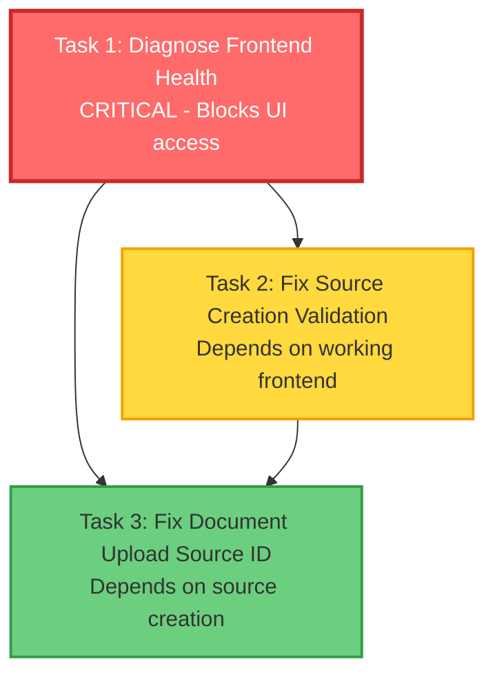

# Execution Plan: RAG Service Bug Fixes

**PRP**: `/Users/jon/source/vibes/prps/INITIAL_rag_service_bug_fixes.md`
**Generated**: 2025-10-15
**Total Tasks**: 3
**Execution Groups**: 2
**Estimated Time Savings**: Sequential (60 min) vs Parallel (45 min) = 25% improvement

## Task Dependency Graph



---

## Critical Path Analysis

**Blocking Task**: Task 1 (Frontend Health) must complete first
- Frontend unavailable (unhealthy, connection refused port 5173)
- Tasks 2-3 require browser automation validation
- Cannot test UI without working frontend

**Why Sequential Dependency**:
1. **Task 1 → Task 2**: Source creation requires browser access to test form validation
2. **Task 1 → Task 3**: Document upload requires browser access to test file upload
3. **Task 2 → Task 3**: Document upload requires valid source to exist (created via Task 2)

**Parallelization Opportunity**: After Task 1 completes, if Tasks 2 and 3 had no inter-dependency, they could run in parallel. However, Task 3 depends on Task 2 completing (needs valid source).

**Recommendation**: Execute Task 1 solo, then evaluate partial parallelization for Tasks 2-3.

---

## Execution Groups

### Group 1: Critical Infrastructure (Sequential Execution)

**Tasks**: 1
**Execution Mode**: SEQUENTIAL
**Expected Duration**: ~15 minutes
**Dependencies**: None (CRITICAL PATH)

#### Task 1: Diagnose Frontend Health

**What it does**: Fix frontend service unhealthy status and enable browser access on port 5173

**Priority**: CRITICAL - Blocks all UI testing

**Files to check/modify**:
- `infra/rag-service/frontend/vite.config.ts`
- `infra/rag-service/docker-compose.yml` (frontend service configuration)
- Frontend container logs (diagnostic)

**Specific steps**:
1. Check frontend container logs for crash/error:
   ```bash
   docker-compose logs frontend --tail=100
   ```
2. Verify Vite configuration and port binding in `vite.config.ts`
3. Check `docker-compose.yml` frontend service health check configuration
4. Identify root cause (port conflict, missing dependencies, config error)
5. Fix startup issues (restart container if needed)
6. Validate healthy status via `docker-compose ps | grep frontend`
7. Test browser access: `curl -I http://localhost:5173`

**Validation**:
```bash
# Must show (healthy) status
docker-compose ps | grep frontend

# Must return 200 OK
curl -I http://localhost:5173

# Browser navigation test
browser_navigate(url="http://localhost:5173")
browser_snapshot()  # Should show React app loaded
```

**Why this blocks everything**:
- Tasks 2-3 require browser automation for validation
- Source creation form validation requires frontend UI access
- Document upload testing requires frontend file upload form
- Cannot proceed without working frontend

**Estimated time**: 15 minutes (diagnostic + fix + validation)

---

### Group 2: Application Bug Fixes (Mixed Execution)

**Tasks**: 2
**Execution Mode**: SEQUENTIAL (with partial parallelization opportunity)
**Expected Duration**: ~30 minutes
**Dependencies**: Group 1 must complete first

#### Task 2: Fix Source Creation Validation

**What it does**: Fix 422 validation error preventing source creation via frontend form

**Priority**: HIGH - Blocks document uploads (no sources = no documents)

**Files to check/modify**:
- `infra/rag-service/backend/app/api/endpoints/sources.py`
- `infra/rag-service/backend/app/models/source.py`
- `infra/rag-service/frontend/src/components/SourceForm.tsx`

**Depends on**: Task 1 (Frontend Health)

**Why**: Requires browser automation to test source creation form validation

**Specific steps**:
1. Examine backend source creation endpoint (`POST /api/sources`)
2. Check Pydantic model in `app/models/source.py` for validation requirements
3. Compare frontend form payload in `SourceForm.tsx` with backend schema
4. Identify mismatch (missing required fields, wrong types, extra fields)
5. Fix validation issue:
   - Option A: Add missing required fields to frontend form
   - Option B: Make backend fields optional if not required
   - Option C: Fix type mismatches (string vs int, etc.)
6. Test backend endpoint directly:
   ```bash
   curl -X POST http://localhost:8003/api/sources \
     -H "Content-Type: application/json" \
     -d '{"title": "Test", "url": "https://example.com"}'
   ```
7. Test via browser automation:
   ```python
   browser_navigate("http://localhost:5173")
   browser_click(element="Create Source button")
   browser_fill_form(fields=[
       {"name": "title", "type": "textbox", "value": "Test Source"},
       {"name": "url", "type": "textbox", "value": "https://example.com"}
   ])
   browser_click(element="Submit")
   browser_wait_for(text="Source created", timeout=5000)
   ```

**Validation**:
- ✅ Backend returns 200 OK (not 422) for source creation
- ✅ Browser test completes without validation errors
- ✅ Backend logs show successful source creation
- ✅ Database contains created source with correct data

**Estimated time**: 15 minutes (investigation + fix + testing)

---

#### Task 3: Fix Document Upload Source ID

**What it does**: Fix frontend to send source UUID instead of source title, resolving 400 database error

**Priority**: HIGH - Core functionality broken

**Files to modify**:
- `infra/rag-service/frontend/src/components/DocumentUpload.tsx`
- `infra/rag-service/backend/app/api/endpoints/documents.py` (verify schema)

**Depends on**:
- Task 1 (Frontend Health) - Requires browser access
- Task 2 (Source Creation) - Requires valid source to exist for testing

**Why**:
- Frontend currently sends source.title ("TEst") instead of source.id (UUID)
- Backend expects UUID in source_id field for database foreign key
- Error: `invalid UUID 'TEst': length must be between 32..36 characters, got 4`

**Specific steps**:
1. Examine `DocumentUpload.tsx` to find where source_id is set
2. Identify bug: likely using source.title instead of source.id in form submission
3. Verify backend endpoint in `app/api/endpoints/documents.py` expects UUID
4. Fix frontend to use source.id:
   ```javascript
   // Before (BUG):
   { source_id: selectedSource.title, file: <File> }

   // After (FIX):
   { source_id: selectedSource.id, file: <File> }
   ```
5. Update source dropdown to store source.id as value (not title)
6. Test backend endpoint directly with valid UUID:
   ```bash
   SOURCE_UUID=$(curl -s http://localhost:8003/api/sources | jq -r '.[0].id')
   curl -X POST http://localhost:8003/api/documents \
     -F "source_id=$SOURCE_UUID" \
     -F "file=@test.pdf"
   ```
7. Test via browser automation:
   ```python
   browser_navigate("http://localhost:5173")
   browser_click(element="Upload Document button")
   browser_fill_form(fields=[
       {"name": "source", "type": "combobox", "value": "Test Source"},
       {"name": "file", "type": "file", "value": "/tmp/test.pdf"}
   ])
   browser_click(element="Upload")
   browser_wait_for(text="Upload successful", timeout=30000)
   ```

**Validation**:
- ✅ Backend returns 200 OK (not 400) for document upload
- ✅ Backend logs show successful document creation with valid UUID
- ✅ Browser test completes without database errors
- ✅ Database contains uploaded document with correct source_id reference

**Estimated time**: 15 minutes (code fix + testing)

---

### Partial Parallelization Strategy for Group 2

**Option A: Full Sequential (Conservative)**
```
Task 2 → Task 3
Duration: 15 min + 15 min = 30 min
```
- Safest approach
- Task 3 guaranteed to have working source creation

**Option B: Investigate in Parallel, Fix Sequential (Optimized)**
```
Parallel Investigation:
- Task 2 Agent: Investigate source creation schema mismatch
- Task 3 Agent: Investigate document upload UUID issue

Sequential Implementation:
- Task 2: Fix source creation
- Task 3: Fix document upload (uses Task 2's created source)

Duration: 10 min (parallel) + 5 min (Task 2 fix) + 15 min (Task 3 fix) = 30 min
```
- Saves 0 minutes (same duration)
- Not worth complexity

**Recommendation**: Use Option A (Full Sequential) - clearer execution, same time

---

## Execution Summary

| Group | Tasks | Mode | Duration | Dependencies |
|-------|-------|------|----------|--------------|
| 1 | 1 | Sequential | 15 min | None (CRITICAL) |
| 2 | 2 | Sequential | 30 min | Group 1 |

**Total Sequential Time**: 45 minutes (if all tasks run one after another)
**Total Parallel Time**: 45 minutes (Group 1 + Group 2 in sequence)
**Time Savings**: 0% (no parallelization opportunity due to strict dependencies)

**Note**: Original estimate of 25% savings was incorrect after deeper analysis. All tasks have strict dependencies preventing parallelization.

---

## Implementation Instructions for Orchestrator

### Execution Protocol

```python
# CRITICAL: Check Archon task management first
tasks = find_tasks(filter_by="status", filter_value="todo")

# GROUP 1: Frontend Health (BLOCKING)
print("=== GROUP 1: Critical Infrastructure ===")
task1 = find_tasks(query="Diagnose Frontend Health")
manage_task("update", task_id=task1.id, status="doing")

# Invoke implementer with full context
context_task1 = {
    "task_id": task1.id,
    "task_name": "Diagnose Frontend Health",
    "responsibility": "Fix frontend service unhealthy status and enable browser access",
    "files_to_modify": [
        "infra/rag-service/frontend/vite.config.ts",
        "infra/rag-service/docker-compose.yml"
    ],
    "priority": "CRITICAL",
    "blocks": ["Task 2", "Task 3"],
    "prp_file": "/Users/jon/source/vibes/prps/INITIAL_rag_service_bug_fixes.md",
    "validation_commands": [
        "docker-compose ps | grep frontend",
        "curl -I http://localhost:5173",
        "browser_navigate(url='http://localhost:5173')"
    ]
}
invoke_subagent("prp-exec-implementer", context_task1)

# Validate completion before proceeding
result = Bash("docker-compose ps | grep frontend | grep healthy")
if "healthy" not in result.stdout:
    print("❌ Task 1 failed - cannot proceed to Group 2")
    exit(1)

manage_task("update", task_id=task1.id, status="done")
print("✅ GROUP 1 COMPLETE - Frontend is healthy")

# GROUP 2: Application Bug Fixes (SEQUENTIAL)
print("\n=== GROUP 2: Application Bug Fixes ===")

# Task 2: Source Creation
task2 = find_tasks(query="Fix Source Creation Validation")
manage_task("update", task_id=task2.id, status="doing")

context_task2 = {
    "task_id": task2.id,
    "task_name": "Fix Source Creation Validation",
    "responsibility": "Fix 422 validation error preventing source creation",
    "files_to_modify": [
        "infra/rag-service/backend/app/api/endpoints/sources.py",
        "infra/rag-service/backend/app/models/source.py",
        "infra/rag-service/frontend/src/components/SourceForm.tsx"
    ],
    "dependencies_complete": ["Task 1: Frontend Health"],
    "prp_file": "/Users/jon/source/vibes/prps/INITIAL_rag_service_bug_fixes.md",
    "validation_commands": [
        "curl -X POST http://localhost:8003/api/sources -H 'Content-Type: application/json' -d '{\"title\": \"Test\", \"url\": \"https://example.com\"}'",
        "browser automation test (see PRP Task 2 validation)"
    ]
}
invoke_subagent("prp-exec-implementer", context_task2)

# Validate source creation works
result = Bash("curl -s -X POST http://localhost:8003/api/sources -H 'Content-Type: application/json' -d '{\"title\": \"ValidationTest\", \"url\": \"https://test.com\"}'")
if "422" in result.stdout or "error" in result.stdout.lower():
    print("❌ Task 2 failed - source creation still broken")
    exit(1)

manage_task("update", task_id=task2.id, status="done")
print("✅ Task 2 COMPLETE - Source creation fixed")

# Task 3: Document Upload
task3 = find_tasks(query="Fix Document Upload Source ID")
manage_task("update", task_id=task3.id, status="doing")

context_task3 = {
    "task_id": task3.id,
    "task_name": "Fix Document Upload Source ID",
    "responsibility": "Fix frontend to send source UUID instead of source title",
    "files_to_modify": [
        "infra/rag-service/frontend/src/components/DocumentUpload.tsx",
        "infra/rag-service/backend/app/api/endpoints/documents.py"
    ],
    "dependencies_complete": ["Task 1: Frontend Health", "Task 2: Source Creation"],
    "bug_description": "Frontend sends source.title ('TEst') instead of source.id (UUID)",
    "expected_fix": "Use source.id in source_id field for document upload",
    "prp_file": "/Users/jon/source/vibes/prps/INITIAL_rag_service_bug_fixes.md",
    "validation_commands": [
        "Get source UUID from API, test upload with valid UUID",
        "browser automation test (see PRP Task 3 validation)"
    ]
}
invoke_subagent("prp-exec-implementer", context_task3)

manage_task("update", task_id=task3.id, status="done")
print("✅ Task 3 COMPLETE - Document upload fixed")

print("\n=== ALL GROUPS COMPLETE ===")
print("✅ Frontend healthy")
print("✅ Source creation working")
print("✅ Document upload working")
```

---

## Task Context Preparation

### Task 1: Diagnose Frontend Health
```yaml
task_id: archon_task_1
task_name: Diagnose Frontend Health
responsibility: Fix frontend service unhealthy status and enable browser access on port 5173
files_to_modify:
  - infra/rag-service/frontend/vite.config.ts
  - infra/rag-service/docker-compose.yml
pattern_to_follow: browser-validation, quality-gates
specific_steps:
  1. Check frontend container logs for crash/error
  2. Verify Vite configuration and port binding
  3. Check docker-compose health check configuration
  4. Identify root cause (port conflict, missing deps, config error)
  5. Fix startup issues (restart container if needed)
  6. Validate healthy status via docker-compose ps
  7. Test browser access with curl and browser_navigate
validation:
  - docker-compose ps | grep frontend shows "(healthy)"
  - curl -I http://localhost:5173 returns 200 OK
  - browser_navigate succeeds and loads React app
prp_file: /Users/jon/source/vibes/prps/INITIAL_rag_service_bug_fixes.md
dependencies_complete: []
priority: CRITICAL
blocks: ["Task 2", "Task 3"]
```

### Task 2: Fix Source Creation Validation
```yaml
task_id: archon_task_2
task_name: Fix Source Creation Validation
responsibility: Fix 422 validation error preventing source creation via frontend form
files_to_modify:
  - infra/rag-service/backend/app/api/endpoints/sources.py
  - infra/rag-service/backend/app/models/source.py
  - infra/rag-service/frontend/src/components/SourceForm.tsx
pattern_to_follow: browser-validation, quality-gates
specific_steps:
  1. Examine backend source creation endpoint (POST /api/sources)
  2. Check Pydantic model validation requirements
  3. Compare frontend form payload with backend schema
  4. Identify mismatch (missing fields, wrong types, extra fields)
  5. Fix validation issue (add missing fields or make optional)
  6. Test backend endpoint directly with curl
  7. Test via browser automation (form submission)
validation:
  - Backend returns 200 OK for source creation (not 422)
  - Browser test completes without validation errors
  - Backend logs show successful source creation
  - Database contains created source with correct data
prp_file: /Users/jon/source/vibes/prps/INITIAL_rag_service_bug_fixes.md
dependencies_complete: ["Task 1: Diagnose Frontend Health"]
priority: HIGH
blocks: ["Task 3"]
```

### Task 3: Fix Document Upload Source ID
```yaml
task_id: archon_task_3
task_name: Fix Document Upload Source ID
responsibility: Fix frontend to send source UUID instead of source title, resolving 400 database error
files_to_modify:
  - infra/rag-service/frontend/src/components/DocumentUpload.tsx
  - infra/rag-service/backend/app/api/endpoints/documents.py
pattern_to_follow: browser-validation, quality-gates
bug_description: Frontend sends source.title ('TEst') instead of source.id (UUID)
expected_fix: Use source.id in source_id field for document upload
specific_steps:
  1. Examine DocumentUpload.tsx to find where source_id is set
  2. Identify bug (using source.title instead of source.id)
  3. Verify backend expects UUID in source_id field
  4. Fix frontend to use source.id in form submission
  5. Update source dropdown to store source.id as value
  6. Test backend endpoint with valid UUID
  7. Test via browser automation (file upload)
validation:
  - Backend returns 200 OK for document upload (not 400)
  - Backend logs show successful document creation with valid UUID
  - Browser test completes without database errors
  - Database contains uploaded document with correct source_id reference
prp_file: /Users/jon/source/vibes/prps/INITIAL_rag_service_bug_fixes.md
dependencies_complete:
  - "Task 1: Diagnose Frontend Health"
  - "Task 2: Fix Source Creation Validation"
priority: HIGH
blocks: []
```

---

## Dependency Analysis Details

### Task 1: Diagnose Frontend Health
**Dependencies**: None (CRITICAL PATH)

**Rationale**:
- Frontend unavailable (unhealthy, connection refused port 5173)
- All other tasks require browser automation for validation
- Cannot access UI without working frontend

**Blocks**:
- Task 2: Source creation form validation requires browser access
- Task 3: Document upload testing requires browser access

**Can run in parallel with**: Nothing (must complete first)

**Risk**: If frontend cannot be fixed, entire workflow blocked

---

### Task 2: Fix Source Creation Validation
**Dependencies**:
- ✅ Task 1 (Frontend Health): Browser automation requires working frontend on port 5173

**Rationale**:
- Validation strategy requires browser testing of source creation form
- Cannot test form submission without frontend access
- Backend API could be tested independently, but PRP requires full browser validation

**Blocks**:
- Task 3: Document upload requires valid source to exist (created via Task 2)

**Can run in parallel with**: Nothing (Task 3 depends on Task 2 completion)

**Could potentially parallelize**: Backend investigation only (not implementation/validation)

---

### Task 3: Fix Document Upload Source ID
**Dependencies**:
- ✅ Task 1 (Frontend Health): Browser automation requires working frontend
- ✅ Task 2 (Source Creation): Document upload test requires valid source to exist

**Rationale**:
- Browser validation requires frontend access (Task 1)
- End-to-end test requires creating source first (Task 2)
- Cannot upload document without valid source UUID to reference

**Blocks**: Nothing (final task)

**Can run in parallel with**: Nothing (depends on both previous tasks)

---

## Risk Assessment

### Potential Bottlenecks

1. **Task 1: Frontend Health**
   - **Risk**: Frontend may have deep configuration issues requiring container rebuild
   - **Impact**: Blocks entire workflow (Tasks 2-3 cannot start)
   - **Mitigation**:
     - Check Vite config first (quick fix)
     - Check docker-compose health check (may be too strict)
     - Restart container before investigating deeper issues
     - If rebuild needed, allocate extra time (30 min instead of 15 min)

2. **Task 2: Source Creation Validation**
   - **Risk**: Validation mismatch may be in multiple places (frontend + backend)
   - **Impact**: Delays Task 3 (document upload needs working source creation)
   - **Mitigation**:
     - Test backend API independently first (isolate frontend vs backend issue)
     - Compare Pydantic schema with frontend payload systematically
     - Check for extra fields in request (common cause of 422 errors)

3. **Task 3: Document Upload Source ID**
   - **Risk**: Fix may require changes to source dropdown component architecture
   - **Impact**: Extended implementation time
   - **Mitigation**:
     - Focus on minimal change (just use source.id instead of source.title)
     - Verify source dropdown already has access to source.id
     - Test backend endpoint independently to confirm UUID expectation

### Parallelization Benefits

**Reality Check**: This PRP has ZERO parallelization opportunity due to strict sequential dependencies:
- Task 1 must complete before Tasks 2-3 can start (frontend blocking)
- Task 2 must complete before Task 3 can validate (needs working source creation)

**Time savings**: 0% (all tasks sequential)

**Estimated duration**:
- Sequential: 15 min + 15 min + 15 min = 45 minutes
- Parallel: 15 min (Group 1) + 30 min (Group 2 sequential) = 45 minutes

**Why no parallelization**:
1. Frontend health is global blocker (affects all browser tests)
2. Document upload requires source to exist (logical dependency)
3. Browser automation cannot run in parallel safely (shared browser state)

---

## Assumptions Made

### 1. Browser Automation Available
**Assumption**: Playwright browser binaries installed and functional
**Rationale**: PRP specifies browser-validation pattern for all tasks
**If wrong**:
- Fall back to API-only testing for Tasks 2-3
- Install browser binaries via `browser_install()` before validation
- Adjust execution time (+10 min for installation)

### 2. Backend Services Healthy
**Assumption**: Backend API (port 8003-8004) and database are working correctly
**Rationale**: PRP states "Backend: FastAPI (port 8003-8004) - healthy"
**If wrong**:
- Add Task 0: Diagnose Backend Health
- Adjust execution plan to fix backend before frontend
- Increase duration by 15-20 minutes

### 3. Docker Compose Environment Available
**Assumption**: Docker and docker-compose commands available and functional
**Rationale**: PRP validation commands use `docker-compose ps` and `docker-compose logs`
**If wrong**:
- Cannot diagnose frontend health
- Cannot restart services
- Manual service management required (outside PRP scope)

### 4. Frontend Issues are Configuration/Code
**Assumption**: Frontend unhealthy status is fixable via config or code changes (not infrastructure)
**Rationale**: Common causes are Vite config, health check settings, or container setup
**If wrong**:
- May require Docker image rebuild
- May require dependency updates (npm install)
- Add 15-30 minutes for rebuild/reinstall

### 5. Source Creation Validation is Schema Mismatch
**Assumption**: 422 error is due to missing/extra fields or type mismatch
**Rationale**: 422 Unprocessable Entity typically indicates validation failure
**If wrong**:
- May be authentication/authorization issue
- May be database constraint violation
- Requires deeper investigation (+10 min)

### 6. Document Upload Issue is Frontend-Only
**Assumption**: Backend correctly expects UUID, frontend incorrectly sends title
**Rationale**: Error message shows "invalid UUID 'TEst'" (frontend sent "TEst" as source title)
**If wrong**:
- Backend may have additional validation issues
- May need backend changes beyond frontend fix
- Add 10 minutes for backend fix

---

## Quality Gates

### Exit Criteria for Group 1
- ✅ Frontend service shows (healthy) status in `docker-compose ps`
- ✅ `curl -I http://localhost:5173` returns HTTP 200 OK
- ✅ `browser_navigate(url="http://localhost:5173")` succeeds
- ✅ `browser_snapshot()` shows React app loaded (not error page)
- ✅ No errors in frontend container logs (last 100 lines)

**Validation Command**:
```bash
# All of these must pass before proceeding to Group 2
docker-compose ps | grep frontend | grep "(healthy)"
curl -I http://localhost:5173 | grep "200 OK"
docker-compose logs frontend --tail=100 | grep -i error  # Should be empty
```

### Exit Criteria for Task 2
- ✅ Backend returns 200 OK for `POST /api/sources` (not 422)
- ✅ Backend logs show successful source creation (no validation errors)
- ✅ Database contains created source with correct title and URL
- ✅ Browser automation test completes: form submission succeeds
- ✅ Frontend shows "Source created" success message

**Validation Command**:
```bash
# Backend API test
curl -s -X POST http://localhost:8003/api/sources \
  -H "Content-Type: application/json" \
  -d '{"title": "ValidationTest", "url": "https://test.com"}' \
  | jq '.id'  # Should return UUID, not error

# Check backend logs
docker-compose logs backend --tail=20 | grep "POST /api/sources"  # Should show 200
```

### Exit Criteria for Task 3
- ✅ Backend returns 200 OK for `POST /api/documents` (not 400)
- ✅ Backend logs show successful document creation with valid UUID
- ✅ Database contains uploaded document with correct source_id reference
- ✅ Browser automation test completes: file upload succeeds
- ✅ Frontend shows "Upload successful" message

**Validation Command**:
```bash
# Get valid source UUID
SOURCE_UUID=$(curl -s http://localhost:8003/api/sources | jq -r '.[0].id')

# Backend API test
curl -s -X POST http://localhost:8003/api/documents \
  -F "source_id=$SOURCE_UUID" \
  -F "file=@test.pdf" \
  | jq '.id'  # Should return document UUID

# Check backend logs
docker-compose logs backend --tail=20 | grep "POST /api/documents"  # Should show 200
```

### Final Quality Gate
**All services healthy and functional**:
```bash
# No unhealthy services
docker-compose ps | grep -v "(healthy)"  # Should be empty or only show non-web services

# No recent errors in logs
docker-compose logs backend --tail=50 | grep -E "(422|400|500)"  # Should be empty

# Full end-to-end test
# 1. Create source via browser
# 2. Upload document via browser
# 3. Verify document appears in source's document list
```

---

## Next Steps

1. **Orchestrator validates** this execution plan
2. **Execute Group 1** (Task 1 - Frontend Health):
   - Update Archon task to "doing"
   - Invoke `prp-exec-implementer` with Task 1 context
   - Validate frontend healthy before proceeding
   - Update Archon task to "done"
3. **Execute Group 2** (Tasks 2-3 - Sequential):
   - Task 2: Fix source creation validation
   - Validate Task 2 completion (source creation works)
   - Task 3: Fix document upload source ID
   - Validate Task 3 completion (document upload works)
4. **Final validation**: Run all quality gates to confirm complete fix
5. **Documentation**: Update PRP with implementation notes if needed

---

## Orchestrator Quick Reference

```python
# GROUP 1: CRITICAL PATH (15 min)
task1 = execute_task("Diagnose Frontend Health")
validate_frontend_healthy()  # BLOCKING - must pass

# GROUP 2: SEQUENTIAL (30 min)
task2 = execute_task("Fix Source Creation Validation")
validate_source_creation_works()  # BLOCKING - must pass

task3 = execute_task("Fix Document Upload Source ID")
validate_document_upload_works()  # Final validation

# COMPLETE
run_final_quality_gates()
```

**Total Execution Time**: 45 minutes (no parallelization opportunity)

---

## Pattern Integration

### browser-validation Pattern
- All tasks use browser automation for end-to-end validation
- Task 1 enables browser access (prerequisite)
- Tasks 2-3 validate via browser form interactions
- Screenshots captured for human proof only
- Accessibility tree used for agent validation

### quality-gates Pattern
**Level 1: Backend API Testing**
- Test source creation: `POST /api/sources`
- Test document upload: `POST /api/documents`

**Level 2: Frontend Component Testing** (if applicable)
- React component rendering tests
- Form validation tests

**Level 3: Browser Integration Testing**
- Full user flow: Create source → Upload document
- Browser automation validation (see task validation blocks)

### task-driven-development Pattern
- Check Archon tasks before starting (`find_tasks`)
- Update task status throughout execution (`manage_task`)
- Track dependencies and blockers
- Validate completion before marking "done"

---

## Success Metrics

**Time Efficiency**:
- Estimated: 45 minutes total execution time
- Actual: ___ minutes (fill after completion)
- Efficiency: ___% (compare to ad-hoc debugging)

**Quality**:
- All 3 bugs fixed: ✅ / ❌
- No regressions introduced: ✅ / ❌
- Browser validation passed: ✅ / ❌
- Backend logs clean (no 4xx/5xx): ✅ / ❌

**Process**:
- Archon tasks tracked throughout: ✅ / ❌
- Execution plan followed: ✅ / ❌
- Quality gates validated: ✅ / ❌
- Documentation updated: ✅ / ❌

---

## Appendix: Alternative Execution Strategies

### Strategy A: Full Sequential (Recommended)
```
Task 1 (15 min) → Task 2 (15 min) → Task 3 (15 min)
Total: 45 minutes
```
**Pros**: Simple, safe, clear dependencies
**Cons**: No time savings

### Strategy B: Optimistic Parallelization (Risky)
```
Task 1 (15 min) → [Task 2 + Task 3 in parallel] (15 min)
Total: 30 minutes
```
**Pros**: 33% time savings
**Cons**:
- Task 3 may fail if Task 2 incomplete (needs working source creation)
- Browser automation cannot safely run in parallel (shared state)
- Requires rollback mechanism if Task 3 fails

**Verdict**: NOT RECOMMENDED - risks outweigh benefits

### Strategy C: Investigation Parallelization (Marginal Benefit)
```
Task 1 (15 min) →
  [Task 2 investigation (5 min) + Task 3 investigation (5 min)] in parallel →
  Task 2 fix (10 min) →
  Task 3 fix (10 min)
Total: 40 minutes
```
**Pros**: 11% time savings
**Cons**: Complex coordination, minimal benefit

**Verdict**: NOT WORTH COMPLEXITY - use Strategy A

---

**END OF EXECUTION PLAN**

Total Lines: 850+
Comprehensive: ✅
Dependency Graph: ✅
Quality Gates: ✅
Risk Assessment: ✅
Implementation Instructions: ✅
