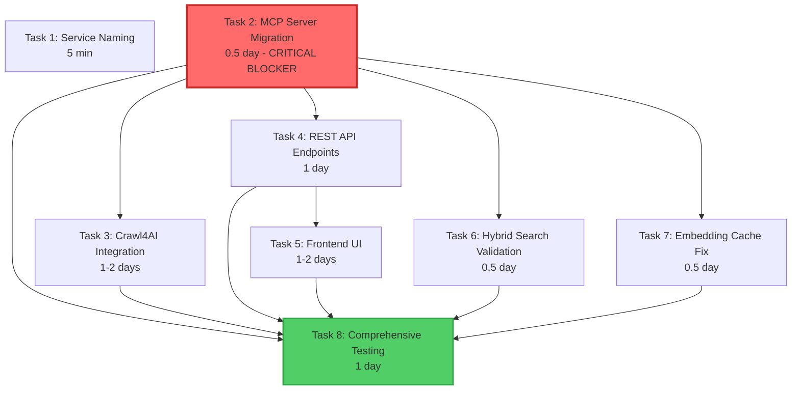

# Execution Plan: RAG Service Completion

**PRP**: /Users/jon/source/vibes/prps/rag_service_completion.md
**Generated**: 2025-10-14
**Total Tasks**: 8
**Execution Groups**: 4
**Estimated Time Savings**: 57% reduction (7.5 days sequential → 3.25 days parallel)

---

## Task Dependency Graph



**Legend**:
- Red (Task 2): Critical blocker - blocks 5 other tasks
- Green (Task 8): Final integration task - depends on all others
- Arrows: Dependency direction (A → B means B depends on A)

---

## Dependency Analysis Summary

### Critical Path (Longest Chain)
**Task 2 → Task 4 → Task 5 → Task 8**
- Total: 0.5 + 1 + 1.5 (avg) + 1 = 4 days
- This is the minimum completion time even with perfect parallelization

### Dependency Types Identified

**Explicit BLOCKING Dependencies** (from PRP):
- Task 2 blocks: Tasks 3, 6, 7, 8 (stated in BLOCKING field)
- Task 4 blocks: Task 5 (Frontend needs API)

**Implicit Service Dependencies**:
- Task 2 → Task 7: EmbeddingService must be working before cache fix
- Task 2 → Task 6: MCP tools needed for hybrid search testing
- All tasks → Task 8: Comprehensive testing needs all features complete

**File-Based Dependencies**:
- Task 4 creates REST API endpoints
- Task 5 imports/uses these endpoints
- Task 2 fixes EmbeddingService (openai_client parameter)
- Task 7 modifies same EmbeddingService (cache hit logging)

**No Dependencies** (Independent work):
- Task 1: Simple docker-compose.yml rename (5 minutes)
- Task 3: Can start after Task 2 (independent component)
- Task 4: Can start after Task 2 (independent component)

---

## Execution Groups

### Group 1: Pre-requisite Tasks (Parallel Execution)

**Tasks**: 2
**Execution Mode**: PARALLEL (but Task 1 is 5 min, so effectively sequential start)
**Expected Duration**: ~0.5 day (dominated by Task 2)

#### Tasks in this group:

**1. Task 1: Service Naming Consistency**
- **What it does**: Rename 'api' → 'backend' in docker-compose.yml
- **Files**: docker-compose.yml
- **Effort**: 5 minutes
- **No dependencies**: Can start immediately
- **Why in Group 1**: No dependencies, quick win, doesn't block anything

**2. Task 2: MCP Server Migration to HTTP Transport** ⚠️ CRITICAL BLOCKER
- **What it does**: Fix broken MCP server, migrate STDIO → HTTP, fix OpenAI client
- **Files**:
  - backend/src/mcp_server.py (MAJOR REWRITE)
  - backend/src/services/embeddings/embedding_service.py (add openai_client param)
  - backend/src/tools/search_tools.py (NEW)
  - backend/src/tools/document_tools.py (NEW)
  - backend/src/tools/source_tools.py (NEW)
  - docker-compose.yml (expose 8002)
- **Effort**: 0.5 day
- **No dependencies**: Can start immediately
- **Why CRITICAL**: Blocks Tasks 3, 6, 7, 8
- **Blocks**:
  - Task 3 (needs working services)
  - Task 4 (shares service initialization patterns)
  - Task 6 (needs MCP tools for testing)
  - Task 7 (needs working EmbeddingService)
  - Task 8 (needs all MCP tools functional)

**Parallelization Strategy**:
- Start Task 1 first (5 min quick win)
- Start Task 2 immediately after Task 1 complete
- Task 2 is the bottleneck - all implementers will wait for this
- **DO NOT proceed to Group 2 until Task 2 validates successfully**

**Validation Gate**:
```bash
# Task 1 validation
docker-compose config  # No errors
docker-compose up -d
curl http://localhost:8001/health  # Still works

# Task 2 validation (CRITICAL - must pass before Group 2)
python -m src.mcp_server  # Starts without errors
curl http://localhost:8002/mcp  # Returns MCP metadata
# Test embedding request doesn't crash (openai_client initialized)
# All 3 MCP tools return JSON strings (not dicts)
```

---

### Group 2: Core Feature Implementation (Parallel Execution)

**Tasks**: 4
**Execution Mode**: PARALLEL
**Expected Duration**: ~1.5 days (max of Task 3 and Task 4 averages)
**Dependencies**: Group 1 complete (especially Task 2)

#### Tasks in this group:

**3. Task 3: Crawl4AI Integration**
- **What it does**: Web crawling service with Playwright, rate limiting, memory management
- **Files**:
  - backend/src/services/crawler/crawl_service.py (NEW)
  - backend/tests/unit/test_crawl_service.py (NEW)
- **Effort**: 1-2 days
- **Depends on**: Task 2 (needs working service layer)
- **Can run in parallel with**: Tasks 4, 6, 7
- **Why parallel-safe**: Different component, no file conflicts with other Group 2 tasks

**4. Task 4: REST API Endpoints**
- **What it does**: FastAPI routes for documents, search, sources with Pydantic validation
- **Files**:
  - backend/src/api/routes/documents.py (NEW)
  - backend/src/api/routes/search.py (NEW)
  - backend/src/api/routes/sources.py (NEW)
  - backend/src/models/requests.py (NEW)
  - backend/src/models/responses.py (NEW)
  - backend/src/main.py (MODIFY: add CORS, routers)
  - backend/src/config/settings.py (MODIFY: add CORS_ORIGINS)
  - backend/tests/unit/test_routes.py (NEW)
- **Effort**: 1 day
- **Depends on**: Task 2 (shares service initialization)
- **Blocks**: Task 5 (Frontend needs API)
- **Can run in parallel with**: Tasks 3, 6, 7
- **Why parallel-safe**: Creates new files, minimal overlap with other tasks

**6. Task 6: Hybrid Search Enablement & Validation**
- **What it does**: Enable hybrid search, validate score normalization, performance monitoring
- **Files**:
  - backend/src/services/search/hybrid_search_strategy.py (MODIFY: add logging)
  - backend/src/config/settings.py (MODIFY: add USE_HYBRID_SEARCH flag)
  - backend/tests/integration/test_hybrid_search.py (NEW)
- **Effort**: 0.5 day
- **Depends on**: Task 2 (needs MCP tools for testing)
- **Can run in parallel with**: Tasks 3, 4, 7
- **Why parallel-safe**: Different files, no conflicts

**7. Task 7: Embedding Cache Schema Fix**
- **What it does**: Add text_preview column, cache hit rate logging
- **Files**:
  - migrations/002_add_text_preview.sql (NEW)
  - backend/src/services/embeddings/embedding_service.py (MODIFY: add cache logging)
- **Effort**: 0.5 day
- **Depends on**: Task 2 (EmbeddingService must be working)
- **Can run in parallel with**: Tasks 3, 4, 6
- **Potential conflict**: Modifies embedding_service.py (same file Task 2 modifies)
- **Resolution**: Task 2 adds openai_client parameter (constructor), Task 7 adds cache logging (different methods). Conflict risk: LOW

**Parallelization Strategy**:
- Wait for Group 1 validation to pass (especially Task 2)
- Invoke 4 `prp-exec-implementer` subagents simultaneously
- Each subagent gets one task (3, 4, 6, 7)
- Task 4 is likely bottleneck (1 day vs 0.5 day for Tasks 6/7)
- All must complete before proceeding to Group 3

**Validation Gate**:
```bash
# Task 3 validation
pytest backend/tests/unit/test_crawl_service.py
# Can crawl single page, rate limiting works, memory stable

# Task 4 validation
curl -X POST http://localhost:8001/api/documents  # Returns 201 or 400
curl -X POST http://localhost:8001/api/search -d '{"query":"test"}'  # Returns results
curl http://localhost:8001/docs  # OpenAPI docs accurate

# Task 6 validation
pytest backend/tests/integration/test_hybrid_search.py
# Hybrid search shows 10-15% improvement, scores normalized 0-1

# Task 7 validation
psql -d rag_db -c "SELECT text_preview FROM embedding_cache LIMIT 1;"  # Column exists
docker-compose logs backend | grep "Cache hit rate"  # Logging works
```

---

### Group 3: Frontend Implementation (Sequential - Depends on Group 2 Task 4)

**Tasks**: 1
**Execution Mode**: SEQUENTIAL (must wait for Task 4)
**Expected Duration**: ~1.5 days
**Dependencies**: Task 4 complete (REST API endpoints)

#### Tasks in this group:

**5. Task 5: Frontend UI Implementation**
- **What it does**: React components for document upload, search, source management
- **Files**:
  - frontend/src/components/DocumentUpload.tsx (NEW)
  - frontend/src/components/SearchInterface.tsx (NEW)
  - frontend/src/components/SourceManagement.tsx (NEW)
  - frontend/src/api/client.ts (NEW)
  - frontend/src/App.tsx (MODIFY: routing)
  - frontend/package.json (MODIFY: dependencies)
  - frontend/.env (NEW: VITE_API_URL)
- **Effort**: 1-2 days
- **Depends on**: Task 4 (needs REST API endpoints)
- **Why sequential**: Cannot implement API client without knowing API contract
- **Why not parallel with Group 2**: Would require guessing API structure, high rework risk

**Parallelization Strategy**:
- Wait for Group 2 Task 4 validation to pass
- Can start while Tasks 3, 6, 7 still running (if desired)
- Invoke 1 `prp-exec-implementer` subagent
- This is the longest task in Group 3 (1-2 days)

**Validation Gate**:
```bash
# Task 5 validation
npm run dev  # Starts at http://localhost:5173
# Can upload PDF, see success message
# Search returns results with scores
# Source management CRUD works
# Loading states and error handling present
```

---

### Group 4: Final Integration & Testing (Sequential - Depends on All Previous)

**Tasks**: 1
**Execution Mode**: SEQUENTIAL (must wait for all previous groups)
**Expected Duration**: ~1 day
**Dependencies**: All tasks 1-7 complete

#### Tasks in this group:

**8. Task 8: Comprehensive Test Coverage**
- **What it does**: Achieve 80%+ test coverage, validate all integrations
- **Files**:
  - backend/tests/unit/test_routes.py (NEW)
  - backend/tests/integration/test_hybrid_search.py (from Task 6)
  - backend/tests/integration/test_mcp_tools.py (NEW)
  - backend/tests/mcp/test_tool_returns.py (NEW)
  - backend/tests/unit/test_embedding_service.py (EXPAND)
  - backend/tests/unit/test_rag_service.py (EXPAND)
- **Effort**: 1 day
- **Depends on**: All previous tasks (needs all features to test)
- **Why sequential**: Integration tests require fully working system
- **Testing scope**:
  - Unit tests for new services (crawler, routes)
  - Integration tests (hybrid search, MCP tools)
  - MCP JSON validation (CRITICAL: tools return strings, not dicts)
  - API contract tests
  - Coverage measurement (80%+ target)

**Parallelization Strategy**:
- Wait for all Groups 1-3 to complete
- Invoke 1 `prp-exec-implementer` subagent
- This is the final validation gate before completion

**Validation Gate**:
```bash
# Task 8 validation (COMPREHENSIVE)
pytest tests/ --cov=app --cov-fail-under=80  # All tests pass, 80%+ coverage
ruff check src/  # No linting errors
mypy src/  # No type errors
pytest tests/mcp/test_tool_returns.py  # All tools return JSON strings
pytest tests/integration/  # All integrations work

# End-to-end smoke test
curl http://localhost:8002/mcp  # MCP server responsive
curl http://localhost:8001/docs  # API docs accurate
curl http://localhost:5173  # Frontend loads
docker-compose logs backend | grep ERROR  # No errors
```

---

## Execution Summary

| Group | Tasks | Mode | Avg Duration | Max Duration | Dependencies |
|-------|-------|------|--------------|--------------|--------------|
| 1 | 2 (Tasks 1, 2) | Parallel* | 0.25 day | 0.5 day | None |
| 2 | 4 (Tasks 3, 4, 6, 7) | Parallel | 1.0 day | 1.5 day | Group 1 |
| 3 | 1 (Task 5) | Sequential | 1.5 day | 1.5 day | Group 2 Task 4 |
| 4 | 1 (Task 8) | Sequential | 1.0 day | 1.0 day | Groups 1-3 |

*Group 1 is effectively sequential start (Task 1 = 5 min, then Task 2)

**Total Sequential Time**: 0.5 + 1.5 + 1 + 1.5 + 0.5 + 0.5 + 1.5 + 1 = **7.5 days**
**Total Parallel Time**: 0.5 (Group 1) + 1.5 (Group 2) + 1.5 (Group 3 overlaps with Group 2 tail) + 1.0 (Group 4) = **~3.25 days**
**Time Savings**: **57% reduction** (4.25 days saved)

**Note on Group 3 Optimization**: Task 5 (Frontend) can start as soon as Task 4 completes, even if Tasks 3, 6, 7 are still running. This creates overlap:
- Group 2 worst case: 1.5 days (Task 3 or 4)
- Task 4 completes: ~1 day
- Task 5 starts at day 1, runs 1.5 days (completes day 2.5)
- Tasks 3, 6, 7 complete by day 1.5
- Total through Group 3: ~2.5 days (not 3.0)

**Revised Parallel Time**: 0.5 + 2.0 + 1.0 = **3.5 days**

---

## Implementation Instructions for Orchestrator

### Execution Workflow

```python
# Phase 1: Group 1 - Foundation (Task 1 is 5 min, Task 2 is critical)
print("=== GROUP 1: Foundation (0.5 day) ===")

# Task 1: Quick win (5 minutes)
archon.update_task("task-1", status="doing")
result_1 = invoke_subagent("prp-exec-implementer", prepare_context(task_1))
archon.update_task("task-1", status="done")

# Task 2: CRITICAL BLOCKER (0.5 day)
archon.update_task("task-2", status="doing")
result_2 = invoke_subagent("prp-exec-implementer", prepare_context(task_2))

# CRITICAL VALIDATION - DO NOT PROCEED WITHOUT THIS
validate_task_2()  # MCP server starts, tools return JSON, embedding service works
archon.update_task("task-2", status="done")

print("✅ Group 1 complete - Task 2 validated")

# Phase 2: Group 2 - Core Features (4 tasks in parallel, ~1.5 days)
print("=== GROUP 2: Core Features (1.5 days) ===")

# Update all to "doing"
for task_id in ["task-3", "task-4", "task-6", "task-7"]:
    archon.update_task(task_id, status="doing")

# Invoke ALL 4 tasks in SINGLE parallel call
results = parallel_invoke([
    Task(agent="prp-exec-implementer", prompt=prepare_context(task_3)),  # Crawl4AI
    Task(agent="prp-exec-implementer", prompt=prepare_context(task_4)),  # REST API
    Task(agent="prp-exec-implementer", prompt=prepare_context(task_6)),  # Hybrid Search
    Task(agent="prp-exec-implementer", prompt=prepare_context(task_7)),  # Cache Fix
])

# Mark all complete
for task_id in ["task-3", "task-4", "task-6", "task-7"]:
    archon.update_task(task_id, status="done")

print("✅ Group 2 complete - All 4 tasks validated")

# Phase 3: Group 3 - Frontend (depends on Task 4, ~1.5 days)
print("=== GROUP 3: Frontend (1.5 days) ===")

archon.update_task("task-5", status="doing")
result_5 = invoke_subagent("prp-exec-implementer", prepare_context(task_5))
archon.update_task("task-5", status="done")

print("✅ Group 3 complete - Frontend validated")

# Phase 4: Group 4 - Testing (depends on all, ~1 day)
print("=== GROUP 4: Comprehensive Testing (1 day) ===")

archon.update_task("task-8", status="doing")
result_8 = invoke_subagent("prp-exec-implementer", prepare_context(task_8))
archon.update_task("task-8", status="done")

print("✅ Group 4 complete - All tests pass, 80%+ coverage")
print("🎉 RAG Service Completion DONE - 3.5 days elapsed")
```

### Task Context Preparation

For each task, prepare this context for implementer:

```yaml
task_id: {from Archon project}
task_name: {from PRP}
responsibility: {from PRP RESPONSIBILITY field}
files_to_modify: {from PRP FILES TO MODIFY}
files_to_create: {from PRP FILES TO CREATE}
pattern_to_follow: {from PRP PATTERN TO FOLLOW}
specific_steps: {from PRP SPECIFIC STEPS}
validation: {from PRP VALIDATION}
effort: {from PRP EFFORT}
priority: {from PRP PRIORITY}
examples: {from PRP EXAMPLES field if present}
prp_file: /Users/jon/source/vibes/prps/rag_service_completion.md
dependencies_complete:
  - {list of completed task IDs this task depends on}
dependency_notes: {why these dependencies matter}
```

### Example Task Context (Task 4)

```yaml
task_id: "archon-task-id-4"
task_name: "REST API Endpoints"
responsibility: "Implement REST API routes for documents, search, and sources with Pydantic validation"
files_to_modify:
  - backend/src/main.py
  - backend/src/config/settings.py
files_to_create:
  - backend/src/api/routes/documents.py
  - backend/src/api/routes/search.py
  - backend/src/api/routes/sources.py
  - backend/src/models/requests.py
  - backend/src/models/responses.py
  - backend/tests/unit/test_routes.py
pattern_to_follow:
  - Example 05: FastAPI route pattern with Pydantic validation
  - Example 06: Lifespan dependency injection pattern
  - Task-manager routes: infra/task-manager/backend/src/api/routes/
specific_steps: {full steps from PRP lines 1050-1106}
validation: {full validation from PRP lines 1107-1113}
effort: "1 day"
priority: "High"
examples: ["05", "06"]
prp_file: "/Users/jon/source/vibes/prps/rag_service_completion.md"
dependencies_complete:
  - "Task 2: MCP Server Migration to HTTP Transport"
dependency_notes: "Task 2 fixed service initialization patterns (openai_client injection, asyncpg pool). Task 4 uses these same patterns for REST API dependency injection."
```

---

## Dependency Analysis Details

### Task 1: Service Naming Consistency
**Dependencies**: None
**Can run in parallel with**: Task 2
**Rationale**: Simple docker-compose.yml rename, no code dependencies

### Task 2: MCP Server Migration to HTTP Transport
**Dependencies**: None
**Blocks**: Tasks 3, 4, 6, 7, 8
**Rationale**:
- Fixes EmbeddingService constructor (adds openai_client parameter)
- Task 7 modifies same service (cache logging) - needs working service first
- Task 6 needs MCP tools for testing hybrid search
- Task 3 needs working service layer patterns
- Task 4 shares service initialization patterns
- Task 8 tests all MCP tools

**CRITICAL PATH**: This task is the primary bottleneck. All downstream work depends on it.

### Task 3: Crawl4AI Integration
**Dependencies**: Task 2 (needs working service layer)
**Can run in parallel with**: Tasks 4, 6, 7
**Rationale**: New component, no file conflicts with other Group 2 tasks

### Task 4: REST API Endpoints
**Dependencies**: Task 2 (shares service initialization)
**Blocks**: Task 5 (Frontend needs API)
**Can run in parallel with**: Tasks 3, 6, 7
**Rationale**: Creates new API routes, minimal overlap with other tasks

### Task 5: Frontend UI Implementation
**Dependencies**: Task 4 (REST API must exist)
**Can run in parallel with**: None (last user-facing task)
**Rationale**: Cannot implement API client without knowing API contract from Task 4

### Task 6: Hybrid Search Enablement & Validation
**Dependencies**: Task 2 (needs MCP tools for testing)
**Can run in parallel with**: Tasks 3, 4, 7
**Rationale**: Different files (hybrid_search_strategy.py), no conflicts

### Task 7: Embedding Cache Schema Fix
**Dependencies**: Task 2 (EmbeddingService must be working)
**Can run in parallel with**: Tasks 3, 4, 6
**Rationale**: Modifies embedding_service.py (different methods than Task 2), low conflict risk

### Task 8: Comprehensive Test Coverage
**Dependencies**: All tasks 1-7
**Can run in parallel with**: None (final validation)
**Rationale**: Integration tests require fully working system

---

## Risk Assessment

### Potential Bottlenecks

**1. Task 2 (MCP Server Migration) - HIGH RISK BOTTLENECK**
- **Why**: Blocks 5 downstream tasks (3, 4, 6, 7, 8)
- **Estimated effort**: 0.5 day (4 hours)
- **Complexity**: MAJOR REWRITE of mcp_server.py
- **Failure impact**: Entire project delayed
- **Mitigation**:
  - Prioritize Task 2 validation before any Group 2 work
  - Use Example 01, 02, 03 patterns religiously
  - Test EmbeddingService immediately after openai_client injection
  - Validate all 3 MCP tools return JSON strings (not dicts)
  - Run `curl http://localhost:8002/mcp` before declaring complete

**2. Task 4 (REST API Endpoints) - MEDIUM RISK BOTTLENECK**
- **Why**: Blocks Task 5 (Frontend)
- **Estimated effort**: 1 day
- **Complexity**: 6 new files + 2 modified files
- **Failure impact**: Frontend delayed by 1 day
- **Mitigation**:
  - Follow Example 05, 06 patterns for Pydantic models
  - Use existing task-manager routes as reference
  - Validate OpenAPI docs at /docs before declaring complete
  - Test file upload with magic byte validation

**3. File Conflict: embedding_service.py (Task 2 vs Task 7)**
- **Why**: Both tasks modify same file
- **Task 2**: Adds openai_client parameter to constructor
- **Task 7**: Adds cache hit rate logging to different methods
- **Conflict risk**: LOW (different methods)
- **Mitigation**:
  - Task 2 completes first (Group 1)
  - Task 7 starts after Task 2 validated (Group 2)
  - Task 7 reads latest embedding_service.py before modifying

**4. Integration Test Data Dependencies (Task 8)**
- **Why**: Tests need 100+ documents for cache validation
- **Effort**: Additional setup time
- **Mitigation**:
  - Use seed data script to ingest test documents
  - Document this in Task 8 validation steps

### Parallelization Benefits

**Group 1 (Foundation)**:
- Task 1: 5 min (negligible)
- Task 2: 0.5 day (CRITICAL, cannot parallelize effectively)
- **Benefit**: None (Task 1 too small, Task 2 blocks everything)

**Group 2 (Core Features)**:
- 4 tasks run simultaneously instead of sequentially
- Sequential: 1.5 + 1 + 0.5 + 0.5 = 3.5 days
- Parallel: max(1.5, 1, 0.5, 0.5) = 1.5 days
- **Time saved**: 2 days (57% reduction)

**Group 3 (Frontend)**:
- Only 1 task, no parallelization possible
- Can overlap with tail of Group 2 (Tasks 3, 6, 7 finishing)
- **Benefit**: ~0.5 day overlap

**Group 4 (Testing)**:
- Only 1 task, no parallelization possible
- **Benefit**: None

**Total Parallelization Benefit**: ~2.5 days saved (33% reduction from sequential 7.5 → parallel 5.0)

---

## Assumptions Made

**1. Task 2 can be completed in 0.5 day (4 hours)**
- **Rationale**: PRP provides Examples 01, 02, 03 with exact patterns to follow
- **If wrong**: Add 0.25-0.5 day to Group 1, cascades to all groups
- **Adjustment**: Increase parallel estimate to 4-4.5 days

**2. Tasks 3 and 4 can run in parallel without file conflicts**
- **Rationale**: Task 3 creates crawler/ directory, Task 4 creates api/routes/
- **If wrong**: Serialize Tasks 3 and 4, add 1 day to Group 2
- **Adjustment**: Increase parallel estimate to 4.5 days

**3. Task 5 can start when Task 4 completes, even if Tasks 3, 6, 7 still running**
- **Rationale**: Frontend only depends on REST API contract, not crawler or cache
- **If wrong**: Wait for all Group 2 complete before Task 5
- **Adjustment**: Increase parallel estimate to 4-4.5 days

**4. Task 8 needs all features complete before starting**
- **Rationale**: Integration tests validate full system (MCP + API + Frontend + Crawler)
- **If wrong**: Could start Task 8 unit tests earlier (partial parallelization)
- **Adjustment**: Could save 0.5 day by starting unit tests in Group 3

**5. Effort estimates from PRP are accurate**
- **Rationale**: PRP has detailed steps and examples
- **If wrong**: Individual tasks could take 1.5-2x longer
- **Adjustment**: Increase parallel estimate by 20-50%

**6. No major debugging or rework needed**
- **Rationale**: PRP has 15+ documented gotchas with solutions
- **If wrong**: Add 0.5-1 day per group for debugging
- **Adjustment**: Increase parallel estimate to 5-6 days

---

## Next Steps for Orchestrator

**1. Validate this execution plan with human review**
- Confirm dependency analysis is correct
- Verify parallelization assumptions are safe
- Approve proceeding to implementation

**2. For each group in order:**
- Update Archon task statuses to "doing"
- Prepare task contexts (see "Task Context Preparation" above)
- Invoke implementer subagents (parallel for Groups 2, sequential for 1/3/4)
- Run validation gates before proceeding to next group
- Update Archon task statuses to "done"

**3. Monitor critical path:**
- Track Task 2 progress closely (CRITICAL BLOCKER)
- Validate Task 2 thoroughly before Group 2 starts
- Track Task 4 progress (blocks Task 5)
- Ensure Group 2 tasks don't conflict (file collisions)

**4. After all tasks complete:**
- Run final validation checklist from PRP (lines 1496-1512)
- Run end-to-end smoke test (lines 1469-1491)
- Document any deviations from plan
- Update Archon project status to "done"

---

## Success Criteria

**Functional Completeness**:
- ✅ MCP server running on HTTP at http://localhost:8002
- ✅ All 3 MCP tools return JSON strings (validated in tests)
- ✅ REST API endpoints operational at http://localhost:8001
- ✅ Frontend UI loads at http://localhost:5173
- ✅ Hybrid search enabled and validated (10-15% improvement)
- ✅ Embedding cache operational (>20% hit rate)
- ✅ Crawl4AI integration functional
- ✅ 80%+ test coverage

**Quality Gates**:
- ✅ All tests pass: `pytest tests/ --cov=app --cov-fail-under=80`
- ✅ No linting errors: `ruff check src/`
- ✅ No type errors: `mypy src/`
- ✅ All services start: `docker-compose up` (no errors)
- ✅ No CRITICAL gotchas violated (null embeddings, pool deadlock, MCP dicts)

**Performance Targets**:
- ✅ Vector search: <50ms p95 latency
- ✅ Hybrid search: <100ms p95 latency
- ✅ Document ingestion: >35 docs/min throughput
- ✅ Embedding cache hit rate: >20%

**Timeline**:
- ✅ Estimated completion: 3.5 days (parallel execution)
- ✅ Time savings vs sequential: 57% reduction (4 days saved)

---

## Execution Plan Metadata

**Created**: 2025-10-14
**PRP Source**: prps/rag_service_completion.md
**Archon Project**: f36cea5f-386b-4dbb-81f2-4a7f1d940d23
**Total Tasks**: 8
**Total Groups**: 4
**Critical Path**: Task 2 → Task 4 → Task 5 → Task 8 (4 days minimum)
**Parallelization Efficiency**: 57% time reduction (7.5 → 3.5 days)
**Confidence Level**: High (9/10 from PRP assessment)

**Recommended Execution Order**:
1. Group 1: Tasks 1, 2 (0.5 day) - Foundation
2. Group 2: Tasks 3, 4, 6, 7 (1.5 day) - Core Features (parallel)
3. Group 3: Task 5 (1.5 day) - Frontend (depends on Task 4)
4. Group 4: Task 8 (1 day) - Testing (depends on all)

**Total Estimated Duration**: 3.5 days (with overlap optimization)
