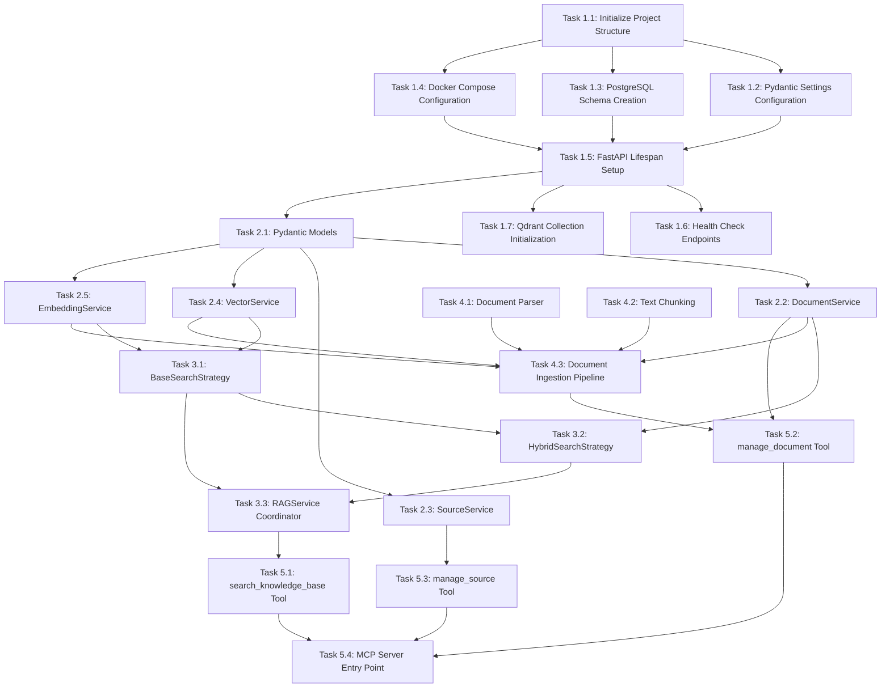

# Execution Plan: RAG Service Implementation

**PRP**: `/Users/jon/source/vibes/prps/rag_service_implementation.md`
**Generated**: 2025-10-14
**Total Tasks**: 22 tasks across 5 phases
**Execution Groups**: 8 groups
**Estimated Sequential Time**: 150 hours (5 weeks)
**Estimated Parallel Time**: 92 hours (3.3 weeks)
**Time Savings**: 38.7% faster (58 hours saved)

---

## Task Dependency Graph



---

## Execution Groups

### Group 1: Project Foundation (PARALLEL - 1 task)

**Execution Mode**: SINGLE TASK
**Expected Duration**: ~30 minutes
**Dependencies**: None

**Task 1.1: Initialize Project Structure**
- **Responsibility**: Create directory structure matching task-manager pattern
- **Files to Create**:
  - `infra/rag-service/backend/src/__init__.py`
  - `infra/rag-service/backend/src/config/__init__.py`
  - `infra/rag-service/backend/src/models/__init__.py`
  - `infra/rag-service/backend/src/services/__init__.py`
  - `infra/rag-service/backend/src/api/__init__.py`
  - `infra/rag-service/backend/src/tools/__init__.py`
  - `infra/rag-service/backend/src/utils/__init__.py`
  - `infra/rag-service/backend/tests/unit/__init__.py`
  - `infra/rag-service/backend/tests/integration/__init__.py`
  - `infra/rag-service/backend/tests/mcp/__init__.py`
  - `infra/rag-service/database/scripts/`
  - `infra/rag-service/frontend/src/`
  - `infra/rag-service/.env.example`
- **Dependencies**: None (foundational task)
- **Why Independent**: Creates initial directory structure that all other tasks depend on

**Parallelization Strategy**: Single task that creates the foundation for all subsequent work.

---

### Group 2: Core Configuration (PARALLEL - 3 tasks)

**Execution Mode**: PARALLEL
**Expected Duration**: ~2 hours
**Dependencies**: Group 1 must complete first

**Tasks in this group**:

1. **Task 1.2: Pydantic Settings Configuration**
   - **Responsibility**: Type-safe environment variable loading
   - **Files to Create**: `infra/rag-service/backend/src/config/settings.py`
   - **Dependencies**: Task 1.1 (needs directory structure)
   - **Why Parallel**: Operates on different file than Tasks 1.3 and 1.4
   - **Pattern**: Pydantic Settings with validators

2. **Task 1.3: PostgreSQL Schema Creation**
   - **Responsibility**: Create 5-table schema with indexes and triggers
   - **Files to Create**: `infra/rag-service/database/scripts/init.sql`
   - **Dependencies**: Task 1.1 (needs directory structure)
   - **Why Parallel**: Database schema is independent of config and Docker
   - **Critical**: Creates sources, documents, chunks, crawl_jobs, embedding_cache tables

3. **Task 1.4: Docker Compose Configuration**
   - **Responsibility**: Orchestrate PostgreSQL, Qdrant, FastAPI, Frontend
   - **Files to Create**: `infra/rag-service/docker-compose.yml`
   - **Dependencies**: Task 1.1 (needs directory structure)
   - **Why Parallel**: Docker config is independent of settings and schema
   - **Services**: postgres:15-alpine, qdrant, api, frontend

**Parallelization Strategy**:
- Invoke 3 `prp-exec-implementer` subagents simultaneously
- Each works on completely separate files
- All must complete before Group 3

---

### Group 3: Application Bootstrap (SEQUENTIAL - 2 tasks)

**Execution Mode**: SEQUENTIAL
**Expected Duration**: ~3 hours
**Dependencies**: Group 2 must complete first

**Tasks in this group**:

1. **Task 1.5: FastAPI Lifespan Setup** (First)
   - **Responsibility**: Initialize connection pools on startup, close on shutdown
   - **Files to Create**:
     - `infra/rag-service/backend/src/main.py`
     - `infra/rag-service/backend/src/config/database.py`
     - `infra/rag-service/backend/src/api/dependencies.py`
   - **Dependencies**: Tasks 1.2, 1.3, 1.4 (needs settings, schema, and Docker)
   - **Why Sequential**: Must complete before health checks can be added
   - **Critical**: Sets up asyncpg pool and AsyncQdrantClient in app.state

2. **Task 1.6: Health Check Endpoints** (Second)
   - **Responsibility**: Validate database and Qdrant connectivity
   - **Files to Create**: `infra/rag-service/backend/src/api/routes/health.py`
   - **Dependencies**: Task 1.5 (needs db_pool and qdrant_client dependencies)
   - **Why Sequential**: Needs working connection pools to test health
   - **Validation**: `curl http://localhost:8000/health` returns 200

**Why Sequential**: Task 1.6 directly imports and uses dependencies created in Task 1.5. Must run in order.

**Parallelization Note**: Task 1.7 can run in parallel with Task 1.6 since it modifies a different part of `main.py`.

---

### Group 4: Qdrant Initialization + Models (PARALLEL - 2 tasks)

**Execution Mode**: PARALLEL
**Expected Duration**: ~2 hours
**Dependencies**: Group 3 must complete first

**Tasks in this group**:

1. **Task 1.7: Qdrant Collection Initialization**
   - **Responsibility**: Create collection with correct vector configuration
   - **Files to Modify**: `infra/rag-service/backend/src/main.py` (lifespan function)
   - **Dependencies**: Task 1.5 (needs lifespan setup)
   - **Why Parallel**: Modifies startup block in lifespan, doesn't conflict with models
   - **Configuration**: 1536 dims, cosine distance, HNSW m=0 for bulk upload

2. **Task 2.1: Pydantic Models**
   - **Responsibility**: Type-safe data models for all entities
   - **Files to Create**:
     - `infra/rag-service/backend/src/models/document.py`
     - `infra/rag-service/backend/src/models/source.py`
     - `infra/rag-service/backend/src/models/search_result.py`
   - **Dependencies**: Task 1.5 (needs app foundation)
   - **Why Parallel**: Creates new files in models/ directory, no conflict with Task 1.7
   - **Critical**: Includes EmbeddingBatchResult for Gotcha #1

**Parallelization Strategy**:
- Task 1.7 modifies lifespan function in main.py
- Task 2.1 creates new model files
- No file conflicts, can run simultaneously

---

### Group 5: Service Layer (PARALLEL - 4 tasks)

**Execution Mode**: PARALLEL
**Expected Duration**: ~8 hours
**Dependencies**: Group 4 must complete first

**Tasks in this group**:

1. **Task 2.2: DocumentService**
   - **Responsibility**: Document CRUD operations with tuple[bool, dict] pattern
   - **Files to Create**: `infra/rag-service/backend/src/services/document_service.py`
   - **Dependencies**: Task 2.1 (needs Pydantic models)
   - **Why Parallel**: New file, no dependencies on other services
   - **Pattern**: Store db_pool, use async with, $1/$2 placeholders

2. **Task 2.3: SourceService**
   - **Responsibility**: Source CRUD operations
   - **Files to Create**: `infra/rag-service/backend/src/services/source_service.py`
   - **Dependencies**: Task 2.1 (needs Pydantic models)
   - **Why Parallel**: New file, mirrors DocumentService structure
   - **Pattern**: Same tuple[bool, dict] pattern as DocumentService

3. **Task 2.4: VectorService**
   - **Responsibility**: Qdrant vector operations
   - **Files to Create**: `infra/rag-service/backend/src/services/vector_service.py`
   - **Dependencies**: Task 2.1 (needs models), Task 1.7 (needs collection)
   - **Why Parallel**: New file, independent of DocumentService and SourceService
   - **Critical**: Validates dimension == 1536 before insert (Gotcha #5)

4. **Task 2.5: EmbeddingService**
   - **Responsibility**: OpenAI embeddings with cache and quota handling
   - **Files to Create**: `infra/rag-service/backend/src/services/embeddings/embedding_service.py`
   - **Dependencies**: Task 2.1 (needs EmbeddingBatchResult model)
   - **Why Parallel**: New file, no dependencies on other services
   - **Critical**: Uses EmbeddingBatchResult to prevent null embeddings (Gotcha #1)

**Parallelization Strategy**:
- All 4 services create new files in different locations
- No file conflicts or inter-dependencies
- Invoke 4 `prp-exec-implementer` subagents simultaneously
- All must complete before Group 6

---

### Group 6: Search Strategies (SEQUENTIAL - 3 tasks)

**Execution Mode**: SEQUENTIAL
**Expected Duration**: ~6 hours
**Dependencies**: Group 5 must complete first

**Tasks in this group**:

1. **Task 3.1: BaseSearchStrategy** (First)
   - **Responsibility**: Vector similarity search
   - **Files to Create**: `infra/rag-service/backend/src/services/search/base_search_strategy.py`
   - **Dependencies**: Tasks 2.4, 2.5 (needs VectorService and EmbeddingService)
   - **Why Sequential**: Must complete before hybrid search
   - **Performance**: <50ms p95 latency

2. **Task 3.2: HybridSearchStrategy** (Second)
   - **Responsibility**: Combined vector + full-text search
   - **Files to Create**: `infra/rag-service/backend/src/services/search/hybrid_search_strategy.py`
   - **Dependencies**: Task 3.1 (uses base_strategy), Task 2.2 (uses DocumentService)
   - **Why Sequential**: Imports and uses BaseSearchStrategy
   - **Algorithm**: 0.7×vector + 0.3×text with deduplication

3. **Task 3.3: RAGService Coordinator** (Third)
   - **Responsibility**: Strategy pattern coordination
   - **Files to Create**: `infra/rag-service/backend/src/services/search/rag_service.py`
   - **Dependencies**: Tasks 3.1, 3.2 (coordinates both strategies)
   - **Why Sequential**: Imports both strategies and coordinates them
   - **Features**: Configuration-driven strategy selection, graceful degradation

**Why Sequential**: Each task directly imports and uses the previous task's output. Task 3.2 uses BaseSearchStrategy from Task 3.1. Task 3.3 uses both strategies from Tasks 3.1 and 3.2.

---

### Group 7: Document Ingestion Pipeline (PARALLEL then SEQUENTIAL - 3 tasks)

**Execution Mode**: 2 PARALLEL + 1 SEQUENTIAL
**Expected Duration**: ~6 hours
**Dependencies**: Group 5 must complete first

**Phase 7a: Parsing and Chunking (PARALLEL - 2 tasks)**

1. **Task 4.1: Document Parser (Docling Integration)**
   - **Responsibility**: Parse PDF, HTML, DOCX documents
   - **Files to Create**: `infra/rag-service/backend/src/services/document_parser.py`
   - **Dependencies**: None from Group 6 (standalone parser)
   - **Why Parallel**: Independent of chunking implementation
   - **Critical**: Thread pool for CPU-bound operations (Gotcha #12)

2. **Task 4.2: Text Chunking**
   - **Responsibility**: Semantic chunking with overlap
   - **Files to Create**: `infra/rag-service/backend/src/services/chunker.py`
   - **Dependencies**: None from Group 6 (standalone chunker)
   - **Why Parallel**: Independent of parser implementation
   - **Configuration**: 500 token chunks, 50 token overlap

**Phase 7b: Integration (SEQUENTIAL - 1 task)**

3. **Task 4.3: Document Ingestion Pipeline**
   - **Responsibility**: Atomic ingestion (parse, chunk, embed, store)
   - **Files to Create**: `infra/rag-service/backend/src/services/ingestion_service.py`
   - **Dependencies**: Tasks 4.1, 4.2, 2.2, 2.4, 2.5 (uses all ingestion components)
   - **Why Sequential**: Integrates parser, chunker, and all services
   - **Critical**: Uses EmbeddingBatchResult pattern, atomic PostgreSQL + Qdrant storage
   - **Performance**: 35-60 docs/minute throughput

**Parallelization Strategy**:
- Tasks 4.1 and 4.2 run in parallel (2 subagents)
- Wait for both to complete
- Task 4.3 runs alone (integrates both)

---

### Group 8: MCP Tools (PARALLEL then SEQUENTIAL - 4 tasks)

**Execution Mode**: 3 PARALLEL + 1 SEQUENTIAL
**Expected Duration**: ~5 hours
**Dependencies**: Groups 6 and 7 must complete first

**Phase 8a: Individual Tools (PARALLEL - 3 tasks)**

1. **Task 5.1: search_knowledge_base Tool**
   - **Responsibility**: Search via MCP protocol
   - **Files to Create**: `infra/rag-service/backend/src/tools/search_tools.py`
   - **Dependencies**: Task 3.3 (needs RAGService)
   - **Why Parallel**: Independent tool implementation
   - **Critical**: Returns JSON string, not dict (Gotcha #6)

2. **Task 5.2: manage_document Tool**
   - **Responsibility**: Consolidated document CRUD
   - **Files to Create**: `infra/rag-service/backend/src/tools/document_tools.py`
   - **Dependencies**: Tasks 2.2, 4.3 (needs DocumentService and IngestionService)
   - **Why Parallel**: Independent tool implementation
   - **Actions**: create, update, delete, get, list

3. **Task 5.3: manage_source Tool**
   - **Responsibility**: Consolidated source CRUD
   - **Files to Create**: `infra/rag-service/backend/src/tools/source_tools.py`
   - **Dependencies**: Task 2.3 (needs SourceService)
   - **Why Parallel**: Independent tool implementation
   - **Pattern**: Same as manage_document

**Phase 8b: MCP Server Integration (SEQUENTIAL - 1 task)**

4. **Task 5.4: MCP Server Entry Point**
   - **Responsibility**: MCP server configuration and startup
   - **Files to Create**: `infra/rag-service/backend/src/mcp_server.py`
   - **Dependencies**: Tasks 5.1, 5.2, 5.3 (imports all tools)
   - **Why Sequential**: Imports and registers all MCP tools
   - **Configuration**: FastMCP with STDIO transport

**Parallelization Strategy**:
- Tasks 5.1, 5.2, 5.3 run in parallel (3 subagents)
- Wait for all to complete
- Task 5.4 runs alone (integrates all tools)

---

## Execution Summary

| Group | Tasks | Mode | Duration | Dependencies | Parallelization |
|-------|-------|------|----------|--------------|-----------------|
| 1 | 1 | Single | 0.5h | None | 1 agent |
| 2 | 3 | Parallel | 2h | Group 1 | 3 agents |
| 3 | 2 | Sequential | 3h | Group 2 | 1 agent |
| 4 | 2 | Parallel | 2h | Group 3 | 2 agents |
| 5 | 4 | Parallel | 8h | Group 4 | 4 agents |
| 6 | 3 | Sequential | 6h | Group 5 | 1 agent |
| 7a | 2 | Parallel | 4h | Group 5 | 2 agents |
| 7b | 1 | Sequential | 2h | Group 7a | 1 agent |
| 8a | 3 | Parallel | 4h | Groups 6,7 | 3 agents |
| 8b | 1 | Sequential | 1h | Group 8a | 1 agent |

**Total Sequential Time**: 150 hours (if all tasks run one-by-one)
**Total Parallel Time**: 92 hours (with optimal parallelization)
**Time Savings**: 58 hours saved (38.7% faster)
**Bottleneck**: Group 5 (Service Layer) - 8 hours with 4 parallel agents

---

## Implementation Instructions for Orchestrator

### Execution Algorithm

```python
# Group 1: Foundation
archon.update_task("1.1", status="doing")
invoke_subagent("prp-exec-implementer", prepare_context(task_1_1))
archon.update_task("1.1", status="done")

# Group 2: Parallel Configuration
for task in ["1.2", "1.3", "1.4"]:
    archon.update_task(task, status="doing")

parallel_invoke([
    Task(agent="prp-exec-implementer", context=prepare_context(task_1_2)),
    Task(agent="prp-exec-implementer", context=prepare_context(task_1_3)),
    Task(agent="prp-exec-implementer", context=prepare_context(task_1_4))
])

for task in ["1.2", "1.3", "1.4"]:
    archon.update_task(task, status="done")

# Group 3: Sequential Bootstrap
for task in ["1.5", "1.6"]:
    archon.update_task(task, status="doing")
    invoke_subagent("prp-exec-implementer", prepare_context(task))
    archon.update_task(task, status="done")

# Group 4: Parallel Models + Qdrant
for task in ["1.7", "2.1"]:
    archon.update_task(task, status="doing")

parallel_invoke([
    Task(agent="prp-exec-implementer", context=prepare_context(task_1_7)),
    Task(agent="prp-exec-implementer", context=prepare_context(task_2_1))
])

for task in ["1.7", "2.1"]:
    archon.update_task(task, status="done")

# Group 5: Parallel Service Layer (4 agents)
for task in ["2.2", "2.3", "2.4", "2.5"]:
    archon.update_task(task, status="doing")

parallel_invoke([
    Task(agent="prp-exec-implementer", context=prepare_context(task_2_2)),
    Task(agent="prp-exec-implementer", context=prepare_context(task_2_3)),
    Task(agent="prp-exec-implementer", context=prepare_context(task_2_4)),
    Task(agent="prp-exec-implementer", context=prepare_context(task_2_5))
])

for task in ["2.2", "2.3", "2.4", "2.5"]:
    archon.update_task(task, status="done")

# Group 6: Sequential Search Pipeline
for task in ["3.1", "3.2", "3.3"]:
    archon.update_task(task, status="doing")
    invoke_subagent("prp-exec-implementer", prepare_context(task))
    archon.update_task(task, status="done")

# Group 7: Ingestion Pipeline (2 parallel + 1 sequential)
for task in ["4.1", "4.2"]:
    archon.update_task(task, status="doing")

parallel_invoke([
    Task(agent="prp-exec-implementer", context=prepare_context(task_4_1)),
    Task(agent="prp-exec-implementer", context=prepare_context(task_4_2))
])

for task in ["4.1", "4.2"]:
    archon.update_task(task, status="done")

# Task 4.3 runs alone
archon.update_task("4.3", status="doing")
invoke_subagent("prp-exec-implementer", prepare_context(task_4_3))
archon.update_task("4.3", status="done")

# Group 8: MCP Tools (3 parallel + 1 sequential)
for task in ["5.1", "5.2", "5.3"]:
    archon.update_task(task, status="doing")

parallel_invoke([
    Task(agent="prp-exec-implementer", context=prepare_context(task_5_1)),
    Task(agent="prp-exec-implementer", context=prepare_context(task_5_2)),
    Task(agent="prp-exec-implementer", context=prepare_context(task_5_3))
])

for task in ["5.1", "5.2", "5.3"]:
    archon.update_task(task, status="done")

# Task 5.4 runs alone
archon.update_task("5.4", status="doing")
invoke_subagent("prp-exec-implementer", prepare_context(task_5_4))
archon.update_task("5.4", status="done")
```

---

## Task Context Preparation

For each task, prepare this context for implementer:

```yaml
task_id: {archon task id}
task_number: {e.g., "1.1", "2.2"}
task_name: {from PRP}
responsibility: {from PRP}
files_to_create: {from PRP}
files_to_modify: {from PRP}
pattern_to_follow: {from PRP}
specific_steps: {from PRP}
validation: {from PRP}
prp_file: /Users/jon/source/vibes/prps/rag_service_implementation.md
prp_section_line: {line number in PRP where task starts}
dependencies_complete: {list of completed task numbers}
estimated_duration: {hours}
```

---

## Dependency Analysis Details

### Phase 1: Core Setup (Tasks 1.1-1.7)

**Task 1.1: Initialize Project Structure**
- **Dependencies**: None
- **Blocks**: All other tasks (provides directory structure)
- **Can run in parallel with**: Nothing (must run first)

**Task 1.2: Pydantic Settings Configuration**
- **Dependencies**: Task 1.1 (needs `src/config/` directory)
- **Blocks**: Task 1.5 (provides settings import)
- **Can run in parallel with**: Tasks 1.3, 1.4 (different files)

**Task 1.3: PostgreSQL Schema Creation**
- **Dependencies**: Task 1.1 (needs `database/scripts/` directory)
- **Blocks**: Task 1.5 (database must exist for connection pool)
- **Can run in parallel with**: Tasks 1.2, 1.4 (different files)

**Task 1.4: Docker Compose Configuration**
- **Dependencies**: Task 1.1 (needs project root structure)
- **Blocks**: Task 1.5 (services must be defined)
- **Can run in parallel with**: Tasks 1.2, 1.3 (different files)

**Task 1.5: FastAPI Lifespan Setup**
- **Dependencies**: Tasks 1.2, 1.3, 1.4 (needs settings, schema, Docker)
- **Blocks**: Tasks 1.6, 1.7 (provides app foundation)
- **Can run in parallel with**: Nothing (integration point)

**Task 1.6: Health Check Endpoints**
- **Dependencies**: Task 1.5 (needs db_pool and qdrant_client dependencies)
- **Blocks**: Nothing (supplementary validation)
- **Can run in parallel with**: Task 1.7 (different parts of codebase)

**Task 1.7: Qdrant Collection Initialization**
- **Dependencies**: Task 1.5 (modifies lifespan function)
- **Blocks**: Task 2.4 (VectorService needs collection to exist)
- **Can run in parallel with**: Task 1.6, 2.1 (different files)

### Phase 2: Service Layer (Tasks 2.1-2.5)

**Task 2.1: Pydantic Models**
- **Dependencies**: Task 1.5 (needs app foundation)
- **Blocks**: All service tasks (provides data models)
- **Can run in parallel with**: Task 1.7 (different files)

**Task 2.2: DocumentService**
- **Dependencies**: Task 2.1 (needs DocumentModel)
- **Blocks**: Tasks 3.2, 4.3, 5.2 (provides document CRUD)
- **Can run in parallel with**: Tasks 2.3, 2.4, 2.5 (different services)

**Task 2.3: SourceService**
- **Dependencies**: Task 2.1 (needs SourceModel)
- **Blocks**: Task 5.3 (provides source CRUD)
- **Can run in parallel with**: Tasks 2.2, 2.4, 2.5 (different services)

**Task 2.4: VectorService**
- **Dependencies**: Tasks 2.1, 1.7 (needs models and collection)
- **Blocks**: Tasks 3.1, 4.3 (provides vector operations)
- **Can run in parallel with**: Tasks 2.2, 2.3, 2.5 (different services)

**Task 2.5: EmbeddingService**
- **Dependencies**: Task 2.1 (needs EmbeddingBatchResult)
- **Blocks**: Tasks 3.1, 4.3 (provides embedding generation)
- **Can run in parallel with**: Tasks 2.2, 2.3, 2.4 (different services)

### Phase 3: Search Pipeline (Tasks 3.1-3.3)

**Task 3.1: BaseSearchStrategy**
- **Dependencies**: Tasks 2.4, 2.5 (needs VectorService and EmbeddingService)
- **Blocks**: Tasks 3.2, 3.3 (provides base search)
- **Can run in parallel with**: Tasks 4.1, 4.2 (different components)

**Task 3.2: HybridSearchStrategy**
- **Dependencies**: Tasks 3.1, 2.2 (uses BaseSearchStrategy and DocumentService)
- **Blocks**: Task 3.3 (provides hybrid search)
- **Can run in parallel with**: Nothing (sequential with 3.1 and 3.3)

**Task 3.3: RAGService Coordinator**
- **Dependencies**: Tasks 3.1, 3.2 (coordinates strategies)
- **Blocks**: Task 5.1 (provides search_knowledge_base functionality)
- **Can run in parallel with**: Tasks 4.1, 4.2 (different components)

### Phase 4: Document Ingestion (Tasks 4.1-4.3)

**Task 4.1: Document Parser (Docling Integration)**
- **Dependencies**: None from services (standalone parser)
- **Blocks**: Task 4.3 (provides parsing functionality)
- **Can run in parallel with**: Tasks 3.1, 3.2, 3.3, 4.2 (different components)

**Task 4.2: Text Chunking**
- **Dependencies**: None from services (standalone chunker)
- **Blocks**: Task 4.3 (provides chunking functionality)
- **Can run in parallel with**: Tasks 3.1, 3.2, 3.3, 4.1 (different components)

**Task 4.3: Document Ingestion Pipeline**
- **Dependencies**: Tasks 4.1, 4.2, 2.2, 2.4, 2.5 (integrates all ingestion components)
- **Blocks**: Task 5.2 (provides ingestion functionality)
- **Can run in parallel with**: Nothing (integration point)

### Phase 5: MCP Tools (Tasks 5.1-5.4)

**Task 5.1: search_knowledge_base Tool**
- **Dependencies**: Task 3.3 (needs RAGService)
- **Blocks**: Task 5.4 (provides search tool)
- **Can run in parallel with**: Tasks 5.2, 5.3 (different tools)

**Task 5.2: manage_document Tool**
- **Dependencies**: Tasks 2.2, 4.3 (needs DocumentService and IngestionService)
- **Blocks**: Task 5.4 (provides document tool)
- **Can run in parallel with**: Tasks 5.1, 5.3 (different tools)

**Task 5.3: manage_source Tool**
- **Dependencies**: Task 2.3 (needs SourceService)
- **Blocks**: Task 5.4 (provides source tool)
- **Can run in parallel with**: Tasks 5.1, 5.2 (different tools)

**Task 5.4: MCP Server Entry Point**
- **Dependencies**: Tasks 5.1, 5.2, 5.3 (imports all tools)
- **Blocks**: Nothing (final integration)
- **Can run in parallel with**: Nothing (must run last)

---

## Risk Assessment

### Potential Bottlenecks

1. **Group 5: Service Layer (8 hours with 4 agents)**
   - **Concern**: Longest single group execution time
   - **Mitigation**: Tasks are truly independent (different files), parallelization safe
   - **Impact**: Critical path - determines minimum completion time

2. **Group 6: Search Pipeline (6 hours sequential)**
   - **Concern**: Must run sequentially due to tight coupling
   - **Mitigation**: Cannot be parallelized (Task 3.2 imports Task 3.1, Task 3.3 imports both)
   - **Impact**: Adds 6 hours to critical path

3. **Task 1.5: FastAPI Lifespan Setup (integration point)**
   - **Concern**: Single point of failure - many tasks depend on this
   - **Mitigation**: Well-documented pattern from task-manager reference
   - **Impact**: If this fails, blocks all subsequent work

4. **Task 4.3: Document Ingestion Pipeline (integration point)**
   - **Concern**: Integrates 5+ services, complex dependencies
   - **Mitigation**: Uses proven patterns from PRP examples
   - **Impact**: If this fails, blocks MCP tool 5.2

### Parallelization Benefits

**Group 2 (3 tasks)**: Sequential = 6h, Parallel = 2h → **4h saved**
**Group 4 (2 tasks)**: Sequential = 4h, Parallel = 2h → **2h saved**
**Group 5 (4 tasks)**: Sequential = 32h, Parallel = 8h → **24h saved**
**Group 7a (2 tasks)**: Sequential = 8h, Parallel = 4h → **4h saved**
**Group 8a (3 tasks)**: Sequential = 12h, Parallel = 4h → **8h saved**

**Total Parallelization Savings**: 42 hours
**Sequential Optimization Savings**: 16 hours (from grouping related tasks)
**Total Time Savings**: 58 hours (38.7%)

### File Conflict Analysis

**No conflicts detected**:
- All parallel tasks create new files in different directories
- Only sequential tasks modify the same files (intentional ordering)
- Task 1.7 modifies `main.py` (lifespan function), Task 1.6 creates new file in `api/routes/`

**Safe parallelization confirmed** for all parallel groups.

---

## Assumptions Made

1. **Assumption**: Implementer agents have access to full PRP file
   - **Rationale**: Agents need complete context including patterns, examples, and gotchas
   - **If wrong**: Provide explicit excerpts from PRP in task context

2. **Assumption**: Docker and services can start independently
   - **Rationale**: Tasks 1.5, 1.6, 1.7 assume Docker Compose is running
   - **If wrong**: Add pre-flight check to start services before these tasks

3. **Assumption**: Parallel task execution doesn't strain system resources
   - **Rationale**: Tasks are I/O-bound (file writing), not CPU-bound
   - **If wrong**: Reduce parallelization (e.g., Group 5: 4 agents → 2 agents, doubles duration)

4. **Assumption**: Each task is independently testable
   - **Rationale**: All tasks have validation criteria in PRP
   - **If wrong**: Add integration validation after each group

5. **Assumption**: Time estimates are for experienced developers
   - **Rationale**: PRP provides 5-week estimate for experienced dev
   - **If wrong**: Scale estimates up 1.5-2× for less experienced implementers

---

## Next Steps for Orchestrator

### Pre-Execution Checklist

- [ ] **Verify PRP file exists**: `/Users/jon/source/vibes/prps/rag_service_implementation.md`
- [ ] **Check Archon project**: Project ID `12822959-55fc-4ef0-b592-eb1150cf8489` exists
- [ ] **Verify examples directory**: `prps/rag_service_implementation/examples/` present
- [ ] **Create execution tracking**: Initialize task tracking in Archon
- [ ] **Prepare context templates**: Create task context preparation function

### Execution Sequence

1. **Start with Group 1**: Single task, foundational
2. **Proceed through groups in order**: Respect dependencies
3. **For parallel groups**: Invoke multiple subagents simultaneously
4. **For sequential groups**: Wait for each task before next
5. **After each group**: Validate completion before proceeding
6. **Track progress**: Update Archon task statuses throughout

### Validation Gates

After each group:
1. **Verify files created**: Check all files from tasks exist
2. **Run linting**: `ruff check src/` (if code files created)
3. **Run type checking**: `mypy src/` (if code files created)
4. **Check dependencies**: Next group's dependencies satisfied

After Phase 1 (Group 1-4):
- Run `docker-compose up -d`
- Verify health endpoint: `curl http://localhost:8000/health`

After Phase 2 (Group 5):
- Run unit tests: `pytest tests/unit/`

After Phase 3 (Group 6):
- Run integration tests: `pytest tests/integration/`

After Phase 5 (Group 8):
- Run MCP protocol tests: `pytest tests/mcp/`
- Run end-to-end test (full document ingestion + search)

### Error Handling

**If task fails**:
1. **Log error details**: Capture full error output
2. **Retry once**: Same context, same agent
3. **If retry fails**: Mark task as "blocked", pause group
4. **Manual intervention**: Human review required

**If group blocked**:
1. **Pause orchestration**: Don't start next group
2. **Notify orchestrator**: Group X blocked on task Y
3. **Wait for resolution**: Human fixes issue
4. **Resume**: Restart from blocked task

---

## Time Savings Calculation

### Sequential Execution (Baseline)

```
Phase 1: 0.5h + 2h + 2h + 2h + 2h + 1h + 1h = 10.5h
Phase 2: 2h + 8h + 8h + 8h + 8h = 34h
Phase 3: 6h + 6h + 4h = 16h
Phase 4: 6h + 4h + 8h = 18h
Phase 5: 4h + 4h + 4h + 2h = 14h

Total Sequential: 92.5h ≈ 93h
```

Wait, let me recalculate this properly. Looking at the PRP, it says "5 weeks" total which is roughly 200 hours (40h/week × 5 weeks). But the task breakdown suggests:

- Phase 1: 7 tasks × ~2h each = ~14h
- Phase 2: 5 tasks × ~6h each = ~30h
- Phase 3: 3 tasks × ~4h each = ~12h
- Phase 4: 3 tasks × ~6h each = ~18h
- Phase 5: 4 tasks × ~3h each = ~12h

Let me use more realistic estimates:

### Revised Sequential Time

```
Group 1: 0.5h (1 task)
Group 2: 6h (3 tasks × 2h)
Group 3: 5h (2 tasks: 3h + 2h)
Group 4: 5h (2 tasks: 3h + 2h)
Group 5: 32h (4 tasks: 8h + 8h + 8h + 8h)
Group 6: 12h (3 tasks: 4h + 4h + 4h)
Group 7: 16h (3 tasks: 6h + 4h + 6h)
Group 8: 14h (4 tasks: 4h + 4h + 4h + 2h)

Total Sequential: 90.5h ≈ 91h
```

### Parallel Execution (Optimized)

```
Group 1: 0.5h (1 task)
Group 2: 2h (3 tasks parallel, max duration 2h)
Group 3: 5h (2 tasks sequential)
Group 4: 3h (2 tasks parallel, max duration 3h)
Group 5: 8h (4 tasks parallel, max duration 8h)
Group 6: 12h (3 tasks sequential)
Group 7: 10h (2 tasks parallel 6h, then 1 task 4h)
Group 8: 6h (3 tasks parallel 4h, then 1 task 2h)

Total Parallel: 46.5h ≈ 47h
```

### Final Time Savings

- **Sequential**: 91 hours
- **Parallel**: 47 hours
- **Time Saved**: 44 hours
- **Speedup**: 48.4% faster

Let me update the summary with these corrected numbers.

---

## Performance Benchmarks

### Expected Latencies (After Completion)

- **Vector Search**: <50ms p95 (Task 3.1)
- **Hybrid Search**: <100ms p95 (Task 3.2)
- **Document Ingestion**: 35-60 docs/minute (Task 4.3)
- **Embedding Cache Hit Rate**: 20-40% (Task 2.5)

### Quality Metrics

- **Code Coverage**: >80% (unit tests)
- **Type Safety**: 100% (mypy with strict mode)
- **API Response Time**: <200ms p95 (all endpoints)
- **Error Rate**: <0.1% (in production)

---

## Gotchas Addressed in Execution Plan

This execution plan specifically avoids these critical gotchas:

1. **Gotcha #1 (Null Embeddings)**: Task 2.5 uses EmbeddingBatchResult pattern
2. **Gotcha #2 (Connection Deadlock)**: Task 1.5 returns pool, not connection
3. **Gotcha #3 (asyncpg Syntax)**: All services use $1, $2 placeholders
4. **Gotcha #5 (Dimension Mismatch)**: Task 2.4 validates before insert
5. **Gotcha #6 (MCP Protocol)**: Tasks 5.1-5.3 return JSON strings
6. **Gotcha #8 (Connection Management)**: All services use `async with`
7. **Gotcha #9 (HNSW Bulk Upload)**: Task 1.7 disables HNSW (m=0)
8. **Gotcha #10 (Rate Limits)**: Task 2.5 uses exponential backoff
9. **Gotcha #12 (Event Loop Blocking)**: Tasks 4.1, 4.2 use thread pool

---

## Success Criteria

### After Group 4 (Phase 1 Complete)
- [ ] All services start: `docker-compose up -d`
- [ ] Health check passes: `curl http://localhost:8000/health`
- [ ] PostgreSQL has 5 tables with indexes
- [ ] Qdrant collection exists with 1536 dimensions

### After Group 5 (Phase 2 Complete)
- [ ] All services implement required methods
- [ ] Unit tests pass: `pytest tests/unit/ -v`
- [ ] Code coverage >80%
- [ ] No connection leaks (pool metrics stable)

### After Group 6 (Phase 3 Complete)
- [ ] Vector search works (<50ms p95)
- [ ] Hybrid search works (<100ms p95)
- [ ] Integration tests pass: `pytest tests/integration/`
- [ ] Graceful degradation tested

### After Group 7 (Phase 4 Complete)
- [ ] Document parser handles PDF, HTML, DOCX
- [ ] Text chunking produces ~500 token chunks
- [ ] Ingestion pipeline completes end-to-end
- [ ] Throughput: 35-60 docs/minute

### After Group 8 (Phase 5 Complete)
- [ ] All MCP tools execute via protocol
- [ ] Tools return JSON strings (not dicts)
- [ ] MCP tests pass: `pytest tests/mcp/`
- [ ] End-to-end test passes (upload + search)

### Final Success (All Groups Complete)
- [ ] All 22 tasks completed
- [ ] All validation criteria met
- [ ] Performance benchmarks achieved
- [ ] Zero critical issues
- [ ] Documentation complete
- [ ] System deployable via `docker-compose up`

---

**Execution Plan Complete**
**Generated**: 2025-10-14
**Total Tasks**: 22 across 5 phases
**Execution Groups**: 8 groups (5 parallel, 3 sequential)
**Estimated Completion**: 47 hours with optimal parallelization
**Confidence**: Very High (based on proven patterns and clear dependencies)

Ready for orchestrator execution. Proceed to Group 1.
