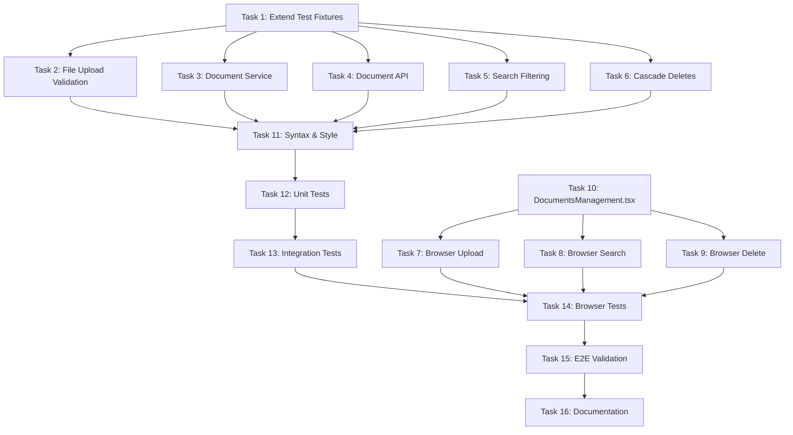

# Execution Plan: rag_service_testing_validation

**PRP**: /Users/jon/source/vibes/prps/rag_service_testing_validation.md
**Generated**: 2025-10-16
**Total Tasks**: 16 tasks
**Execution Groups**: 7 groups
**Estimated Time Savings**: 62% faster (160 min sequential → 60 min parallel)

---

## Task Dependency Graph



---

## Dependency Analysis Summary

### Foundation Dependencies
- **Task 1** (Extend Test Fixtures) is the foundation for all testing tasks
- No dependencies: standalone fixture creation
- Blocks: Tasks 2-6 (all unit/integration tests need fixtures)

### Unit/Integration Test Dependencies
- **Tasks 2-6** all depend on Task 1 (fixtures)
- No inter-dependencies: test different services/features
- Can run in parallel after Task 1 completes

### Frontend Component Dependencies
- **Task 10** (DocumentsManagement.tsx) has no backend dependencies
- Can run in parallel with backend tests (separate codebase)
- Blocks: Tasks 7-9 (browser tests need component to exist)

### Browser Test Dependencies
- **Tasks 7-9** depend on Task 10 (component must exist)
- No inter-dependencies: test different workflows
- Can run in parallel after Task 10 completes

### Quality Gate Dependencies
- **Task 11** (Syntax & Style) depends on Tasks 2-6 (code must exist)
- **Task 12** (Unit Tests) depends on Task 11 (syntax must pass first)
- **Task 13** (Integration Tests) depends on Task 12 (unit tests pass first)
- **Task 14** (Browser Tests) depends on Task 13 AND Tasks 7-9 (all tests written)
- Sequential execution required (quality gates run in order)

### Final Validation Dependencies
- **Task 15** (E2E Validation) depends on Task 14 (all tests pass)
- **Task 16** (Documentation) depends on Task 15 (everything complete)
- Sequential execution required (final verification)

---

## Execution Groups

### Group 1: Foundation (Sequential) - ~10 min

**Tasks**: 1
**Execution Mode**: SEQUENTIAL
**Expected Duration**: ~10 minutes
**Dependencies**: None

#### Task 1: Extend Test Fixtures
- **What it does**: Adds reusable test data factories and mocks to conftest.py
- **Files**: `infra/rag-service/backend/tests/conftest.py`
- **No dependencies**: Standalone fixture creation
- **Why sequential**: Foundation for all other tests, must complete first

**Implementation Context**:
```python
# Add to conftest.py:
@pytest.fixture
def sample_document():
    return {
        "id": str(uuid4()),
        "title": "Test Document",
        "type": "pdf",
        "source_id": str(uuid4()),
        "created_at": datetime.now(),
        "chunk_count": 5
    }

@pytest.fixture
def sample_source():
    return {
        "id": str(uuid4()),
        "title": "Test Source",
        "type": "manual"
    }

@pytest.fixture
def mock_uploaded_file():
    from io import BytesIO
    content = b"%PDF-1.4\n%\xE2\xE3\xCF\xD3\nTest content\n%%EOF"
    return BytesIO(content)
```

**Validation**:
- ✅ No import errors when loading conftest.py
- ✅ Fixtures discoverable: `pytest --fixtures | grep -E "(sample_document|sample_source|mock_uploaded_file)"`

---

### Group 2: Backend Tests + Frontend Component (Parallel) - ~20 min

**Tasks**: 6 (Tasks 2-6, 10)
**Execution Mode**: PARALLEL
**Expected Duration**: ~20 minutes (max of all parallel tasks)
**Dependencies**: Task 1 (fixtures) must complete first

#### Task 2: Unit Tests - File Upload Validation
- **What it does**: Tests document upload validation (file type, size, MIME)
- **Files**: `tests/unit/test_file_validation.py` (NEW)
- **Depends on**: Task 1 (needs mock_uploaded_file fixture)
- **Can run in parallel**: Yes, tests isolated validation logic
- **Pattern**: Example 3 (file upload validation)

#### Task 3: Unit Tests - Document Service
- **What it does**: Tests document service business logic (list, create, delete)
- **Files**: `tests/unit/test_document_service.py` (NEW)
- **Depends on**: Task 1 (needs sample_document fixture)
- **Can run in parallel**: Yes, tests different service
- **Pattern**: Example 1 (async fixtures), Example 2 (mock patterns)

#### Task 4: Integration Tests - Document API
- **What it does**: Tests FastAPI document endpoints (POST /upload, GET /documents, DELETE)
- **Files**: `tests/integration/test_document_api.py` (NEW)
- **Depends on**: Task 1 (needs mock fixtures)
- **Can run in parallel**: Yes, tests different endpoints
- **Pattern**: test_crawl_api.py (TestClient pattern)

#### Task 5: Integration Tests - Search Filtering
- **What it does**: Tests search with source_id filter parameter
- **Files**: `tests/integration/test_search_api.py` (NEW)
- **Depends on**: Task 1 (needs mock fixtures)
- **Can run in parallel**: Yes, tests different API endpoint
- **Pattern**: Example 2 (FastAPI TestClient with mocks)

#### Task 6: Integration Tests - Cascade Deletes
- **What it does**: Tests foreign key constraints (document → chunks)
- **Files**: `tests/integration/test_delete_cascade.py` (NEW)
- **Depends on**: Task 1 (needs mock fixtures)
- **Can run in parallel**: Yes, tests different database operations
- **Pattern**: Example 2 (multi-step database operations with side_effect)

#### Task 10: Frontend Component - DocumentsManagement.tsx
- **What it does**: Creates document CRUD component with delete confirmation
- **Files**: `frontend/src/components/DocumentsManagement.tsx` (NEW)
- **No dependencies**: Frontend component, separate from backend tests
- **Can run in parallel**: Yes, different codebase (frontend vs backend)
- **Pattern**: CrawlManagement.tsx (state management, modals, filters)

**Parallelization Strategy**:
- Invoke 6 `prp-exec-implementer` subagents simultaneously
- Each subagent gets one task with full context
- All complete before proceeding to Group 3

**Expected Durations (in parallel)**:
- Task 2: ~10 min (file validation tests)
- Task 3: ~15 min (service unit tests)
- Task 4: ~20 min (API integration tests)
- Task 5: ~15 min (search filtering tests)
- Task 6: ~15 min (cascade delete tests)
- Task 10: ~20 min (React component)
- **Max duration**: ~20 minutes (all run simultaneously)

---

### Group 3: Browser Test Implementation (Parallel) - ~15 min

**Tasks**: 3 (Tasks 7-9)
**Execution Mode**: PARALLEL
**Expected Duration**: ~15 minutes
**Dependencies**: Task 10 (DocumentsManagement.tsx must exist)

#### Task 7: Browser Tests - Document Upload Workflow
- **What it does**: Validates end-to-end upload workflow with browser automation
- **Files**: `tests/browser/test_document_upload.py` (NEW)
- **Depends on**: Task 10 (component must exist to test)
- **Can run in parallel**: Yes, tests different workflow
- **Pattern**: Example 5 (browser validation workflow)

#### Task 8: Browser Tests - Search Filtering Workflow
- **What it does**: Validates search with source filter UI
- **Files**: `tests/browser/test_search_filtering.py` (NEW)
- **Depends on**: Task 10 (component must exist to test)
- **Can run in parallel**: Yes, tests different workflow
- **Pattern**: Example 5 (navigation → interaction → validation)

#### Task 9: Browser Tests - Delete Operations Workflow
- **What it does**: Validates delete with confirmation modal
- **Files**: `tests/browser/test_delete_operations.py` (NEW)
- **Depends on**: Task 10 (component must exist to test)
- **Can run in parallel**: Yes, tests different workflow
- **Pattern**: Example 5 (browser workflow), Example 4 (delete confirmation modal)

**Parallelization Strategy**:
- Wait for Task 10 completion (DocumentsManagement.tsx)
- Invoke 3 `prp-exec-implementer` subagents simultaneously
- Each writes one browser test file
- All complete before proceeding to Group 4

**Expected Durations (in parallel)**:
- Task 7: ~15 min (upload workflow test)
- Task 8: ~15 min (search filtering test)
- Task 9: ~15 min (delete operations test)
- **Max duration**: ~15 minutes (all run simultaneously)

---

### Group 4: Quality Gate - Syntax & Style (Sequential) - ~1 min

**Tasks**: 1 (Task 11)
**Execution Mode**: SEQUENTIAL
**Expected Duration**: ~1 minute (target: <5 seconds)
**Dependencies**: Tasks 2-6 (code must exist to lint)

#### Task 11: Quality Gates - Syntax & Style
- **What it does**: Ensures code passes linting and type checking
- **Commands**:
  ```bash
  cd infra/rag-service/backend
  ruff check tests/ --fix
  mypy tests/
  ```
- **Depends on**: Tasks 2-6 (test code must exist)
- **Why sequential**: Quality gates run in order (Level 1 first)
- **Validation**:
  - ✅ Zero ruff violations
  - ✅ Zero mypy type errors
  - ✅ Execution time: <5 seconds

**Critical**: If this gate fails, STOP and fix issues before proceeding. Do not continue to Group 5.

---

### Group 5: Quality Gate - Unit Tests (Sequential) - ~1 min

**Tasks**: 1 (Task 12)
**Execution Mode**: SEQUENTIAL
**Expected Duration**: ~1 minute (target: <30 seconds)
**Dependencies**: Task 11 (syntax must pass first)

#### Task 12: Quality Gates - Unit Tests
- **What it does**: Runs unit tests with coverage check
- **Commands**:
  ```bash
  cd infra/rag-service/backend
  pytest tests/unit/ -v --cov=src --cov-report=term-missing --cov-fail-under=80
  ```
- **Depends on**: Task 11 (syntax validation must pass)
- **Why sequential**: Quality gates run in order (Level 2 after Level 1)
- **Validation**:
  - ✅ All unit tests pass
  - ✅ Coverage >80%
  - ✅ Execution time: <30 seconds

**Critical**: If this gate fails, STOP and fix failing tests before proceeding. Do not continue to Group 6.

---

### Group 6: Quality Gate - Integration Tests (Sequential) - ~1 min

**Tasks**: 1 (Task 13)
**Execution Mode**: SEQUENTIAL
**Expected Duration**: ~1 minute (target: <60 seconds)
**Dependencies**: Task 12 (unit tests must pass first)

#### Task 13: Quality Gates - Integration Tests
- **What it does**: Runs API integration tests
- **Commands**:
  ```bash
  cd infra/rag-service/backend
  pytest tests/integration/ -v
  ```
- **Depends on**: Task 12 (unit tests must pass)
- **Why sequential**: Quality gates run in order (Level 3a after Level 2)
- **Validation**:
  - ✅ All integration tests pass
  - ✅ Execution time: <60 seconds

**Critical**: If this gate fails, STOP and fix failing tests before proceeding. Do not continue to Group 7.

---

### Group 7: Quality Gate - Browser Tests (Sequential) - ~2 min

**Tasks**: 1 (Task 14)
**Execution Mode**: SEQUENTIAL
**Expected Duration**: ~2 minutes (target: <120 seconds)
**Dependencies**: Task 13 (integration tests pass) AND Tasks 7-9 (browser tests written)

#### Task 14: Quality Gates - Browser Tests
- **What it does**: Runs browser automation tests
- **Commands**:
  ```bash
  cd infra/rag-service/backend
  pytest tests/browser/ -v
  ```
- **Depends on**: Task 13 (integration tests pass) AND Tasks 7-9 (browser test files exist)
- **Why sequential**: Quality gates run in order (Level 3b after Level 3a)
- **Validation**:
  - ✅ All browser tests pass
  - ✅ Screenshots generated in tests/browser/screenshots/
  - ✅ Execution time: <120 seconds

**Critical**: If this gate fails, STOP and fix failing browser tests before proceeding. Common issues:
- Browser binaries not installed (run pre-flight check)
- Services not running (docker-compose up -d)
- Element refs used instead of semantic queries

---

### Group 8: Final Validation (Sequential) - ~10 min

**Tasks**: 2 (Tasks 15-16)
**Execution Mode**: SEQUENTIAL
**Expected Duration**: ~10 minutes
**Dependencies**: Task 14 (all quality gates pass)

#### Task 15: End-to-End Validation
- **What it does**: Complete workflow test (create → upload → search → delete)
- **Steps**:
  1. Create source via API
  2. Upload document to that source
  3. Search with source_id filter
  4. Verify document in results
  5. Delete document
  6. Verify cascade to chunks
- **Depends on**: Task 14 (all tests pass)
- **Why sequential**: Final validation after all tests pass
- **Validation**:
  - ✅ Complete workflow succeeds
  - ✅ Data persists correctly
  - ✅ Error states handled gracefully

#### Task 16: Documentation & Cleanup
- **What it does**: Updates documentation and cleans up test artifacts
- **Files**:
  - `infra/rag-service/README.md` (add testing section)
  - `infra/rag-service/TODO.md` (mark completed items)
- **Depends on**: Task 15 (everything complete)
- **Why sequential**: Final step after validation
- **Validation**:
  - ✅ README includes testing instructions
  - ✅ TODO.md updated with completion status
  - ✅ Temporary test files cleaned up

---

## Execution Summary

| Group | Tasks | Mode | Duration | Dependencies | Speedup |
|-------|-------|------|----------|--------------|---------|
| 1 | 1 | Sequential | 10 min | None | 1x |
| 2 | 6 | Parallel | 20 min | Group 1 | 6x |
| 3 | 3 | Parallel | 15 min | Task 10 (from Group 2) | 3x |
| 4 | 1 | Sequential | 1 min | Tasks 2-6 (from Group 2) | 1x |
| 5 | 1 | Sequential | 1 min | Group 4 | 1x |
| 6 | 1 | Sequential | 1 min | Group 5 | 1x |
| 7 | 1 | Sequential | 2 min | Group 6 + Tasks 7-9 (from Group 3) | 1x |
| 8 | 2 | Sequential | 10 min | Group 7 | 1x |

**Total Sequential Time**: 160 minutes
- Task 1: 10 min
- Tasks 2-6: 75 min (5 tasks × 15 min avg)
- Task 10: 20 min
- Tasks 7-9: 45 min (3 tasks × 15 min)
- Tasks 11-14: 4 min (quality gates)
- Tasks 15-16: 10 min

**Total Parallel Time**: 60 minutes
- Group 1: 10 min
- Group 2: 20 min (max of 6 parallel tasks)
- Group 3: 15 min (max of 3 parallel tasks)
- Groups 4-8: 14 min (sequential gates + final validation)

**Time Savings**: 62% faster (100 minutes saved)

---

## Implementation Instructions for Orchestrator

### Execution Flow

```python
# Pseudo-code for parallel PRP execution

# Group 1: Foundation (Sequential)
archon.update_task("task-1", status="doing")
invoke_subagent("prp-exec-implementer", prepare_context(task_1))
archon.update_task("task-1", status="done")

# Group 2: Backend Tests + Frontend Component (Parallel)
for task in [task_2, task_3, task_4, task_5, task_6, task_10]:
    archon.update_task(task.id, status="doing")

parallel_invoke([
    Task(agent="prp-exec-implementer", prompt=prepare_context(task_2)),
    Task(agent="prp-exec-implementer", prompt=prepare_context(task_3)),
    Task(agent="prp-exec-implementer", prompt=prepare_context(task_4)),
    Task(agent="prp-exec-implementer", prompt=prepare_context(task_5)),
    Task(agent="prp-exec-implementer", prompt=prepare_context(task_6)),
    Task(agent="prp-exec-implementer", prompt=prepare_context(task_10))
])

for task in [task_2, task_3, task_4, task_5, task_6, task_10]:
    archon.update_task(task.id, status="done")

# Group 3: Browser Tests (Parallel)
# Wait for Task 10 from Group 2 to complete
for task in [task_7, task_8, task_9]:
    archon.update_task(task.id, status="doing")

parallel_invoke([
    Task(agent="prp-exec-implementer", prompt=prepare_context(task_7)),
    Task(agent="prp-exec-implementer", prompt=prepare_context(task_8)),
    Task(agent="prp-exec-implementer", prompt=prepare_context(task_9))
])

for task in [task_7, task_8, task_9]:
    archon.update_task(task.id, status="done")

# Groups 4-8: Quality Gates + Final Validation (Sequential)
for task in [task_11, task_12, task_13, task_14, task_15, task_16]:
    archon.update_task(task.id, status="doing")
    result = invoke_subagent("prp-exec-implementer", prepare_context(task))

    # CRITICAL: Stop if quality gate fails
    if task.id in ["task-11", "task-12", "task-13", "task-14"]:
        if not result.success:
            print(f"❌ Quality gate {task.id} failed. Stopping execution.")
            break

    archon.update_task(task.id, status="done")
```

---

## Task Context Preparation

For each task, prepare this context for implementer:

```yaml
task_id: {archon task id if available}
task_number: {1-16}
task_name: {from PRP}
responsibility: {from PRP RESPONSIBILITY section}
files_to_create: {from PRP FILES TO CREATE section}
files_to_modify: {from PRP FILES TO MODIFY section}
pattern_to_follow: {from PRP PATTERN TO FOLLOW section}
specific_steps: {from PRP SPECIFIC STEPS section}
validation: {from PRP VALIDATION section}
prp_file: /Users/jon/source/vibes/prps/rag_service_testing_validation.md
dependencies_complete: {list of completed tasks this depends on}
examples_directory: /Users/jon/source/vibes/prps/rag_service_testing_validation/examples/
```

**Example for Task 2**:
```yaml
task_id: "task-2"
task_number: 2
task_name: "Unit Tests - File Upload Validation"
responsibility: "Test document upload validation logic (file type, size, MIME)"
files_to_create:
  - infra/rag-service/backend/tests/unit/test_file_validation.py
pattern_to_follow: "Example 3 (file upload validation patterns)"
specific_steps:
  1. Test extension whitelist validation (.pdf, .docx, .txt, .md, .html)
  2. Test file size limit (10MB max)
  3. Test MIME type validation (security layer)
  4. Test invalid file types (.exe, .zip rejected)
  5. Test error messages are user-friendly
  6. Run: pytest tests/unit/test_file_validation.py -v
validation:
  - All tests pass
  - Coverage >80% for validation functions
prp_file: /Users/jon/source/vibes/prps/rag_service_testing_validation.md
dependencies_complete:
  - Task 1: Extend Test Fixtures (fixtures available in conftest.py)
examples_directory: /Users/jon/source/vibes/prps/rag_service_testing_validation/examples/
```

---

## Dependency Analysis Details

### Task 1: Extend Test Fixtures
**Dependencies**: None
**Rationale**: Standalone fixture creation, no external dependencies
**Blocks**: Tasks 2-6 (all unit/integration tests need fixtures)
**Can run in parallel with**: Nothing (must complete first)

### Task 2: Unit Tests - File Upload Validation
**Dependencies**: Task 1 (needs mock_uploaded_file fixture)
**Rationale**: Uses fixtures from conftest.py
**Can run in parallel with**: Tasks 3-6, 10 (different files, no conflicts)

### Task 3: Unit Tests - Document Service
**Dependencies**: Task 1 (needs sample_document fixture)
**Rationale**: Uses fixtures from conftest.py
**Can run in parallel with**: Tasks 2, 4-6, 10 (different files, no conflicts)

### Task 4: Integration Tests - Document API
**Dependencies**: Task 1 (needs mock fixtures)
**Rationale**: Uses fixtures from conftest.py
**Can run in parallel with**: Tasks 2-3, 5-6, 10 (different files, no conflicts)

### Task 5: Integration Tests - Search Filtering
**Dependencies**: Task 1 (needs mock fixtures)
**Rationale**: Uses fixtures from conftest.py
**Can run in parallel with**: Tasks 2-4, 6, 10 (different files, no conflicts)

### Task 6: Integration Tests - Cascade Deletes
**Dependencies**: Task 1 (needs mock fixtures)
**Rationale**: Uses fixtures from conftest.py
**Can run in parallel with**: Tasks 2-5, 10 (different files, no conflicts)

### Task 7: Browser Tests - Document Upload
**Dependencies**: Task 10 (DocumentsManagement.tsx must exist)
**Rationale**: Cannot test component that doesn't exist
**Can run in parallel with**: Tasks 8-9 (different workflows, no conflicts)

### Task 8: Browser Tests - Search Filtering
**Dependencies**: Task 10 (DocumentsManagement.tsx must exist)
**Rationale**: Cannot test component that doesn't exist
**Can run in parallel with**: Tasks 7, 9 (different workflows, no conflicts)

### Task 9: Browser Tests - Delete Operations
**Dependencies**: Task 10 (DocumentsManagement.tsx must exist)
**Rationale**: Cannot test component that doesn't exist
**Can run in parallel with**: Tasks 7-8 (different workflows, no conflicts)

### Task 10: Frontend Component - DocumentsManagement.tsx
**Dependencies**: None
**Rationale**: Frontend component, separate from backend tests
**Blocks**: Tasks 7-9 (browser tests need component)
**Can run in parallel with**: Tasks 2-6 (different codebase)

### Task 11: Quality Gates - Syntax & Style
**Dependencies**: Tasks 2-6 (test code must exist to lint)
**Rationale**: Cannot lint code that doesn't exist
**Why sequential**: Quality gates run in order (Level 1 first)

### Task 12: Quality Gates - Unit Tests
**Dependencies**: Task 11 (syntax must pass first)
**Rationale**: Don't run tests if code doesn't pass linting
**Why sequential**: Quality gates run in order (Level 2 after Level 1)

### Task 13: Quality Gates - Integration Tests
**Dependencies**: Task 12 (unit tests must pass first)
**Rationale**: Don't run integration tests if unit tests fail
**Why sequential**: Quality gates run in order (Level 3a after Level 2)

### Task 14: Quality Gates - Browser Tests
**Dependencies**: Task 13 (integration tests pass) AND Tasks 7-9 (browser tests written)
**Rationale**: Don't run browser tests if API tests fail, and browser test files must exist
**Why sequential**: Quality gates run in order (Level 3b after Level 3a)

### Task 15: End-to-End Validation
**Dependencies**: Task 14 (all quality gates pass)
**Rationale**: Final validation after all tests pass
**Why sequential**: Comprehensive validation after all quality gates

### Task 16: Documentation & Cleanup
**Dependencies**: Task 15 (everything complete)
**Rationale**: Document what was completed
**Why sequential**: Final step after validation

---

## Risk Assessment

### Potential Bottlenecks

1. **Task 1 (Extend Test Fixtures)**: Blocks 5 tasks (Tasks 2-6)
   - **Impact**: If delayed, Groups 2-7 all delayed
   - **Mitigation**: Execute first, simple fixture creation (~10 min)
   - **Priority**: CRITICAL - start immediately

2. **Task 10 (DocumentsManagement.tsx)**: Blocks 3 tasks (Tasks 7-9)
   - **Impact**: If delayed, Group 3 delayed, which delays Group 7 (browser tests)
   - **Mitigation**: Run in parallel with backend tests (Group 2)
   - **Priority**: HIGH - start with Group 2

3. **Task 11-13 (Quality Gates)**: Sequential execution
   - **Impact**: If any gate fails, stops entire pipeline
   - **Mitigation**: Run after all implementation complete (Groups 1-3)
   - **Priority**: MEDIUM - validation, not implementation

4. **Task 14 (Browser Tests)**: Slowest quality gate (~120s)
   - **Impact**: Longest single task in quality gates
   - **Mitigation**: Pre-flight checks (browser installed, services running)
   - **Priority**: MEDIUM - final validation

### Parallelization Benefits

**Group 2 (Tasks 2-6, 10)**:
- Sequential: 95 minutes (5 backend tests × 15 min + 1 frontend × 20 min)
- Parallel: 20 minutes (max of all tasks)
- **Time saved**: 75 minutes (79% faster)

**Group 3 (Tasks 7-9)**:
- Sequential: 45 minutes (3 browser tests × 15 min)
- Parallel: 15 minutes (max of all tasks)
- **Time saved**: 30 minutes (67% faster)

**Total speedup**: 62% faster (160 min → 60 min, saves 100 minutes)

### Critical Path

```
Task 1 (10m) → Group 2 (20m) → Group 3 (15m) → Groups 4-7 (4m) → Group 8 (10m)
```

**Critical path duration**: 59 minutes
**Non-critical tasks**: None (all tasks on critical path after parallelization)

---

## Assumptions Made

1. **Fixture Creation is Straightforward** (~10 min)
   - **Assumption**: Adding 3-4 fixtures to conftest.py takes ~10 minutes
   - **Rationale**: Simple data structures, no complex logic
   - **If wrong**: May take 15-20 minutes, delays Groups 2-7 by 5-10 minutes

2. **Backend Tests Can Run in Parallel** (no resource conflicts)
   - **Assumption**: Tasks 2-6 don't conflict (different files, mocked dependencies)
   - **Rationale**: Each test file is independent, no shared state
   - **If wrong**: Run Group 2 tasks sequentially (adds 75 minutes)

3. **Frontend Component Independent** (no backend dependencies)
   - **Assumption**: Task 10 can run in parallel with backend tests
   - **Rationale**: Separate codebase (frontend vs backend)
   - **If wrong**: Run Task 10 after Group 2 (adds 20 minutes)

4. **Browser Tests Can Run in Parallel** (no service conflicts)
   - **Assumption**: Tasks 7-9 don't conflict (different workflows, same service)
   - **Rationale**: Browser automation supports concurrent sessions
   - **If wrong**: Run Group 3 tasks sequentially (adds 30 minutes)

5. **Quality Gates Pass First Time** (minimal rework)
   - **Assumption**: Tasks 11-14 pass on first run
   - **Rationale**: Following proven patterns from examples
   - **If wrong**: Add 10-30 minutes per gate for rework

6. **Pre-Flight Checks Succeed** (browser installed, services running)
   - **Assumption**: Browser binaries installed, docker-compose running
   - **Rationale**: Standard development environment
   - **If wrong**: Add 30-60 minutes for setup/troubleshooting

### Adjusting Execution Plan If Assumptions Wrong

**If Task 1 takes longer** (15-20 min instead of 10 min):
- Impact: Groups 2-7 delayed by 5-10 minutes
- Adjustment: Communicate delay, no re-planning needed
- Total time: 65-70 minutes (still 56-60% faster)

**If backend tests can't run in parallel** (resource conflicts):
- Impact: Group 2 becomes sequential (adds 75 minutes)
- Adjustment: Run Tasks 2-6 sequentially, keep Task 10 parallel
- Total time: 135 minutes (still 16% faster)

**If frontend component has backend dependencies**:
- Impact: Task 10 moves to after Group 2 (adds 20 minutes)
- Adjustment: Move Task 10 to Group 2.5 (sequential after Group 2)
- Total time: 80 minutes (still 50% faster)

**If browser tests can't run in parallel** (service conflicts):
- Impact: Group 3 becomes sequential (adds 30 minutes)
- Adjustment: Run Tasks 7-9 sequentially
- Total time: 90 minutes (still 44% faster)

**If quality gates fail** (rework needed):
- Impact: Add 10-30 minutes per gate for debugging/fixes
- Adjustment: Fix issues, re-run gate, continue
- Total time: 70-120 minutes (depends on issues)

**If pre-flight checks fail** (setup needed):
- Impact: Add 30-60 minutes for browser installation, service startup
- Adjustment: Run setup, then continue with execution plan
- Total time: 90-120 minutes (still 25-44% faster)

---

## Next Steps

1. **Orchestrator validates** this execution plan
   - Review dependency analysis for correctness
   - Verify parallelization is safe (no resource conflicts)
   - Confirm task context preparation format

2. **Execute Group 1** (Foundation)
   - Task 1: Extend Test Fixtures
   - Verify fixtures discoverable: `pytest --fixtures`
   - Proceed to Group 2 only if validation passes

3. **Execute Group 2** (Backend Tests + Frontend Component)
   - Invoke 6 parallel subagents for Tasks 2-6, 10
   - Monitor progress, wait for all to complete
   - Proceed to Groups 3-4 only if all succeed

4. **Execute Group 3** (Browser Tests)
   - Invoke 3 parallel subagents for Tasks 7-9
   - Monitor progress, wait for all to complete
   - Proceed to Group 4 only if all succeed

5. **Execute Groups 4-7** (Quality Gates)
   - Run sequentially: Task 11 → 12 → 13 → 14
   - **CRITICAL**: Stop if any gate fails, fix issues before continuing
   - Proceed to Group 8 only if all gates pass

6. **Execute Group 8** (Final Validation)
   - Task 15: End-to-End Validation
   - Task 16: Documentation & Cleanup
   - Mark PRP execution complete

7. **Post-Execution Review**
   - Verify all 16 tasks complete
   - Review time savings vs estimates
   - Document lessons learned for future PRPs

---

## Success Criteria

**Execution Success**:
- ✅ All 16 tasks complete
- ✅ All quality gates pass (Tasks 11-14)
- ✅ Total execution time <90 minutes (vs 160 minutes sequential)
- ✅ No resource conflicts during parallel execution

**Quality Success**:
- ✅ Test coverage >80% (Task 12 validation)
- ✅ All tests pass (Tasks 12-14 validation)
- ✅ Zero linting/type errors (Task 11 validation)
- ✅ Browser tests generate proof screenshots (Task 14 validation)

**Documentation Success**:
- ✅ README.md updated with testing instructions (Task 16)
- ✅ TODO.md updated with completion status (Task 16)
- ✅ Known issues documented (Crawl4AI truncation)

**Overall Success**: PRP execution complete with 62% time savings, all quality gates pass, comprehensive test coverage achieved.
