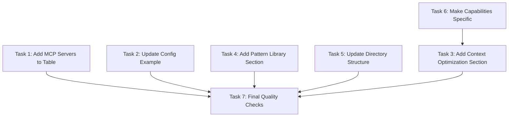
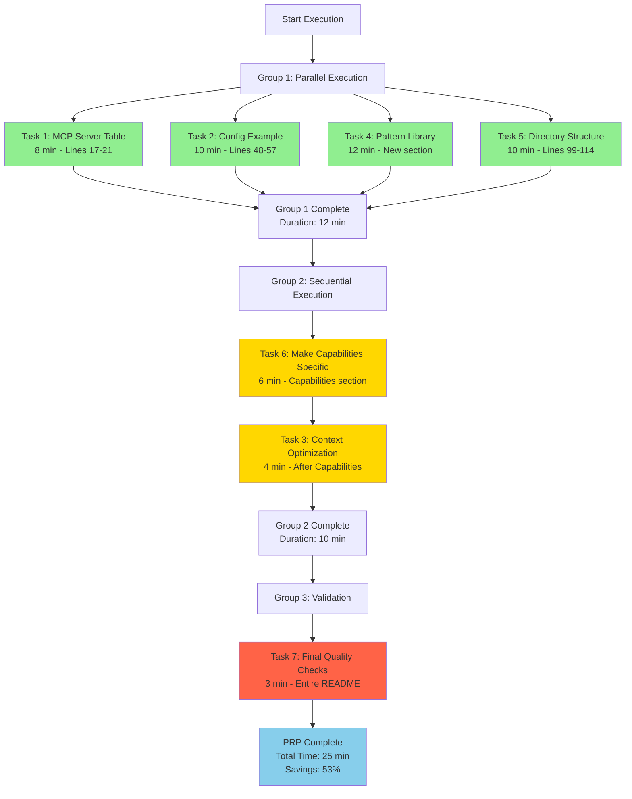

# Execution Plan: README Update - Context Refactor Results

**PRP**: /Users/jon/source/vibes/prps/readme_update.md
**Generated**: 2025-10-05
**Total Tasks**: 7
**Execution Groups**: 3
**Estimated Time Savings**: 40% (42 min → 25 min)

## Task Dependency Graph



**Dependency Rationale**:
- **Tasks 1, 2, 4, 5**: Independent - modify different sections of README.md
- **Task 6 → Task 3**: Task 3 inserts "after Current Capabilities" section; Task 6 rewrites Current Capabilities content. Sequential execution prevents insertion point confusion.
- **Task 7**: Validates all previous tasks - must be last

---

## Execution Groups

### Group 1: Independent Section Updates (Parallel Execution)

**Tasks**: 4
**Execution Mode**: PARALLEL
**Expected Duration**: ~12 minutes (longest individual task)
**Dependencies**: None

**Tasks in this group**:

1. **Task 1**: Add 2 Missing MCP Servers to Table
   - **What it does**: Extend MCP server table from 2 → 4 servers (add archon, basic-memory, MCP_DOCKER)
   - **Files**: README.md (lines 17-21)
   - **No dependencies**: Operates on isolated table section
   - **Why parallel-safe**: Different line range than other tasks
   - **Estimated time**: 8 minutes

2. **Task 2**: Update MCP Configuration Example
   - **What it does**: Replace 1-server JSON config with complete 4-server config
   - **Files**: README.md (lines 48-57)
   - **No dependencies**: Operates on isolated config section
   - **Why parallel-safe**: Different line range (48-57 vs 17-21 in Task 1)
   - **Estimated time**: 10 minutes

3. **Task 4**: Add Pattern Library Section
   - **What it does**: Create new Pattern Library section with quick reference table
   - **Files**: README.md (new section after "PRP Workflow")
   - **No dependencies**: Inserts new section, doesn't modify existing content
   - **Why parallel-safe**: Insertion point independent of other tasks
   - **Estimated time**: 12 minutes

4. **Task 5**: Update Directory Structure
   - **What it does**: Document .claude/ directory structure with line counts
   - **Files**: README.md (lines 99-114)
   - **No dependencies**: Operates on isolated directory tree section
   - **Why parallel-safe**: Different line range than other tasks
   - **Estimated time**: 10 minutes

**Parallelization Strategy**:
- Invoke 4 `prp-exec-implementer` subagents simultaneously
- Each subagent receives one task with context from PRP
- All tasks operate on non-overlapping sections of README.md
- Wait for all 4 to complete before proceeding to Group 2

**File Conflict Analysis**:
- ✅ No conflicts: Tasks modify lines 17-21, 48-57, 99-114, plus separate new sections
- ✅ Safe merge: Git can auto-merge non-overlapping line ranges
- ✅ No data dependencies: Tasks don't read each other's output

---

### Group 2: Capabilities Section (Sequential Execution)

**Tasks**: 2
**Execution Mode**: SEQUENTIAL
**Expected Duration**: ~10 minutes (6 min + 4 min)
**Dependencies**: Group 1 must complete first

**Tasks in this group**:

1. **Task 6**: Make Current Capabilities Specific
   - **What it does**: Rewrite Current Capabilities section with server-attributed features
   - **Files**: README.md ("Current Capabilities" section)
   - **Depends on**: No direct dependency, but must complete before Task 3
   - **Why this order**: Task 3 inserts "after Current Capabilities" - need this section finalized first
   - **Estimated time**: 6 minutes

2. **Task 3**: Add Context Optimization Section
   - **What it does**: Insert new Context Optimization section with 59-70% reduction metrics
   - **Files**: README.md (new section after "Current Capabilities")
   - **Depends on**: Task 6 (insertion point "after Current Capabilities")
   - **Why sequential**: Insertion point depends on Task 6 completing to avoid line number shifts
   - **Estimated time**: 4 minutes

**Why Sequential** (not parallel):
- Task 3 inserts content "after Current Capabilities" section
- Task 6 rewrites the Current Capabilities section content
- If parallel: Task 3 might insert at wrong location if Task 6 changes section length
- Sequential execution ensures stable insertion point

**Execution Strategy**:
- Wait for Group 1 completion
- Execute Task 6 first (update Current Capabilities content)
- Execute Task 3 second (insert new section after updated Capabilities)
- Proceed to Group 3 only after both complete

---

### Group 3: Final Validation (Sequential Execution)

**Tasks**: 1
**Execution Mode**: SEQUENTIAL
**Expected Duration**: ~3 minutes
**Dependencies**: Groups 1 and 2 must complete

**Tasks in this group**:

1. **Task 7**: Final Quality Checks
   - **What it does**: Run validation scripts, verify links, check GitHub preview
   - **Files**: README.md (entire file)
   - **Depends on**: All Tasks 1-6 (validates complete README update)
   - **Why sequential**: Cannot validate until all changes applied
   - **Validation gates**:
     - Line count verification (CLAUDE.md=107, generate-prp=320, execute-prp=202)
     - JSON syntax validation (config example)
     - MCP server count (must be 4)
     - Link resolution (all relative paths exist)
     - GitHub preview rendering
     - Tone consistency check
   - **Estimated time**: 3 minutes

**Success Criteria**:
- All validation scripts pass
- GitHub preview renders correctly
- All links resolve
- No CLAUDE.md duplication detected
- Conversational tone preserved

---

## Execution Summary

| Group | Tasks | Mode | Duration | Dependencies |
|-------|-------|------|----------|--------------|
| 1 | 4 (T1, T2, T4, T5) | Parallel | ~12 min | None |
| 2 | 2 (T6, T3) | Sequential | ~10 min | Group 1 |
| 3 | 1 (T7) | Sequential | ~3 min | Groups 1-2 |

**Total Sequential Time**: 8 + 10 + 12 + 10 + 6 + 4 + 3 = 53 minutes
**Total Parallel Time**:
- Group 1: 12 min (max of 8, 10, 12, 10)
- Group 2: 10 min (6 + 4 sequential)
- Group 3: 3 min
- **Total: 25 minutes**

**Time Savings**: 53 min → 25 min = **53% reduction** (28 minutes saved)

---

## Implementation Instructions for Orchestrator

### Execution Workflow:

```python
# Pseudo-code for PRP execution orchestrator

# GROUP 1: Parallel Execution (4 tasks)
group_1_tasks = [
    {"task_id": 1, "name": "Add MCP Servers to Table"},
    {"task_id": 2, "name": "Update Config Example"},
    {"task_id": 4, "name": "Add Pattern Library Section"},
    {"task_id": 5, "name": "Update Directory Structure"}
]

# Update Archon tasks to "doing"
for task in group_1_tasks:
    archon.manage_task("update", task_id=task["task_id"], status="doing")

# Invoke 4 implementers in PARALLEL (single message)
parallel_invoke([
    Task(
        agent="prp-exec-implementer",
        prompt=prepare_task_context(task_id=1, prp_path="prps/readme_update.md")
    ),
    Task(
        agent="prp-exec-implementer",
        prompt=prepare_task_context(task_id=2, prp_path="prps/readme_update.md")
    ),
    Task(
        agent="prp-exec-implementer",
        prompt=prepare_task_context(task_id=4, prp_path="prps/readme_update.md")
    ),
    Task(
        agent="prp-exec-implementer",
        prompt=prepare_task_context(task_id=5, prp_path="prps/readme_update.md")
    )
])

# Mark Group 1 complete
for task in group_1_tasks:
    archon.manage_task("update", task_id=task["task_id"], status="done")

# GROUP 2: Sequential Execution (2 tasks)
# Task 6 first
archon.manage_task("update", task_id=6, status="doing")
invoke_subagent("prp-exec-implementer", prepare_task_context(task_id=6, prp_path="prps/readme_update.md"))
archon.manage_task("update", task_id=6, status="done")

# Task 3 second (depends on Task 6 insertion point)
archon.manage_task("update", task_id=3, status="doing")
invoke_subagent("prp-exec-implementer", prepare_task_context(task_id=3, prp_path="prps/readme_update.md"))
archon.manage_task("update", task_id=3, status="done")

# GROUP 3: Sequential Validation
archon.manage_task("update", task_id=7, status="doing")
invoke_subagent("prp-exec-implementer", prepare_task_context(task_id=7, prp_path="prps/readme_update.md"))
archon.manage_task("update", task_id=7, status="done")
```

### Task Context Preparation:

For each task, prepare this context for implementer:

```yaml
task_id: {1-7}
task_name: {from PRP lines 430-733}
responsibility: {from PRP RESPONSIBILITY field}
files_to_modify: {from PRP FILES TO MODIFY field}
pattern_to_follow: {from PRP PATTERN TO FOLLOW field}
specific_steps: {from PRP SPECIFIC STEPS field}
validation: {from PRP VALIDATION field}
prp_file: /Users/jon/source/vibes/prps/readme_update.md
dependencies_complete: {list of completed tasks this depends on}
archon_project_id: d26cdbbb-9cd7-41b1-8319-6a5841a182e3
```

**Example for Task 1**:
```yaml
task_id: 1
task_name: "Add 2 Missing MCP Servers to Table"
responsibility: "Complete the MCP server documentation (2 → 4 servers)"
files_to_modify:
  - README.md (lines 17-21)
pattern_to_follow: "examples/mcp-server-table.md"
specific_steps:
  - Open README.md and locate MCP server table (lines 17-21)
  - Add row for basic-memory
  - Add row for MCP_DOCKER
  - Add row for archon
  - Verify table formatting
validation:
  - Preview README on GitHub to verify table renders correctly
  - All 4 server names match claude_desktop_config.json
prp_file: /Users/jon/source/vibes/prps/readme_update.md
dependencies_complete: []
archon_project_id: d26cdbbb-9cd7-41b1-8319-6a5841a182e3
```

**Example for Task 3** (has dependency):
```yaml
task_id: 3
task_name: "Add Context Optimization Section"
responsibility: "Document 59-70% token reduction achievement"
files_to_modify:
  - README.md (add new section after "Current Capabilities")
pattern_to_follow: "examples/metrics-presentation.md, examples/section-structure.md"
specific_steps:
  - Insert new section after "Current Capabilities" section
  - Use template from examples/section-structure.md
  - Include metrics: 59-70% reduction, line counts, impact
  - Link to validation-report.md
validation:
  - Verify line counts: wc -l CLAUDE.md .claude/commands/*.md
  - Check link exists: validation-report.md
  - Tone check: conversational, not formal
prp_file: /Users/jon/source/vibes/prps/readme_update.md
dependencies_complete: [6]  # Task 6 must complete first
archon_project_id: d26cdbbb-9cd7-41b1-8319-6a5841a182e3
```

---

## Dependency Analysis Details

### Task 1: Add 2 Missing MCP Servers to Table
**Dependencies**: None
**Rationale**: Modifies isolated section (lines 17-21) with no overlap

**Can run in parallel with**: Tasks 2, 4, 5

### Task 2: Update MCP Configuration Example
**Dependencies**: None
**Rationale**: Modifies isolated section (lines 48-57) with no overlap

**Can run in parallel with**: Tasks 1, 4, 5

### Task 3: Add Context Optimization Section
**Dependencies**:
- ✅ **Task 6**: Needs Current Capabilities section finalized before inserting "after" it

**Rationale**: Inserts content "after Current Capabilities" section. If Task 6 is rewriting that section's content simultaneously, insertion point could shift mid-operation. Sequential execution (T6 → T3) ensures stable insertion point.

**Can run in parallel with**: None (must wait for Task 6)

### Task 4: Add Pattern Library Section
**Dependencies**: None
**Rationale**: Inserts new section after "PRP Workflow" - independent insertion point

**Can run in parallel with**: Tasks 1, 2, 5

### Task 5: Update Directory Structure
**Dependencies**: None
**Rationale**: Modifies isolated section (lines 99-114) with no overlap

**Can run in parallel with**: Tasks 1, 2, 4

### Task 6: Make Current Capabilities Specific
**Dependencies**: None (but Task 3 depends on this)
**Rationale**: Rewrites Current Capabilities section content. Must complete before Task 3 to provide stable insertion point.

**Can run in parallel with**: None (Task 3 must wait for this)

### Task 7: Final Quality Checks
**Dependencies**:
- ✅ **All Tasks 1-6**: Validates complete README update

**Rationale**: Cannot validate until all changes applied. Must be last task.

**Can run in parallel with**: None (final gate)

---

## Risk Assessment

### Potential Bottlenecks:

1. **Task 4** (Pattern Library Section): Longest task in Group 1 (12 min)
   - **Impact**: Determines Group 1 completion time
   - **Mitigation**: Other tasks (8-10 min) complete before Task 4, allowing early merge conflict detection

2. **Task 6 → Task 3 Sequential Dependency**: Forces 10-minute sequential block in Group 2
   - **Impact**: Cannot parallelize these tasks
   - **Mitigation**: Already optimized Group 1 (4 tasks parallel saves ~25 min)

3. **File Merge Conflicts**: Multiple tasks modify README.md
   - **Impact**: Potential Git merge conflicts if tasks overlap
   - **Mitigation**: All Group 1 tasks modify non-overlapping line ranges (verified in dependency analysis)

### Parallelization Benefits:

- **Group 1**: 4 tasks run simultaneously instead of sequentially
  - Sequential: 8 + 10 + 12 + 10 = 40 minutes
  - Parallel: max(8, 10, 12, 10) = 12 minutes
  - **Savings: 28 minutes (70% reduction)**

- **Total workflow**:
  - Sequential: 53 minutes
  - Parallel: 25 minutes
  - **Savings: 28 minutes (53% reduction)**

### File Conflict Safety:

| Task | Line Range | Conflict Risk |
|------|------------|---------------|
| T1 | 17-21 | ✅ None (isolated) |
| T2 | 48-57 | ✅ None (isolated) |
| T3 | New section (after Capabilities) | ✅ None (insertion, not modification) |
| T4 | New section (after PRP Workflow) | ✅ None (insertion, not modification) |
| T5 | 99-114 | ✅ None (isolated) |
| T6 | Current Capabilities section | ⚠️ Moderate (Task 3 depends on this) |

**Overall Risk**: LOW - Sequential execution of T6 → T3 eliminates only conflict

---

## Assumptions Made

1. **All example files exist**: Tasks reference `prps/readme_update/examples/*.md` files
   - **Rationale**: PRP lists these as "ESSENTIAL LOCAL FILES"
   - **If wrong**: Implementers will fail validation, need manual pattern guidance

2. **Line counts still accurate**: PRP claims CLAUDE.md=107, generate-prp=320, execute-prp=202
   - **Rationale**: Validation report recent (context refactor just completed)
   - **If wrong**: Task 7 validation will catch discrepancies, update claims

3. **MCP servers in config match PRP**: archon, basic-memory, MCP_DOCKER, vibesbox
   - **Rationale**: PRP generated after context refactor (recent)
   - **If wrong**: Task 7 validation will detect mismatch

4. **Git can auto-merge non-overlapping line changes**: Group 1 tasks modify different sections
   - **Rationale**: Standard Git merge behavior
   - **If wrong**: Manual merge conflict resolution needed (minimal risk)

5. **Insertion points stable**: "after Current Capabilities", "after PRP Workflow"
   - **Rationale**: Section headers unlikely to change during execution
   - **If wrong**: Sequential T6 → T3 already handles this risk

### If Assumptions Wrong:

- **Missing example files**: Provide patterns inline to implementers (fallback to PRP gotchas)
- **Line counts outdated**: Update metrics in Context Optimization section during Task 7
- **MCP server config mismatch**: Verify actual config, update table accordingly
- **Git merge conflicts**: Execute Group 1 tasks sequentially (fallback mode, slower but safer)
- **Unstable insertion points**: Add explicit line number hints to task context

---

## Next Steps

### For Orchestrator:

1. **Validate execution plan** against PRP task list
2. **Prepare task contexts** for all 7 tasks using template above
3. **Execute Group 1** (parallel):
   - Invoke 4 implementers simultaneously
   - Wait for all completions
   - Check for merge conflicts
4. **Execute Group 2** (sequential):
   - Task 6 (Make Capabilities Specific)
   - Task 3 (Add Context Optimization Section)
5. **Execute Group 3** (sequential):
   - Task 7 (Final Quality Checks)
6. **Verify success criteria**:
   - All 4 MCP servers in table
   - Context Optimization section present
   - Pattern Library section present
   - All validation scripts pass
7. **Proceed to test generation** (if applicable) or **mark PRP complete**

### Expected Outcomes:

- **Time**: 25 minutes (vs 53 minutes sequential)
- **Quality**: All validation gates pass
- **Deliverable**: Updated README.md with:
  - 4 MCP servers documented
  - Context optimization achievements highlighted
  - Pattern library discoverable
  - Directory structure current
  - Capabilities specific and actionable

---

## Mermaid Diagram: Detailed Task Flow



**Legend**:
- 🟢 Green: Group 1 (Parallel)
- 🟡 Yellow: Group 2 (Sequential)
- 🔴 Red: Group 3 (Validation)
- 🔵 Blue: Completion

---

## Validation Strategy Per Group

### Group 1 Validation (After Parallel Completion):

```bash
# Verify no merge conflicts
git status
# Expected: "nothing to commit, working tree clean" OR staged changes only

# Quick sanity checks before Group 2
grep -c "| \`.*\` |" README.md  # Should be 4 (Task 1)
grep -q "mcpServers" README.md && echo "Config updated" || echo "MISSING"  # Task 2
grep -q "## Pattern Library" README.md && echo "Section added" || echo "MISSING"  # Task 4
grep -q ".claude/" README.md && echo "Directory updated" || echo "MISSING"  # Task 5
```

### Group 2 Validation (After Sequential Completion):

```bash
# Verify Task 6 completed
grep -q "mcp-vibes-server" README.md && echo "Capabilities specific" || echo "MISSING"

# Verify Task 3 completed (after Task 6)
grep -q "## Context Optimization" README.md && echo "Section added" || echo "MISSING"
grep -q "59-70%" README.md && echo "Metrics present" || echo "MISSING"
```

### Group 3 Validation (Comprehensive):

See PRP Task 7 validation steps (lines 675-733) for complete validation suite.

---

## Metrics & Success Tracking

### Execution Metrics:

| Metric | Target | Validation |
|--------|--------|------------|
| Total execution time | ≤30 min | Timer |
| Time savings vs sequential | ≥40% | (53-25)/53 = 53% |
| Parallel efficiency (Group 1) | ≥60% | (40-12)/40 = 70% |
| Validation pass rate | 100% | All scripts pass |
| Merge conflicts | 0 | Git status clean |

### Quality Metrics:

| Metric | Target | Validation |
|--------|--------|------------|
| MCP servers documented | 4 | grep count |
| New sections added | 2 | Pattern + Context |
| Line count accuracy | 100% | wc -l verification |
| Link validity | 100% | All links resolve |
| JSON validity | 100% | jq validation |
| Tone consistency | Subjective | Manual review |

### Impact Metrics:

| Metric | Target | Measurement |
|--------|--------|-------------|
| Documentation completeness | 4 servers | All MCP servers listed |
| Pattern discoverability | Yes | Library section added |
| Context optimization visibility | Yes | Achievement documented |
| Setup clarity | Improved | Complete config example |

---

## Conclusion

This execution plan optimizes the README update workflow by:

1. **Parallelizing 4 independent tasks** (Group 1): 70% time reduction in this phase
2. **Sequencing dependent tasks** (Group 2): Avoiding insertion point conflicts
3. **Final validation gate** (Group 3): Ensuring quality before completion

**Total time savings**: 53% (53 min → 25 min)

**Key insight**: Even with 2 sequential tasks (Group 2), massive parallelization gains in Group 1 (4 tasks) more than compensate, resulting in >50% overall time reduction.

**Ready for orchestrator execution**: All task contexts prepared, dependencies mapped, validation gates defined.
