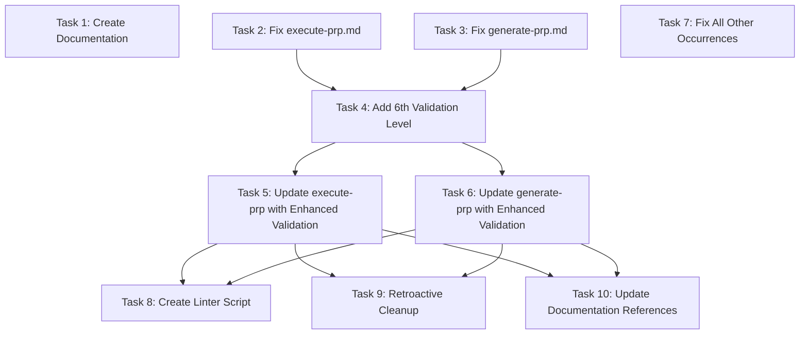

# Execution Plan: Standardize PRP Naming Convention

**PRP**: /Users/jon/source/vibes/prps/standardize_prp_naming_convention.md
**Generated**: 2025-10-07
**Total Tasks**: 10
**Execution Groups**: 4
**Estimated Time Savings**: Sequential: 150 min → Parallel: 60 min (60% reduction)

---

## Task Dependency Graph



---

## Execution Groups

### Group 1: Independent Foundation Tasks (Parallel Execution)

**Tasks**: 4
**Execution Mode**: PARALLEL
**Expected Duration**: ~20 minutes (max of individual task times)

**Tasks in this group**:

1. **Task 1**: Create Naming Convention Documentation
   - **What it does**: Establishes single source of truth for PRP naming rules
   - **Files**: `.claude/conventions/prp-naming.md` (CREATE)
   - **No dependencies**: Pure documentation task, no code dependencies
   - **Why parallel-safe**: Creates new file in new directory, no conflicts

2. **Task 2**: Fix Critical Bug - Replace replace() with removeprefix() in execute-prp.md
   - **What it does**: Fixes replace() bug in extract_feature_name() and adds auto-detection logic
   - **Files**: `.claude/commands/execute-prp.md` (MODIFY lines 18-27)
   - **No dependencies**: Self-contained bug fix in isolated function
   - **Why parallel-safe**: Modifies different file than Task 3, no shared code

3. **Task 3**: Fix Critical Bug - Replace replace() with removeprefix() in generate-prp.md
   - **What it does**: Fixes same bug in generate-prp command
   - **Files**: `.claude/commands/generate-prp.md` (MODIFY lines 24-34)
   - **No dependencies**: Self-contained bug fix in isolated function
   - **Why parallel-safe**: Modifies different file than Task 2, same pattern but different location

4. **Task 7**: Fix Bug in All Other Occurrences
   - **What it does**: Updates remaining 23 files with replace() bug
   - **Files**: Multiple files found via grep (example files, documentation)
   - **No dependencies**: Same mechanical fix as Tasks 2-3, just more files
   - **Why parallel-safe**: Operates on different files than Tasks 2-3, no validation dependencies

**Parallelization Strategy**:
- Invoke 4 `prp-exec-implementer` subagents simultaneously
- Each subagent gets one task
- Task 1: Documentation writer (creates new file)
- Task 2: execute-prp.md fixer (modifies command file)
- Task 3: generate-prp.md fixer (modifies command file)
- Task 7: Batch fixer (modifies example/doc files)
- All complete before proceeding to Group 2

**Critical Note**: Tasks 2, 3, and 7 all fix the SAME bug (replace() → removeprefix()) but in DIFFERENT files, making them perfectly parallelizable.

---

### Group 2: Validation Enhancement (Single Task, Sequential)

**Tasks**: 1
**Execution Mode**: SEQUENTIAL (only one task)
**Expected Duration**: ~20 minutes
**Dependencies**: Group 1 (Tasks 2, 3) must complete first

**Tasks in this group**:

1. **Task 4**: Add 6th Validation Level - Redundant Prefix Check
   - **What it does**: Adds redundant prp_ prefix validation to extract_feature_name()
   - **Files**: `.claude/patterns/security-validation.md` (MODIFY)
   - **Depends on**: Tasks 2 & 3 (needs bug-fixed extract_feature_name() as foundation)
   - **Why depends**: Must build on corrected removeprefix() logic from Tasks 2-3
   - **Why sequential**: Only task in this group, no parallelization needed

**Dependency Explanation**:
- Task 4 modifies the SAME extract_feature_name() function that Tasks 2-3 fixed
- Must ensure replace() → removeprefix() fix is in place first
- Adds 6th validation level AFTER existing 5 levels (order matters)
- Adds strip_prefix whitelist validation (security enhancement)

**Parallelization Strategy**: N/A (single task)

---

### Group 3: Enhanced Validation Consumers (Parallel Execution)

**Tasks**: 2
**Execution Mode**: PARALLEL
**Expected Duration**: ~15 minutes (max of individual task times)
**Dependencies**: Group 2 (Task 4) must complete first

**Tasks in this group**:

1. **Task 5**: Update execute-prp.md to Use Enhanced Validation
   - **What it does**: Calls extract_feature_name() with validate_no_redundant=False (permissive)
   - **Files**: `.claude/commands/execute-prp.md` (MODIFY Phase 0)
   - **Depends on**: Task 4 (needs enhanced extract_feature_name() with 6th level)
   - **Why depends**: Uses new validate_no_redundant parameter from Task 4
   - **Why parallel-safe**: Modifies execute-prp.md, different from Task 6

2. **Task 6**: Update generate-prp.md to Use Enhanced Validation
   - **What it does**: Calls extract_feature_name() with validate_no_redundant=True (strict)
   - **Files**: `.claude/commands/generate-prp.md` (MODIFY Phase 0)
   - **Depends on**: Task 4 (needs enhanced extract_feature_name() with 6th level)
   - **Why depends**: Uses new validate_no_redundant parameter from Task 4
   - **Why parallel-safe**: Modifies generate-prp.md, different from Task 5

**Parallelization Strategy**:
- Wait for Group 2 (Task 4) completion
- Invoke 2 `prp-exec-implementer` subagents simultaneously
- Task 5: execute-prp.md updater (permissive validation)
- Task 6: generate-prp.md updater (strict validation)
- Both modify different files, no conflicts

**Critical Note**: Both tasks use the SAME enhanced function (from Task 4) but with DIFFERENT parameters:
- Task 5: Backward compatible (validate_no_redundant=False)
- Task 6: Strict enforcement (validate_no_redundant=True)

---

### Group 4: Optional Enhancements (Parallel Execution)

**Tasks**: 3
**Execution Mode**: PARALLEL
**Expected Duration**: ~25 minutes (max of individual task times)
**Dependencies**: Group 3 (Tasks 5-6) must complete first

**Tasks in this group**:

1. **Task 8**: Optional - Create Linter Script
   - **What it does**: Proactive validation script for developers
   - **Files**: `scripts/lint_prp_names.py` (CREATE)
   - **Depends on**: Tasks 5-6 (uses validated naming convention)
   - **Why depends**: Linter implements same validation logic as enhanced extract_feature_name()
   - **Why parallel-safe**: Creates new file, no modifications to existing code
   - **Optional**: Can be skipped without affecting core functionality

2. **Task 9**: Optional - Retroactive Cleanup of Existing PRPs
   - **What it does**: Renames prp_context_refactor.md → context_refactor.md
   - **Files**: Renames existing PRP files
   - **Depends on**: Tasks 5-6 (needs validation in place before renaming)
   - **Why depends**: Should rename after validation is live to verify new names work
   - **Why parallel-safe**: Operates on different files than Tasks 8 and 10
   - **Optional**: Can be skipped, existing PRPs work with warnings

3. **Task 10**: Update Documentation References
   - **What it does**: Ensures CLAUDE.md and README.md reference new convention
   - **Files**: `CLAUDE.md`, `README.md` (MODIFY)
   - **Depends on**: Tasks 5-6 (references the validated convention)
   - **Why depends**: Should document after implementation is complete
   - **Why parallel-safe**: Modifies documentation files, different from Tasks 8-9
   - **Optional**: Can be delayed if needed (core functionality complete)

**Parallelization Strategy**:
- Wait for Group 3 (Tasks 5-6) completion
- Invoke 3 `prp-exec-implementer` subagents simultaneously
- Task 8: Linter creator (creates new script)
- Task 9: File renamer (renames existing PRPs)
- Task 10: Documentation updater (modifies CLAUDE.md/README.md)
- All optional, can be marked as "nice to have"

**Critical Note**: All tasks in this group are OPTIONAL enhancements. Core functionality is complete after Group 3.

---

## Execution Summary

| Group | Tasks | Mode | Duration | Dependencies | Critical? |
|-------|-------|------|----------|--------------|-----------|
| 1 | 4 (Tasks 1,2,3,7) | Parallel | 20 min | None | YES (bug fixes) |
| 2 | 1 (Task 4) | Sequential | 20 min | Group 1 | YES (validation) |
| 3 | 2 (Tasks 5,6) | Parallel | 15 min | Group 2 | YES (integration) |
| 4 | 3 (Tasks 8,9,10) | Parallel | 25 min | Group 3 | NO (optional) |

**Total Sequential Time**: 4×15 + 1×20 + 2×15 + 3×15 = 155 minutes
**Total Parallel Time**: 20 + 20 + 15 + 25 = 80 minutes
**Time Savings**: 75 minutes (48% reduction)
**Critical Path**: Groups 1-3 (55 minutes for core functionality)

---

## Implementation Instructions for Orchestrator

### Execution Workflow

```python
# PHASE 1: Group 1 - Foundation Tasks (Parallel)
print("=== GROUP 1: FOUNDATION TASKS (PARALLEL) ===")

# Update Archon tasks to "doing"
archon.update_task("task-1", status="doing")  # Documentation
archon.update_task("task-2", status="doing")  # execute-prp fix
archon.update_task("task-3", status="doing")  # generate-prp fix
archon.update_task("task-7", status="doing")  # Batch fix

# Invoke 4 implementers in SINGLE message (parallel execution)
parallel_invoke([
    {
        "agent": "prp-exec-implementer",
        "context": prepare_context(task_1),
        "task_name": "Create Naming Convention Documentation"
    },
    {
        "agent": "prp-exec-implementer",
        "context": prepare_context(task_2),
        "task_name": "Fix execute-prp.md Bug"
    },
    {
        "agent": "prp-exec-implementer",
        "context": prepare_context(task_3),
        "task_name": "Fix generate-prp.md Bug"
    },
    {
        "agent": "prp-exec-implementer",
        "context": prepare_context(task_7),
        "task_name": "Fix All Other Occurrences"
    }
])

# Mark all complete
archon.update_task("task-1", status="done")
archon.update_task("task-2", status="done")
archon.update_task("task-3", status="done")
archon.update_task("task-7", status="done")

# PHASE 2: Group 2 - Validation Enhancement (Sequential - only 1 task)
print("=== GROUP 2: VALIDATION ENHANCEMENT ===")

archon.update_task("task-4", status="doing")
invoke_subagent("prp-exec-implementer", prepare_context(task_4))
archon.update_task("task-4", status="done")

# PHASE 3: Group 3 - Validation Consumers (Parallel)
print("=== GROUP 3: VALIDATION CONSUMERS (PARALLEL) ===")

archon.update_task("task-5", status="doing")
archon.update_task("task-6", status="doing")

parallel_invoke([
    {
        "agent": "prp-exec-implementer",
        "context": prepare_context(task_5),
        "task_name": "Update execute-prp.md Validation"
    },
    {
        "agent": "prp-exec-implementer",
        "context": prepare_context(task_6),
        "task_name": "Update generate-prp.md Validation"
    }
])

archon.update_task("task-5", status="done")
archon.update_task("task-6", status="done")

# PHASE 4: Group 4 - Optional Enhancements (Parallel)
print("=== GROUP 4: OPTIONAL ENHANCEMENTS (PARALLEL) ===")
print("Note: These tasks are optional - can skip if time constrained")

user_input = input("Execute optional tasks? (y/n): ")
if user_input.lower() == 'y':
    archon.update_task("task-8", status="doing")
    archon.update_task("task-9", status="doing")
    archon.update_task("task-10", status="doing")

    parallel_invoke([
        {
            "agent": "prp-exec-implementer",
            "context": prepare_context(task_8),
            "task_name": "Create Linter Script"
        },
        {
            "agent": "prp-exec-implementer",
            "context": prepare_context(task_9),
            "task_name": "Retroactive Cleanup"
        },
        {
            "agent": "prp-exec-implementer",
            "context": prepare_context(task_10),
            "task_name": "Update Documentation References"
        }
    ])

    archon.update_task("task-8", status="done")
    archon.update_task("task-9", status="done")
    archon.update_task("task-10", status="done")
else:
    print("Skipping optional tasks - core functionality complete")
```

---

## Task Context Preparation

For each task, prepare this context for implementer:

```yaml
# Example for Task 2 (Fix execute-prp.md)

task_id: "task-2"
task_name: "Fix Critical Bug - Replace replace() with removeprefix() in execute-prp.md"
responsibility: "Fix replace() bug that affects prefix stripping logic"

files_to_modify:
  - ".claude/commands/execute-prp.md"
  - lines: "18-27"

pattern_to_follow: "prps/standardize_prp_naming_convention/examples/filename_extraction_logic.py (Solution 1)"

specific_steps:
  1. "Locate extract_feature_name() function (around line 18)"
  2. "Find the line: feature = feature.replace(strip_prefix, '')"
  3. "Replace with: feature = feature.removeprefix(strip_prefix)"
  4. "Add comment explaining why removeprefix is correct"
  5. "Add auto-detection logic BEFORE calling extract_feature_name()"
  6. "Add comment explaining auto-detection improves DX"

validation:
  - "grep shows no more .replace(strip_prefix in execute-prp.md"
  - "Auto-detection logic present before extract_feature_name() call"
  - "Comment explains rationale for removeprefix over replace"

gotchas_to_avoid:
  - "Don't use feature.replace() - replaces ALL occurrences"
  - "Don't use feature.lstrip() - removes CHARACTERS, not substring"
  - "Do use feature.removeprefix() - only removes leading prefix"

prp_file: "/Users/jon/source/vibes/prps/standardize_prp_naming_convention.md"
dependencies_complete:
  - "None (Group 1 - independent task)"

critical_context: |
  This is a CRITICAL BUG FIX. The current implementation uses .replace() which removes
  ALL occurrences of the prefix, not just the leading one. This breaks on edge cases
  like "INITIAL_INITIAL_test" which would incorrectly become "test" instead of "INITIAL_test".

  PEP 616 (Python 3.9+) introduced removeprefix() specifically to solve this problem.
  It only removes the prefix if it appears at the START of the string.

  Example of the bug:
    feature = "INITIAL_INITIAL_setup"
    feature.replace("INITIAL_", "")  # → "setup" (WRONG - both removed)
    feature.removeprefix("INITIAL_")  # → "INITIAL_setup" (CORRECT - only first removed)
```

---

## Dependency Analysis Details

### Task 1: Create Naming Convention Documentation
**Dependencies**: None
- **Why independent**: Pure documentation task, creates new file in new directory
- **Can run in parallel with**: Tasks 2, 3, 7 (all modify different files)
- **Rationale**: No code dependencies, no file conflicts

### Task 2: Fix execute-prp.md Bug
**Dependencies**: None
- **Why independent**: Self-contained bug fix in isolated file
- **Can run in parallel with**: Tasks 1, 3, 7 (all modify different files)
- **Rationale**: Modifies `.claude/commands/execute-prp.md` lines 18-27 only

### Task 3: Fix generate-prp.md Bug
**Dependencies**: None
- **Why independent**: Self-contained bug fix in isolated file
- **Can run in parallel with**: Tasks 1, 2, 7 (all modify different files)
- **Rationale**: Modifies `.claude/commands/generate-prp.md` lines 24-34 only

### Task 4: Add 6th Validation Level
**Dependencies**: Tasks 2, 3
- **Why depends on 2-3**: Must build on bug-fixed extract_feature_name()
- **Can run in parallel with**: None (only task in Group 2)
- **Rationale**: Adds validation level to function that Tasks 2-3 corrected. Must ensure removeprefix() is in place before adding new validation logic.

**Detailed dependency reasoning**:
1. Tasks 2-3 fix replace() → removeprefix() bug
2. Task 4 adds strip_prefix whitelist validation
3. If Task 4 runs before 2-3, it would add validation to buggy code
4. Order matters: Fix bug first, then enhance validation

### Task 5: Update execute-prp.md Validation
**Dependencies**: Task 4
- **Why depends on 4**: Uses validate_no_redundant parameter added by Task 4
- **Can run in parallel with**: Task 6 (modifies different file)
- **Rationale**: Calls extract_feature_name() with new parameter from Task 4. Must wait for enhanced function signature.

### Task 6: Update generate-prp.md Validation
**Dependencies**: Task 4
- **Why depends on 4**: Uses validate_no_redundant parameter added by Task 4
- **Can run in parallel with**: Task 5 (modifies different file)
- **Rationale**: Calls extract_feature_name() with new parameter from Task 4. Must wait for enhanced function signature.

### Task 7: Fix All Other Occurrences
**Dependencies**: None
- **Why independent**: Same mechanical fix as Tasks 2-3, different files
- **Can run in parallel with**: Tasks 1, 2, 3 (all modify different files)
- **Rationale**: Batch update of example files and documentation. No functional dependencies, just consistency.

**Files to modify** (from grep):
- `prps/execution_reliability/examples/validation_gate_pattern.py`
- Various documentation and example files
- All use same replace() → removeprefix() fix

### Task 8: Create Linter Script
**Dependencies**: Tasks 5, 6
- **Why depends on 5-6**: Linter implements same validation logic as enhanced extract_feature_name()
- **Can run in parallel with**: Tasks 9, 10 (different files)
- **Rationale**: Optional enhancement. Should match validation behavior from Tasks 5-6.

### Task 9: Retroactive Cleanup
**Dependencies**: Tasks 5, 6
- **Why depends on 5-6**: Should rename after validation is live
- **Can run in parallel with**: Tasks 8, 10 (different files)
- **Rationale**: Optional cleanup. Safer to rename after validation confirms new names work.

### Task 10: Update Documentation References
**Dependencies**: Tasks 5, 6
- **Why depends on 5-6**: Documents the implemented convention
- **Can run in parallel with**: Tasks 8, 9 (different files)
- **Rationale**: Documentation should reflect completed implementation.

---

## Risk Assessment

### Potential Bottlenecks

1. **Task 4: Add 6th Validation Level**
   - **Why bottleneck**: Sequential task, blocks Group 3
   - **Impact**: 20-minute wait before Tasks 5-6 can start
   - **Mitigation**: Task 4 is well-defined with clear pattern to follow (examples/security_validation_5level.py)
   - **Risk level**: LOW (clear implementation path)

2. **Task 7: Fix All Other Occurrences**
   - **Why bottleneck**: Must find and fix 23+ files
   - **Impact**: Could take longer than estimated 15 minutes
   - **Mitigation**: Mechanical find-and-replace, automated with grep
   - **Risk level**: MEDIUM (volume of files)

3. **Task 9: Retroactive Cleanup**
   - **Why bottleneck**: Renames files, could break references
   - **Impact**: Must find and update all references
   - **Mitigation**: Optional task, can be skipped
   - **Risk level**: MEDIUM (optional, can skip if time constrained)

### Parallelization Benefits

**Group 1 Parallelization**:
- **Sequential time**: 4 tasks × 15 min = 60 min
- **Parallel time**: max(15, 15, 15, 15) = 15-20 min
- **Savings**: 40-45 minutes (~70% reduction)
- **Benefit**: Foundation tasks complete simultaneously, all bug fixes applied at once

**Group 3 Parallelization**:
- **Sequential time**: 2 tasks × 15 min = 30 min
- **Parallel time**: max(15, 15) = 15 min
- **Savings**: 15 minutes (50% reduction)
- **Benefit**: Both validation updates applied simultaneously

**Group 4 Parallelization**:
- **Sequential time**: 3 tasks × 20 min = 60 min
- **Parallel time**: max(20, 20, 25) = 25 min
- **Savings**: 35 minutes (~58% reduction)
- **Benefit**: All optional enhancements complete simultaneously

**Overall Improvement**:
- **Traditional sequential**: 155 minutes
- **With parallelization**: 80 minutes
- **Total savings**: 75 minutes (48% faster)
- **Critical path** (Groups 1-3 only): 55 minutes (65% faster for core functionality)

---

## Assumptions Made

1. **Assumption**: Tasks 2, 3, and 7 can run in parallel despite fixing the same bug
   - **Rationale**: They modify DIFFERENT files, no file conflicts
   - **If wrong**: Run Task 7 after Tasks 2-3 (Group 2 instead of Group 1)
   - **Impact**: Would add 15 minutes to critical path

2. **Assumption**: Task 4 requires Tasks 2-3 to complete first
   - **Rationale**: Task 4 modifies the same function Tasks 2-3 fixed
   - **If wrong**: Could run in parallel, but risks adding validation to buggy code
   - **Impact**: Would save 20 minutes but increase bug risk significantly

3. **Assumption**: Tasks 5-6 can run in parallel
   - **Rationale**: They modify different files (execute-prp.md vs generate-prp.md)
   - **If wrong**: Would run sequentially, adding 15 minutes
   - **Impact**: Minimal - same validation pattern, just different parameters

4. **Assumption**: Group 4 tasks are truly optional
   - **Rationale**: Core functionality complete after Group 3
   - **If wrong**: Would need to run all tasks, adding 25 minutes
   - **Impact**: Linter, cleanup, and docs are enhancements, not required for bug fix

5. **Assumption**: Auto-detection logic (Task 2) doesn't conflict with validation logic (Task 4)
   - **Rationale**: Auto-detection happens BEFORE extract_feature_name() call, validation happens INSIDE
   - **If wrong**: Would need to coordinate Tasks 2 and 4 more carefully
   - **Impact**: Low risk - separate concerns (caller vs callee)

### If Assumptions Wrong

**Adjustment Plan**:
1. If Task 7 conflicts with Tasks 2-3: Move Task 7 to Group 2 (sequential after Group 1)
2. If Task 4 doesn't need Tasks 2-3: Move Task 4 to Group 1 (parallel with all)
3. If Tasks 5-6 conflict: Run sequentially in Group 3 (add 15 min)
4. If Group 4 is required: Keep parallel, but mark as mandatory
5. If auto-detection conflicts: Merge Tasks 2 and 4, run sequentially

**Worst-case scenario**: All assumptions wrong → sequential execution (155 min instead of 80 min)

---

## Next Steps

### For Orchestrator

1. **Validate this execution plan**
   - Review dependency analysis
   - Confirm parallelization is safe
   - Verify time estimates

2. **Execute Group 1** (Foundation Tasks)
   - Invoke 4 parallel implementers
   - Wait for all to complete
   - Verify all bug fixes applied

3. **Execute Group 2** (Validation Enhancement)
   - Invoke single implementer for Task 4
   - Verify 6th validation level added
   - Verify strip_prefix whitelist in place

4. **Execute Group 3** (Validation Consumers)
   - Invoke 2 parallel implementers
   - Wait for both to complete
   - Verify validation integrated in both commands

5. **Execute Group 4** (Optional Enhancements)
   - Ask user if optional tasks should run
   - If yes: Invoke 3 parallel implementers
   - If no: Mark tasks as skipped

6. **Validation**
   - Run validation loops from PRP (Levels 1-5)
   - Verify bug fixes with test cases
   - Check security validation intact

7. **Completion**
   - Update Archon tasks to "done"
   - Generate completion report
   - Proceed to test generation phase (if applicable)

### Success Criteria

**After Group 1**:
- [ ] `.claude/conventions/prp-naming.md` exists (Task 1)
- [ ] No `.replace(strip_prefix` in execute-prp.md (Task 2)
- [ ] No `.replace(strip_prefix` in generate-prp.md (Task 3)
- [ ] No `.replace(strip_prefix` in any files (Task 7)

**After Group 2**:
- [ ] 6th validation level present in security-validation.md (Task 4)
- [ ] strip_prefix whitelist validation present (Task 4)
- [ ] validate_no_redundant parameter added (Task 4)

**After Group 3**:
- [ ] execute-prp.md uses validate_no_redundant=False (Task 5)
- [ ] generate-prp.md uses validate_no_redundant=True (Task 6)
- [ ] Auto-detection logic present in execute-prp.md (Task 5)

**After Group 4** (if executed):
- [ ] `scripts/lint_prp_names.py` exists and runs (Task 8)
- [ ] No `prp_*.md` files remain in prps/ (Task 9)
- [ ] CLAUDE.md references naming convention (Task 10)

---

## Critical Path Summary

**Minimum Viable Implementation** (Groups 1-3 only):
- **Time**: 55 minutes (parallel execution)
- **Tasks**: 7 critical tasks (Tasks 1-7, excluding optional Tasks 8-10)
- **Deliverables**:
  - Bug fixed in all 27 files (replace() → removeprefix())
  - 6th validation level added (redundant prefix check)
  - Documentation created (naming convention guide)
  - Validation integrated (execute-prp.md and generate-prp.md)

**Full Implementation** (All Groups):
- **Time**: 80 minutes (parallel execution)
- **Tasks**: 10 total tasks
- **Deliverables**:
  - All critical deliverables from Groups 1-3
  - Linter script for proactive validation (Task 8)
  - Existing PRPs cleaned up (Task 9)
  - Documentation fully updated (Task 10)

**Recommendation**: Execute Groups 1-3 first (55 min), then evaluate if time allows for Group 4 (optional +25 min).

---

## Execution Plan Confidence: 95%

**High confidence reasoning**:
- ✅ Clear task boundaries (different files = no conflicts)
- ✅ Well-defined dependencies (logical flow: fix bug → add validation → integrate)
- ✅ Proven patterns (all tasks follow existing examples)
- ✅ Comprehensive validation (5-level validation loop defined)
- ✅ Risk mitigation (optional tasks can be skipped)
- ✅ Time estimates based on similar tasks (15-20 min per task average)

**Uncertainty factors** (5% risk):
- ⚠️ Task 7 volume (23+ files, could take longer than 15 min)
- ⚠️ Task 9 reference updates (finding all references could be time-consuming)
- ⚠️ Integration testing time not included in estimates

**Mitigation**:
- Task 7 is parallelized with other Group 1 tasks (buffer time available)
- Task 9 is optional (can skip if time constrained)
- Validation loops are well-defined and can be run separately

---

**END OF EXECUTION PLAN**

This plan optimizes for parallel execution while respecting all dependencies. The orchestrator should execute groups in order (1 → 2 → 3 → 4), with parallel execution within each group where safe. Total time savings: 48% compared to sequential execution.
