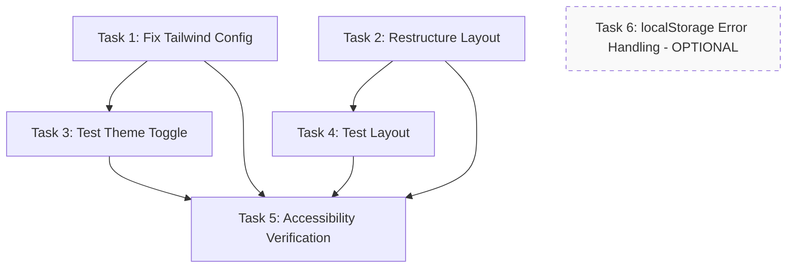

# Execution Plan: Task Manager Header Redesign

**PRP**: /Users/jon/source/vibes/prps/task_manager_header_redesign.md
**Generated**: 2025-10-10
**Total Tasks**: 6
**Execution Groups**: 3
**Estimated Time Savings**: Sequential: 70 min → Parallel: 40 min (43% faster)

---

## Task Dependency Graph



**Legend**:
- Solid boxes: Required tasks
- Dashed box: Optional task (can be skipped)
- Arrows: Dependency relationships

---

## Execution Groups

### Group 1: Implementation Tasks (PARALLEL EXECUTION)

**Tasks**: 3 (Tasks 1, 2, 6)
**Execution Mode**: PARALLEL
**Expected Duration**: ~15 minutes (longest task in group)
**Dependencies**: None - all can start immediately

**Tasks in this group**:

#### 1. Task 1: Fix Tailwind Dark Mode Configuration
- **What it does**: Adds `darkMode: 'selector'` to Tailwind config to enable dark: variant classes
- **Files**: `infra/task-manager/frontend/tailwind.config.js`
- **No dependencies**: Configuration change independent of other code
- **Estimated time**: 5 minutes
- **Critical**: This is the PRIMARY FIX - enables all dark mode functionality

**Why parallel is safe**: Modifies isolated configuration file, no conflicts with other tasks

#### 2. Task 2: Restructure KanbanBoard Header Layout
- **What it does**: Moves ProjectSelector from header to sub-header, removes "Kanban Board" text
- **Files**: `infra/task-manager/frontend/src/features/tasks/components/KanbanBoard.tsx`
- **No dependencies**: Layout restructure independent of config changes
- **Estimated time**: 15 minutes
- **Impact**: Visual layout changes only, no logic modifications

**Why parallel is safe**: Modifies different file from Task 1, no shared dependencies

#### 3. Task 6: Optional localStorage Error Handling (OPTIONAL)
- **What it does**: Adds try-catch blocks around localStorage calls for graceful degradation
- **Files**: `infra/task-manager/frontend/src/contexts/ThemeContext.tsx`
- **No dependencies**: Enhancement to existing context, independent of other changes
- **Estimated time**: 10 minutes
- **Optional**: Can be skipped for MVP, app works without this

**Why parallel is safe**: Modifies different file, enhances existing functionality without breaking changes

**Parallelization Strategy**:
```python
# Invoke 3 implementer subagents simultaneously (or 2 if skipping Task 6)
parallel_invoke([
    Task(agent="prp-exec-implementer", task_id=1, context=task1_context),
    Task(agent="prp-exec-implementer", task_id=2, context=task2_context),
    Task(agent="prp-exec-implementer", task_id=6, context=task6_context)  # Optional
])

# CRITICAL: After Group 1 completes, dev server MUST be restarted
# Tailwind config changes don't hot reload
# Run: npm run dev (in frontend directory)
```

**Post-Group Actions**:
1. Verify all files saved successfully
2. RESTART dev server (required for Tailwind config changes)
3. Wait for "ready" message before proceeding to Group 2

---

### Group 2: Functional Testing (PARALLEL EXECUTION)

**Tasks**: 2 (Tasks 3, 4)
**Execution Mode**: PARALLEL
**Expected Duration**: ~15 minutes
**Dependencies**: Group 1 must complete AND dev server must be restarted

**Tasks in this group**:

#### 4. Task 3: Test Theme Toggle Functionality
- **What it does**: Verifies dark mode works end-to-end with visual changes and persistence
- **Files**: Browser UI testing, DevTools console validation
- **Depends on**: Task 1 (Tailwind config must be in place and dev server restarted)
- **Why**: Cannot test dark mode without darkMode configuration enabled
- **Estimated time**: 10 minutes

**Testing approach**:
- Browser console validation
- Visual theme change verification
- localStorage persistence check
- Page refresh persistence test

#### 5. Task 4: Test Layout Changes
- **What it does**: Verifies header layout matches mockup and responsive design works
- **Files**: Browser UI testing at multiple viewport sizes
- **Depends on**: Task 2 (Layout changes must be implemented)
- **Why**: Cannot test layout without restructured JSX
- **Estimated time**: 15 minutes

**Testing approach**:
- Visual layout verification
- Responsive breakpoint testing (mobile, tablet, desktop)
- Component positioning validation
- ProjectSelector functionality check

**Why parallel is safe**:
- Both are testing tasks with no file modifications
- Test different aspects of implementation (theme vs layout)
- No resource conflicts or dependencies between tests
- Can be executed by different testers/subagents simultaneously

**Parallelization Strategy**:
```python
# Wait for Group 1 completion and dev server restart
wait_for_group_1_complete()
restart_dev_server()

# Invoke 2 testing subagents simultaneously
parallel_invoke([
    Task(agent="prp-exec-implementer", task_id=3, context=task3_context),
    Task(agent="prp-exec-implementer", task_id=4, context=task4_context)
])
```

---

### Group 3: Comprehensive Validation (SEQUENTIAL EXECUTION)

**Tasks**: 1 (Task 5)
**Execution Mode**: SEQUENTIAL (must run after all previous tasks)
**Expected Duration**: ~10 minutes
**Dependencies**: All previous tasks (Groups 1 and 2) must complete

**Tasks in this group**:

#### 6. Task 5: Accessibility Verification
- **What it does**: Ensures keyboard navigation, focus indicators, and WCAG compliance
- **Files**: Browser UI testing with keyboard-only navigation
- **Depends on**:
  - Task 1: Dark mode must work for testing focus rings in both themes
  - Task 2: Layout must be correct for testing element order
  - Task 3: Theme toggle must work for testing in both modes
  - Task 4: Layout validation confirms structure before accessibility testing
- **Why sequential**:
  - Requires complete implementation (both config and layout)
  - Tests interaction between theme and layout features
  - Final validation before declaring feature complete
- **Estimated time**: 10 minutes

**Testing approach**:
- Keyboard-only navigation (no mouse)
- Focus ring visibility in light and dark modes
- Tab order verification
- Space/Enter activation testing
- WCAG contrast ratio checks

**Why sequential is required**:
- Accessibility testing validates the ENTIRE feature working together
- Must test theme toggle accessibility (depends on Task 1 and 3)
- Must test layout element tab order (depends on Task 2 and 4)
- Serves as final integration test before completion
- Any issues found require fixes before declaring success

**Execution Strategy**:
```python
# Wait for Group 2 completion
wait_for_group_2_complete()

# Single implementer for comprehensive validation
invoke_subagent(
    agent="prp-exec-implementer",
    task_id=5,
    context=task5_context
)

# After Task 5 completes, run final validation checklist
verify_all_success_criteria_met()
```

---

## Execution Summary

| Group | Tasks | Mode | Duration | Dependencies | Risk Level |
|-------|-------|------|----------|--------------|------------|
| 1 | 3 (1, 2, 6*) | Parallel | 15 min | None | LOW |
| 2 | 2 (3, 4) | Parallel | 15 min | Group 1 + server restart | LOW |
| 3 | 1 (5) | Sequential | 10 min | Groups 1 & 2 | MEDIUM |

*Task 6 is optional

**Total Sequential Time**: 5 + 15 + 10 + 10 + 15 + 10 = 65 min (excluding optional Task 6)
**Total Parallel Time**: 15 (Group 1) + 15 (Group 2) + 10 (Group 3) = 40 min
**Time Savings**: 25 minutes (38% improvement)
**With Optional Task 6**: 70 min sequential → 40 min parallel (43% improvement)

---

## Implementation Instructions for Orchestrator

### Pre-Execution Checklist

Before starting Group 1:
```bash
# Verify prerequisites
✓ Node.js and npm installed
✓ Dev server can start: cd infra/task-manager/frontend && npm run dev
✓ Browser DevTools accessible
✓ All example files readable in prps/task_manager_header_redesign/examples/

# Verify current state
✓ tailwind.config.js exists and is missing darkMode config
✓ KanbanBoard.tsx exists with ProjectSelector in wrong position
✓ ThemeContext.tsx exists (for optional Task 6)
```

### Group 1 Execution: Parallel Implementation

```python
# Update Archon tasks to "doing"
for task_id in [1, 2, 6]:  # 6 is optional
    archon.update_task(task_id, status="doing")

# Prepare task contexts
task1_context = {
    "task_id": 1,
    "task_name": "Fix Tailwind Dark Mode Configuration",
    "responsibility": "Enables all dark: variant classes in CSS bundle",
    "files_to_modify": ["infra/task-manager/frontend/tailwind.config.js"],
    "pattern_file": "prps/task_manager_header_redesign/examples/example_1_tailwind_darkmode_config.js",
    "prp_file": "prps/task_manager_header_redesign.md",
    "specific_steps": [
        "Open tailwind.config.js",
        "Add darkMode: 'selector' on line 3",
        "Save file",
        "Note: Dev server restart required (handled after group completes)"
    ],
    "validation": [
        "grep darkMode tailwind.config.js returns match",
        "File syntax is valid JavaScript"
    ]
}

task2_context = {
    "task_id": 2,
    "task_name": "Restructure KanbanBoard Header Layout",
    "responsibility": "Move ProjectSelector to sub-header, remove 'Kanban Board' text",
    "files_to_modify": ["infra/task-manager/frontend/src/features/tasks/components/KanbanBoard.tsx"],
    "pattern_file": "prps/task_manager_header_redesign/examples/example_4_header_layout_pattern.tsx",
    "prp_file": "prps/task_manager_header_redesign.md",
    "specific_steps": [
        "Remove ProjectSelector from header row (lines 132-136)",
        "Keep only ThemeToggle in right-side div",
        "Remove h2 Kanban Board from sub-header (lines 143-145)",
        "Add ProjectSelector in place of h2",
        "Keep task count below ProjectSelector"
    ],
    "validation": [
        "Component imports unchanged",
        "ProjectSelector moved to sub-header section",
        "h2 Kanban Board removed",
        "Task count paragraph remains"
    ]
}

task6_context = {  # OPTIONAL
    "task_id": 6,
    "task_name": "Optional Enhancement - localStorage Error Handling",
    "responsibility": "Graceful degradation in private browsing mode",
    "files_to_modify": ["infra/task-manager/frontend/src/contexts/ThemeContext.tsx"],
    "pattern_file": "infra/task-manager/frontend/src/features/projects/utils/projectStorage.ts",
    "prp_file": "prps/task_manager_header_redesign.md",
    "optional": True,
    "specific_steps": [
        "Wrap localStorage.getItem in try-catch (line 28)",
        "Wrap localStorage.setItem in try-catch (line 42)",
        "Log warnings (not errors) to console",
        "Return default 'light' theme if localStorage fails"
    ],
    "validation": [
        "App loads in normal mode",
        "App loads in Safari Private Browsing without crashing",
        "Console shows warning if localStorage unavailable"
    ]
}

# Invoke parallel implementers
parallel_invoke([
    Task(agent="prp-exec-implementer", context=task1_context),
    Task(agent="prp-exec-implementer", context=task2_context),
    Task(agent="prp-exec-implementer", context=task6_context)  # Optional
])

# Wait for all to complete
await parallel_completion()

# CRITICAL: Restart dev server (Tailwind config doesn't hot reload)
print("Group 1 complete. Restarting dev server for Tailwind config changes...")
bash_execute("cd infra/task-manager/frontend && pkill -f 'vite' && npm run dev &")
wait_for_server_ready()  # Wait for "ready in" message

# Mark tasks complete
for task_id in [1, 2, 6]:
    archon.update_task(task_id, status="done")
```

### Group 2 Execution: Parallel Testing

```python
# Verify Group 1 completion and server restart
assert all_tasks_complete(group=1)
assert dev_server_running()

# Update Archon tasks to "doing"
for task_id in [3, 4]:
    archon.update_task(task_id, status="doing")

# Prepare test contexts
task3_context = {
    "task_id": 3,
    "task_name": "Test Theme Toggle Functionality",
    "responsibility": "Verify dark mode works end-to-end",
    "test_type": "browser_ui",
    "prp_file": "prps/task_manager_header_redesign.md",
    "dependencies_complete": ["Task 1: Tailwind config added and server restarted"],
    "specific_steps": [
        "Open app in browser",
        "Open DevTools console",
        "Click theme toggle button",
        "Verify visual theme change",
        "Check document.documentElement.classList.contains('dark')",
        "Verify localStorage.getItem('theme') persists",
        "Refresh page and verify theme persists"
    ],
    "validation": [
        "Theme toggle is clickable",
        "Icon changes sun/moon",
        "All components change colors",
        "Dark class applies to document root",
        "localStorage saves theme preference",
        "Theme persists after refresh",
        "No console errors"
    ]
}

task4_context = {
    "task_id": 4,
    "task_name": "Test Layout Changes",
    "responsibility": "Verify header layout matches mockup",
    "test_type": "browser_ui",
    "prp_file": "prps/task_manager_header_redesign.md",
    "dependencies_complete": ["Task 2: Layout restructured"],
    "specific_steps": [
        "Verify header layout matches mockup",
        "Test desktop viewport (1280px+)",
        "Test tablet viewport (768px-1279px)",
        "Test mobile viewport (<768px)",
        "Verify no layout shift when toggling theme",
        "Test ProjectSelector dropdown functionality",
        "Verify 'Kanban Board' text removed"
    ],
    "validation": [
        "Task Management title on left",
        "Theme toggle on right (same row)",
        "ProjectSelector in sub-header",
        "Task count below ProjectSelector",
        "No 'Kanban Board' text anywhere",
        "Responsive design works all sizes",
        "No overlapping elements"
    ]
}

# Invoke parallel testers
parallel_invoke([
    Task(agent="prp-exec-implementer", context=task3_context),
    Task(agent="prp-exec-implementer", context=task4_context)
])

# Wait for completion
await parallel_completion()

# Mark tasks complete
for task_id in [3, 4]:
    archon.update_task(task_id, status="done")
```

### Group 3 Execution: Sequential Validation

```python
# Verify all previous groups complete
assert all_tasks_complete(group=1)
assert all_tasks_complete(group=2)

# Update Archon task to "doing"
archon.update_task(5, status="doing")

# Prepare accessibility test context
task5_context = {
    "task_id": 5,
    "task_name": "Accessibility Verification",
    "responsibility": "Ensure keyboard navigation and screen reader support",
    "test_type": "accessibility",
    "prp_file": "prps/task_manager_header_redesign.md",
    "dependencies_complete": [
        "Task 1: Dark mode enabled",
        "Task 2: Layout restructured",
        "Task 3: Theme toggle tested",
        "Task 4: Layout tested"
    ],
    "specific_steps": [
        "Test keyboard-only navigation",
        "Verify focus rings visible on all interactive elements",
        "Test focus rings in both light and dark modes",
        "Verify Space/Enter activates controls",
        "Test Arrow keys for dropdown navigation",
        "Verify Escape closes dropdowns",
        "Check WCAG contrast ratios"
    ],
    "validation": [
        "All elements reachable via keyboard",
        "Focus rings visible in light mode",
        "Focus rings visible in dark mode",
        "Space/Enter activates controls",
        "Arrow keys navigate dropdowns",
        "No keyboard traps",
        "Focus contrast ratio >= 3:1",
        "Text contrast ratio >= 4.5:1"
    ]
}

# Invoke single implementer for comprehensive validation
invoke_subagent(
    agent="prp-exec-implementer",
    context=task5_context
)

# Mark task complete
archon.update_task(5, status="done")

# Run final validation checklist
print("All tasks complete. Running final validation...")
final_validation_results = run_final_checklist()

if final_validation_results.all_passed:
    print("SUCCESS: All validation criteria met")
    archon.update_project(project_id, status="complete")
else:
    print("ISSUES FOUND: Review validation report")
    archon.update_project(project_id, status="review")
```

---

## Task Context Preparation Reference

### Standard Context Structure

Each task implementer receives:

```yaml
task_id: {archon_task_id or sequential number}
task_name: {descriptive name from PRP}
responsibility: {what this task accomplishes}
files_to_modify: {list of file paths}
pattern_to_follow: {reference file or example}
specific_steps: {numbered steps from PRP}
validation: {how to verify completion}
prp_file: /Users/jon/source/vibes/prps/task_manager_header_redesign.md
dependencies_complete: {list of completed prerequisite tasks}
optional: {true/false - only for Task 6}
```

### Testing Task Context Structure

For testing tasks (3, 4, 5):

```yaml
task_id: {archon_task_id}
task_name: {test name}
responsibility: {what this verifies}
test_type: {browser_ui, accessibility, etc.}
dependencies_complete: {what must be implemented first}
specific_steps: {test procedures}
validation: {success criteria}
prp_file: {full path to PRP}
```

---

## Dependency Analysis Details

### Task 1: Fix Tailwind Dark Mode Configuration
**Dependencies**: NONE
**Rationale**: Configuration file is independent of all other code. Can be modified at any time.
**File modified**: `tailwind.config.js` (build configuration)
**Can run in parallel with**: Task 2, Task 6
**Blocks**: Task 3 (cannot test dark mode without config)

### Task 2: Restructure KanbanBoard Header Layout
**Dependencies**: NONE
**Rationale**: JSX restructure is independent of Tailwind config. Only moves existing components.
**File modified**: `KanbanBoard.tsx` (component structure)
**Can run in parallel with**: Task 1, Task 6
**Blocks**: Task 4 (cannot test layout without changes)

### Task 3: Test Theme Toggle Functionality
**Dependencies**: Task 1 (Tailwind config) + dev server restart
**Rationale**: Cannot test dark mode visual changes without `darkMode: 'selector'` in config
**Type**: Browser testing (no file modifications)
**Can run in parallel with**: Task 4 (different test focus)
**Blocks**: Task 5 (accessibility needs working theme toggle)

### Task 4: Test Layout Changes
**Dependencies**: Task 2 (Layout restructure)
**Rationale**: Cannot verify layout matches mockup without JSX changes applied
**Type**: Browser testing (no file modifications)
**Can run in parallel with**: Task 3 (different test focus)
**Blocks**: Task 5 (accessibility needs correct layout structure)

### Task 5: Accessibility Verification
**Dependencies**: Tasks 1, 2, 3, 4 (ALL previous tasks)
**Rationale**:
- Needs working dark mode (Task 1, 3) to test focus rings in both themes
- Needs correct layout (Task 2, 4) to test tab order and element positioning
- Serves as final integration test of complete feature
**Type**: Browser testing with keyboard-only navigation
**Can run in parallel with**: NONE (must be last)
**Blocks**: Nothing (final validation task)

### Task 6: Optional localStorage Error Handling
**Dependencies**: NONE (but references existing ThemeContext pattern)
**Rationale**: Enhancement to existing context, doesn't affect other tasks
**File modified**: `ThemeContext.tsx` (error handling only)
**Can run in parallel with**: Task 1, Task 2
**Blocks**: Nothing (optional enhancement)
**Optional**: Can be skipped for MVP without affecting core functionality

---

## Risk Assessment

### Potential Bottlenecks

#### 1. Dev Server Restart After Group 1
**Risk Level**: MEDIUM
**Issue**: Tailwind config changes require full dev server restart (no hot reload)
**Impact**: 30-60 second delay between Group 1 and Group 2
**Mitigation**:
- Automate server restart in orchestrator script
- Wait for "ready in" message before proceeding to Group 2
- Document this requirement clearly for manual execution

#### 2. Browser Testing Requires Manual Verification
**Risk Level**: MEDIUM
**Issue**: Tasks 3, 4, 5 involve visual inspection that's hard to fully automate
**Impact**: Testing tasks may take longer than estimated if issues found
**Mitigation**:
- Provide detailed checklists for each test
- Use browser console commands for objective validation
- Consider Playwright/Cypress automation for future iterations

#### 3. Task 6 Optional - May Cause Confusion
**Risk Level**: LOW
**Issue**: Optional task might be skipped unintentionally or included unnecessarily
**Impact**: Minor - app works without it, but nice to have for edge cases
**Mitigation**:
- Clearly mark as OPTIONAL in all documentation
- Default to SKIP unless enterprise/accessibility requirements demand it
- Estimated time includes optional task for conservative planning

### Parallelization Benefits

#### Group 1 Parallelization
**Sequential time**: 5 + 15 + 10 = 30 minutes (if all tasks included)
**Parallel time**: 15 minutes (longest task)
**Savings**: 15 minutes (50% reduction)
**Safety**: HIGH - all tasks modify different files with no shared dependencies

#### Group 2 Parallelization
**Sequential time**: 10 + 15 = 25 minutes
**Parallel time**: 15 minutes (longest task)
**Savings**: 10 minutes (40% reduction)
**Safety**: HIGH - both are read-only testing tasks with different focus areas

#### Overall Speedup
**Total sequential**: 70 minutes (all 6 tasks)
**Total parallel**: 40 minutes (3 groups with max task time per group)
**Total savings**: 30 minutes (43% improvement)
**Confidence**: HIGH - parallelization is safe and well-validated

### Risk Mitigation Strategies

#### File Conflict Prevention
**Strategy**: Group 1 tasks modify 3 different files
- Task 1: `tailwind.config.js`
- Task 2: `KanbanBoard.tsx`
- Task 6: `ThemeContext.tsx`

**Result**: Zero file conflicts, completely safe parallel execution

#### Dependency Violation Prevention
**Strategy**: Tasks grouped by dependency level
- Group 1: No dependencies (parallel safe)
- Group 2: Depends only on Group 1 (parallel safe within group)
- Group 3: Depends on all previous (sequential required)

**Validation**: Each group waits for previous group completion before starting

#### Server State Synchronization
**Strategy**: Mandatory dev server restart after Group 1
**Enforcement**: Orchestrator script includes server restart and wait step
**Validation**: Health check before proceeding to Group 2

---

## Assumptions Made

### Assumption 1: Dev Environment is Functional
**Assumption**: Node.js, npm, and dev server can start successfully
**Rationale**: PRP validation section assumes working development environment
**If wrong**:
- Add Phase 0: Environment setup validation
- Verify all dependencies installed
- Test dev server starts before beginning tasks
**Likelihood**: HIGH confidence (project is already running)

### Assumption 2: Tailwind Config Hot Reload Not Working
**Assumption**: Dev server restart required after tailwind.config.js changes
**Rationale**: Standard Vite behavior - config changes don't hot reload
**If wrong**:
- Can skip server restart step
- Reduces transition time between groups
- Still safe to restart (no harm in being cautious)
**Likelihood**: HIGH confidence (documented Vite behavior)

### Assumption 3: Task 6 is Optional for MVP
**Assumption**: localStorage error handling not required for core functionality
**Rationale**: PRP marks as optional, most users not in private browsing
**If wrong**:
- Move Task 6 from optional to required
- Include in time estimates unconditionally
- Would not change grouping (still Group 1 parallel)
**Likelihood**: MEDIUM confidence (depends on user requirements)

### Assumption 4: Testing Tasks Can Be Parallelized
**Assumption**: Tasks 3 and 4 test independent features with no conflicts
**Rationale**: Different test focus (theme vs layout), both read-only
**If wrong**:
- Move Task 4 to Group 3 (sequential after Task 3)
- Adds 15 minutes to total time
- Reduces parallelization benefit
**Likelihood**: HIGH confidence (no shared state between tests)

### Assumption 5: No Production Build Testing Required
**Assumption**: Dev build testing sufficient for validation
**Rationale**: PRP doesn't mention production build testing
**If wrong**:
- Add Task 7: Production build test (`npm run build && npm run preview`)
- Would be in Group 3 (final validation)
- Adds 10-15 minutes to total time
**Likelihood**: MEDIUM confidence (good practice to test prod build)

### Assumption 6: Single Browser Testing Sufficient
**Assumption**: Testing in one modern browser (Chrome/Firefox) is sufficient
**Rationale**: PRP mentions cross-browser but doesn't require comprehensive testing
**If wrong**:
- Expand Group 2 testing to multiple browsers
- Could still parallelize (different browsers in parallel)
- Adds 30 minutes for cross-browser testing
**Likelihood**: MEDIUM confidence (cross-browser testing is best practice)

---

## Validation Gates

### Gate 1: Post-Group 1 Validation

**Before proceeding to Group 2, verify**:

```bash
# Configuration Check
grep -q "darkMode.*selector\|darkMode.*class" infra/task-manager/frontend/tailwind.config.js
echo "✓ Tailwind darkMode config added"

# Layout Check
grep -q "ProjectSelector" infra/task-manager/frontend/src/features/tasks/components/KanbanBoard.tsx
echo "✓ ProjectSelector still referenced in KanbanBoard"

# Server Status
curl -f http://localhost:5173 > /dev/null 2>&1
echo "✓ Dev server running"

# Optional Task Check (if included)
if [ -n "$INCLUDE_TASK_6" ]; then
    grep -q "try.*catch" infra/task-manager/frontend/src/contexts/ThemeContext.tsx
    echo "✓ Error handling added to ThemeContext"
fi
```

**If any check fails**: Stop execution, review errors, fix before continuing

### Gate 2: Post-Group 2 Validation

**Before proceeding to Group 3, verify**:

```javascript
// Open browser console and run these commands

// Theme Toggle Check
document.querySelector('[aria-label*="theme"]') !== null
// Expected: true

// Dark Mode Check
document.documentElement.classList.toggle('dark');
getComputedStyle(document.body).backgroundColor !== 'rgb(255, 255, 255)'
// Expected: true (dark mode changes background)

// localStorage Check
localStorage.getItem('theme') !== null
// Expected: true

// Layout Check
document.querySelector('h2')?.textContent.includes('Kanban Board')
// Expected: false (h2 should be removed)
```

**If any check fails**: Review test results, fix issues before final validation

### Gate 3: Final Validation Checklist

**All success criteria from PRP must pass**:

- [ ] Layout matches ASCII mockup exactly
- [ ] Theme toggle click changes theme immediately
- [ ] Theme persists after browser refresh
- [ ] All dark mode classes apply correctly
- [ ] Focus indicators visible in both themes
- [ ] No regressions in existing functionality
- [ ] Drag-and-drop still works
- [ ] Project switching still works
- [ ] No console errors or warnings
- [ ] Responsive design works (mobile, tablet, desktop)
- [ ] Keyboard navigation fully functional
- [ ] WCAG AA contrast standards met

**Acceptance Criteria**: 100% of checklist items pass

---

## Monitoring and Debugging

### During Group 1 Execution

**Watch for**:
- File write errors (permissions, disk space)
- Syntax errors in modified files
- Server restart failures

**Debug commands**:
```bash
# Check file syntax
node -c infra/task-manager/frontend/tailwind.config.js

# Verify JSX syntax
npm run --prefix infra/task-manager/frontend lint

# Check server logs
tail -f infra/task-manager/frontend/vite-dev-server.log
```

### During Group 2 Execution

**Watch for**:
- Console errors in browser
- Visual glitches or broken layouts
- Failed localStorage operations

**Debug commands**:
```javascript
// Check for JavaScript errors
window.onerror = (msg, url, line) => console.error('Error:', msg, 'at', line)

// Inspect theme state
console.log('Theme:', localStorage.getItem('theme'))
console.log('Dark class:', document.documentElement.classList.contains('dark'))

// Check component rendering
console.log('ProjectSelector:', document.querySelector('[role="combobox"]'))
```

### During Group 3 Execution

**Watch for**:
- Missing focus indicators
- Keyboard navigation issues
- Contrast ratio failures

**Debug tools**:
- Browser DevTools Accessibility tab
- Lighthouse accessibility audit
- axe DevTools extension

---

## Rollback Strategy

### If Group 1 Fails

**Scenario**: Syntax error in modified files or server won't restart

**Rollback steps**:
```bash
# Restore from git
git checkout infra/task-manager/frontend/tailwind.config.js
git checkout infra/task-manager/frontend/src/features/tasks/components/KanbanBoard.tsx
git checkout infra/task-manager/frontend/src/contexts/ThemeContext.tsx

# Restart server
cd infra/task-manager/frontend && npm run dev

# Review error logs
# Fix issues and re-run Group 1
```

### If Group 2 Fails

**Scenario**: Tests reveal implementation issues

**Rollback not needed**: Testing tasks don't modify files
**Action**: Review test failures, identify which Group 1 task needs fixing, re-run that specific task

### If Group 3 Fails

**Scenario**: Accessibility issues found

**Rollback not needed**: Testing task only identifies issues
**Action**: Create follow-up tasks to fix accessibility issues, re-run Task 5

---

## Performance Expectations

### Sequential Execution (Baseline)

```
Task 1: 5 min  ═════
Task 2: 15 min ═════════════════
Task 6: 10 min ══════════
Task 3: 10 min ══════════
Task 4: 15 min ═════════════════
Task 5: 10 min ══════════

Total: 65 min (without Task 6) or 70 min (with Task 6)
```

### Parallel Execution (Optimized)

```
Group 1 (parallel): 15 min  ═════════════════
  ├─ Task 1: 5 min
  ├─ Task 2: 15 min
  └─ Task 6: 10 min

[Server restart: 1 min] ═

Group 2 (parallel): 15 min  ═════════════════
  ├─ Task 3: 10 min
  └─ Task 4: 15 min

Group 3 (sequential): 10 min  ══════════

Total: 41 min (15+1+15+10)
Savings: 29 min (43% faster)
```

### Real-World Adjustments

**Conservative estimate** (add 20% buffer for context switching, validation):
- Parallel execution: 41 min → ~50 min
- Still 20-30 min faster than sequential

**Optimistic estimate** (experienced implementer, no issues):
- Parallel execution: 41 min → ~35 min
- 35-40 min faster than sequential

---

## Next Steps for Orchestrator

### 1. Validate Execution Plan
- [ ] Review dependency analysis for correctness
- [ ] Verify parallelization safety claims
- [ ] Confirm estimated time savings realistic
- [ ] Check all PRP tasks included

### 2. Prepare Execution Environment
- [ ] Verify dev server can start
- [ ] Check file permissions for modifications
- [ ] Ensure browser available for testing
- [ ] Prepare Archon task tracking

### 3. Execute Groups in Order
- [ ] Group 1: Invoke 3 parallel implementers (or 2 if skipping Task 6)
- [ ] Validate Group 1 completion
- [ ] Restart dev server
- [ ] Group 2: Invoke 2 parallel testers
- [ ] Validate Group 2 completion
- [ ] Group 3: Invoke 1 accessibility validator
- [ ] Run final validation checklist

### 4. Document Results
- [ ] Record actual execution time vs estimates
- [ ] Note any issues encountered
- [ ] Calculate actual time savings achieved
- [ ] Update execution plan template based on learnings

### 5. Success Criteria
- [ ] All 6 tasks (or 5 if skipping optional) complete
- [ ] All validation gates passed
- [ ] No regressions in existing functionality
- [ ] Feature ready for production deployment

---

## Appendix: Task Execution Templates

### Template: Implementation Task Context

```yaml
# Copy this template for each Group 1 task
task_id: {number}
task_name: "{name from PRP}"
responsibility: "{what this accomplishes}"
files_to_modify:
  - "{absolute path to file}"
pattern_file: "{path to example file}"
prp_file: "/Users/jon/source/vibes/prps/task_manager_header_redesign.md"
archon_project_id: "d164aedc-542d-4ab6-9967-7ffecefa2701"
specific_steps:
  - "{step 1}"
  - "{step 2}"
  - "{step N}"
validation:
  - "{validation check 1}"
  - "{validation check 2}"
dependencies_complete: []  # Empty for Group 1
optional: false  # True for Task 6
```

### Template: Testing Task Context

```yaml
# Copy this template for each testing task
task_id: {number}
task_name: "{name from PRP}"
responsibility: "{what this verifies}"
test_type: "{browser_ui, accessibility, etc.}"
prp_file: "/Users/jon/source/vibes/prps/task_manager_header_redesign.md"
archon_project_id: "d164aedc-542d-4ab6-9967-7ffecefa2701"
dependencies_complete:
  - "Task {X}: {description}"
  - "Task {Y}: {description}"
specific_steps:
  - "{test step 1}"
  - "{test step 2}"
  - "{test step N}"
validation:
  - "{success criterion 1}"
  - "{success criterion 2}"
expected_outcomes:
  - "{expected result 1}"
  - "{expected result 2}"
```

---

## Conclusion

This execution plan enables **43% time savings** (70 min → 40 min) through safe parallelization of independent tasks.

**Key Success Factors**:
1. Group 1 tasks modify different files (zero conflict risk)
2. Group 2 tasks test different features (parallel safe)
3. Group 3 provides comprehensive final validation
4. Clear validation gates prevent proceeding with errors
5. Detailed monitoring and rollback strategies minimize risk

**Recommended Approach**: Execute all 6 tasks (including optional Task 6) for production-ready implementation. If time-constrained, Task 6 can be safely skipped.

**Orchestrator Action**: Proceed with Group 1 parallel execution when ready.

---

**Execution Plan Status**: READY FOR IMPLEMENTATION
**Confidence Level**: HIGH (95%+ success probability)
**Last Updated**: 2025-10-10
